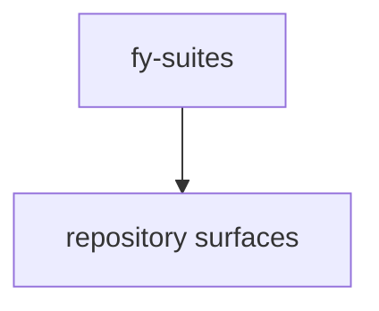

# fy-suites — What, Why, and How

## What is it?

The **fy-suites** are a family of internal tools that work together inside one shared workspace.

They are not one single tool. They are a **tool system**.

Each suite has its own responsibility, but all suites share the same platform foundations.

The repository currently exposes these major service or package areas: **no primary service roots detected yet**.

## Why does it exist?

The fy-suites exist because complex work becomes hard to manage when everything is mixed together.

Without a system like this, useful information spreads across many places, documentation drifts, tests lose context, and support tools start contaminating the real target work.

The fy-suites solve this by creating one internal system with clear lanes, shared rules, and readable outputs.

They exist to make work:

- more organized
- more explainable
- more governable
- more reusable
- safer to review
- easier to continue later

## How does it work?

At a simple level, the fy-suites work like this:

1. there is one shared platform
2. each suite has its own job
3. the suites share a common lifecycle
4. work stays internal before it becomes outward
5. results are tracked, explained, and turned into next steps

### Shared platform

The shared platform provides workspace handling, evidence tracking, run tracking, context building, model routing, status pages, release readiness, and production readiness.

### Common lifecycle

Most suites follow common actions such as initialize, inspect, audit, explain, prepare context, compare runs, prepare fixes, self-audit, and readiness checks.

### Start reading here

- `README.md`

## Quick recap

### What?
A modular family of internal suites for governed support work.

### Why?
To reduce chaos, improve clarity, keep work explainable, and avoid uncontrolled changes.

### How?
Through a shared platform, specialized suites, a common lifecycle, internal tracking, and controlled outward action.
