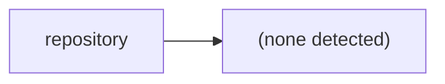

# World of Shadows — technical reference

## Repository service map

## Documentation domains

ADR, MVPs, platform, testing

## Automation and gates

(no workflows detected)

## Canonical operational entrypoints

- `docker-up.py` — local Docker lifecycle
- `docker-compose.yml` — stack declaration
- `tests/run_tests.py` — multi-suite test runner
- `.github/workflows/` — GitHub Actions CI gates
