# Fy AI-Augmented Suite Layer — MVP Blueprint

## Purpose

This MVP defines a concrete target architecture for an internal AI-augmented `fy` suite layer that extends the existing Fy development suite without replacing canonical truth.

The design follows a strict three-layer model:

1. **Shared AI Platform** inside `fy_platform`
2. **Suite Adapters** per suite
3. **Human-Governed Execution Modes** across all suites

The architecture is designed to:

- collect and preserve evidence,
- build reusable context packs,
- enable suite-wide retrieval and search,
- orchestrate higher-value multi-step flows,
- improve productivity and quality,
- keep AI advisory rather than authoritative.

---

## Core Principles

1. **AI remains advisory.** Canonical truth remains in source, tests, CI, reports, committed documentation, and approved governance artifacts.
2. **Evidence first.** Any synthesis must be grounded in registered evidence.
3. **One retrieval plane for all suites.** No isolated search silos.
4. **Graph orchestration only where it adds real value.** Simple checks remain deterministic.
5. **Documentation grows progressively.** `documentify` becomes a staged documentation growth engine.
6. **Searchability belongs everywhere.** Nachsucharbeit is not document-only; all suites can use the same retrieval plane.
7. **Local spikes matter.** `despaghettify` must reduce extreme outliers even when global repo metrics already look good.

---

## Layered Target Architecture

```mermaid
flowchart TB

    subgraph L3["Layer 3 — Human-Governed Execution Modes"]
        M1["inspect"]
        M2["audit"]
        M3["triage"]
        M4["explain"]
        M5["prepare-fix"]
        M6["prepare-context-pack"]
        M7["compare-runs"]
    end

    subgraph L2["Layer 2 — Suite Adapters"]
        A1["Contractify Adapter"]
        A2["Testify Adapter"]
        A3["Dockerify Adapter"]
        A4["Documentify Adapter"]
        A5["Docify Adapter"]
        A6["Despaghettify Adapter"]
    end

    subgraph L1["Layer 1 — Shared AI Platform in fy_platform"]
        P1["Evidence Registry"]
        P2["Semantic Index"]
        P3["Context Pack Service"]
        P4["Model Router"]
        P5["Run Journal"]
        P6["Structured Output Schemas"]
        P7["Graph Recipes"]
        P8["Policy / Governance Gate"]
    end

    subgraph S["Repository & Artifact Surfaces"]
        S1["Repo files / manifests / markdown / source"]
        S2["Suite reports / committed artifacts / state"]
        S3["Tests / CI outputs / workflow yaml"]
        S4["Docker / compose / logs / run outputs"]
        S5["Docs site outputs"]
        S6["AI-readable doc bundles"]
    end

    M1 --> A1
    M1 --> A2
    M1 --> A3
    M1 --> A4
    M1 --> A5
    M1 --> A6

    M2 --> A1
    M2 --> A2
    M2 --> A3
    M2 --> A4
    M2 --> A5
    M2 --> A6

    M3 --> A1
    M3 --> A2
    M3 --> A3
    M3 --> A6

    M4 --> A1
    M4 --> A2
    M4 --> A3
    M4 --> A4
    M4 --> A5
    M4 --> A6

    M5 --> A1
    M5 --> A2
    M5 --> A3
    M5 --> A5
    M5 --> A6

    M6 --> A1
    M6 --> A2
    M6 --> A3
    M6 --> A4
    M6 --> A5
    M6 --> A6

    M7 --> A1
    M7 --> A2
    M7 --> A3
    M7 --> A4
    M7 --> A5
    M7 --> A6

    A1 --> P1
    A1 --> P2
    A1 --> P3
    A1 --> P4
    A1 --> P5
    A1 --> P6
    A1 --> P7
    A1 --> P8

    A2 --> P1
    A2 --> P2
    A2 --> P3
    A2 --> P4
    A2 --> P5
    A2 --> P6
    A2 --> P7
    A2 --> P8

    A3 --> P1
    A3 --> P2
    A3 --> P3
    A3 --> P4
    A3 --> P5
    A3 --> P6
    A3 --> P7
    A3 --> P8

    A4 --> P1
    A4 --> P2
    A4 --> P3
    A4 --> P4
    A4 --> P5
    A4 --> P6
    A4 --> P7
    A4 --> P8

    A5 --> P1
    A5 --> P2
    A5 --> P3
    A5 --> P4
    A5 --> P5
    A5 --> P6
    A5 --> P7
    A5 --> P8

    A6 --> P1
    A6 --> P2
    A6 --> P3
    A6 --> P4
    A6 --> P5
    A6 --> P6
    A6 --> P7
    A6 --> P8

    P1 --> S1
    P1 --> S2
    P1 --> S3
    P1 --> S4
    P1 --> S5
    P1 --> S6

    P2 --> S1
    P2 --> S2
    P2 --> S3
    P2 --> S4
    P2 --> S5
    P2 --> S6

    A4 --> S5
    A4 --> S6
```



---

## Layer 1 — Shared AI Platform inside `fy_platform`

### New platform modules

- `fy_platform/ai/evidence_registry.py`
- `fy_platform/ai/semantic_index.py`
- `fy_platform/ai/context_packs.py`
- `fy_platform/ai/model_router.py`
- `fy_platform/ai/run_journal.py`
- `fy_platform/ai/schemas.py`
- `fy_platform/ai/graph_recipes/`
- `fy_platform/ai/policy.py`

### Responsibilities

- register evidence and artifacts from any suite,
- index source, reports, docs, logs, and generated outputs,
- build reusable context packs,
- route work to SLM or LLM according to cost and confidence needs,
- persist run journals and review checkpoints,
- host shared schemas and graph recipes,
- enforce governance boundaries.

---

## Layer 2 — Suite Adapters

Each suite receives a thin adapter that:

- invokes the suite’s deterministic tools,
- normalizes inputs and outputs,
- registers evidence,
- queries the shared retrieval plane,
- builds context packs,
- optionally triggers graph recipes,
- never silently changes truth.

### Shared adapter responsibilities

- source collection
- deterministic checks
- failure classification
- report normalization
- context-pack generation
- explain output generation
- prepare-fix proposal generation
- compare-runs support

---

## Layer 3 — Human-Governed Execution Modes

All suites support the same execution modes:

- **inspect** — raw evidence and context browsing
- **audit** — deterministic checks plus AI-grounded synthesis
- **triage** — failure and drift analysis
- **explain** — audience-aware explanation output
- **prepare-fix** — generate repair plans or patch proposals without auto-apply
- **prepare-context-pack** — build working bundles for humans or external AI execution
- **compare-runs** — compare previous and current suite runs

---

## Phase Roadmap

## Phase 1 — Shared AI Platform

### Goal
Extend `fy_platform` with:

- evidence registry
- semantic index
- run journal
- model routing

### Milestones

1. Core data models and schemas
2. Storage foundation
3. Lexical + semantic indexing
4. Run journal integration
5. Model router with SLM-first policy
6. Shared CLI commands

### Estimated effort
4–6 weeks

---

## Phase 2 — Contractify and Testify

### Goal
AI-augment the highest-value suites first.

### Milestones

1. Contractify adapter
2. Testify adapter
3. Shared explain / compare-runs / context-pack features
4. Failure memory and run-over-run deltas
5. Human review checkpoints

### Estimated effort
4–5 weeks

---

## Phase 3 — Dockerify, Documentify, Docify

### Goal
Expand searchability, document growth, and operator/developer explanation.

### Milestones

1. Dockerify adapter with log triage
2. Documentify growth engine
3. Docify adapter with repair packs
4. Docs publishing stack
5. Cross-suite retrieval everywhere
6. Despaghettify local spike lane

### Estimated effort
6–8 weeks

---

## Phase 4 — LangGraph Recipes

### Goal
Add multi-step, stateful, reviewable graph flows.

### Planned recipes

- repair planning
- multi-step drift investigation
- failure triage loops
- context-pack generation
- document growth
- contract conflict analysis

### Estimated effort
5–7 weeks

---

## Phase 1 Specification Outline

## Evidence Registry

### Purpose
A suite-neutral evidence catalog for:

- repository files
- reports
- JSON bundles
- logs
- CI artifacts
- generated docs
- AI-readable doc bundles
- context packs
- model decisions

### Core data models

```python
@dataclass
class EvidenceRecord:
    evidence_id: str
    suite: str
    run_id: str
    kind: str
    source_uri: str
    content_hash: str
    mime_type: str
    deterministic: bool
    created_at: str
    tags: list[str]
    owner_ref: str | None
    review_state: str
```

```python
@dataclass
class ArtifactRecord:
    artifact_id: str
    suite: str
    run_id: str
    path: str
    format: str
    generated_at: str
    role: str
```

```python
@dataclass
class SuiteRunRecord:
    run_id: str
    suite: str
    mode: str
    started_at: str
    ended_at: str | None
    repo_root: str
    git_ref: str | None
    manifest_ref: str | None
    status: str
    parent_run_id: str | None
```

```python
@dataclass
class JournalEvent:
    event_id: str
    run_id: str
    ts: str
    event_type: str
    payload: dict
```

```python
@dataclass
class EvidenceLink:
    src_id: str
    dst_id: str
    relation: str
```

### Storage strategy

Recommended initial production form:

- SQLite for registry, relations, runs, journal, and chunk metadata
- filesystem object store for stored artifacts
- JSONL sidecars for debug and bulk ingest
- embedding cache on disk

### Recommended directory layout

```text
.fydata/
  registry/
    registry.db
    objects/
      sha256/ab/cd/<hash>.blob
    chunks/
      <chunk_id>.json
  journal/
    <run_id>.jsonl
  index/
    lexical/
    semantic/
  cache/
    embeddings/
```

### Why this form

- locally durable
- easy to back up
- easy to inspect
- no early server requirement
- can later migrate to Postgres/pgvector if needed

---

## Semantic Index

### Purpose
A shared retrieval layer for:

- cross-suite search
- context packs
- prior results reuse
- AI-readable doc bundles
- hybrid lexical + semantic retrieval

### Core data models

```python
@dataclass
class ChunkRecord:
    chunk_id: str
    evidence_id: str
    suite: str
    source_path: str
    chunk_type: str
    text: str
    title: str | None
    tags: list[str]
    owner_ref: str | None
    token_count: int
    semantic_hash: str
    embedding_ref: str | None
```

```python
@dataclass
class RetrievalHit:
    chunk_id: str
    score_lexical: float
    score_semantic: float
    score_hybrid: float
    source_path: str
    suite: str
    owner_ref: str | None
    excerpt: str
```

```python
@dataclass
class ContextPack:
    pack_id: str
    query: str
    mode: str
    audience: str
    suite_scope: list[str]
    hits: list[RetrievalHit]
    summary: str
    artifacts: list[str]
    generated_at: str
```

### Query patterns

#### Registry queries
- latest run for a suite and mode
- all evidence linked to an owner reference
- artifacts produced between two runs
- accepted evidence for a workflow or service

#### Search queries
- hybrid search across suites
- scoped search by suite and owner ref
- log- and workflow-focused root-cause search
- context pack generation for a question and audience

#### Compare queries
- compare runs within a suite
- compare context packs over time

#### AI-doc queries
- search easy docs
- search technical docs
- search role-specific docs
- search AI-readable bundles

### Chunking strategy

- Markdown by heading blocks
- JSON by top-level sections
- logs by time windows or failure windows
- code by symbol + docstring + summary
- workflow YAML by job and step blocks

### Ranking strategy

`hybrid_score = lexical*w1 + semantic*w2 + recency*w3 + suite_priority*w4 + owner_match*w5`

### Reindex triggers

- new suite run finished
- committed report changed
- docs regenerated
- manual changed-only reindex

---

## Phase 2 — High-Leverage Use Cases

## Contractify

### Use case A — Drift triage with evidence pack
- run deterministic discovery, audit, and drift tools
- collect related prior runs, ADRs, projections, OpenAPI surfaces, reports
- build context pack
- cluster findings
- synthesize “real break vs weak evidence”
- produce next closure actions

### Use case B — Projection explain pack
- gather anchor/projection links
- retrieve related findings and evidence
- generate governance, developer, and easy explanations from the same base

### Use case C — Re-audit prep pack
- generate a clean package for the next implementation or audit pass
- include anchors, affected files, prior findings, deltas, and accepted evidence

### Use case D — Normative overlap clustering
- semantically group similar contract nodes
- propose overlap clusters for human review

---

## Testify

### Use case A — Failure cluster synthesis
- collect workflow failures, target suites, reports, and logs
- bucket failures into clusters
- explain likely causes in practical language
- produce affected surfaces and next checks

### Use case B — CI governance mismatch detection
- compare suite entry points, workflow YAML, and runner scripts
- explain exact inconsistencies
- build a repair proposal bundle

### Use case C — Change-sensitive test impact pack
- combine changed paths, previous failure memory, and suite targets
- retrieve similar earlier changes
- propose focused test lanes to run next

### Use case D — Practical explain mode
- produce maintainer summary
- produce manager summary
- produce developer action checklist

---

## Phase 3 — Suite Integrations

## Contractify adapter

### Sources
- ADRs
- contract indices
- projection docs
- OpenAPI refs
- prior audits
- committed reports
- implementation findings

### Failure classes
- normative overlap
- projection drift
- backref missing
- contract without evidence
- anchor conflict

---

## Testify adapter

### Sources
- `tests/run_tests.py`
- CI workflows
- test reports
- suite scripts
- coverage outputs
- prior testify runs

### Failure classes
- workflow missing
- CI gate incomplete
- script entry missing
- failure cluster
- coverage signal gap

---

## Dockerify adapter

### Sources
- compose files
- `docker-up.py`
- env examples
- health outputs
- stack logs
- migration logs
- smoke results

### Failure classes
- service missing
- healthcheck gap
- port conflict
- startup dependency gap
- stack boot failure

---

## Documentify adapter

### Output tracks
- easy
- technical
- role-admin
- role-developer
- role-operator
- role-writer
- role-player
- ai-read

### Failure classes
- doc gap
- doc drift
- role surface missing
- template incomplete
- industrial reference gap
- AI bundle stale

### Growth model
- inventory
- skeletons
- evidence fill
- cross-linking
- industrial hardening
- AI bundle export

---

## Docify adapter

### Sources
- Python AST
- docstrings
- changed paths
- drift reports
- documentation quality rules

### Failure classes
- missing docstring
- public API undocumented
- Google style gap
- module reference gap
- drift hint

---

## Despaghettify extension

### New local spike lane
The suite must treat local anomalies even when global repo metrics are already good.

### New spike classes
- local spike file length
- local spike function length
- local spike tail distribution
- local spike control flow
- recurring hotspot

### Goal
A repository can stay globally low-category while still opening focused remediation workstreams for severe local spikes.

---

## Documentation Strategy

`documentify` should become a staged documentation engine rather than a one-pass generator.

### Documentation families

#### Easy
- simpler language
- same theme, lower complexity
- intent-first guidance
- readable for broad stakeholders

#### Technical
- fuller technical suite
- increasingly industrial quality
- stronger completeness, structure, and precision

#### Role-bound
- richer than today
- easier to read
- tailored for admin, developer, operator, writer, player, and other roles

#### AI-read
- structured, chunked, tagged, searchable
- suitable for internal retrieval and context pack generation
- reusable by all other suites

### Recommended external publishing approach

- MkDocs + Material for MkDocs
- Diátaxis-inspired structure
- versioning plan
- built-in search
- AI bundle export alongside site generation

---

## Cross-Suite Search Requirement

The shared search and context-pack capability must be available to all suites, not only `documentify`.

That means every suite should be able to:

- search prior reports,
- search generated docs,
- search logs,
- search AI-readable bundles,
- search related findings across suites,
- assemble a context pack for audit, triage, or repair planning.

---

## Suggested MVP Package Layout

```text
fy_platform/
  ai/
    evidence_registry.py
    semantic_index.py
    context_packs.py
    model_router.py
    run_journal.py
    schemas.py
    policy.py
    graph_recipes/
      audit_graph.py
      triage_graph.py
      context_pack_graph.py

contractify/
  ai_adapter.py

testify/
  ai_adapter.py

dockerify/
  ai_adapter.py

documentify/
  ai_adapter.py
  templates/
    easy/
    technical/
    role/
    ai_read/

docify/
  ai_adapter.py

despaghettify/
  ai_adapter.py
  spike_lane.py
```

---

## Practical MVP Outcome

When this MVP is implemented, the Fy suite gains:

- one shared evidence and retrieval plane,
- reusable context packs,
- consistent run memory,
- cost-aware model routing,
- structured AI outputs,
- first-class audit and triage augmentation,
- staged documentation growth,
- AI-readable document bundles,
- suite-wide searchability,
- targeted despaghettify treatment for local extreme spikes.

The result is not “AI everywhere”.
It is a governance-safe, productivity-oriented, reusable intelligence layer for the existing suite system.
