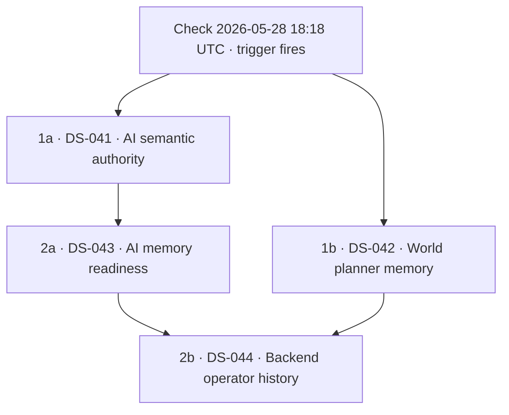

# Despaghettification — information input list for implementers

*Path:* `despaghettify/despaghettification_implementation_input.md` — Overview: [README.md](../README.md).

This document is **not** part of the frozen consolidation archive under [`docs/archive/documentation-consolidation-2026/`](../../docs/archive/documentation-consolidation-2026/). That archive holds **completed** findings and migration evidence (ledgers, topic map, validation reports) — **do not overwrite or “continue writing” those files**.

Here you find the **living working basis**: structural and spaghetti topics in **code**, prioritised input rows for task implementers, coordination rules, and **in-flight** progress (closed history: [despaghettification_completed_log.md](despaghettification_completed_log.md)). Like documentation consolidation 2026: **one canonical truth per topic** — applied here to **code structure** (fewer duplicates, clearer boundaries, smaller coherent modules).

**This file is part of wave discipline:** Whoever implements a **despaghettification wave** in code (new helper modules, noticeable AST/structure change) **updates this Markdown in the same wave** — not only the code. Details: § **“Maintaining this file during structural waves”** under coordination. This does **not** replace pre/post artefacts under `despaghettify/state/artifacts/…` (they remain mandatory per [`EXECUTION_GOVERNANCE.md`](../state/EXECUTION_GOVERNANCE.md)); it complements them as the **functional** entry and priority track.

**Language:** [Repository language](../docs/dev/contributing.md#repository-language) — English for every editor-maintained field here (DS rows, structure scan prose, Open hotspots, coordination, active progress). **Closed** wave history: [despaghettification_completed_log.md](despaghettification_completed_log.md).

## Latest structure scan (orientation, no warranty)

**Purpose:** A **fillable** overview after measurable runs — update **date and time**, **`metrics_bundle.score`** (**Trigger v2** + **Anteil %**), **AST telemetry**, optional **extra checks**, and **open hotspots** per [spaghetti-check-task.md](../spaghetti-check-task.md). **Numeric** thresholds (**bars**, **weights**, **`M7_ref`**) are canonical in [spaghetti-setup.md](../spaghetti-setup.md). The spaghetti check maintains the **information input list** and **recommended implementation order** when the **trigger policy** in § *Trigger policy for check task updates* fires (per **setup**); otherwise this scan section (including M7 and category breakdown) is enough. **Rankings:** `python "./'fy'-suites/despaghettify/tools/spaghetti_ast_scan.py"` only (repo root). **Open hotspots:** [spaghetti-solve-task.md](../spaghetti-solve-task.md) clears or narrows items when waves resolve them; on every spaghetti-check run, **prune** so solved items are not listed.

| Field | **Trigger v2** (0–100; advisory) | **Anteil %** (vs. bars / `M7_ref`; **M7** row = `m7_anteil_pct_gewichtet`) |
|-------|-------------------------------------|-------------------------------------|
| **As of (date & time)** | — | **2026-05-28 18:18:39 (UTC)** |
| Spaghetti scan command | — | `PYTHONPATH="'fy'-suites" python -m despaghettify.tools check --with-metrics --out "'fy'-suites/despaghettify/reports/latest_check_with_metrics.json"` |
| Measurement scope (ROOTS) | — | `backend/app`, `world-engine/app`, `ai_stack`, `story_runtime_core`, `tools/mcp_server`, `administration-tool` from `fy-manifest.yaml` |
| **M7** — gewichtete 7-Kategorien-Summe | **44.06** | **3.69** |
| C1: Circular dependencies | **8.26** | **0.74** |
| C2: Nesting depth | **0.00** | **1.32** |
| C3: Long functions + complexity | **95.87** | **0.90** |
| C4: Multi-responsibility modules | **72.44** | **7.16** |
| C5: Magic numbers + global state | **39.84** | **0.70** |
| C6: Missing abstractions / duplication | **30.31** | **13.36** |
| C7: Confusing control flow | **62.32** | **6.56** |
| **AST telemetry N / L₅₀ / L₁₀₀ / D₆** | — | **11299** / **809** / **102** / **0** |
| Extra check builtins | — | **0** matches for `def build_god_of_carnage_solo` in `**/builtins.py`; `story_runtime_core/goc_solo_builtin_template.py` still owns the definition |
| Extra check runtime | — | **`ds005_runtime_import_check.py`** exit **0**; imported **12** current runtime modules via `app.runtime.package_classification.runtime_module_import_path`. Grep `TYPE_CHECKING` / `avoid circular` / `circular dependency` under `backend/app/runtime`: **0** hits |
| **Open hotspots** | — | **Trigger policy fires:** `M7_anteil` **3.689** remains below `M7_ref` **4.24**, but Anteil exceeds bars on **C4** (**7.16** > **5**), **C5** (**0.70** > **0**), **C6** (**13.36** > **0**), and **C7** (**6.56** > **3**). **DS-037 through DS-040 anchors are pruned:** their named leaders no longer appear in the current top-12 longest ranking. Current top-12 leaders seed **DS-041** through **DS-044**: `interpret_goc_semantic_move`, `build_planner_truth_payload`, `_record_hierarchical_memory_aspect`, `build_readiness_co_authority_preview`, `build_off_stage_hierarchical_memory_write`, `compute_stream_readiness`, `validate_voice_consistency`, `build_bounded_dramatic_context_summary`, `apply_action_to_environment_state`, `validate_temporal_control_realization`, `build_validation_authority_bridge`, and `_extract_npc_agency_breakdown`. **C7 nesting tail:** `D6` remains **0**. **Metric scan gate:** DS-005 imports **12** current runtime modules with exit **0**. |

### Score *M7* — inputs, weights, and calculation

| Symbol | Meaning | **Trigger v2** (0–100) | **Anteil %** |
|--------|---------|------------------------|--------------|
| **M7** | Gewichtete Summe | **44.06** | **3.69** |
| **C1** | Circular dependencies | **8.26** | **0.74** |
| **C2** | Nesting depth | **0.00** | **1.32** |
| **C3** | Long functions + complexity | **95.87** | **0.90** |
| **C4** | Multi-responsibility modules | **72.44** | **7.16** |
| **C5** | Magic numbers + global state | **39.84** | **0.70** |
| **C6** | Missing abstractions / duplication | **30.31** | **13.36** |
| **C7** | Confusing control flow | **62.32** | **6.56** |
| **AST telemetry** | N / L₅₀ / L₁₀₀ / D₆ | — | **11299** / **809** / **102** / **0** |

**Formeln:** **Trigger:** `M7_trigger = Σ weight_i × trigger_v2(Ci)` aus **`metrics_bundle.m7`** / **`score`**. **Anteil:** `M7_anteil = Σ weight_i × anteil_pct(Ci)` aus **`score.m7_anteil_pct_gewichtet`**. **Weights:** [spaghetti-setup.md](../spaghetti-setup.md) § *M7 category weights*.

**Evaluation:** From **`check --with-metrics`**: fill **`metrics_bundle.score`** (both columns); **AST** from **`spaghetti_ast_scan`**. **Bars** apply to **Anteil %** / **`metric_a.m7`** only (see [spaghetti-check-task.md](../spaghetti-check-task.md) §1).

**Trigger policy for check task updates:**

Update § *Information input list*, § *Recommended implementation order*, and the bottom appendix § *DS-ID → primary workstream* when **`metrics_bundle.trigger_policy_fires`** is true — i.e. **Anteil(C*n*) > bar*n*** or **`M7_anteil ≥ M7_ref`** per [spaghetti-setup.md](../spaghetti-setup.md). Update the appendix in place; do not move it above this operational scan.

| Condition | Rule |
|-----------|------|
| **Per-category** | **Anteil(C*n*)** **>** **bar*n*** per [spaghetti-setup.md](../spaghetti-setup.md) § *Per-category trigger bars*. |
| **Composite** | **`M7_anteil` ≥ `M7_ref`** (`metric_a.m7`). |

**Otherwise** (no per-category exceedance **and** **`M7_anteil` < `M7_ref`**): update **only** § *Latest structure scan*.

*Note:* **`trigger_policy_basis`:** `anteil_pct`. **Trigger v2** is advisory. No hand edits.

## Information input list (extensible)

Each **open** row: **ID**, **pattern** (lead with **C1..C7** from [spaghetti-setup.md](../spaghetti-setup.md) § *Per-category trigger bars*, e.g. **`C3 ·`** …), **location**, **hint / measurement idea**, **direction**, **collision hint**.

### Open

| ID | pattern | location (typical) | hint / measurement idea | direction (solution sketch) | collision hint |
|----|---------|--------------------|-------------------------|----------------------------|----------------|
| **DS-041** | **C4 · C6 · C7 ·** AI semantic move and readiness authority leaders | `ai_stack/story_runtime/semantic_planner/god_of_carnage_semantic_move_interpretation.py`; `ai_stack/story_runtime/turn/validation_authority_bridge.py`; `ai_stack/langgraph/langgraph_runtime_package_output_sections.py` | Current leaders: `interpret_goc_semantic_move` **134L**, `build_readiness_co_authority_preview` **133L**, `build_validation_authority_bridge` **130L**, `build_bounded_dramatic_context_summary` **131L**. Re-run semantic planner, validation authority, and LangGraph package-output tests. | Split semantic interpretation, readiness preview, validation bridge, and bounded dramatic context into named extraction, policy, and payload sections. | Primary owner: `ai_stack`. Keep LangGraph and runtime authority public payload names stable. |
| **DS-042** | **C4 · C7 ·** World-engine planner truth and hierarchical memory snapshot leaders | `world-engine/app/story_runtime/planner_truth_projection.py`; `world-engine/app/story_runtime/manager/session/session_memory_policies.py` | Current leaders: `build_planner_truth_payload` **133L**, `_record_hierarchical_memory_aspect` **133L**. Re-run planner truth, validator lane, and story session memory/readout tests. | Extract planner truth sections and hierarchical memory aspect recording into named evidence, actor, memory, and response helpers without changing manager payloads. | Primary owner: `world_engine`. Coordinate with DS-041 if authority/ledger naming overlaps. |
| **DS-043** | **C4 · C6 · C7 ·** AI memory, stream readiness, voice, environment, and temporal-control leaders | `ai_stack/contracts/hierarchical_memory_contracts.py`; `ai_stack/story_runtime/stream_readiness.py`; `ai_stack/story_runtime/npc_agency/character/character_voice_validation.py`; `ai_stack/contracts/environment_state_contracts.py`; `ai_stack/story_runtime/narrative/temporal_control_engine.py` | Current leaders: `build_off_stage_hierarchical_memory_write` **132L**, `compute_stream_readiness` **132L**, `validate_voice_consistency` **132L**, `apply_action_to_environment_state` **130L**, `validate_temporal_control_realization` **130L**. Re-run focused memory/readiness/voice/environment/temporal tests. | Split validation, readiness, environment mutation, and memory-write assembly into named evidence, guard, and result helpers with stable contract envelopes. | Primary owner: `ai_stack`. Keep story-runtime-core contract surfaces stable. |
| **DS-044** | **C4 · C6 · C7 ·** Backend operator turn history NPC-agency breakdown leader | `backend/app/services/story_runtime/operator_turn_history_service.py` | Current leader: `_extract_npc_agency_breakdown` **129L**. Re-run operator turn history/service tests and AST top-12. | Extract NPC-agency breakdown collection, normalization, status, and display-row helpers while preserving operator response shape. | Primary owner: `backend_runtime_services`. Coordinate with AI-stack only if NPC-agency contract field names move. |

### Closed (archived)

*None.* Closed **DS-*** detail lives in [despaghettification_completed_log.md](despaghettification_completed_log.md).

**New rows:** next **DS-045**+ when check fills the open table; on closure append [despaghettification_completed_log.md](despaghettification_completed_log.md) and remove from *Open* above.
## Recommended implementation order

Prioritised **phases** for **open** **DS-*** only — aligned with § *Open* in the information input list and [`EXECUTION_GOVERNANCE.md`](../state/EXECUTION_GOVERNANCE.md). **Mandatory** Mermaid `flowchart` **below** the table once open phase rows exist ([spaghetti-check-task.md](../spaghetti-check-task.md) §3).

### Open phases

| Priority / phase | DS-ID(s) | short logic | workstream (primary) | note (dependencies, gates) |
|------------------|----------|-------------|----------------------|----------------------------|
| **1a** | **DS-041** | AI authority and semantic interpretation leaders shape names used by later world-engine planner and memory surfaces. | `ai_stack` | Can run in parallel with DS-042 if authority payload names stay stable. |
| **1b** | **DS-042** | World-engine planner truth and memory snapshot leaders are isolated manager/readout surfaces. | `world_engine` | Can run in parallel with DS-041 unless ledger/authority names move. |
| **2a** | **DS-043** | AI memory/readiness/voice/environment/temporal leaders should follow DS-041 authority naming. | `ai_stack` | Preserve public contract envelopes and story-runtime-core import surfaces. |
| **2b** | **DS-044** | Backend operator turn history can follow DS-043 if NPC-agency field names change; otherwise isolated backend service wave. | `backend_runtime_services` | Preserve operator response shape. |

**Fill in:** one phase row per **open** **DS-*** when check repopulates the backlog. **Mermaid:** present because open phase rows exist.

**Implementation:** invoke [spaghetti-solve-task.md](../spaghetti-solve-task.md) with **one** **DS-ID** per run.
## Active progress (in-flight only)

**Completed waves** live in **[despaghettification_completed_log.md](despaghettification_completed_log.md)** — append there when a **DS-ID** is **CLOSED** or a check/reset pass is finished; do **not** grow this table with closed work.

Use this section only for:

- **Partial** solve runs (`k < N` sub-waves; resume anchor),
- **Open** DS waves before final closure,
- At most **3** rows — archive older **closed** rows to the completed log.

| date | ID(s) | short description | pre artefacts (rel. to `despaghettify/state/`) | post artefacts (rel. to `despaghettify/state/`) | state doc(s) updated | PR / commit |
|------|-------|-------------------|----------------------------------------|----------------------------------------|----------------------|-------------|
| — | — | — | — | — | — | — |

**Rules:** [`despaghettification_completed_log.md`](despaghettification_completed_log.md) § *When to append here*; formal evidence still under `despaghettify/state/artifacts/…` per [`EXECUTION_GOVERNANCE.md`](state/EXECUTION_GOVERNANCE.md).

## Closed phases (archived)

*None.* See [despaghettification_completed_log.md](despaghettification_completed_log.md).

## Link to documentation-consolidation-2026

| Archive artefact | Link to code despaghettification |
|------------------|----------------------------------|
| [`TOPIC_CONSOLIDATION_MAP.md`](../../docs/archive/documentation-consolidation-2026/TOPIC_CONSOLIDATION_MAP.md) | Topics map to **one** active doc per topic; code refactors should not reopen the same functional edge across two parallel implementations (e.g. RAG, MCP, runtime). |
| [`DURABLE_TRUTH_MIGRATION_LEDGER.md`](../../docs/archive/documentation-consolidation-2026/DURABLE_TRUTH_MIGRATION_LEDGER.md) | Model for **traceable** moves instead of silent drift; despaghettification: **one source** for shared building blocks (e.g. builtins). |
| [`FINAL_DOCUMENTATION_VALIDATION_REPORT.md`](../../docs/archive/documentation-consolidation-2026/FINAL_DOCUMENTATION_VALIDATION_REPORT.md) | Closure criteria for a **documentation** strand; for code: tests/CI green, behaviour unchanged, interfaces explicit. |

## Coordination — extend work without colliding

1. **Claims:** Before larger refactors, name the **ID(s)** in team/issue/PR (all **`DS-*** you are taking from this information input list). Preferably **one** clear owner per ID.
2. **No double track:** Two implementers do **not** work the same ID in parallel; if split: separate sub-tasks explicitly (e.g. DS-003a backend wiring only, DS-003b world-engine import only).
3. **Leave archive alone:** Do not mirror code findings into `documentation-consolidation-2026/*.md`; use CHANGELOG, PR description, **`despaghettify/state/` artefacts**, **this input list** (§ *Latest structure scan*, open DS rows only), **[despaghettification_completed_log.md](despaghettification_completed_log.md)** for closed waves, and matching **`WORKSTREAM_*_STATE.md`**.
4. **Interfaces first:** For cycles (runtime cluster) small **DTO / protocol modules** before big moves; avoids PRs that touch half of `app.runtime` at once.
5. **Measurement optional:** AST/review-based lengths are **guidance**; success is **understandable** boundaries + green suites, not a percentage score.

### Maintaining this file during structural waves (move with the code)

For every relevant **DS-*** / despaghettification **wave**, update this file in the **same PR/commit logic** (not “code only”):

| What | Content |
|------|---------|
| **Information input list** | **Open** rows only; **pattern** starts with **C1..C7** per [spaghetti-check-task.md](../spaghetti-check-task.md) §2. On closure: strikethrough here **or** remove row and record in [despaghettification_completed_log.md](despaghettification_completed_log.md) (preferred when batch is done). |
| **§ Latest structure scan** | After measurable change: **main table** — **Trigger v2** + **Anteil %** for **M7** / **C1..C7** from **`metrics_bundle.score`** via `check --with-metrics` ([spaghetti-check-task.md](../spaghetti-check-task.md) §1); telemetry **N / L₅₀ / L₁₀₀ / D₆** from `spaghetti_ast_scan`; § *Score M7* **same** dual columns + **AST telemetry** row **under C7**; optional **extra checks**; **open hotspots** (**prune** solved items). For runtime edges `despaghettify/tools/ds005_runtime_import_check.py`. Rankings: script output only. |
| **§ Recommended implementation order** | Update when priority, dependency, or phase changes; **mandatory** Mermaid `flowchart` below the phase table on every [spaghetti-check-task.md](../spaghetti-check-task.md) pass that fills phases (see that doc §3). |
| **§ Active progress** | **In-flight only** (partial sub-waves, open DS): at most **3** rows; see [despaghettification_completed_log.md](despaghettification_completed_log.md) when a **DS-ID** is **CLOSED** or a pass is done. |
| **Appendix § DS-ID → workstream table** | Place new or moved **DS-*** in the bottom appendix; note co-involved workstreams. Keep the appendix below the operational sections so checks and resets do not hide the current scan/open backlog. |

**Governance:** `despaghettify/state/artifacts/workstreams/<slug>/pre|post/` and `WORKSTREAM_*_STATE.md` remain **formal** evidence; this file is the **compact** working and review map.

## Canonical technical reading paths (after refactor)

After structural changes to runtime/AI/RAG/MCP, align **active** technical docs (not the 2026 archive):

- Runtime / authority: [`docs/technical/runtime/runtime-authority-and-state-flow.md`](../../docs/technical/runtime/runtime-authority-and-state-flow.md) — supervisor orchestration: `supervisor_orchestrate_execute.py` + `supervisor_orchestrate_execute_sections.py`; subagent invocation: `supervisor_invoke_agent.py` + `supervisor_invoke_agent_sections.py`
- Inspector projection (backend): `inspector_turn_projection_sections.py` orchestrates; pieces in `inspector_turn_projection_sections_{utils,constants,semantic,provenance}.py`
- Admin tool routes: `administration-tool/route_registration.py` + `route_registration_{proxy,pages,manage,security}.py`
- God-of-Carnage solo builtin (core): `story_runtime_core/goc_solo_builtin_template.py` + `goc_solo_builtin_catalog.py` + `goc_solo_builtin_roles_rooms.py`
- AI / RAG / LangGraph: [`docs/technical/ai/RAG.md`](../../docs/technical/ai/RAG.md), [`docs/technical/integration/LangGraph.md`](../../docs/technical/integration/LangGraph.md), [`docs/technical/integration/MCP.md`](../../docs/technical/integration/MCP.md)
- Dev seam overview: [`docs/dev/architecture/ai-stack-rag-langgraph-and-goc-seams.md`](../../docs/dev/architecture/ai-stack-rag-langgraph-and-goc-seams.md)

## Appendix — execution governance and DS-ID workstream map

This appendix intentionally lives below the operational scan, open DS rows, implementation order, and active progress. Hub archive sync and `spaghetti-check` must keep it here; do not move it back above § *Latest structure scan*.

## Link to `despaghettify/state/` (execution governance, pre/post)

This document is **not** a replacement for [`state/EXECUTION_GOVERNANCE.md`](../state/EXECUTION_GOVERNANCE.md); it is the **functional input side** for structural refactors that should use the **same** evidence and restart rules.

| Governance building block | Role for despaghettification |
|---------------------------|------------------------------|
| [`EXECUTION_GOVERNANCE.md`](../state/EXECUTION_GOVERNANCE.md) | Mandatory: read state document, **pre** and **post** artefacts per wave, compare pre→post, update state from evidence (**completion gate**). |
| [`WORKSTREAM_INDEX.md`](../state/WORKSTREAM_INDEX.md) | Maps **workstream** → `artifacts/workstreams/<slug>/pre|post/`. |
| [`state/README.md`](../state/README.md) | Entry to the state hub. |
| `despaghettify/state/artifacts/repo_governance_rollout/pre|post/` | Optional for **repo-wide** waves (e.g. large diff across packages); useful when a structural wave needs the same repo commands as the rollout. |

**Artefact paths (canonical, relative to `despaghettify/state/`):**

- Per affected workstream: `artifacts/workstreams/<workstream>/pre/` and `…/post/`.
- Slugs as in the index: `backend_runtime_services`, `ai_stack`, `administration_tool`, `world_engine` (documentation only if MkDocs/nav is in scope).

**Naming convention for structural waves (DS-*):**

- Session/wave prefix as today: `session_YYYYMMDD_…`.
- **DS-ID in the filename**, e.g. `session_YYYYMMDD_DS-001_scope_snapshot.txt`, `session_YYYYMMDD_DS-001_pytest_collect.exit.txt`, `session_YYYYMMDD_DS-001_pre_post_comparison.json` (the latter typically under **`post/`**).
- At least **one** human-readable artefact (`.txt`/`.md`) and **preferably** one machine-readable (`.json`) — as governance requires.

**DS-ID → primary workstream (where to place pre/post):**

| ID | Primary workstream (`artifacts/workstreams/…`) | Also involved | Status |
|----|--------------------------------------------------|---------------|--------|
| **DS-001** | `backend_runtime_services` | — | **CLOSED** 2026-05-20 |
| **DS-002** | `backend_runtime_services` | `ai_stack` (call sites) | **CLOSED** 2026-05-20 |
| **DS-003** | `ai_stack` | — | **CLOSED** 2026-05-20 |
| **DS-004** | `backend_runtime_services` | `administration_tool` (if admin surfaces share constants) | **CLOSED** 2026-05-20 |
| **DS-005** | `backend_runtime_services` | `world_engine`, `ai_stack` | **CLOSED** 2026-05-20 |
| **DS-006** | `repo_governance_rollout` | `world_engine` scan tree, despaghettify config | **CLOSED** 2026-05-20 |
| **DS-007** | `backend_runtime_services` | — | **CLOSED** 2026-05-20 |
| **DS-008** | `ai_stack` | — | **CLOSED** 2026-05-20 |
| **DS-009** | `world_engine` | — | **CLOSED** 2026-05-20 |
| **DS-010** | `ai_stack` | `backend_runtime_services` | **CLOSED** 2026-05-22 |
| **DS-011** | `ai_stack` | `story_runtime_core`, `backend_runtime_services` | **CLOSED** 2026-05-22 |
| **DS-012** | `backend_runtime_services` | — | **CLOSED** 2026-05-22 |
| **DS-013** | `ai_stack` | `story_runtime_core` | **CLOSED** 2026-05-23 |
| **DS-014** | `world_engine` | — | **CLOSED** 2026-05-22 |
| **DS-015** | `ai_stack` | `backend_runtime_services`, `administration_tool`, `story_runtime_core` | **CLOSED** 2026-05-22 |
| **DS-016** | `repo_governance_rollout` | `tools/mcp_server`, `administration_tool` | **CLOSED** 2026-05-23 |
| **DS-017** | `ai_stack` | — | **CLOSED** 2026-05-23 |
| **DS-018** | `world_engine` | `ai_stack` (runtime call surfaces only) | **CLOSED** 2026-05-23 |
| **DS-019** | `ai_stack` | `story_runtime_core` | **CLOSED** 2026-05-23 |
| **DS-020** | `ai_stack` | `story_runtime_core` | **CLOSED** 2026-05-23 |
| **DS-021** | `ai_stack` | — | **CLOSED** 2026-05-23 |
| **DS-022** | `world_engine` | — | **CLOSED** 2026-05-23 |
| **DS-023** | `ai_stack` | `story_runtime_core` | **CLOSED** 2026-05-23 |
| **DS-024** | `ai_stack` | `story_runtime_core` | **CLOSED** 2026-05-23 |
| **DS-025** | `world_engine` | — | **CLOSED** 2026-05-23 |
| **DS-026** | `ai_stack` | `story_runtime_core` | **CLOSED** 2026-05-23 |
| **DS-027** | `ai_stack` | `story_runtime_core` | **CLOSED** 2026-05-23 |
| **DS-028** | `repo_governance_rollout` | `tools/mcp_server`, `ai_stack` | **CLOSED** 2026-05-23 |
| **DS-029** | `ai_stack` | `story_runtime_core` | **CLOSED** 2026-05-28 |
| **DS-030** | `backend_runtime_services` | — | **CLOSED** 2026-05-28 |
| **DS-031** | `world_engine` | — | **CLOSED** 2026-05-28 |
| **DS-032** | `backend_runtime_services` | `ai_stack`, `world_engine`, `story_runtime_core`, `administration_tool` | **CLOSED** 2026-05-28 |
| **DS-033** | `ai_stack` | `story_runtime_core` contract surfaces only | **CLOSED** 2026-05-28 |
| **DS-034** | `backend_runtime_services` | `ai_stack` service contracts only | **CLOSED** 2026-05-28 |
| **DS-035** | `world_engine` | `ai_stack` runtime contract surfaces only | **CLOSED** 2026-05-28 |
| **DS-036** | `ai_stack` | `story_runtime_core`, `backend_runtime_services` contract surfaces only | **CLOSED** 2026-05-28 |
| **DS-037** | `ai_stack` | `backend_runtime_services`, `world_engine` contract surfaces only | **CLOSED** 2026-05-28 |
| **DS-038** | `world_engine` | `ai_stack` contract surfaces only | **CLOSED** 2026-05-28 |
| **DS-039** | `backend_runtime_services` | `ai_stack` narrator-path surfaces | **CLOSED** 2026-05-28 |
| **DS-040** | `ai_stack` | `story_runtime_core` contract surfaces only | **CLOSED** 2026-05-28 |
| **DS-041** | `ai_stack` | `backend_runtime_services`, `world_engine` authority surfaces only | **OPEN** 2026-05-28 |
| **DS-042** | `world_engine` | `ai_stack` authority/ledger surfaces only | **OPEN** 2026-05-28 |
| **DS-043** | `ai_stack` | `story_runtime_core` contract surfaces only | **OPEN** 2026-05-28 |
| **DS-044** | `backend_runtime_services` | `ai_stack` NPC-agency contract fields only | **OPEN** 2026-05-28 |

**Fill in:** For each active **DS-*** one row (or a group sharing the same primary workstream); slugs as in [`WORKSTREAM_INDEX.md`](../state/WORKSTREAM_INDEX.md): `backend_runtime_services`, `ai_stack`, `administration_tool`, `world_engine`, `documentation`. Repo-wide cross-check without product code: optional `artifacts/repo_governance_rollout/pre|post/` (e.g. **DS-REPLAY-G**).

Implementers: tick the **completion gate** from `EXECUTION_GOVERNANCE.md`; record the wave and new artefact paths in the matching `WORKSTREAM_*_STATE.md`. Avoid crossings: one clear wave owner per **DS-ID**; multiple workstreams only with agreed **separate** artefact sets.

---

*Created as an operational bridge between structural code work, the state hub under [`despaghettify/state/`](../state/README.md) (pre/post evidence), and the completed documentation archive of 2026.*
