# 20-Minuten-Präsentation: AI, LangChain, RAG, LLM und SLM im Play-Service

Der **Play-Service ist im Projekt der `world-engine`-Service**. Er ist die autoritative Runtime für Story-Sessions. Der Backend-Service bleibt wichtig für Auth, Policy, Publishing, Integration und Proxy-Flows, aber **committed Runtime-Wahrheit entsteht im World-Engine/Play-Service**.

Ebenso wichtig: AI-Ausgaben sind **Vorschläge**, keine Wahrheit. Die AI darf Narrative, Reaktionen oder Zustandsänderungen vorschlagen. Die Engine validiert und committed nur gültige Änderungen.

Nicht alles ist vollständig als perfekte Endarchitektur vorhanden.

| Thema                                           | Status                                                                                                                    |
| ----------------------------------------------- | ------------------------------------------------------------------------------------------------------------------------- |
| World-Engine als autoritative Runtime           | direkt belegt                                                                                                             |
| LangGraph als Turn-Orchestrierung               | direkt belegt                                                                                                             |
| LangChain als Prompt-/Parser-/Adapter-Brücke    | direkt belegt                                                                                                             |
| RAG im Runtime-Turn                             | direkt belegt                                                                                                             |
| AI-Ausgabe nur Proposal bis Validierung         | direkt belegt                                                                                                             |
| Narrator als eigene Klasse                      | nicht eindeutig belegt; als Runtime-Rolle über Scene Director / Visible Render / Commit-Logik belegt                      |
| NPC-Denken als autonome Agenten                 | nicht eindeutig belegt; als deterministische CharacterMind-/SceneDirector-/Responder-Logik belegt                         |
| Vollständige persistente World-State-Simulation | nicht vollständig belegt; aktuell bounded story session state, history, scene progression, diagnostics, narrative threads |
| Bedarfsgesteuertes RAG-Skipping                 | im Idealablauf sinnvoll; im aktuellen Runtime-Graph ist Retrieval als eigener Knoten standardmäßig vorhanden              |

---

Der Play-Service ist nicht einfach ein ChatGPT-Aufruf im Spiel. Er ist eine Runtime-Kette, die Spieler-Input entgegennimmt, Session State und World State berücksichtigt, Kontext über RAG ergänzen kann, AI über LangGraph und LangChain orchestriert, Narrator- und NPC-nahe Entscheidungen vorbereitet, Modellantworten prüft und nur validierte Änderungen in den Spielzustand übernimmt.

Die wichtigste Aussage:

> Die AI erzeugt Vorschläge. Die Engine entscheidet, was wirklich gilt.

Das ist die zentrale Schutzlinie gegen Halluzinationen, Lore-Brüche, falsche NPC-Reaktionen und unkontrollierte World-State-Mutationen.

---

## 2. Natürliche Präsentation

Heute geht es um den Play-Service in *World of Shadows* und darum, wie AI dort wirklich eingebunden ist.

Wenn man von außen auf so ein System schaut, könnte man denken: Der Spieler schreibt etwas, das System schickt es an ein LLM, und das LLM antwortet. Aber genau das wäre zu einfach. Der Play-Service ist nicht nur eine Textgenerierungsmaschine. Er ist eine Runtime, die entscheiden muss, was im Spiel passieren darf.

Der autoritative Play-Service liegt im `world-engine`. Das Backend kann Sessions vorbereiten, Inhalte kompilieren und Anfragen weiterleiten, aber die eigentliche Story-Runtime läuft in der World-Engine. Dort gibt es den `StoryRuntimeManager`, der Story-Sessions verwaltet, Turns ausführt, Diagnostics schreibt und den aktuellen Scene State fortschreibt.

Wenn ein Spieler eine Aktion eingibt, wird zuerst nicht sofort generiert. Der Input wird interpretiert. Dann wird ein Turn-Kontext aufgebaut: In welcher Session sind wir? In welchem Modul? In welcher Szene? Welche vorherigen Ereignisse oder Continuity Impacts gibt es? Welche Narrative Threads sind aktiv? Danach läuft der Turn durch einen LangGraph-basierten Runtime-Graph.

Dieser Graph ist eine Art Ablaufplan für den Spielzug. Er enthält Knoten wie Input-Interpretation, Retrieval, Scene Assessment, Modell-Routing, Modell-Aufruf, Fallback, Proposal-Normalisierung, Validation, Commit und sichtbares Rendering. Das ist wichtig, weil damit nicht alles in einem großen Prompt verschwindet. Der Ablauf ist strukturiert und diagnostizierbar.

RAG spielt dabei die Rolle eines kontrollierten Gedächtnisses. Wenn Kontext benötigt wird, etwa Lore, Modulwissen, Charakterprofile oder Runtime-Projektionen, wird ein Retrieval Request gebaut. Im Code ist das über `ai_stack/rag.py` und den Runtime-Graph belegt. Der Retriever liefert Kontextstücke, die in den Prompt eingebaut werden können. Aber auch hier gilt: Retrieval ist nicht Wahrheit an sich. Es liefert Hinweise und Kontext. Die Engine und die Validatoren müssen trotzdem prüfen, ob das Ergebnis gültig ist.

LangChain wird im Projekt nicht als magische Agentenplattform verwendet, sondern sehr konkret: als Brücke für Prompt-Templates, strukturierte Ausgabeparser und Adapter-Aufrufe. Der Runtime-Graph entscheidet, wann ein Modell aufgerufen wird. LangChain hilft dabei, den Prompt sauber zu bauen und strukturierte Ergebnisse zu parsen.

LLMs und SLMs haben unterschiedliche Rollen. Große Modelle sind sinnvoll für komplexe narrative Formulierungen, Konfliktsynthese und schwierige soziale Entscheidungen. Kleinere Modelle sind eher geeignet für Klassifikation, Preflight, Routing oder einfache Erkennung. Im Backend gibt es dafür eigene Routing Contracts. Im Live-Pfad der World-Engine ist Modellrouting über Registry, RoutingPolicy und Adapter belegt, aber die konkrete LLM/SLM-Provider-Parität ist nicht in allen Details eindeutig sichtbar. Wichtig ist das Prinzip: Nicht jede Aufgabe braucht dasselbe Modell.

Der Narrator ist im Code nicht einfach eine einzelne mystische Figur. Technisch ist er eher eine Runtime-Rolle: Szene bewerten, dramatischen Druck einschätzen, Konsequenzen sichtbar machen, Übergänge vorbereiten und eine sichtbare Ausgabe rendern. Für das Modul `God of Carnage` sieht man dafür konkrete Bausteine wie `scene_director_goc.py`, Scene Assessment, Dramatic Effect Gate und Visible Render.

NPCs denken ebenfalls nicht frei wie komplett autonome Wesen. Ihr Verhalten wird aus konkreten Daten abgeleitet: CharacterMind Records, Social State, Scene State, vorherige Continuity Impacts, semantische Interpretation des Spielerinputs und Responder-Auswahl. Der NPC soll also nicht beliebig reagieren, sondern in seiner Rolle, in der aktuellen Szene und innerhalb der erlaubten Dramaturgie.

Der Entscheidungsbaum ist deshalb kein einzelner Baum in einer Datei. Er ist ein Zusammenspiel aus Regeln, Graph-Knoten, Routing Policies, Validation Seams, Guardrails und Commit-Logik. Manche Entscheidungen sind deterministisch: Ist die Session gültig? Ist die Szene bekannt? Ist ein Übergang erlaubt? Manche Entscheidungen sind AI-gestützt: Wie formuliert sich eine Reaktion? Welche narrative Antwort passt? Aber selbst dann bleibt die Engine die Instanz, die entscheidet, ob daraus Wahrheit wird.

Wenn alles korrekt funktioniert, läuft ein Turn ungefähr so: Spielerinput kommt rein, Session und State werden geladen, Kontext wird aufgebaut, Retrieval ergänzt fehlendes Wissen, der Scene Director plant Narrator- und NPC-nahe Reaktionen, ein Modell erzeugt einen strukturierten Vorschlag, Validation und Guardrails prüfen diesen Vorschlag, und nur gültige Änderungen werden committed. Danach bekommt der Spieler eine erzählerisch passende Antwort, und die Diagnostics zeigen, was passiert ist.

Die Risiken liegen genau an den Schnittstellen: fehlender Kontext, falsche Runtime Config, Provider-Ausfall, halluzinierte Modellantworten, zu passive Narration, NPCs ohne klare Ziele oder nicht ausreichend sichtbare Diagnostics. Deshalb ist diese Architektur mehr als ein Prompt. Sie ist ein kontrolliertes Zusammenspiel aus Gedächtnis, Entscheidung, Generierung, Validierung und Zustand.

---

## 3. Technische Erklärung in einfacher Sprache

| Begriff              | Erklärung im Play-Service-Kontext                                                                             | Beispiel aus Repository oder Idealablauf                                                                                                                         |
| -------------------- | ------------------------------------------------------------------------------------------------------------- | ---------------------------------------------------------------------------------------------------------------------------------------------------------------- |
| AI                   | Sammelbegriff für Modellaufrufe, Retrieval, Orchestrierung und Vorschlagslogik.                               | `ai_stack/langgraph_runtime.py`, `ai_stack/rag.py`                                                                                                               |
| LLM                  | Großes Modell für komplexe narrative oder soziale Generierung.                                                | Backend-Routing nennt `narrative_formulation`, `scene_direction`, `conflict_synthesis` als LLM-nahe Aufgaben.                                                    |
| SLM                  | Kleineres Modell für schnelle, engere Aufgaben wie Klassifikation oder Preflight.                             | `backend/app/runtime/model_routing.py` nennt `classification`, `ranking`, `cheap_preflight`. Live-Provider-Zuordnung nicht vollständig eindeutig belegt.         |
| RAG                  | Retrieval-Augmented Generation: Kontext wird aus Projekt-/Runtime-Wissen gesucht und in den Prompt eingebaut. | `ai_stack/rag.py`, `docs/technical/ai/RAG.md`, `_retrieve_context` im Runtime-Graph.                                                                             |
| LangChain            | Hilft bei Prompt-Templates, strukturiertem Parser und Adapter-Aufrufen.                                       | `ai_stack/langchain_integration/bridges.py`.                                                                                                                     |
| LangGraph            | Orchestriert den Turn als Graph aus mehreren Schritten.                                                       | `RuntimeTurnGraphExecutor` in `ai_stack/langgraph_runtime.py`.                                                                                                   |
| Retrieval            | Sucht relevante Kontextstücke für den aktuellen Turn.                                                         | `RetrievalRequest(domain=runtime, profile=runtime_turn_support)`.                                                                                                |
| Embeddings           | Optionaler dichter Suchindex für semantische Suche.                                                           | `.wos/rag/runtime_embeddings.npz`, optional `fastembed`; nicht zwingend immer aktiv.                                                                             |
| Vector Store         | Im aktuellen Stand kein externer produktiver Vector-DB-Service belegt; lokale dense Artifacts sind belegt.    | `.wos/rag/runtime_corpus.json`, `.npz` dense index.                                                                                                              |
| Prompt               | Der Text, der an das Modell geht.                                                                             | LangChain Runtime Prompt mit Player Input, Interpretation und Retrieval Context.                                                                                 |
| Prompt Context       | Zusammengesetzter Kontext aus Session, Szene, Retrieval und Interpretation.                                   | `model_prompt`, `context_text` im LangGraph-State.                                                                                                               |
| Tool Call            | Kontrollierter Zugriff auf Fähigkeiten oder Capabilities.                                                     | Capability Registry / LangChain tool bridge ist belegt; vollständiger Tool-Loop nicht als Hauptpfad eindeutig belegt.                                            |
| Guardrail            | Schutzregel gegen ungültige, lorebrechende oder unpassende Ausgaben.                                          | `dramatic_effect_gate.py`, Validation Seams, Backend Validators.                                                                                                 |
| Validation           | Prüfung, ob AI-Vorschlag akzeptiert werden darf.                                                              | `run_validation_seam`, `validators.py`, `commit_models.py`.                                                                                                      |
| Runtime Config       | Effektive Runtime-/Routing-/Adapter-Konfiguration.                                                            | In Code verteilt über Env, `RoutingPolicy`, `ModelRegistry`, `game_service.py`; keine einzelne vollständige `RuntimeConfig`-Wahrheit eindeutig belegt.           |
| Session State        | Zustand einer laufenden Story Session.                                                                        | `StorySession` in `world-engine/app/story_runtime/manager.py`.                                                                                                   |
| World State          | Autoritative Spiel-/Story-Wahrheit.                                                                           | Im Story Runtime Code bounded: Szene, History, Diagnostics, Narrative Threads, Continuity Impacts. Vollständige persistente Simulation nicht vollständig belegt. |
| Turn Context         | Kurzlebiger Kontext für einen Spielzug.                                                                       | LangGraph `RuntimeTurnState`, Backend `ShortTermTurnContext`.                                                                                                    |
| Narrator             | Runtime-Rolle für Szenenbewertung, Konsequenz, sichtbare Erzählung.                                           | Scene Director, Visible Render, Narrative Commit; keine einzelne `Narrator`-Klasse eindeutig belegt.                                                             |
| NPC Decision Logic   | Logik zur Auswahl von Respondern, Haltung und Szene-Funktion.                                                 | `scene_director_goc.py`, `character_mind_goc.py`, `social_state_contract.py`.                                                                                    |
| Decision Tree        | Verteilte Entscheidungslogik aus Graph, Policies, Rules, Routing und Validation.                              | LangGraph Nodes, commit resolver, scene director.                                                                                                                |
| Policy               | Regelwerk, das entscheidet, was erlaubt ist oder wie geroutet wird.                                           | `decision_policy.py`, `mutation_policy.py`, `model_routing.py`, `reference_policy.py`.                                                                           |
| State Machine        | Zustandsfolge eines Turns oder einer Session.                                                                 | LangGraph-Ablauf und Turn-State.                                                                                                                                 |
| Delta Proposal       | Vorgeschlagene Änderung durch AI oder Normalisierung.                                                         | Live: `proposed_state_effects`; Backend: Delta-Validierung.                                                                                                      |
| Accepted Delta       | Validierte und angewendete Änderung.                                                                          | `committed_result`, `StoryNarrativeCommitRecord.allowed`.                                                                                                        |
| Rejected Delta       | Abgelehnte Änderung.                                                                                          | `validation_outcome` rejected, blocked commit reason.                                                                                                            |
| Diagnostics Envelope | Strukturierte Diagnose pro Turn.                                                                              | `session.diagnostics`, Graph diagnostics, `/api/story/sessions/{id}/diagnostics`.                                                                                |

---

## 4. Play-Service Ablaufdiagramm

**Idealablauf mit Ist-Zustand-Hinweis:** Das Diagramm zeigt den gewünschten sauberen Ablauf. Im aktuellen Code ist Retrieval als eigener Runtime-Graph-Knoten belegt; ein echtes „Retrieval nur bei Bedarf überspringen“ ist nicht eindeutig belegt.

**Präsentationshinweis:** Alle Mermaid-Diagramme in dieser Datei verwenden sprechende interne IDs statt kryptischer Einzelbuchstaben. Dadurch bleiben die Diagramme auch dann verständlich, wenn ein Renderer ausnahmsweise IDs im Quelltext oder in der Ansicht sichtbar macht.

```mermaid
flowchart TD
    spielerAktion["Hauptpfad: Spieler sendet Aktion"] --> frontendInput["Frontend nimmt Input auf"]
    frontendInput --> backendTurnRequest["Backend API empfängt Turn Request"]
    backendTurnRequest --> storySessionVorhanden{"World-Engine Story Session vorhanden?"}

    storySessionVorhanden -- "Nein" --> backendKompiliertModul["Backend kompiliert Modul und Runtime Projection"]
    backendKompiliertModul --> worldEngineErstelltSession["World-Engine erstellt Story Session"]
    storySessionVorhanden -- "Ja" --> worldEngineEmpfaengtTurn["World-Engine empfängt Turn Request"]
    worldEngineErstelltSession --> worldEngineEmpfaengtTurn

    worldEngineEmpfaengtTurn --> playServiceRuntime["Play-Service / World-Engine"]
    playServiceRuntime --> storyRuntimeManagerTurn["StoryRuntimeManager.execute_turn"]
    storyRuntimeManagerTurn --> sessionStateLaden["Session State laden und Turn Counter erhöhen"]
    sessionStateLaden --> inputInterpretieren["LangGraph Node: interpret_input"]

    inputInterpretieren --> kontextBewerten["Context Assessment"]
    kontextBewerten --> ragKontextNoetig{"RAG-Kontext nötig?"}
    ragKontextNoetig -- "Ja / aktuell als Graphknoten belegt" --> ragRetrievalPfad["RAG-Pfad: RetrievalRequest und ContextPack"]
    ragKontextNoetig -- "Nein / Idealpfad" --> direkterPromptKontext["Direkter Prompt Context"]
    ragRetrievalPfad --> promptContextBauen["Prompt Context bauen"]
    direkterPromptKontext --> promptContextBauen

    inputInterpretieren --> narratorAnalysePfad["Narrator-Pfad: Scene Assessment und Dramatic Pressure"]
    inputInterpretieren --> npcAnalysePfad["NPC-Pfad: Semantic Move, CharacterMind und SocialState"]
    narratorAnalysePfad --> sceneIntentBestimmen["Scene Function, Pacing und Visible Intent"]
    npcAnalysePfad --> sceneIntentBestimmen

    promptContextBauen --> modellRouting["Model Routing: LLM, SLM, Provider oder Adapter"]
    sceneIntentBestimmen --> modellRouting
    modellRouting --> providerVerfuegbar{"Provider verfügbar?"}

    providerVerfuegbar -- "Ja" --> modellAufruf["LangChain Prompt, Parser und LLM/SLM Invocation"]
    providerVerfuegbar -- "Nein" --> fallbackPfad["Fehler-/Fallback-Pfad: Mock, Fallback oder degraded marker"]

    modellAufruf --> aiVorschlag["AI Proposal / Structured Output"]
    fallbackPfad --> aiVorschlag

    aiVorschlag --> validierungPfad["Validation-Pfad: Validation Seam und Guardrails"]
    validierungPfad --> vorschlagGueltig{"Proposal gültig?"}

    vorschlagGueltig -- "Ja" --> akzeptiertesDelta["Accepted Delta / Commit Seam"]
    akzeptiertesDelta --> worldStateAktualisieren["World State bounded update: scene, history, threads, diagnostics"]
    vorschlagGueltig -- "Nein" --> abgelehntesDelta["Rejected Delta / blocked / diagnostics_only"]

    worldStateAktualisieren --> antwortAnSpieler["Antwort an Spieler"]
    abgelehntesDelta --> antwortAnSpieler
    antwortAnSpieler --> diagnoseSchreiben["Diagnostics, Logs und Evidence"]
```

---

## 5. Sequenzdiagramm

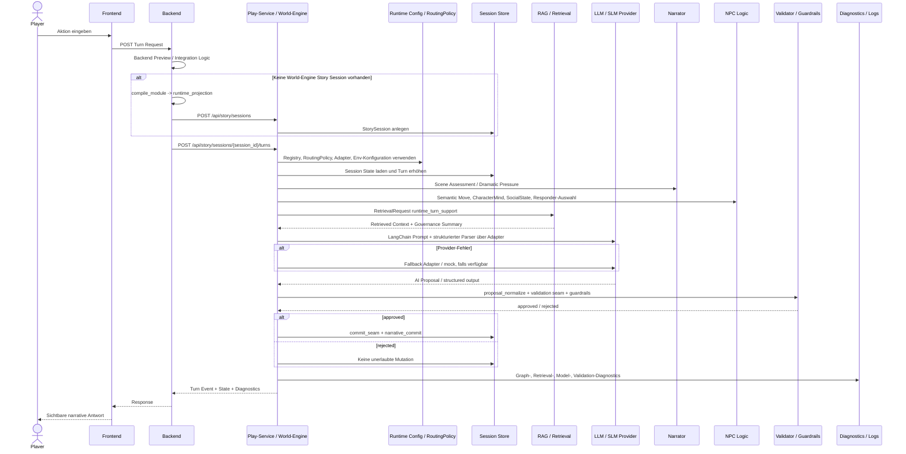

---

## 6. Zustandsdiagramm für einen Spielzug

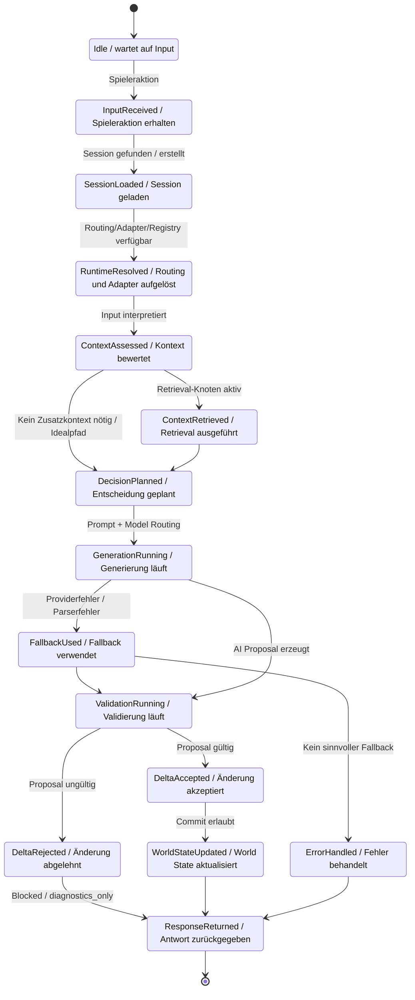

Dieses Diagramm bedeutet: Ein Turn ist kein einzelner Funktionsaufruf, sondern eine kontrollierte Zustandsmaschine. Erst wenn Session, Kontext, Generierung und Validierung erfolgreich durchlaufen sind, darf sich autoritativer Runtime State ändern.

---

## 7. UML-Komponentendiagramm / Architekturdiagramm

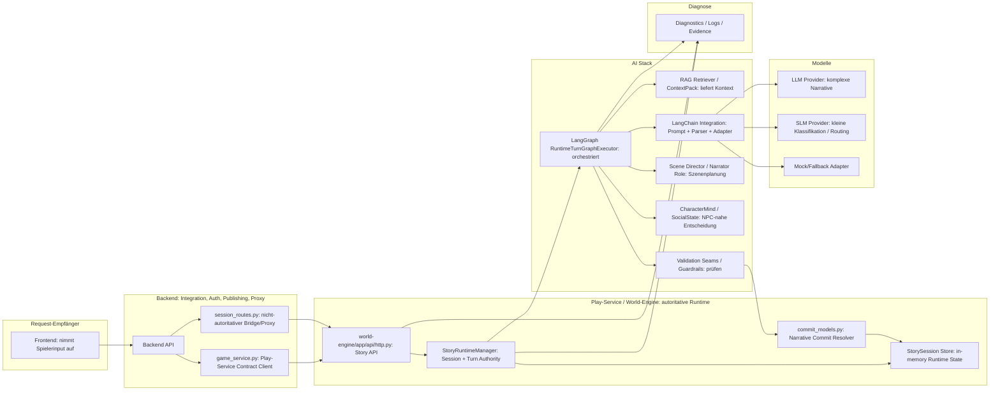

Komponentenrollen:

| Komponente                  | Rolle                                               |
| --------------------------- | --------------------------------------------------- |
| Frontend                    | Request-Eingang für Spieler                         |
| Backend                     | Integration, Proxy, Auth/Policy, Modul-Kompilierung |
| World-Engine                | autoritative Turn-Ausführung                        |
| StoryRuntimeManager         | Session- und Turn-Orchestrierung auf Runtime-Seite  |
| LangGraph                   | Ablaufsteuerung des Turns                           |
| RAG                         | Kontextlieferant                                    |
| LangChain                   | Prompt-/Parser-/Adapter-Brücke                      |
| Scene Director              | Narrator-nahe Planung                               |
| CharacterMind / SocialState | NPC-nahe Planung                                    |
| Validator / Guardrails      | Schutzschicht vor Commit                            |
| Commit Resolver             | entscheidet, was autoritativ übernommen wird        |
| Diagnostics                 | Nachvollziehbarkeit                                 |

---

## 8. Bedeutende Funktionsketten im Play-Service

### 8.1 Funktionsketten-Tabelle

| Funktionskette                                                                                                         | Startpunkt            | Beteiligte Komponenten                                                          | Zweck                            | Ergebnis                                      | Risiko                                           |
| ---------------------------------------------------------------------------------------------------------------------- | --------------------- | ------------------------------------------------------------------------------- | -------------------------------- | --------------------------------------------- | ------------------------------------------------ |
| Spieler-Input → Request Handling → Session Load → Runtime Config → AI Routing → Generation → Validation → Response     | Spieleraktion         | Frontend, Backend, World-Engine, LangGraph, LangChain, Validator                | Vollständiger Turn-Hauptpfad     | Antwort + optionaler Commit                   | Providerfehler, Session fehlt, Validation reject |
| Spieler-Input → Intent Detection → NPC Selection → NPC Decision → Dialogue / Action → World State Update               | Interpretierter Input | `interpret_input`, semantic planner, Scene Director, CharacterMind, SocialState | Relevante NPC-Reaktion bestimmen | Responder, Szene-Funktion, sichtbare Reaktion | NPC wirkt passiv oder lorewidrig                 |
| Spieler-Input → Retrieval Decision → RAG Query → Context Assembly → Prompt Build → LLM Response                        | Kontextbedarf         | RAG, ContextPackAssembler, LangChain Prompt                                     | Fehlenden Kontext ergänzen       | Prompt enthält relevante Lore/Memory          | Retrieval findet nichts oder falschen Kontext    |
| Narrator Turn → Scene State → Dramatic Pressure → Narrative Intent → Generated Output → Guardrails                     | Scene Assessment      | Scene Director, Dramatic Effect Gate, Visible Render                            | Szene erzählerisch führen        | Erzähltext, Konsequenz, Druck                 | Narrator bleibt zu allgemein/passiv              |
| NPC Turn → Character Traits → Relationship State → Goal Evaluation → Decision Tree → Action / Dialogue                 | NPC-nahe Reaktion     | CharacterMind, SocialState, SemanticMove, Scene Director                        | Plausible Figurreaktion          | Dialog/Handlungsvorschlag                     | Ziele/Beziehungen zu schwach modelliert          |
| Runtime Config → Provider Selection → LLM/SLM Routing → Fallback Handling                                              | Turn Routing          | RoutingPolicy, Registry, Adapter, LangChain                                     | Passendes Modell wählen          | Primärmodell oder Fallback                    | Falsches Modell, Kosten/Latenz, keine Fallbacks  |
| AI Output → Structured Delta Proposal → Validation → Accepted / Rejected Changes → Committed World State               | Modellantwort         | LangChain Parser, proposal_normalize, validation seam, commit seam              | AI-Vorschlag kontrollieren       | Commit oder Reject                            | Halluzination wird sonst Wahrheit                |
| Failure Path → Missing Context / Provider Error / Validation Failure → Fallback / Error Response / Diagnostic Evidence | Fehlerfall            | LangGraph fallback, Diagnostics, Logs                                           | Kontrolliert degradieren         | Degraded response + Evidence                  | Fehler bleibt unsichtbar oder UX bricht          |

### 8.2 Wichtigste Funktionskette im Idealzustand

Wenn der Spieler etwas eingibt, passiert nicht einfach nur eine Textgenerierung. Stattdessen läuft eine Kette aus Kontextauflösung, Entscheidungslogik, Modellwahl, Generierung, Prüfung und Zustandsänderung ab.

Der Spielerinput wird zuerst in einen Runtime-Kontext gesetzt: Welche Session? Welche Szene? Welche vorherigen Ereignisse? Dann entscheidet der Runtime-Graph, welche Informationen benötigt werden und welche Rolle aktiv wird: Narrator, NPC-nahe Logik oder beides. RAG kann zusätzlichen Kontext liefern. Danach wird über Modellrouting und Adapter ein Modell aufgerufen. Das Modell erzeugt aber nur einen Vorschlag. Erst Validation und Commit-Logik entscheiden, ob daraus autoritative Spielwahrheit wird.

### 8.3 Mermaid Flowchart der wichtigsten Funktionsketten

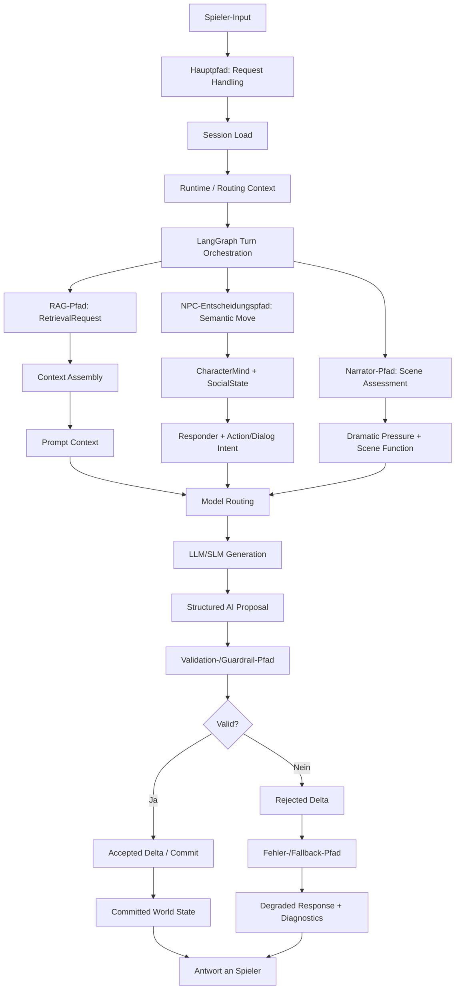

---

## 9. Entscheidungsbaum und Entscheidungslogik

### 9.1 Entscheidungsbaum allgemein erklären

In diesem Projekt bedeutet „Entscheidungsbaum“ nicht: Es gibt genau eine Datei mit einem klassischen Baum. Der Entscheidungsbaum ist verteilt.

Er besteht aus:

- deterministischen Regeln,
- LangGraph-Knoten,
- Model Routing,
- Retrieval Governance,
- Scene Director Logik,
- CharacterMind und SocialState,
- Validation Seams,
- Commit Resolver,
- Fallback-Routing.

Die AI darf formulieren, interpretieren und Vorschläge machen. Die Engine entscheidet, was in den autoritativen Zustand übernommen wird. Diese Trennung ist wichtig, weil ein Modell sonst versehentlich Figurenwissen erfinden, Szenen überspringen oder den World State unkontrolliert verändern könnte.

### 9.2 Entscheidungsbaum für einen Spielerzug

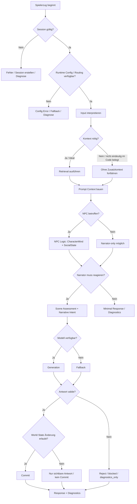

### 9.3 Entscheidungsbaum für NPCs

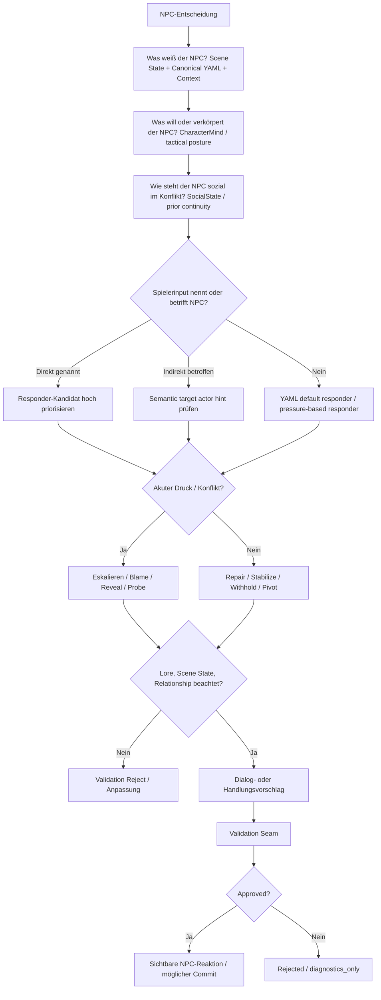

### 9.4 Entscheidungsbaum für den Narrator

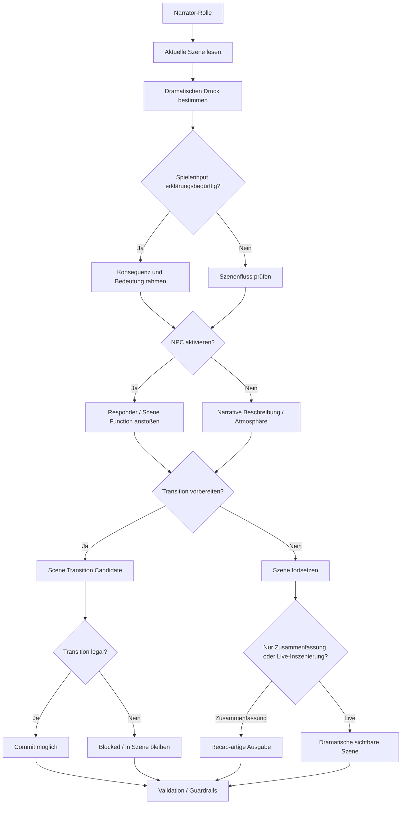

### 9.5 Entscheidungslogik als Präsentationstext

Der Entscheidungsbaum ist die Stelle, an der der Play-Service entscheidet, was überhaupt passieren darf. Wichtig ist: Die AI darf nicht einfach frei den Spielzustand überschreiben. Sie schlägt Reaktionen, Dialoge oder Zustandsänderungen vor. Die Engine prüft, ob das erlaubt ist, und committed nur valide Änderungen.

In der Praxis ist dieser Entscheidungsbaum verteilt: Ein Teil steckt im LangGraph-Ablauf, ein Teil im Scene Director, ein Teil im Modellrouting und ein Teil in Validation und Commit. Genau diese Aufteilung verhindert, dass ein einzelner LLM-Output die gesamte Spielwelt kontrolliert.

---

## 10. Narrator Thinking Model

Der Narrator „denkt“ technisch nicht wie ein Mensch. Er bekommt strukturierte Hinweise:

- aktuelle Szene,
- Modul und Runtime Projection,
- Spielerinput,
- semantische Interpretation,
- vorherige Continuity Impacts,
- Narrative Threads,
- Retrieval Context,
- dramatischen Druck,
- mögliche Scene Functions.

Sein Ziel ist, die Szene verständlich, konsequent und dramatisch sinnvoll weiterzuführen. Er erklärt nicht nur, was passiert, sondern rahmt Konsequenzen, Spannung und mögliche Übergänge.

Im aktuellen Code ist kein einzelnes `Narrator`-Objekt eindeutig belegt. Die Narrator-Rolle verteilt sich auf Scene Assessment, Director-Logik, Visible Render, Commit Resolver und Diagnostics.

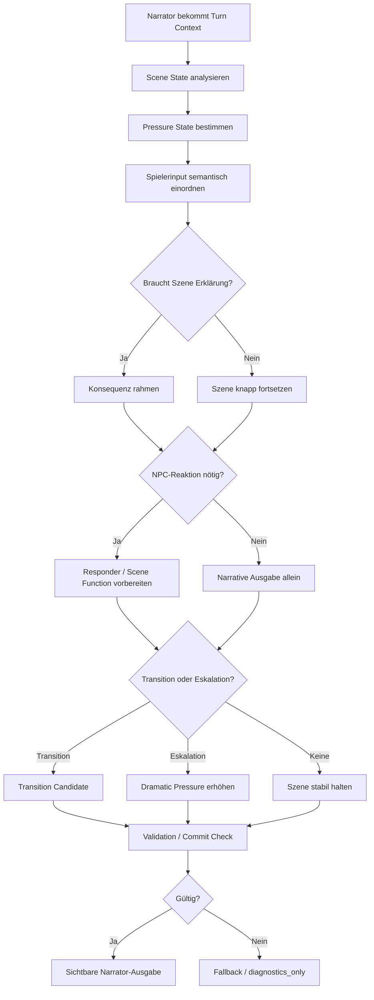

---

## 11. NPC Thinking Model

NPCs „denken“ im Repository vor allem über strukturierte, begrenzte Modelle:

- `CharacterMindRecord`: taktische Rolle und Haltung einer Figur.
- `SocialStateRecord`: sozialer Druck, Threads, Scene Pressure.
- `SemanticMoveRecord`: was der Spieler sozial oder dramatisch gerade tut.
- `ScenePlanRecord`: ausgewählte Scene Function, Responder Set, Pacing.
- `scene_director_goc.py`: konkrete Auswahl von Responder und Scene Function für `God of Carnage`.

Das ist keine freie autonome Agenten-Psyche. Es ist eine kontrollierte Entscheidungslogik: Wer soll reagieren? Warum? Mit welcher Funktion? Darf die Reaktion in dieser Szene passieren?

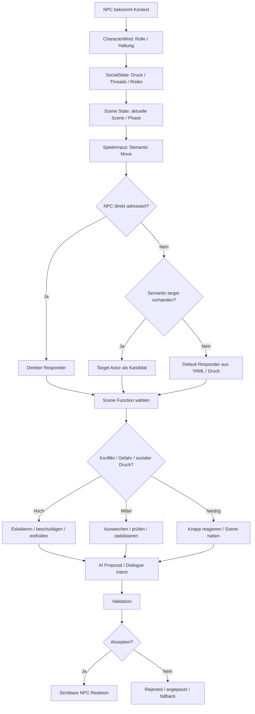

---

## 12. RAG im Play-Service

Beispiel: Der Spieler fragt nach einem alten Ereignis, das nicht im aktuellen Prompt-Kontext liegt.

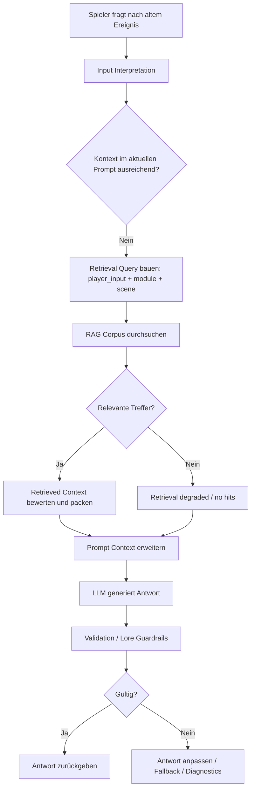

RAG ist hilfreich, wenn:

- relevante Lore nicht im aktuellen Prompt liegt,
- frühere Ereignisse oder Modulwissen gebraucht werden,
- der Turn eine Szene, Figur oder Beziehung referenziert,
- der Prompt sonst zu wenig Kontext hätte.

RAG ist nicht nötig, wenn:

- die Reaktion rein lokal aus der aktuellen Szene ableitbar ist,
- es nur um eine kleine UI-/Meta-Antwort geht,
- der Kontext bereits im Turn State vorhanden ist.

Wenn Retrieval nichts findet, darf das Modell nicht einfach Wahrheit erfinden. Dann muss die Antwort vorsichtig sein, oder der Turn muss degraded/fallback-diagnostiziert werden.

---

## 13. LLM vs SLM

| Aufgabe                         | Geeignetes Modell                 | Warum?                                        | Risiko bei falscher Wahl                           |
| ------------------------------- | --------------------------------- | --------------------------------------------- | -------------------------------------------------- |
| Narrative Formulierung          | LLM                               | braucht Sprache, Kontext, soziale Nuance      | SLM wirkt flach oder unplausibel                   |
| Scene Direction                 | LLM                               | komplexe dramaturgische Abwägung              | falscher Ton, falsche Eskalation                   |
| Conflict Synthesis              | LLM                               | mehrere Figureninteressen gleichzeitig        | Konflikt wird vereinfacht                          |
| Ambiguity Resolution            | LLM oder Eskalation               | unklare Spielerabsicht braucht Interpretation | falsche Absicht wird committed                     |
| Classification                  | SLM                               | eng begrenzte, schnelle Aufgabe               | LLM wäre teurer/langsamer                          |
| Trigger Extraction              | SLM                               | strukturierte Signal-Erkennung                | LLM kann overthinken                               |
| Ranking / Preflight             | SLM                               | günstiger und schnell                         | LLM unnötige Latenz/Kosten                         |
| High-stakes Continuity Judgment | LLM + Validation                  | Risiko für Lore/State-Bruch                   | falsche World-State-Änderung                       |
| Fallback Response               | kleines Modell oder mock fallback | muss kontrolliert degraded reagieren          | Spieler bekommt kaputte oder nichtssagende Antwort |

Im Repository sind LLM/SLM-Routingprinzipien besonders in `backend/app/runtime/model_routing.py` und den Routing Contracts belegt. Im Live-Pfad der World-Engine ist Modellrouting über Registry, RoutingPolicy und Adapter belegt; konkrete Provider-Parität ist nicht in jedem Detail eindeutig belegt.

---

## 14. LangChain / LangGraph / Orchestration

LangGraph ist im Live-Turn-Pfad zentral belegt. Der Runtime-Graph enthält Schritte wie:

- `interpret_input`,
- `retrieve_context`,
- `goc_resolve_canonical_content`,
- `director_assess_scene`,
- `director_select_dramatic_parameters`,
- `route_model`,
- `invoke_model`,
- `fallback_model`,
- `proposal_normalize`,
- `validate_seam`,
- `commit_seam`,
- `render_visible`,
- `package_output`.

LangChain wird konkreter und schmaler eingesetzt:

- Prompt-Templates,
- Pydantic Structured Output Parser,
- Runtime Adapter Invocation,
- Retriever Bridge,
- Capability Tool Bridge.

Es ist also nicht korrekt zu sagen: „LangChain steuert alles.“ Besser:

> LangGraph steuert den Ablauf. LangChain hilft beim Modellaufruf und bei strukturierter Ausgabe.

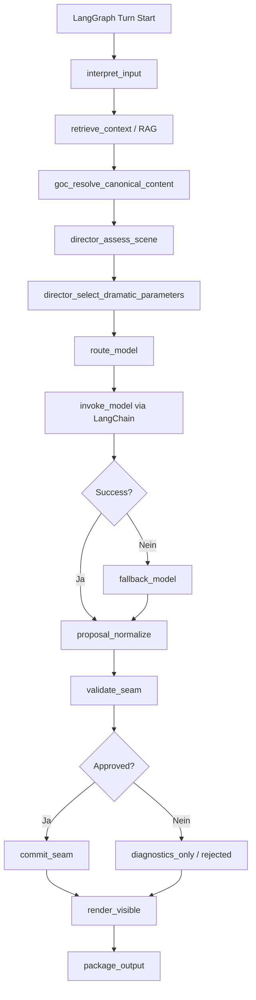

---

## 15. Elementar erforderliche Datenstrukturen und Designanforderungen

### 15.1 Elementare Datenstrukturen

| Datenstruktur               | Zweck                               | Wer erzeugt sie?                     | Wer liest sie?                         | Warum erforderlich?                                             |
| --------------------------- | ----------------------------------- | ------------------------------------ | -------------------------------------- | --------------------------------------------------------------- |
| Session State               | Laufende Story Session halten       | `StoryRuntimeManager.create_session` | World-Engine API, Manager, Diagnostics | Ohne Session kein autoritativer Turn                            |
| World State                 | Autoritative Wahrheit der Spielwelt | Engine Commit                        | Runtime, UI, Diagnostics               | Trennt Wahrheit von AI-Vorschlag                                |
| Player Input / Action       | Auslöser eines Turns                | Spieler/Frontend                     | Backend, World-Engine, LangGraph       | Startpunkt jeder Entscheidung                                   |
| Turn Context                | Kurzlebiger Kontext eines Turns     | LangGraph / Runtime Manager          | Modellrouting, Validator, Renderer     | Verhindert kontextlose Generation                               |
| Runtime Config              | Provider, Routing, Secrets, URLs    | Env/Config/Registry                  | Backend, World-Engine                  | Falsche Config bricht Integration                               |
| Model Routing Config        | Modellwahl je Aufgabe               | RoutingPolicy / Contracts            | LangGraph, Adapter                     | Kosten, Latenz und Qualität steuern                             |
| Retrieval Query             | Suchanfrage für Kontext             | Runtime Graph / RAG                  | Retriever                              | Macht RAG gezielt nutzbar                                       |
| Retrieved Context           | Gefundener Kontext                  | Retriever / Assembler                | Prompt Builder / LangChain             | Ergänzt Wissen außerhalb des Prompts                            |
| Prompt Context              | Modell-Eingabetext                  | LangGraph + LangChain                | LLM/SLM Provider                       | Kontrollierte Modellanfrage                                     |
| AI Decision / AI Proposal   | Vorschlag des Modells               | LLM/SLM über Adapter                 | Validator, Commit Seam                 | AI darf vorschlagen, nicht direkt committen                     |
| Narrator Output             | Sichtbare Erzählung                 | Visible Render / Modell              | Spieler, Diagnostics                   | Erzeugt Erlebnis und Konsequenz                                 |
| NPC State                   | Figurbezogener Zustand              | Canonical YAML / CharacterMind       | Scene Director, Validator              | Macht Reaktionen plausibel                                      |
| NPC Goal / Motivation       | Figurabsicht                        | CharacterMind / YAML-nahe Logik      | NPC Decision Logic                     | Nicht vollständig als persistente Goals belegt                  |
| Relationship State          | Beziehungskontext                   | SocialState / Runtime Context        | NPC/Narrator Logic                     | Als reiches Beziehungssystem nicht vollständig eindeutig belegt |
| Scene State                 | Aktuelle Szene und Phase            | Runtime Projection / Session         | Scene Director, Commit Resolver        | Szenenlogik und Transitionen brauchen Zustand                   |
| Decision Tree / Policy Node | Entscheidungslogik                  | Code-Regeln / Graph Nodes            | Runtime                                | Macht Ablauf steuerbar                                          |
| Validation Result           | Ergebnis der Prüfung                | Validator / Validation Seam          | Commit Seam, Diagnostics               | Verhindert ungültige Mutationen                                 |
| Guardrail Result            | Schutzentscheidung                  | Dramatic Effect Gate / Policies      | Runtime Graph                          | Schutz vor Lore-/Tone-/State-Bruch                              |
| Accepted Delta              | Erlaubte Änderung                   | Commit Seam / Resolver               | Session Store                          | Nur akzeptierte Änderung wird Wahrheit                          |
| Rejected Delta              | Abgelehnte Änderung                 | Validator / Commit Resolver          | Diagnostics, Response                  | Fehler sichtbar statt stiller Mutation                          |
| Runtime Event Log           | Turn-Evidence                       | StoryRuntimeManager                  | Operators, Tests, Debug                | Nachvollziehbarkeit                                             |
| Diagnostics Envelope        | Strukturierte Diagnose              | LangGraph + Manager                  | Admin/Ops/Debug                        | Erklärt, was warum passiert ist                                 |

Status-Notizen:

- `Session State` ist direkt als `StorySession` typisiert.
- `RuntimeTurnState` ist als TypedDict belegt.
- RAG-Strukturen sind klar typisiert: `RetrievalRequest`, `RetrievalHit`, `CorpusChunk`.
- `NPC Goal / Motivation` ist eher als abgeleitete taktische Haltung belegt, nicht als vollständiges persistentes Zielsystem.
- Vollständige World-State-Simulation ist im Story Runtime Code nicht vollständig belegt; aktuell ist der Commit im untersuchten Pfad bounded.

### 15.2 Designanforderungen an die Architektur

1. **Klare Trennung zwischen AI-Vorschlag und Engine-Wahrheit**
  Die AI darf vorschlagen, aber die Engine committed.
2. **Nachvollziehbare Entscheidungen**
  Retrieval, Routing, Responder-Auswahl und Validation müssen erklärbar bleiben.
3. **Deterministische Validierung**
  Kritische Regeln dürfen nicht allein beim Modell liegen.
4. **Einheitliche Runtime Config**
  Backend und World-Engine müssen dieselbe effektive Realität sehen oder Abweichungen diagnostizieren.
5. **Diagnostische Sichtbarkeit**
  Operatoren müssen sehen, welche Kette aktiv war.
6. **Saubere Datenverträge**
  API und Runtime Shapes dürfen nicht auseinanderdriften.
7. **Fallback-Fähigkeit**
  Provider-, Parser- oder Validation-Fehler müssen kontrolliert behandelt werden.
8. **RAG nur bei Bedarf**
  Als Ideal wichtig; aktuell ist Retrieval als Runtime-Knoten belegt, echtes Skipping nicht eindeutig belegt.
9. **Rollenklare AI-Komponenten**
  Narrator, NPC Logic, Retrieval, Validator und Model Router dürfen nicht vermischt werden.
10. **Testbarkeit**
  Entscheidungslogik muss über Unit-, Integration- und E2E-Tests belegbar bleiben.

### 15.3 Architektur-Anforderungsmatrix

| Designanforderung               | Warum wichtig?                  | Betroffene Komponenten      | Benötigte Datenstruktur                       | Risiko bei Verletzung      |
| ------------------------------- | ------------------------------- | --------------------------- | --------------------------------------------- | -------------------------- |
| AI Proposal ≠ Engine Truth      | Schutz vor Halluzination        | AI Stack, Validator, Engine | AI Proposal, Validation Result, Commit Record | Modell überschreibt Welt   |
| Nachvollziehbare Entscheidungen | Debug und Vertrauen             | LangGraph, Diagnostics      | RuntimeTurnState, Diagnostics Envelope        | Fehler nicht erklärbar     |
| Deterministische Validierung    | Lore/State-Sicherheit           | Validator, Commit Resolver  | Validation Result, Scene State                | ungültige Fortschritte     |
| Einheitliche Config             | stabile Runtime                 | Backend, World-Engine       | Runtime Config, Routing Config                | falscher Provider/Endpoint |
| Diagnostics                     | Betrieb und Demo-Sicherheit     | Logs, Admin, Backend        | Runtime Event Log                             | Black Box                  |
| API-Verträge                    | Frontend/Backend/Engine-Parität | APIs, Schemas               | Runtime Projection, Turn Event                | Schema Drift               |
| Fallbacks                       | kontrollierte Degradation       | LangGraph, Adapter          | Fallback Metadata                             | harter Abbruch             |
| Gezieltes RAG                   | Qualität ohne Overhead          | RAG, Prompt Builder         | Retrieval Query, Retrieved Context            | irrelevanter Kontext       |
| Rollentrennung                  | klare Verantwortlichkeit        | Narrator, NPC, Validator    | Scene Plan, CharacterMind                     | vermischte Logik           |
| Testbarkeit                     | beweisbare Qualität             | Tests, CI                   | Fixtures, Contracts                           | Regressionen               |

### 15.4 Datenflussdiagramm

```mermaid
flowchart LR
    playerInputData["Player Input"] --> sessionStateData["Session State"]
    sessionStateData --> worldSceneStateData["World State / Scene State"]
    worldSceneStateData --> runtimeRoutingData["Runtime Config / Routing"]
    playerInputData --> retrievalQueryData["Retrieval Query"]
    retrievalQueryData --> retrievedContextData["Retrieved Context"]
    retrievedContextData --> promptContextData["Prompt Context"]
    worldSceneStateData --> promptContextData
    runtimeRoutingData --> promptContextData
    promptContextData --> aiProposalData["AI Proposal"]
    aiProposalData --> validationResultData["Validation Result"]
    validationResultData --> deltaAcceptedDecision{"Accepted?"}
    deltaAcceptedDecision -- "Ja" --> acceptedDeltaData["Accepted Delta"]
    deltaAcceptedDecision -- "Nein" --> rejectedDeltaData["Rejected Delta"]
    acceptedDeltaData --> updatedWorldStateData["Updated World State"]
    rejectedDeltaData --> fallbackBlockedResponseData["Fallback / Blocked Response"]
    updatedWorldStateData --> playerResponseData["Player Response"]
    fallbackBlockedResponseData --> playerResponseData
    validationResultData --> diagnosticsData["Diagnostics"]
    runtimeRoutingData --> diagnosticsData
    retrievedContextData --> diagnosticsData
    aiProposalData --> diagnosticsData
```

### 15.5 Natürlich sprechbare Erklärung

Damit so ein AI-gestützter Play-Service stabil funktioniert, reicht es nicht, einfach einen Prompt an ein Modell zu schicken. Das System braucht klare Datenstrukturen: Wer bin ich? Wo bin ich? Wer ist anwesend? Was weiß der NPC? Was darf sich ändern? Was wurde nur vorgeschlagen und was wurde wirklich committed?

Genau diese Strukturen verhindern, dass die AI frei halluziniert oder den Spielzustand unkontrolliert verändert. Der Play-Service ist deshalb eher ein kontrolliertes Runtime-System mit AI-Unterstützung als ein Chatbot.

---

## 16. Validation & Guardrails

Validiert wird:

- strukturierte Modellantwort,
- vorgeschlagene Scene Transition,
- vorgeschlagene State Effects,
- dramatische Plausibilität,
- Character-/Scene-/Lore-Bezug,
- erlaubte Mutation,
- Fallback-/Degraded-Zustände.

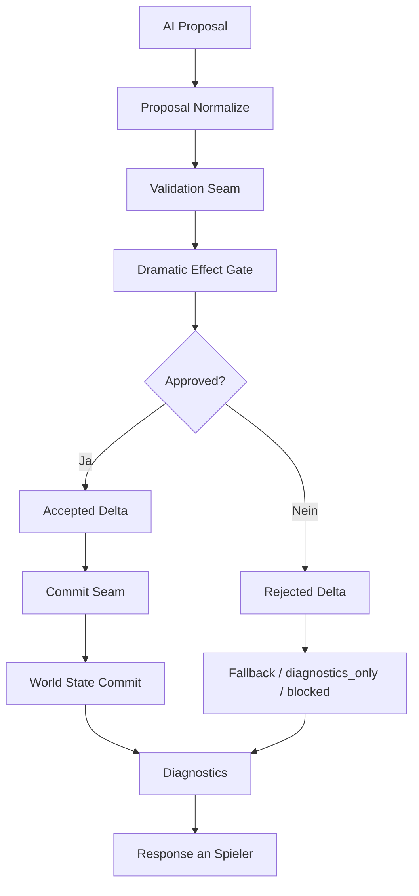

Bei abgelehnten Deltas wird nicht einfach trotzdem committed. Stattdessen entstehen Diagnoseinformationen, und die Antwort kann degraded, blocked oder fallback-basiert sein.

---

## 17. Probleme und Risiken

| Problem                            | Wann tritt es auf?                                  | Auswirkung                          | Ideale Lösung                                       |
| ---------------------------------- | --------------------------------------------------- | ----------------------------------- | --------------------------------------------------- |
| Fehlender Retrieval-Kontext        | RAG findet nichts oder falsches Profil              | Antwort wird dünn oder halluziniert | Trefferstatus sichtbar machen, vorsichtig antworten |
| Falsche Runtime Config             | Backend/World-Engine URLs, Secrets, Provider falsch | Sessionstart oder Turn bricht       | readiness checks + Admin-Sicht                      |
| Provider nicht verfügbar           | Modell/Adapter scheitert                            | Fallback oder degraded output       | kontrollierter Fallback mit Diagnose                |
| LLM halluziniert                   | Modell erfindet Lore/State                          | Lore-Bruch                          | Validation + Retrieval + Reject                     |
| NPC widerspricht Lore              | CharacterMind/SocialState unklar                    | Figur wirkt falsch                  | stärkere Character Contracts                        |
| Narrator bleibt zu passiv          | Scene pressure oder render schwach                  | Szene fühlt sich leblos an          | Dramatic Effect Gate + bessere pacing controls      |
| Validation schlägt fehl            | Proposal verletzt Regeln                            | kein Commit                         | brauchbare blocked/fallback response                |
| World State nicht synchron         | Backend volatile state statt World-Engine Truth     | UI zeigt falschen Zustand           | World-Engine state als einzige Runtime-Wahrheit     |
| Decision Tree ist zu grob          | Responder/Scene Function falsch                     | falsche Reaktion                    | feinere Policies und Tests                          |
| Datenstruktur fehlt oder driftet   | API/Runtime Shapes ändern sich                      | Consumer brechen                    | Contract Tests                                      |
| Diagnose zeigt zu wenig Details    | Fehler in Graph/Provider/Validation                 | Debug schwer                        | Diagnostics Envelope ausbauen                       |
| Fallback ist nicht sprechend genug | Provider oder Validation Fehler                     | schlechte UX                        | narrative Fallbacks statt nur technische Fehler     |

Für eine Live-Demo besonders kritisch:

1. falsche Play-Service-Konfiguration,
2. Provider/Fallback nicht verfügbar,
3. Validation reject ohne verständliche Antwort,
4. UI/Backend/World-Engine Contract Drift.

---

## 18. Idealbild

Im stabilen Idealablauf ist die Runtime Config klar, das Routing nachvollziehbar, Retrieval wird gezielt genutzt, die Modellwahl passt zur Aufgabe, Narrator und NPCs arbeiten rollengetrennt, und die AI bleibt in ihrer Rolle: Sie schlägt vor.

Die Engine validiert. Der World State bleibt konsistent. Die Antwort ist erzählerisch sinnvoll. Diagnostics zeigen, welche Komponente aktiv war, welcher Kontext verwendet wurde, welcher Provider aufgerufen wurde und warum ein Delta akzeptiert oder abgelehnt wurde.

So wird aus AI im Spiel keine unkontrollierte Textmaschine, sondern ein steuerbarer, prüfbarer Runtime-Partner.

---

## 19. Folienstruktur für 10 Minuten

| Folie | Titel                           | Kernaussage                                                                     | Visual / Diagramm         | Sprecherhinweis                                                                        |
| ----- | ------------------------------- | ------------------------------------------------------------------------------- | ------------------------- | -------------------------------------------------------------------------------------- |
| 1     | Was ist der Play-Service?       | Autoritative Story Runtime im `world-engine`                                    | Komponentenübersicht      | „Nicht Backend und nicht Chatbot: Die World-Engine ist die Runtime-Wahrheit.“          |
| 2     | Der Weg eines Spieler-Inputs    | Input läuft durch mehrere Runtime-Stufen                                        | Sequenzdiagramm           | „Ein Turn ist eine Kette, kein einzelner Prompt.“                                      |
| 3     | Die wichtigsten Funktionsketten | Kontext, Routing, Generation, Validation, Commit                                | Funktionsketten-Flowchart | „Hier sieht man, warum das System kontrollierbar bleibt.“                              |
| 4     | AI im System                    | LangGraph steuert, LangChain ruft Modelle strukturiert auf, RAG liefert Kontext | Orchestration Diagramm    | „LangGraph ist der Ablaufplan; LangChain ist die Modellbrücke.“                        |
| 5     | Entscheidungsbaum               | Regeln + State + AI + Validation                                                | Entscheidungsbaum Turn    | „Die AI entscheidet nicht allein.“                                                     |
| 6     | Narrator Thinking Model         | Narrator ist Runtime-Rolle für Szene, Druck, Konsequenz                         | Narrator Tree             | „Der Narrator rahmt die Szene technisch über Kontext und Druck.“                       |
| 7     | NPC Thinking Model              | NPCs reagieren über CharacterMind, SocialState und Scene Function               | NPC Tree                  | „NPCs sind nicht frei, sondern rollen- und szenengebunden.“                            |
| 8     | Datenstrukturen                 | State, Context, Proposal, Validation halten die Welt zusammen                   | Datenflussdiagramm        | „Das ist Gedächtnis und Kontrollsystem.“                                               |
| 9     | Validation & Guardrails         | Nur geprüfte Vorschläge werden Wahrheit                                         | Validation Diagramm       | „Proposal ist nicht gleich Commit.“                                                    |
| 10    | Idealablauf ohne Probleme       | Saubere Runtime vom Input bis Diagnostics                                       | Hauptablaufdiagramm       | „So soll der Demo-Pfad aussehen.“                                                      |
| 11    | Typische Risiken und Diagnose   | Fehler sind erwartbar, müssen sichtbar sein                                     | Risiko-Tabelle            | „Wichtig ist nicht, dass nie etwas schiefgeht, sondern dass es kontrolliert passiert.“ |
| 12    | Fazit                           | Mehr als ChatGPT: Runtime + AI + Validation                                     | 5 Kernaussagen            | „AI wird eingebettet, nicht freigelassen.“                                             |

---

## 20. Speaker Notes

| Folie | Speaker Notes                                                                                                                                        |
| ----- | ---------------------------------------------------------------------------------------------------------------------------------------------------- |
| 1     | „Der Play-Service ist die laufende Spielinstanz. Er entscheidet, was in einer Story Session wirklich passiert.“                                      |
| 2     | „Der Spielerinput geht über Frontend und Backend in die World-Engine. Das Backend ist wichtig, aber die Runtime-Wahrheit liegt in der World-Engine.“ |
| 3     | „Wir sehen hier die Ketten: Input, Kontext, Routing, Modell, Prüfung, Commit. Jede Kette kann diagnostiziert werden.“                                |
| 4     | „LangGraph ist der Ablaufplan des Turns. LangChain baut und parst den Modellaufruf. RAG liefert Kontext, wenn die Szene mehr Wissen braucht.“        |
| 5     | „Der Entscheidungsbaum ist verteilt. Regeln entscheiden harte Fakten, AI formuliert Vorschläge, Validation entscheidet über Übernahme.“              |
| 6     | „Der Narrator ist technisch die Instanz, die Szene, Druck und Konsequenz sichtbar macht. Er ist keine magische Stimme, sondern eine Runtime-Rolle.“  |
| 7     | „NPCs reagieren über Haltung, sozialen Druck, Szene und Spielerinput. Dadurch bleiben Figuren konsistenter.“                                         |
| 8     | „Ohne Datenstrukturen wäre alles nur Prompt. Session State, World State und Turn Context machen daraus eine echte Runtime.“                          |
| 9     | „Der wichtigste Schutz: Ein AI-Vorschlag darf nicht automatisch Wahrheit werden.“                                                                    |
| 10    | „Im Ideal ist jeder Schritt nachvollziehbar: warum dieses Modell, warum dieser NPC, warum dieses Delta akzeptiert wurde.“                            |
| 11    | „Risiken liegen an Schnittstellen: Config, Provider, Retrieval, Validation und UI-Verträge.“                                                         |
| 12    | „Der Kern ist: Das System nutzt AI, aber die Engine bleibt verantwortlich.“                                                                          |

---

## 21. Repository Evidence

| Datei                                                                              | Warum relevant                                                                                          |
| ---------------------------------------------------------------------------------- | ------------------------------------------------------------------------------------------------------- |
| `docs/ADR/adr-0001-runtime-authority-in-world-engine.md`                           | Belegt World-Engine als autoritative Runtime.                                                           |
| `docs/ADR/adr-0004-runtime-model-output-proposal-only-until-validator-approval.md` | Belegt AI Output als Proposal bis Validator/Engine-Approval.                                            |
| `docs/technical/runtime/runtime-authority-and-state-flow.md`                       | Belegt Ownership: World-Engine, Backend, story_runtime_core, ai_stack.                                  |
| `docs/technical/architecture/canonical_runtime_contract.md`                        | Belegt API-/Runtime-Contract und `runtime_projection`.                                                  |
| `docs/technical/ai/RAG.md`                                                         | Belegt RAG-Zweck, Domains, Storage und Runtime-Profil.                                                  |
| `docs/technical/integration/LangChain.md`                                          | Belegt LangChain als Adapter-/Prompt-/Parser-Harness.                                                   |
| `docs/archive/architecture-legacy/langgraph_in_world_of_shadows.md`                | Belegt LangGraph als Turn-Orchestrierungskonzept; aktuelle Codeform ist erweitert.                      |
| `world-engine/app/api/http.py`                                                     | Belegt Play-Service HTTP APIs, Story Session Endpoints und Internal API Key.                            |
| `world-engine/app/story_runtime/manager.py`                                        | Belegt `StoryRuntimeManager`, `StorySession`, Turn Execution, Diagnostics, LangGraph-Anbindung.         |
| `world-engine/app/story_runtime/commit_models.py`                                  | Belegt deterministic Narrative Commit Resolver und bounded scene progression.                           |
| `ai_stack/langgraph_runtime.py`                                                    | Belegt aktiven Runtime-Turn-Graph mit Retrieval, Routing, Invoke, Fallback, Validation, Commit, Render. |
| `ai_stack/langchain_integration/bridges.py`                                        | Belegt LangChain Prompt Templates, Pydantic Parser, Adapter Invocation, Retriever Bridge.               |
| `ai_stack/rag.py`                                                                  | Belegt Retrieval-Datenstrukturen, Corpus, Hybrid/Sparse Retrieval, Runtime Retriever.                   |
| `ai_stack/scene_director_goc.py`                                                   | Belegt GoC Scene Assessment, Responder Selection, Scene Function, Pacing.                               |
| `ai_stack/character_mind_contract.py`                                              | Belegt CharacterMind als begrenztes taktisches Identitätsmodell.                                        |
| `ai_stack/character_mind_goc.py`                                                   | Belegt GoC-spezifische CharacterMind-Ableitung.                                                         |
| `ai_stack/social_state_contract.py`                                                | Belegt SocialState als abgeleitete, nicht autoritative soziale Projektion.                              |
| `ai_stack/semantic_move_contract.py`                                               | Belegt semantische Spielerzug-Klassifikation.                                                           |
| `ai_stack/scene_plan_contract.py`                                                  | Belegt ScenePlan als advisory bis Validation/Commit.                                                    |
| `ai_stack/dramatic_effect_gate.py`                                                 | Belegt Guardrail für dramatische Wirkung und Plausibilität.                                             |
| `backend/app/api/v1/session_routes.py`                                             | Belegt Backend als nicht-autoritativer Bridge/Proxy zur World-Engine.                                   |
| `backend/app/services/game_service.py`                                             | Belegt Play-Service Contract Client, Config-Prüfung und Error Handling.                                 |
| `backend/app/api/v1/game_routes.py`                                                | Belegt Game/Play-Service Integration über Backend API.                                                  |
| `backend/app/runtime/model_routing.py`                                             | Belegt LLM/SLM-nahe Routingprinzipien im Backend-Kontext.                                               |
| `backend/app/runtime/model_routing_contracts.py`                                   | Belegt Modellrouting-Datenstrukturen und Task-Kategorien.                                               |
| `backend/app/runtime/decision_policy.py`                                           | Belegt AI Action Taxonomy und Policy-Prinzip.                                                           |
| `backend/app/runtime/validators.py`                                                | Belegt Validation von AI-Proposals im Backend-Runtime-Kontext.                                          |
| `backend/app/runtime/reference_policy.py`                                          | Belegt Referenzprüfung für Characters, Scenes, Triggers.                                                |
| `backend/app/runtime/mutation_policy.py`                                           | Belegt Mutation Whitelist/Blocking-Prinzip.                                                             |
| `backend/app/runtime/short_term_context.py`                                        | Belegt Short-Term Turn Context als bounded Kontextstruktur.                                             |
| `ai_stack/tests/test_langgraph_runtime.py`                                         | Testbezug für LangGraph Runtime.                                                                        |
| `ai_stack/tests/test_langchain_integration.py`                                     | Testbezug für LangChain Integration.                                                                    |
| `ai_stack/tests/test_rag.py`                                                       | Testbezug für RAG.                                                                                      |
| `ai_stack/tests/test_goc_runtime_graph_seams_and_diagnostics.py`                   | Testbezug für GoC Graph Seams und Diagnostics.                                                          |
| `ai_stack/tests/test_character_mind_goc.py`                                        | Testbezug für CharacterMind.                                                                            |
| `ai_stack/tests/test_dramatic_effect_gate.py`                                      | Testbezug für Guardrail/Dramatic Effect Gate.                                                           |

Markierungen:

| Aussage                                         | Status                                                                   |
| ----------------------------------------------- | ------------------------------------------------------------------------ |
| World-Engine ist autoritative Runtime           | direkt durch ADR, Docs und Code belegt                                   |
| AI Output ist Proposal bis Validation           | direkt durch ADR, Docs und Code belegt                                   |
| LangGraph ist Runtime-Orchestrierung            | direkt durch Code belegt                                                 |
| LangChain ist Prompt-/Parser-/Adapter-Brücke    | direkt durch Code belegt                                                 |
| RAG ist Runtime-Kontextlieferant                | direkt durch Code und Docs belegt                                        |
| Narrator als einzelne Klasse                    | nicht eindeutig belegt                                                   |
| Narrator als Runtime-Rolle                      | durch Scene Director, Render, Commit und Diagnostics belegt              |
| NPCs als vollständig autonome Agenten           | nicht eindeutig belegt                                                   |
| NPC-nahe Entscheidungslogik                     | durch CharacterMind, SocialState, SemanticMove und Scene Director belegt |
| RAG nur bei Bedarf                              | Idealablauf; aktuelles Skipping nicht eindeutig belegt                   |
| Vollständige persistente World-State-Simulation | nicht vollständig belegt; bounded Story Runtime State belegt             |

---

## 22. Zusammenfassung für mich als Vortragenden

### Die 5 wichtigsten Aussagen

1. Der Play-Service ist die autoritative Story Runtime im `world-engine`.
2. Ein Spielerturn ist eine Kette aus Kontext, Entscheidung, Modellaufruf, Validation und Commit.
3. Die AI erzeugt Vorschläge, aber die Engine entscheidet, was Wahrheit wird.
4. LangGraph orchestriert den Ablauf; LangChain hilft beim strukturierten Modellaufruf; RAG liefert Kontext.
5. Narrator und NPCs sind technisch kontrollierte Runtime-Rollen, keine frei halluzinierenden Figuren.

### Die 3 wichtigsten Diagramme

1. **Play-Service Ablaufdiagramm**
  Zeigt den gesamten Idealablauf vom Input bis Diagnostics.
2. **Sequenzdiagramm**
  Zeigt, wer mit wem kommuniziert.
3. **Validation & Guardrails Diagramm**
  Zeigt die wichtigste Sicherheitslinie: Proposal ≠ Commit.

### Die 3 kritischsten Risiken bei Rückfragen

1. **Runtime Config / Provider nicht verfügbar**
  Dann muss Fallback greifen, sonst bricht der Turn.
2. **AI halluziniert oder verletzt Lore**
  Deshalb gibt es Validation, Guardrails und Commit Resolver.
3. **Backend und World-Engine State driften auseinander**
  Deshalb muss die World-Engine als autoritative Runtime behandelt werden.

### Kurze Antwort auf: „Warum ist das mehr als einfach nur ChatGPT im Spiel?“

Weil der Play-Service nicht nur Text generiert. Er lädt Runtime State, baut Kontext auf, nutzt RAG, orchestriert den Turn über LangGraph, ruft Modelle strukturiert über LangChain auf, prüft die Ergebnisse über Validation und Guardrails und committed nur erlaubte Änderungen in den autoritativen World State. ChatGPT wäre nur die Generierung. Der Play-Service ist die kontrollierte Runtime darum herum.