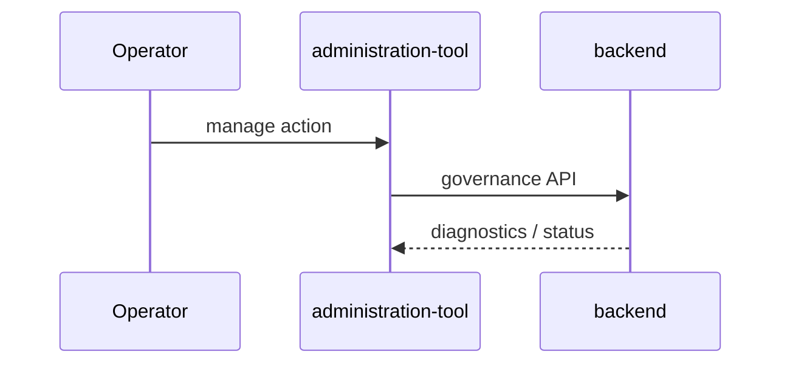

# administration-tool primary sequence

```mermaid
sequenceDiagram
  participant Op as Operator
  participant ADM as administration-tool
  participant BE as backend
  Op->>ADM: manage action
  ADM->>BE: governance API
  BE-->>ADM: diagnostics / status
```
