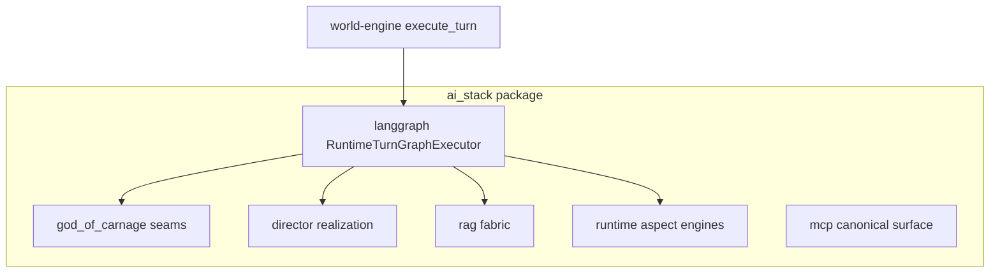

# ai-stack — Containers

```mermaid
flowchart TD
  subgraph ai_stack["ai_stack package"]
    LG["langgraph RuntimeTurnGraphExecutor"]
    GOC["god_of_carnage seams"]
    DIR["director realization"]
    RAG["rag fabric"]
    ASP["runtime aspect engines"]
    MCP["mcp canonical surface"]
  end
  WE["world-engine execute_turn"] --> LG
  LG --> GOC
  LG --> DIR
  LG --> RAG
  LG --> ASP
```
