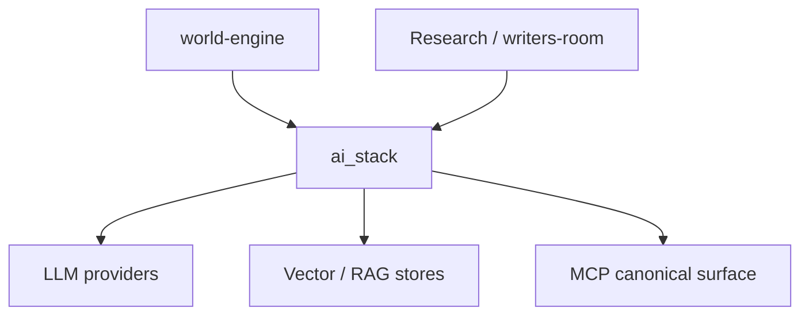

# ai-stack — System Context

```mermaid
flowchart TD
  WE["world-engine"] --> AI["ai_stack"]
  AI --> LLM["LLM providers"]
  AI --> RAG["Vector / RAG stores"]
  AI --> MCP["MCP canonical surface"]
  Research["Research / writers-room"] --> AI
```

ai_stack is invoked in-process from world-engine; it does not own session stores or HTTP play APIs.
