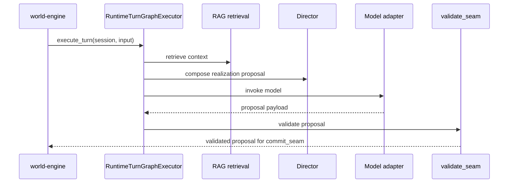

# ai-stack primary turn graph sequence

```mermaid
sequenceDiagram
  participant W as world-engine
  participant E as RuntimeTurnGraphExecutor
  participant R as RAG retrieval
  participant D as Director
  participant M as Model adapter
  participant V as validate_seam
  W->>E: execute_turn(session, input)
  E->>R: retrieve context
  E->>D: compose realization proposal
  E->>M: invoke model
  M-->>E: proposal payload
  E->>V: validate proposal
  V-->>W: validated proposal for commit_seam
```

Proposal-only: commit authority remains in world-engine after validate_seam returns.
