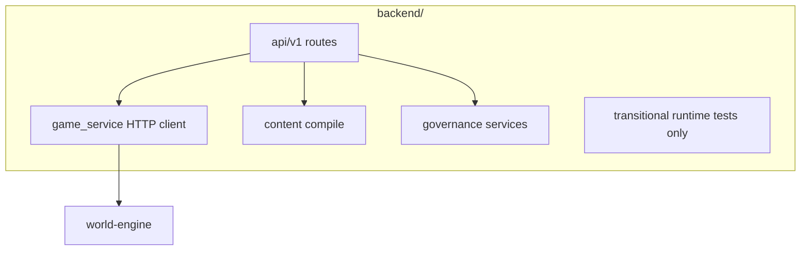

# backend — Containers

```mermaid
flowchart TD
  subgraph backend["backend/"]
    API["api/v1 routes"]
    GS["game_service HTTP client"]
    CT["content compile"]
    GV["governance services"]
    TR["transitional runtime tests only"]
  end
  API --> GS
  API --> CT
  API --> GV
  GS --> WE["world-engine"]
```
