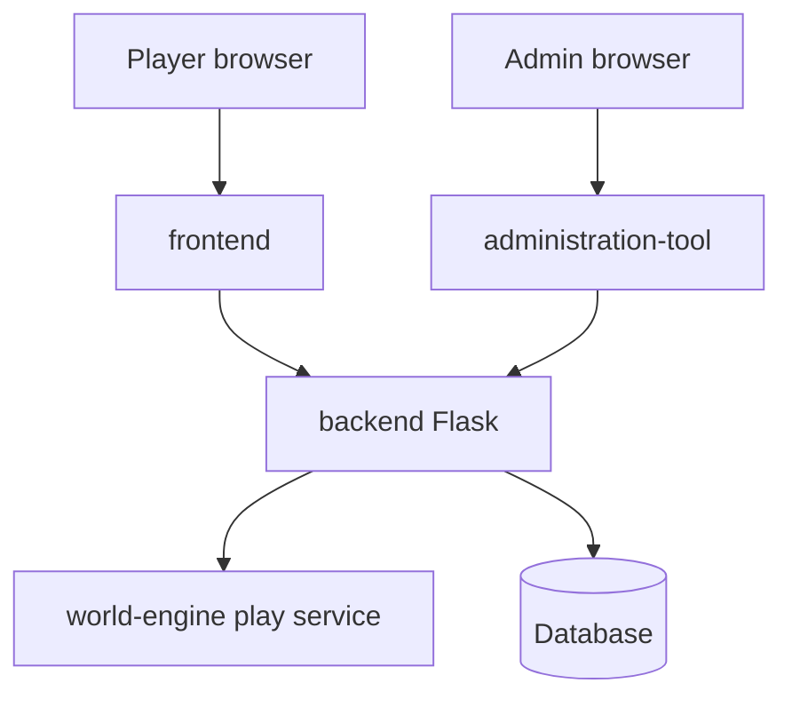

# backend — System Context

```mermaid
flowchart TD
  Player["Player browser"] --> FE["frontend"]
  Admin["Admin browser"] --> ADM["administration-tool"]
  FE --> BE["backend Flask"]
  ADM --> BE
  BE --> WE["world-engine play service"]
  BE --> DB[(Database)]
```

Backend proxies live play to world-engine; it does not commit narrative state.
