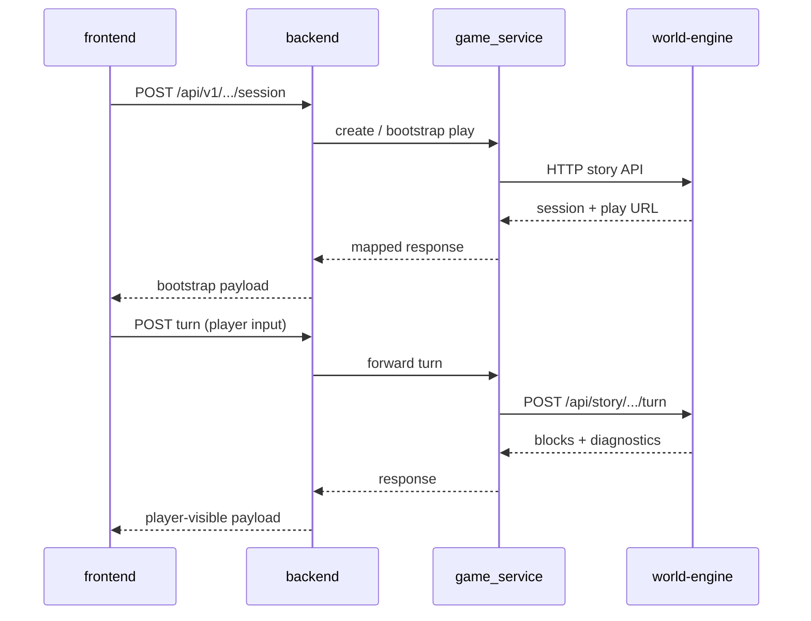

# backend session create → play proxy sequence

```mermaid
sequenceDiagram
  participant F as frontend
  participant B as backend
  participant G as game_service
  participant W as world-engine
  F->>B: POST /api/v1/.../session
  B->>G: create / bootstrap play
  G->>W: HTTP story API
  W-->>G: session + play URL
  G-->>B: mapped response
  B-->>F: bootstrap payload
  F->>B: POST turn (player input)
  B->>G: forward turn
  G->>W: POST /api/story/.../turn
  W-->>G: blocks + diagnostics
  G-->>B: response
  B-->>F: player-visible payload
```
