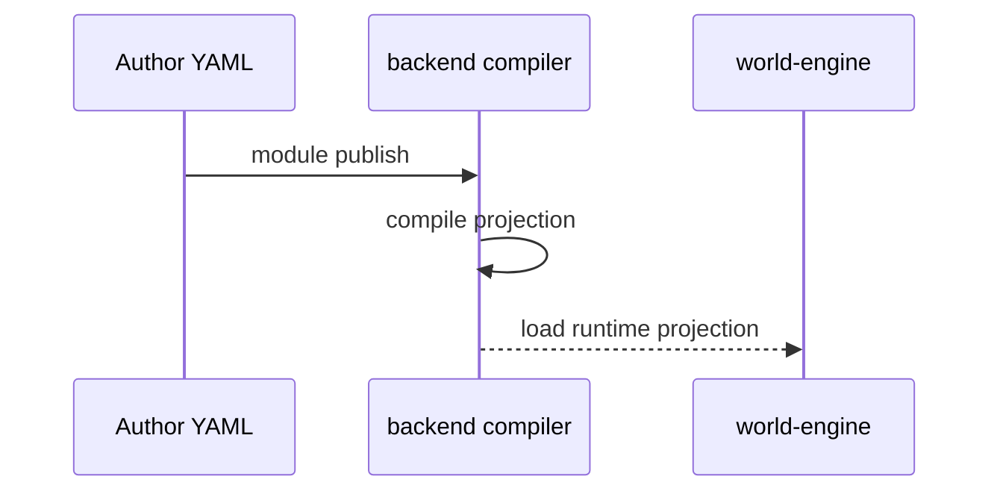

# content-authority primary sequence

```mermaid
sequenceDiagram
  participant A as Author YAML
  participant BE as backend compiler
  participant WE as world-engine
  A->>BE: module publish
  BE->>BE: compile projection
  BE-->>WE: load runtime projection
```
