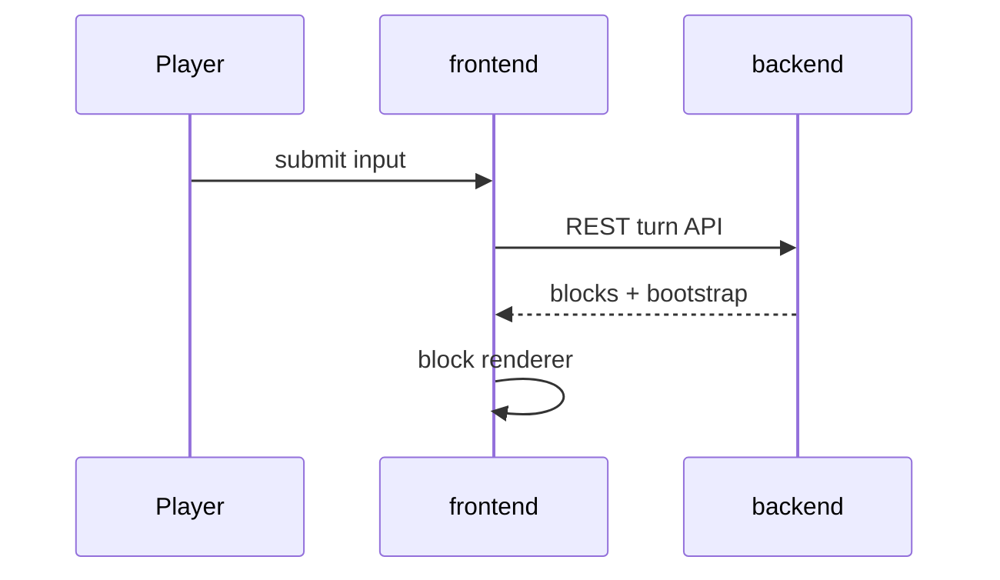

# frontend primary sequence

```mermaid
sequenceDiagram
  participant P as Player
  participant F as frontend
  participant B as backend
  P->>F: submit input
  F->>B: REST turn API
  B-->>F: blocks + bootstrap
  F->>F: block renderer
```
