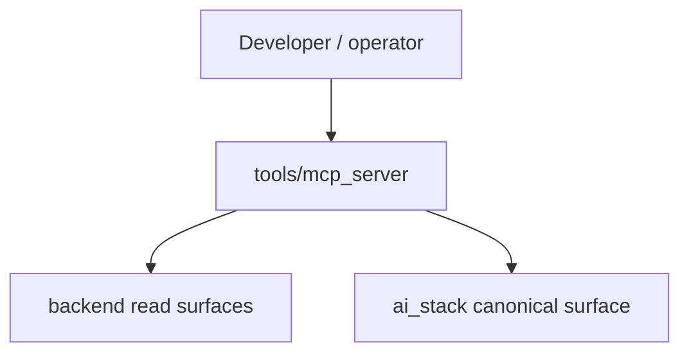

# mcp-server — System Context

```mermaid
flowchart TD
  Dev["Developer / operator"] --> MCP["tools/mcp_server"]
  MCP --> BE["backend read surfaces"]
  MCP --> CS["ai_stack canonical surface"]
```
