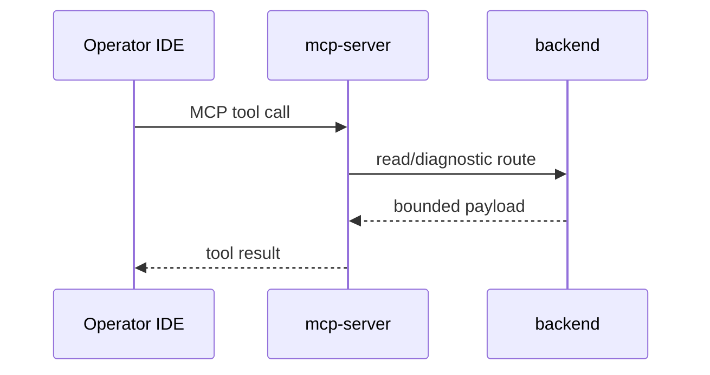

# mcp-server primary sequence

```mermaid
sequenceDiagram
  participant O as Operator IDE
  participant M as mcp-server
  participant B as backend
  O->>M: MCP tool call
  M->>B: read/diagnostic route
  B-->>M: bounded payload
  M-->>O: tool result
```
