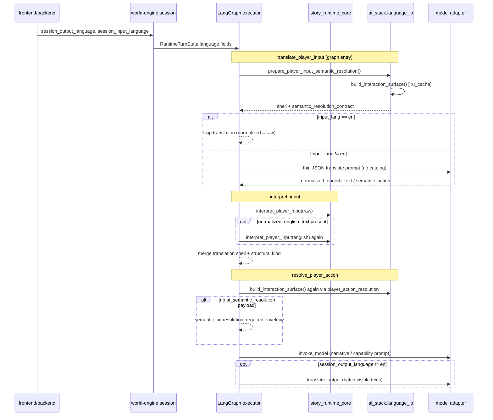

# Language resolution chain (story-runtime-core ↔ ai_stack ↔ LangGraph)

Normative session language: [world-engine session language](../../../../docs/architecture/components/world-engine/architecture.md#session-language), [D14 ingress](../../../../docs/architecture/components/world-engine/architecture.md#d14-semantic-player-input-enters-once).

## Multiplication points (audit notes)

| Step | What repeats | Owner |
| --- | --- | --- |
| Catalog surface | `build_interaction_surface` in translate shell, resolver, cached YAML scan | `ai_stack.language_io` |
| Structural interpret | `interpret_player_input` up to twice per turn | `story_runtime_core.input_interpreter` |
| LLM ingress | Thin translate vs unused `_semantic_translation_prompt` (full catalog) | `ai_stack.langgraph` |
| LLM egress | `translate_output` after narrator render | `ai_stack.langgraph` |
| Default language | `"de"` at ingress vs `"en"` at `translate_output` if state field missing | executor nodes |
