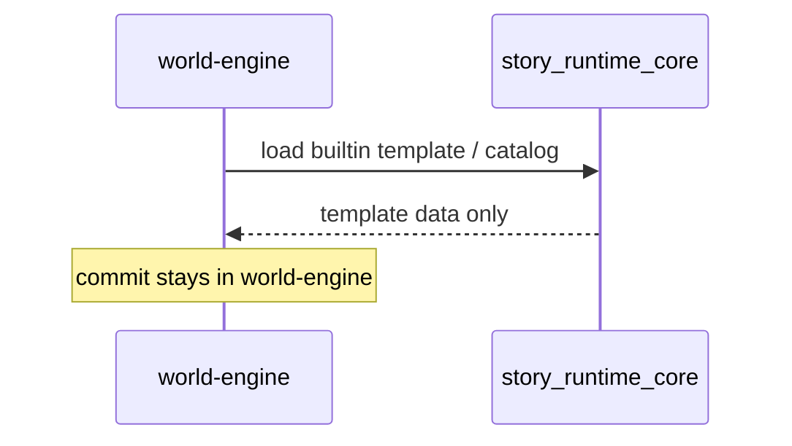

# story-runtime-core primary sequence

```mermaid
sequenceDiagram
  participant WE as world-engine
  participant SRC as story_runtime_core
  WE->>SRC: load builtin template / catalog
  SRC-->>WE: template data only
  Note over WE: commit stays in world-engine
```
