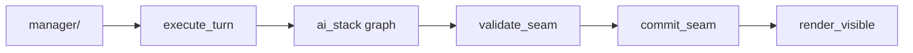

# world-engine — Components (story path)

```mermaid
flowchart LR
  MGR["manager/"] --> EXEC["execute_turn"]
  EXEC --> GRAPH["ai_stack graph"]
  GRAPH --> VAL["validate_seam"]
  VAL --> COM["commit_seam"]
  COM --> REN["render_visible"]
```

Source: [`c4-component.puml`](c4-component.puml)
