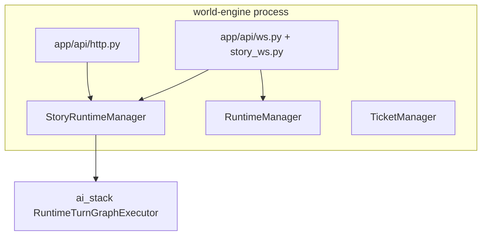

# world-engine — Containers

```mermaid
flowchart TD
  subgraph we ["world-engine process"]
    HTTP["app/api/http.py"]
    WS["app/api/ws.py + story_ws.py"]
    SRM["StoryRuntimeManager"]
    RM["RuntimeManager"]
    TM["TicketManager"]
  end
  HTTP --> SRM
  WS --> RM
  WS --> SRM
  SRM --> AI["ai_stack RuntimeTurnGraphExecutor"]
```

Source: [`c4-container.puml`](c4-container.puml)
