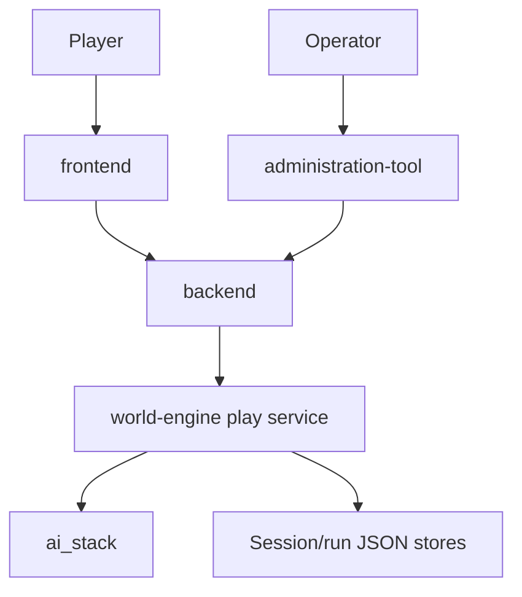

# world-engine — System Context

```mermaid
flowchart TD
  Player["Player"] --> Frontend["frontend"]
  Frontend --> Backend["backend"]
  Backend --> WE["world-engine play service"]
  WE --> AI["ai_stack"]
  WE --> Disk["Session/run JSON stores"]
  Operator["Operator"] --> Admin["administration-tool"]
  Admin --> Backend
```

Source: [`c4-context.puml`](c4-context.puml)
