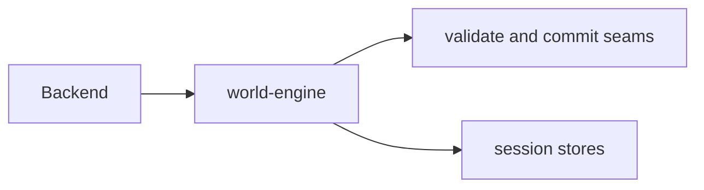

# D1: Runtime authority in world-engine

**Owner SAD:** [world-engine SAD](../../../../docs/architecture/components/world-engine/architecture.md#d1-world-engine-owns-live-story-commit-authority)
**Origin:** ADR-0001 (retired)
**Status:** Accepted

## Context

When a story session is live, exactly one process must own committed runtime truth.

## Decision

world-engine is the authoritative play service for live session state, turn execution, and narrative commits.

## Diagram

## Evidence

| Kind | Link |
| --- | --- |
| Source | `world-engine/world_engine/story_runtime/manager/` |
| Test | `world-engine/tests/test_story_runtime_api.py` |
