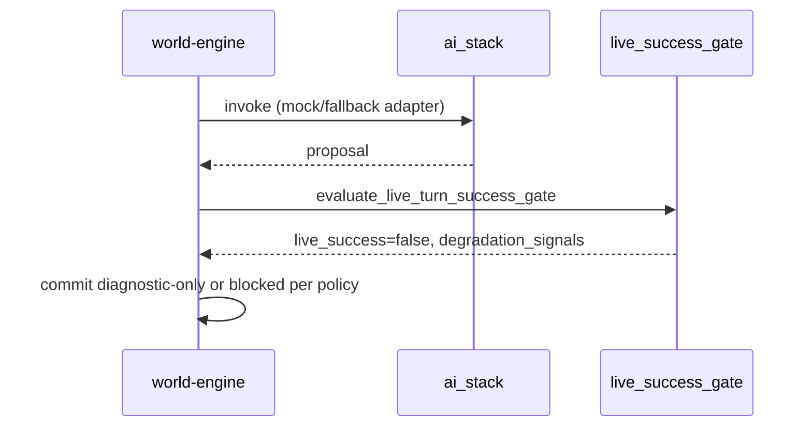

# Degraded turn sequence

```mermaid
sequenceDiagram
  participant W as world-engine
  participant A as ai_stack
  participant G as live_success_gate
  W->>A: invoke (mock/fallback adapter)
  A-->>W: proposal
  W->>G: evaluate_live_turn_success_gate
  G-->>W: live_success=false, degradation_signals
  W->>W: commit diagnostic-only or blocked per policy
```

Source: [`world-engine-degraded-turn-sequence.puml`](world-engine-degraded-turn-sequence.puml)
