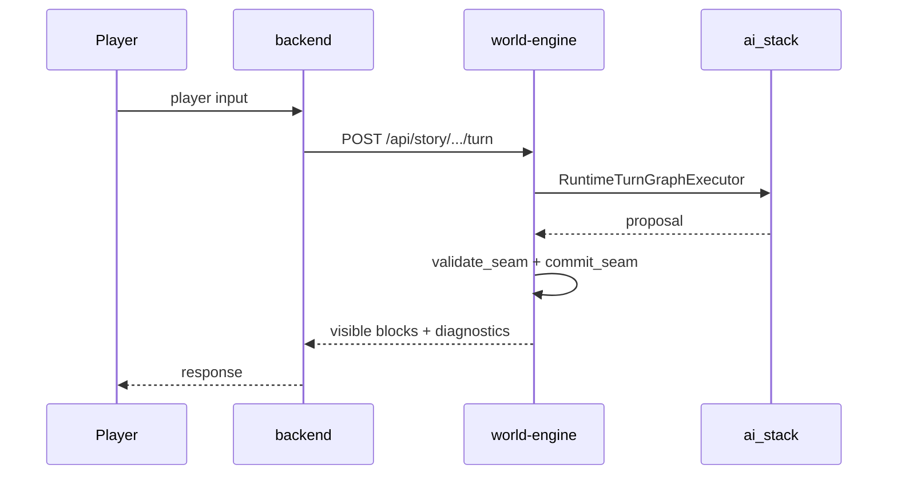

# Primary story turn sequence

```mermaid
sequenceDiagram
  participant P as Player
  participant B as backend
  participant W as world-engine
  participant A as ai_stack
  P->>B: player input
  B->>W: POST /api/story/.../turn
  W->>A: RuntimeTurnGraphExecutor
  A-->>W: proposal
  W->>W: validate_seam + commit_seam
  W-->>B: visible blocks + diagnostics
  B-->>P: response
```

Source: [`world-engine-primary-turn-sequence.puml`](world-engine-primary-turn-sequence.puml)
