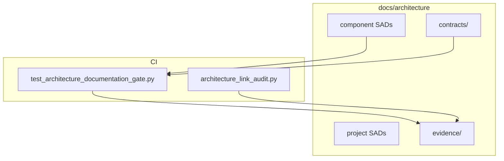

# documentation-supply-chain — Containers

```mermaid
flowchart TD
  subgraph supply["docs/architecture"]
    COMP["component SADs"]
    PROJ["project SADs"]
    CTR["contracts/"]
    EV["evidence/"]
  end
  subgraph ci["CI"]
    GT["test_architecture_documentation_gate.py"]
    LA["architecture_link_audit.py"]
  end
  COMP --> GT
  CTR --> GT
  GT --> EV
  LA --> EV
```
