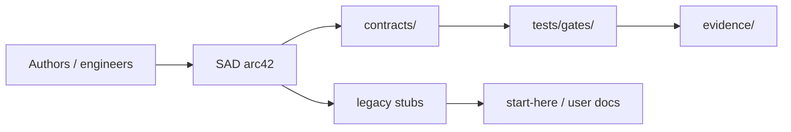

# documentation-supply-chain — System Context

```mermaid
flowchart LR
  Author["Authors / engineers"] --> SAD["SAD arc42"]
  SAD --> Contract["contracts/"]
  Contract --> Gate["tests/gates/"]
  Gate --> Evidence["evidence/"]
  SAD --> Stub["legacy stubs"]
  Stub --> Audience["start-here / user docs"]
```
