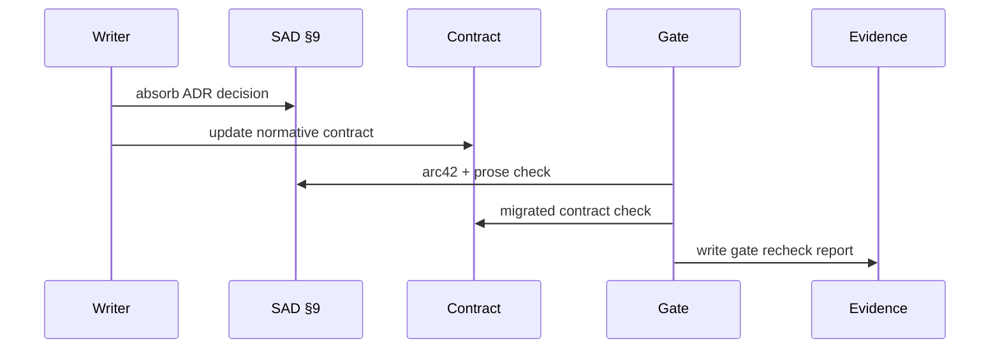

# Documentation supply chain sequence

```mermaid
sequenceDiagram
  participant W as Writer
  participant S as SAD §9
  participant C as Contract
  participant G as Gate
  participant E as Evidence
  W->>S: absorb ADR decision
  W->>C: update normative contract
  G->>S: arc42 + prose check
  G->>C: migrated contract check
  G->>E: write gate recheck report
```
