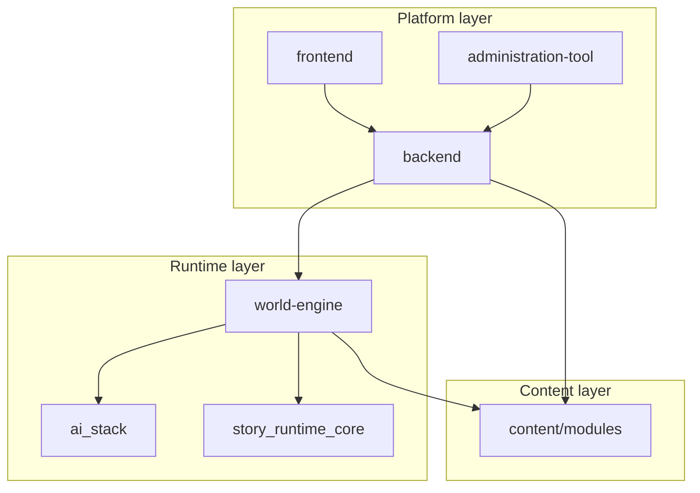

# ecosystem-topology — Containers

```mermaid
flowchart TD
  subgraph platform["Platform layer"]
    FE["frontend"]
    ADM["administration-tool"]
    BE["backend"]
  end
  subgraph runtime["Runtime layer"]
    WE["world-engine"]
    AI["ai_stack"]
    SRC["story_runtime_core"]
  end
  subgraph content["Content layer"]
    CA["content/modules"]
  end
  FE --> BE
  ADM --> BE
  BE --> WE
  WE --> AI
  WE --> SRC
  BE --> CA
  WE --> CA
```

Canonical service map: [ecosystem-topology SAD](../../../../docs/architecture/project/ecosystem-topology/architecture.md).
