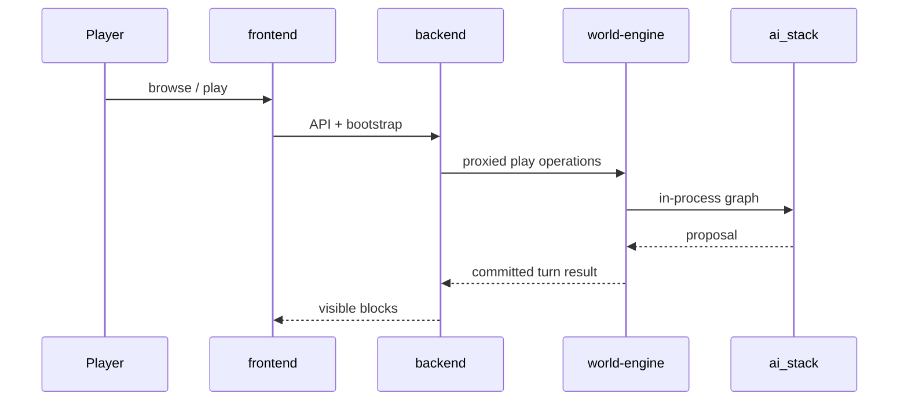

# Ecosystem request flow sequence

```mermaid
sequenceDiagram
  participant P as Player
  participant F as frontend
  participant B as backend
  participant W as world-engine
  participant A as ai_stack
  P->>F: browse / play
  F->>B: API + bootstrap
  B->>W: proxied play operations
  W->>A: in-process graph
  A-->>W: proposal
  W-->>B: committed turn result
  B-->>F: visible blocks
```

Platform-level view; component detail in component UML packages.
