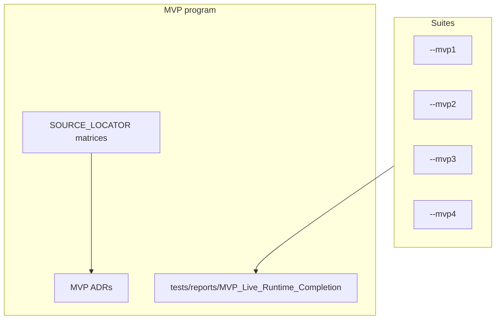

# mvp-live-runtime-completion — Containers

```mermaid
flowchart TD
  subgraph program["MVP program"]
    SL["SOURCE_LOCATOR matrices"]
    ADR["MVP ADRs"]
    REP["tests/reports/MVP_Live_Runtime_Completion"]
  end
  subgraph gates["Suites"]
    G1["--mvp1"]
    G2["--mvp2"]
    G3["--mvp3"]
    G4["--mvp4"]
  end
  SL --> ADR
  gates --> REP
```
