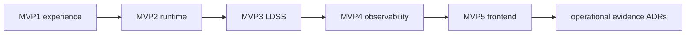

# mvp-live-runtime-completion — System Context

```mermaid
flowchart LR
  MVP1["MVP1 experience"] --> MVP2["MVP2 runtime"]
  MVP2 --> MVP3["MVP3 LDSS"]
  MVP3 --> MVP4["MVP4 observability"]
  MVP4 --> MVP5["MVP5 frontend"]
  MVP5 --> Evidence["operational evidence ADRs"]
```
