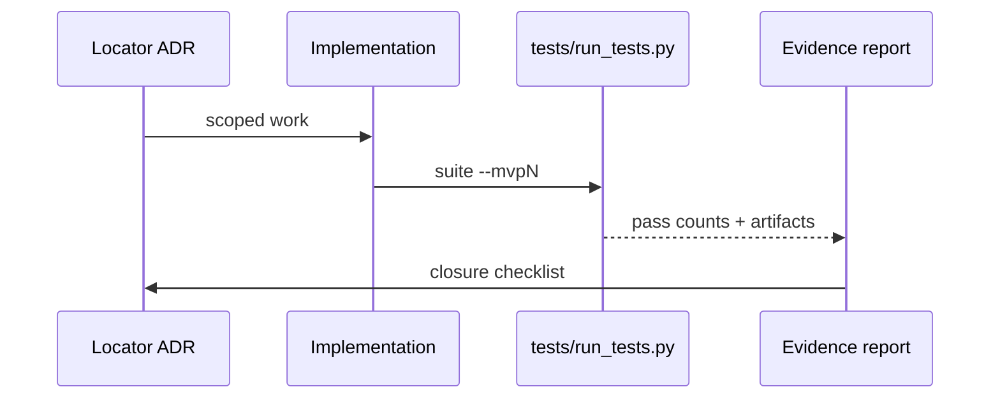

# MVP gate flow sequence

```mermaid
sequenceDiagram
  participant L as Locator ADR
  participant I as Implementation
  participant T as tests/run_tests.py
  participant E as Evidence report
  L->>I: scoped work
  I->>T: suite --mvpN
  T-->>E: pass counts + artifacts
  E->>L: closure checklist
```
