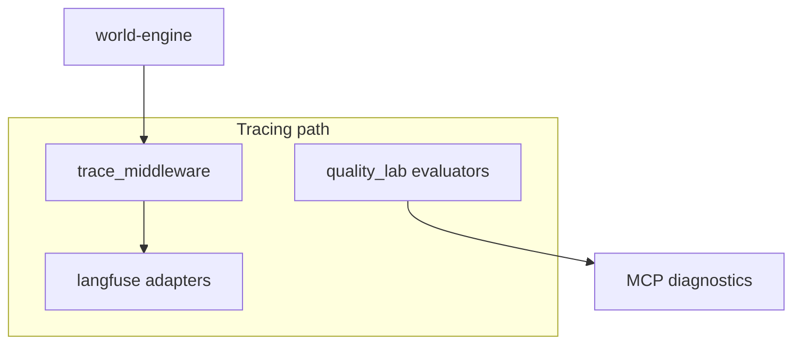

# observability-traceability — Containers

```mermaid
flowchart TD
  subgraph trace["Tracing path"]
    TM["trace_middleware"]
    LA["langfuse adapters"]
    QL["quality_lab evaluators"]
  end
  WE["world-engine"] --> TM
  TM --> LA
  QL --> MCP["MCP diagnostics"]
```
