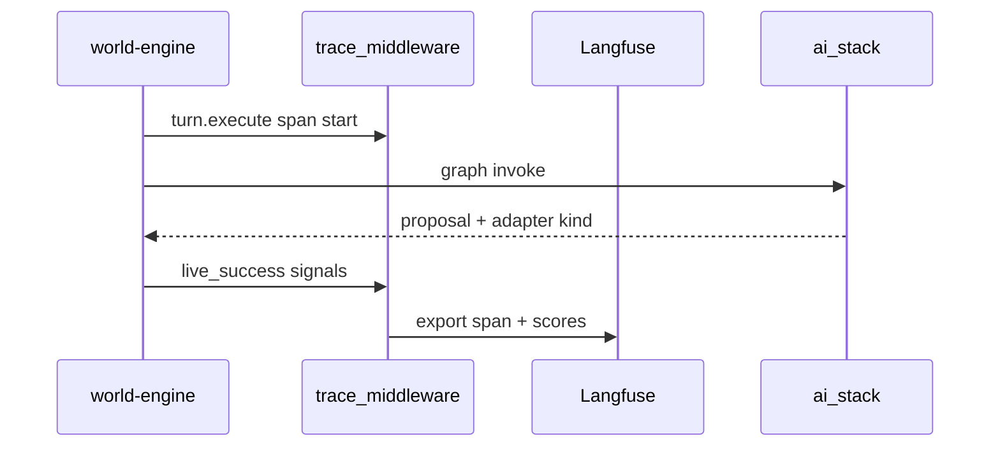

# Turn trace sequence

```mermaid
sequenceDiagram
  participant W as world-engine
  participant T as trace_middleware
  participant L as Langfuse
  participant A as ai_stack
  W->>T: turn.execute span start
  W->>A: graph invoke
  A-->>W: proposal + adapter kind
  W->>T: live_success signals
  T->>L: export span + scores
```
