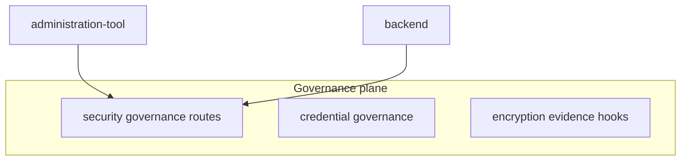

# security-governance — Containers

```mermaid
flowchart TD
  subgraph gov["Governance plane"]
    SG["security governance routes"]
    CP["credential governance"]
    ENC["encryption evidence hooks"]
  end
  ADM["administration-tool"] --> SG
  BE["backend"] --> SG
```
