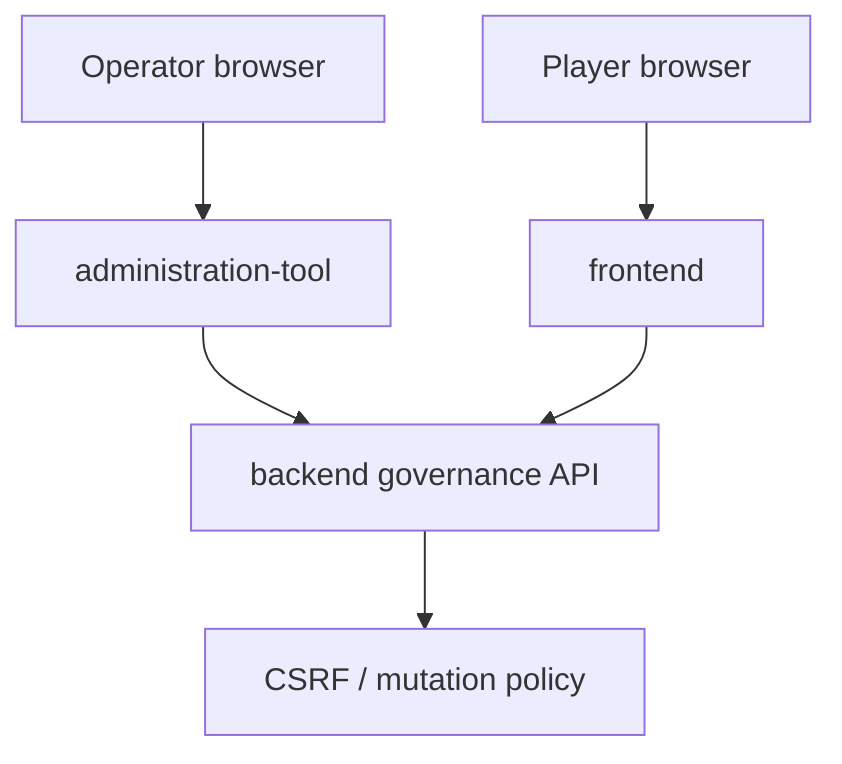

# security-governance — System Context

```mermaid
flowchart TD
  Admin["Operator browser"] --> ADM["administration-tool"]
  ADM --> BE["backend governance API"]
  Player["Player browser"] --> FE["frontend"]
  FE --> BE
  BE --> Policy["CSRF / mutation policy"]
```
