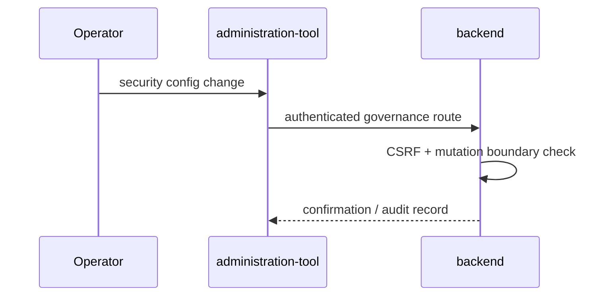

# Security admin control plane sequence

```mermaid
sequenceDiagram
  participant Op as Operator
  participant A as administration-tool
  participant B as backend
  Op->>A: security config change
  A->>B: authenticated governance route
  B->>B: CSRF + mutation boundary check
  B-->>A: confirmation / audit record
```
