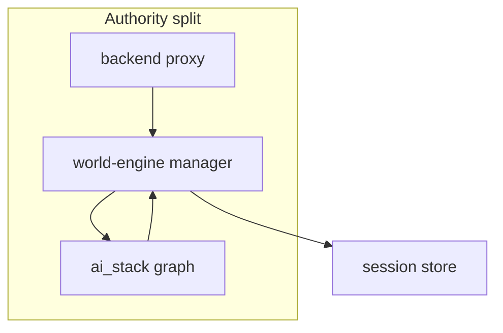

# turn-execution-canonical — Containers

```mermaid
flowchart TD
  subgraph authority["Authority split"]
    BE["backend proxy"]
    WE["world-engine manager"]
    AI["ai_stack graph"]
  end
  BE --> WE
  WE --> AI
  AI --> WE
  WE --> Store["session store"]
```

Single commit path target (ADR-0038 open exception) documented in world-engine SAD D5.
