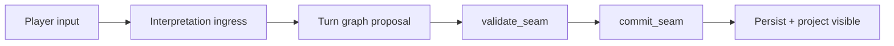

# turn-execution-canonical — Context

```mermaid
flowchart LR
  Input["Player input"] --> Ingress["Interpretation ingress"]
  Ingress --> Graph["Turn graph proposal"]
  Graph --> Validate["validate_seam"]
  Validate --> Commit["commit_seam"]
  Commit --> Project["Persist + project visible"]
```

Cross-cutting contract: [`turn_execution_contract.md`](../../../../docs/architecture/contracts/turn_execution_contract.md).
