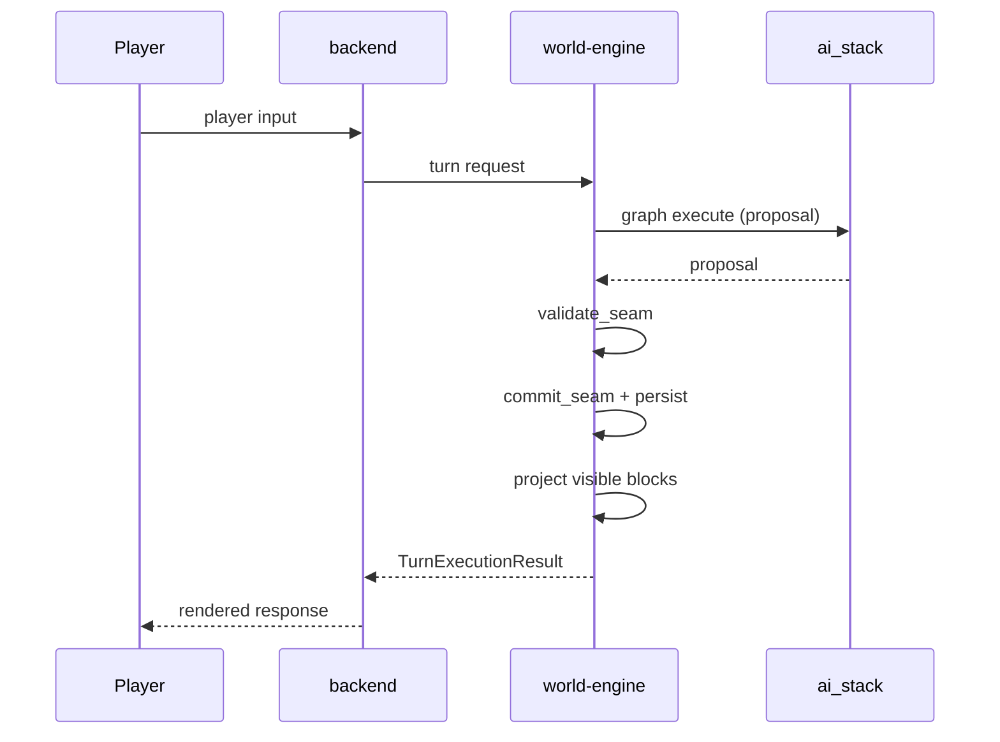

# Canonical turn lifecycle sequence

Normative: [`turn_execution_contract.md`](../../../../docs/architecture/contracts/turn_execution_contract.md), GoC [`CANONICAL_TURN_CONTRACT_GOC.md`](../../../../docs/MVPs/MVP_VSL_And_GoC_Contracts/CANONICAL_TURN_CONTRACT_GOC.md).
