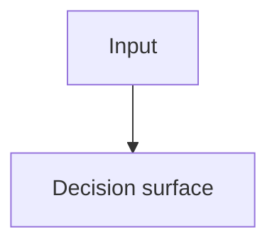

# D{n}: {Title}

**Owner SAD:** [component SAD](../../../../docs/architecture/components/{slug}/architecture.md#d{n}-{slug})
**Origin:** ADR-00xx (retired)
**Status:** Accepted

## Context

Why the decision was needed.

## Decision

Normative statement (distilled from SAD §9).

## Diagram

## Evidence

| Kind | Link |
| --- | --- |
| Test | `tests/...` |
| Gate | `tests/gates/...` |
