# AI in World of Shadows — Connected System Reference

## Title and purpose

This document is the **spine** for AI-related documentation: it explains how retrieval, orchestration, model routing, runtime authority, authoring workflows, and operator tooling **fit together** in this repository. It is written for contributors who need a **system picture**, not a bag of isolated definitions.

**Companion pages** (deeper detail, maintained alongside code):

- [AI stack overview](../technical/ai/ai-stack-overview.md)
- [How AI fits the platform](../start-here/how-ai-fits-the-platform.md) (plain language + pointers)
- [RAG](../technical/ai/RAG.md), [LLM / SLM role stratification](../technical/ai/llm-slm-role-stratification.md)
- [LangGraph integration](../technical/integration/LangGraph.md), [LangChain integration](../technical/integration/LangChain.md)
- [Runtime authority and state flow](../technical/runtime/runtime-authority-and-state-flow.md), [World-engine narrative commit](../technical/runtime/world_engine_authoritative_narrative_commit.md)
- [MCP scope](../mcp/00_M0_scope.md) and the [MCP server developer guide](../dev/tooling/mcp-server-developer-guide.md)

---

## Scope and source-of-truth

**Priority:** (1) implementation in this repo, (2) normative docs such as [`docs/VERTICAL_SLICE_CONTRACT_GOC.md`](../VERTICAL_SLICE_CONTRACT_GOC.md) and [`docs/CANONICAL_TURN_CONTRACT_GOC.md`](../CANONICAL_TURN_CONTRACT_GOC.md), (3) tests and gate reports, (4) architecture/governance artifacts, (5) **inference** — explicitly labeled when used.

**Legacy archive warning:** Older milestone summaries under [`docs/archive/architecture-legacy/`](../archive/architecture-legacy/) may describe LangGraph, RAG, or LangChain as “planned” or “deferred.” That is **out of date** relative to the current tree. When archive text disagrees with code, **trust the vertical slice contract, `ai_stack/langgraph_runtime.py`, and the documents linked above**.

**Graph version (code):** `RUNTIME_TURN_GRAPH_VERSION` in `ai_stack/version.py` (currently `m12_goc_freeze_v1`).

---

## Executive overview

World of Shadows uses **several cooperating layers** for AI: local **RAG** builds context packs; **LangGraph** runs the **runtime turn graph** inside the play host; **LangChain** supports **structured invocation** inside that graph and in backend workflows; **model routing** chooses adapters by phase/task (LLM- vs SLM-biased roles); **capabilities** expose governed tool-shaped operations; **MCP** surfaces operator/developer tooling **outside** the authoritative turn loop.

**Nothing in that stack replaces runtime authority:** models and graphs **propose**; **validation and commit seams** (GoC) and the **world-engine session host** determine what becomes **live session truth** and history.

---

## AI as participant, not authority

### Plain language

AI helps interpret input, retrieve relevant text, propose narrative structure, and enrich operator workflows. It does **not** “own” the story state: the platform **checks** proposals and **records** only what rules allow.

### Technical precision

- **`ai_stack`:** Turn graph execution, RAG, LangChain bridges, capabilities — outputs are **inputs to validation** until seams and host logic accept them (see [`runtime-authority-and-state-flow.md`](../technical/runtime/runtime-authority-and-state-flow.md)).
- **`story_runtime_core`:** Shared interpretation, adapters, registry patterns used by both world-engine and backend paths.
- **`world-engine`:** Authoritative host for **live** `StorySession` lifecycle, turn execution, diagnostics append, and bounded narrative commit resolution after the graph returns (`StoryRuntimeManager` in `world-engine/app/story_runtime/manager.py`).
- **`backend`:** Policy, auth, Writers’ Room / improvement HTTP surfaces, proxy to play via `PLAY_SERVICE_*`, governance APIs — **not** a second authoritative runtime for the canonical play path.

### Why this matters in World of Shadows

Without this split, debugging “why did the scene change?” collapses into opaque model behavior. The repo **encodes** separation: graph diagnostics, validation outcomes, commit records, and `resolve_narrative_commit` give **inspectable** reasons.

### How it connects

Feeds into every later section: RAG (context), LangGraph (ordering), LangChain (structured IO), routing (which adapter), MCP (visibility), Writers’ Room (authoring-time AI).

### What this is not

It is **not** the claim that “the LLM is only chat.” Models can be deeply involved — but **authority** for committed runtime effects is **elsewhere**.

---

## The major AI building blocks

Each subsection follows: **plain** → **technical** → **why WoS** → **connections** → **not**.

### LLM — synthesis under guardrails

**Plain:** Large models are used where nuanced language or structured narrative output is needed, under routing rules that can prefer cheaper models for smaller tasks.

**Technical:** Task kinds such as `narrative_formulation` and `scene_direction` are **LLM-first** in `TASK_ROUTING_MODE` (`backend/app/runtime/model_routing.py`). Adapters implement `StoryAIAdapter` / structured outputs; traces capture routing decisions and degradation. On the **canonical GoC path**, the graph invokes the routed adapter after `route_model` (`ai_stack/langgraph_runtime.py`).

**Why WoS:** Drama and ambiguity need capacity; the project still refuses to let that capacity **short-circuit** validation.

**Connections:** SLM routing for cheaper stages; LangChain for parsers/templates; RAG for prompts; commit seams for acceptance.

**Not:** LLM output is **not** canonical authored text and **not** committed runtime truth until seams and host resolution say so.

### SLM — fast, bounded work

**Plain:** Smaller or cheaper models handle classification-like or preflight work when policy allows.

**Technical:** `TASK_ROUTING_MODE` marks several task kinds as **SLM-first** (e.g. `classification`, `cheap_preflight`, `ranking`). Runtime **staged orchestration** in `backend/app/runtime/runtime_ai_stages.py` (invoked from `execute_turn_with_ai` in `backend/app/runtime/ai_turn_executor.py`) runs **preflight → signal → ranking → conditional synthesis** with **honest traces** when stages are skipped or degraded. *Inference:* exact deployment of every stage in all product modes may vary by session metadata (e.g. `runtime_staged_orchestration`).

**Why WoS:** Cost, latency, and predictable **bounded** calls matter at scale.

**Connections:** Same registry/bootstrap as LLM paths (`routing_registry_bootstrap.py`); shared `routing_evidence` shapes across Runtime, Writers’ Room, and Improvement.

**Not:** SLM-first routing does **not** mean “SLM replaces the graph”; it shapes **which adapter** runs for which **task** in backend-orchestrated paths.

### LangGraph — orchestration without owning the session

**Plain:** LangGraph defines the **order of steps** in a turn: interpret, retrieve, direct, call the model, normalize, validate, commit, render, package.

**Technical:** `RuntimeTurnGraphExecutor` (`ai_stack/langgraph_runtime.py`) compiles a `StateGraph` with nodes including `interpret_input`, `retrieve_context`, `goc_resolve_canonical_content`, director nodes, `route_model`, `invoke_model`, optional `fallback_model`, `proposal_normalize`, **`validate_seam`**, **`commit_seam`**, `render_visible`, `package_output`. Version `RUNTIME_TURN_GRAPH_VERSION` is exposed for reproducibility.

**Why WoS:** A single explicit graph makes **operator diagnostics** (`graph_diagnostics`, node outcomes, fallback markers) possible.

**Connections:** LangChain inside `invoke_model`; RAG in `retrieve_context`; world-engine calls `turn_graph.run(...)` then persists history.

**Not:** LangGraph does **not** replace `StoryRuntimeManager`; the host still increments `turn_counter`, appends `history` / `diagnostics`, runs `resolve_narrative_commit`, and updates narrative threads.

### LangChain — integration inside nodes, not a second runtime

**Plain:** LangChain helps build prompts and parse structured model output where the project chose that stack.

**Technical:** `invoke_runtime_adapter_with_langchain` bridges templates and parsers in the graph; Writers’ Room uses `invoke_writers_room_adapter_with_langchain` and retriever bridges (`docs/technical/integration/LangChain.md`).

**Why WoS:** Structured JSON and retriever integration without forking a separate orchestration framework.

**Connections:** Feeds LangGraph’s `invoke_model`; shares honesty patterns with graph fallback (`raw_adapter_fallback` when mock/unparseable).

**Not:** LangChain is **not** the authority for validation/commit; it is an **invocation helper**.

### RAG — retrieval is context, not canon

**Plain:** The system searches project-owned files to build **context packs** for prompts.

**Technical:** `ai_stack/rag.py` — local corpus (e.g. under `.wos/rag/`), sparse and optional hybrid embeddings, profiles and governance lanes. Ingestion includes `content/**/*` and selected `docs/**` paths (see [RAG.md](../technical/ai/RAG.md)).

**Why WoS:** Grounding in **repository text** improves relevance while keeping **governance** separate from “what the model read last.”

**Connections:** `retrieve_context` node; Writers’ Room domains/profiles; capabilities like `wos.context_pack.build`.

**Not:** Retrieved chunks are **not** authoritative narrative state; they are **inputs**. Canon for modules remains **authored YAML** under `content/modules/` unless product policy says otherwise ([how-ai-fits-the-platform.md](../start-here/how-ai-fits-the-platform.md)).

### MCP — control plane around the story

**Plain:** MCP tools help operators and developers inspect and act through **controlled** APIs — not by replacing the play service.

**Technical:** `tools/mcp_server/` implements tools; `docs/mcp/` defines scope, security baseline, and parity expectations. M0 explicitly states MCP must not write persistent story state or bypass guards ([`00_M0_scope.md`](../mcp/00_M0_scope.md)).

**Why WoS:** A **stable tool surface** for diagnostics and workflows without coupling model prompts to ad-hoc scripts.

**Connections:** Aligns conceptually with `ai_stack/capabilities.py` (capability IDs and audit rows); complements admin UI and backend governance.

**Not:** MCP is **not** the runtime authority for turns and **not** a substitute for `execute_turn` on the play host.

---

## Runtime authority and AI boundaries

### Plain language

**Live play** is owned by **world-engine**. AI produces **proposals** and **diagnostics**; **validation/commit** rules and the session host decide what is **remembered** as committed turn history.

### Technical precision

- **Inside the graph:** `validate_seam` → `commit_seam` (GoC seams; see `goc_turn_seams.py` / contract docs).
- **Host after `run()`:** `resolve_narrative_commit` builds `StoryNarrativeCommitRecord` (bounded scene/interpreter linkage — see `world-engine/app/story_runtime/commit_models.py`).
- **Backend in-process path:** `ai_turn_executor.py` documents itself as **transitional** integration for `SessionState` loops — **not** a parallel live runtime to world-engine.

### Why WoS

Clear boundaries prevent “the model said it, so it happened” bugs and make compliance with slice contracts testable.

### Connections

RAG → proposal only; LangGraph → ordering; LangChain → formatting; MCP → observation.

### What this is not

Not a claim that **every** future module uses identical seams; **GoC** is the binding reference for the frozen vertical slice.

### Diagram: AI participation boundaries

**Title:** Where AI participates vs where the host commits

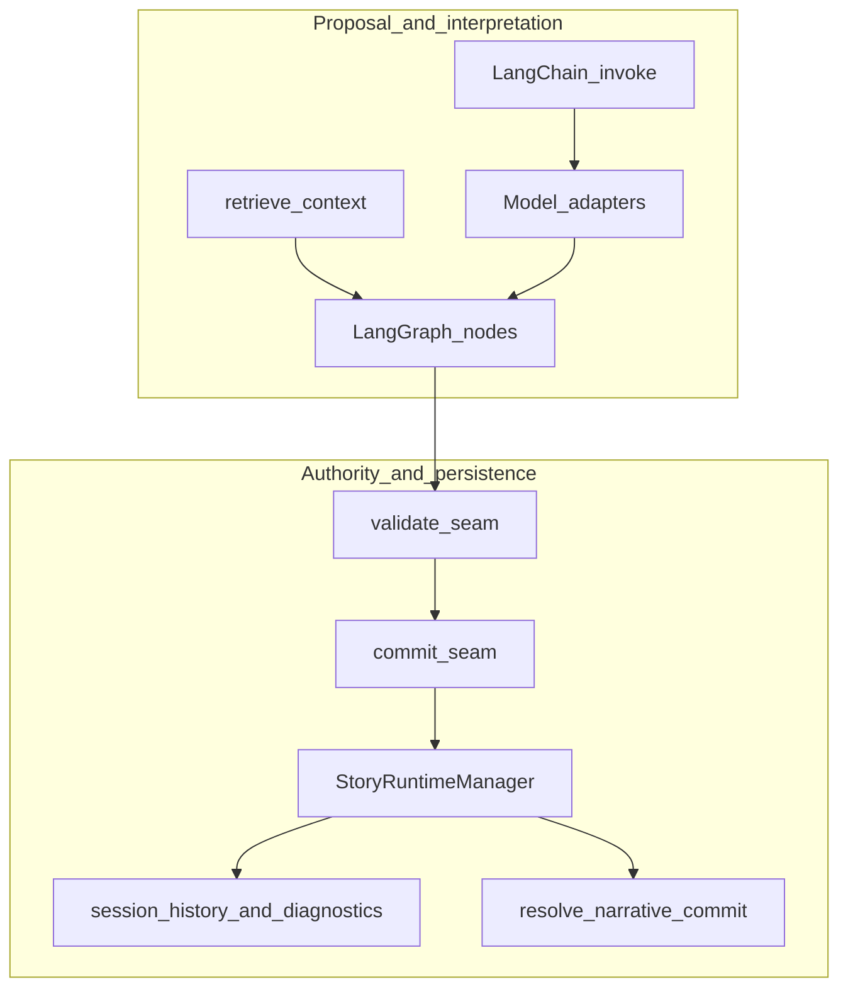

**What to notice:** AI-heavy steps sit **left**; durable session effects flow through **validate/commit** and **manager** paths on the **right**.

**Why it matters:** Prevents conflating “model output” with “committed turn record.”

---

## From authored material to live runtime

### Plain language

Authors work in **module sources** and review flows; **publishing** and **compilation** make content available to the game; **RAG** may ingest overlapping paths for **prompt context** — but **runtime projection** and **contracts** define what the play host uses for a given module.

### Technical precision

- **Authored source:** `content/modules/` (canonical module YAML for the slice, per [how-ai-fits-the-platform.md](../start-here/how-ai-fits-the-platform.md)).
- **RAG ingestion:** Broad repo paths including `content/**` and docs ([RAG.md](../technical/ai/RAG.md)); **profile** and **lane** rules bias what surfaces where.
- **Writers’ Room:** Backend routes under `/api/v1/writers-room/...` with LangChain-backed flows ([LangChain.md](../technical/integration/LangChain.md)).

### Why WoS

Separating **authored canon**, **retrieved context**, and **committed runtime** avoids silent drift (“the retriever found an old doc, so the module changed”).

### Connections

MCP read tools may expose content listings/search; they do not redefine canon.

### What this is not

RAG matching score is **not** an approval workflow.

### Diagram: Writers’ Room to published content to runtime

**Title:** Content and context lifecycles (simplified)

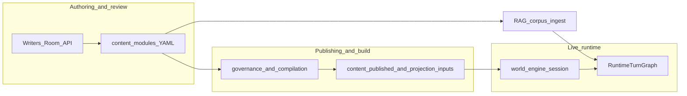

**What to notice:** **Two parallel lines**: governance path into **runtime projection** vs **RAG ingest** feeding **retrieve_context**.

**Why it matters:** Explains why retrieval can include docs while **play** still follows **module contracts**.

---

## How the layers work together

### Plain language

A turn is a **pipeline**: understand input, pull context, align to canonical slice and director logic, call the right model, normalize, validate, commit effects, render what the player should see, package diagnostics.

### Technical precision

High-level node order is in `RuntimeTurnGraphExecutor._build_graph` and mirrored in [ai-stack-overview.md](../technical/ai/ai-stack-overview.md). Normative field names: [`VERTICAL_SLICE_CONTRACT_GOC.md`](../VERTICAL_SLICE_CONTRACT_GOC.md).

### Why WoS

Layering allows **swap** (e.g. retriever backend) without losing **ordering** and **seam** semantics.

### Connections

Backend `execute_turn_with_ai` is a **different** orchestration surface for in-process sessions; do not assume identical graphs without reading code.

### What this is not

Not every HTTP entrypoint runs the full LangGraph path — follow the call chain from the handler you care about.

### Diagram: Core architecture (focused)

**Title:** Primary runtime AI components

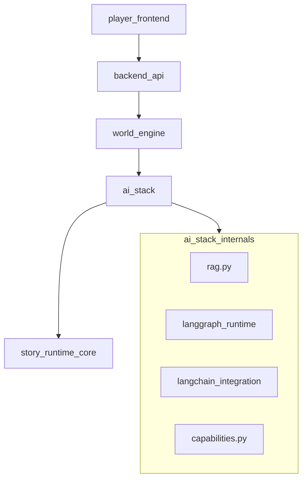

**What to notice:** **`ai_stack` hangs under world-engine** for canonical play, not under the frontend.

**Why it matters:** Correct mental model for where to open code during incidents.

### Diagram: LangGraph vs LangChain responsibilities

**Title:** Orchestration vs integration

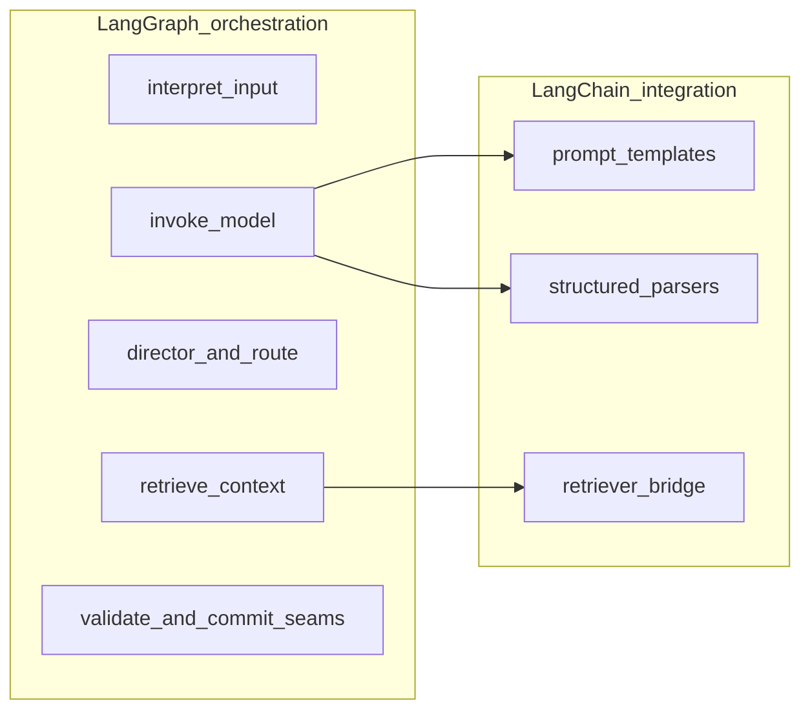

**What to notice:** LangChain **serves** specific nodes; LangGraph **owns** the graph shape.

**Why it matters:** Avoids “two orchestrators” confusion.

### Diagram: RAG, canon, and runtime state

**Title:** Three meanings of “truth”

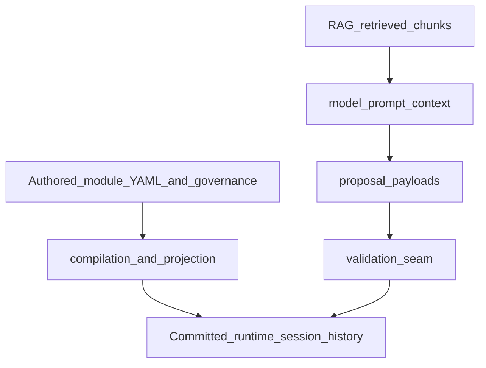

**What to notice:** **Only one path** (via validation/commit) ties **retrieval** to **committed runtime**.

**Why it matters:** Core governance story for reviewers and safety discussions.

---

## AI mechanics across backend, world-engine, Writers’ Room, and admin

### Plain language

- **Players** hit frontend → backend → **play service** for live turns.
- **Writers** use backend APIs for review-oriented generation.
- **Admins** use administration tooling and governance APIs for visibility.

### Technical precision

- **Trace propagation:** Backend can pass `X-WoS-Trace-Id` to world-engine (`backend/app/services/game_service.py` pattern) for correlated logs.
- **World-engine:** `StoryRuntimeManager.execute_turn` passes `trace_id` into `turn_graph.run` and logs turn events.
- **Writers’ Room / Improvement:** Share Task 2A routing evidence patterns ([llm-slm-role-stratification.md](../technical/ai/llm-slm-role-stratification.md)).

### Why WoS

Same **routing evidence** shape across surfaces reduces “it looked fine in the admin but not in play” surprises when comparing JSON.

### Connections

MCP tools for operators; Langfuse or other vendors are **not** required by this spine — integrate only where the repo already does.

### What this is not

Admin UI readability does not imply **write authority** into live sessions without going through defined APIs.

### Diagram: System context

**Title:** World of Shadows — major subsystems

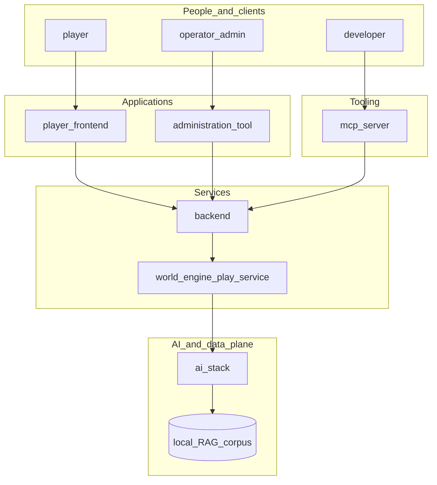

**What to notice:** MCP reaches **backend/tooling**, not a shortcut into **player HTTP** as runtime authority.

**Why it matters:** Correct incident routing (play vs platform vs operator tools).

### Diagram: LLM / SLM role model (routing view)

**Title:** Task-kind bias (simplified)

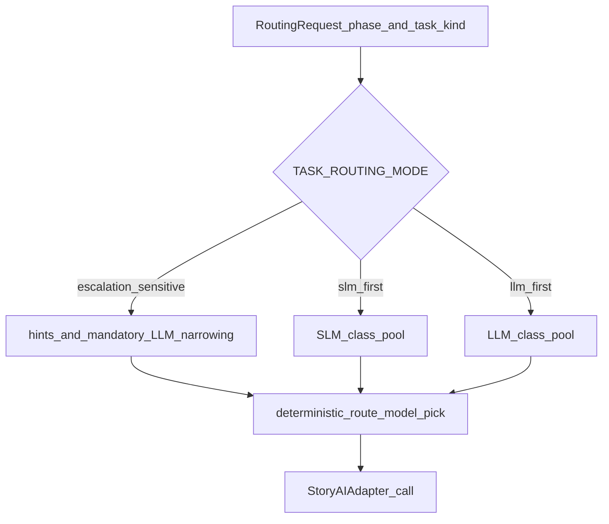

**What to notice:** **Routing** chooses **adapter**; it does not replace **graph seams**.

**Why it matters:** Explains logs like `degradation_applied` vs graph `fallback_model`.

---

## Telemetry, diagnostics, and operational observability

### Plain language

Turns emit **structured diagnostics**: graph health, validation hints, trace IDs — so operators can answer “what path ran?” without reading raw prompts.

### Technical precision

- **Graph:** `graph_diagnostics` on turn state (nodes, outcomes, errors, dramatic review fields where enabled).
- **Session event:** `StoryRuntimeManager` appends diagnostics including `retrieval`, `model_route`, `graph`, `validation_outcome`, `committed_result`, etc.
- **Trace ID:** Threaded from backend to world-engine for log correlation.

### Why WoS

M11-era work emphasized reproducibility metadata (`repro_metadata`, graph version) and audit surfaces ([ai-stack-overview.md](../technical/ai/ai-stack-overview.md) / CHANGELOG narrative).

### Connections

Gate reports under `docs/reports/ai_stack_gates/` record what was proven at release milestones.

### What this is not

**Not** a guarantee that every environment exports to a third-party APM; this repo focuses on **JSON-shaped** diagnostics and logs.

### Diagram: Observability flow

**Title:** From request to inspectable artifacts

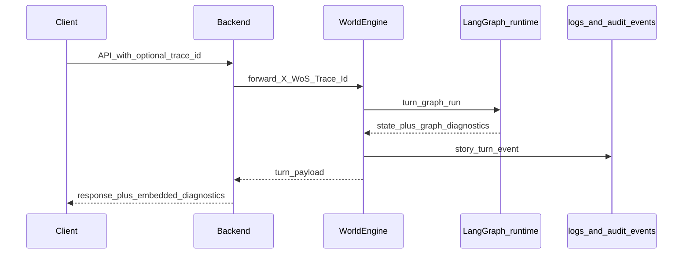

**What to notice:** **Correlation** rides on **trace_id**, not on MCP.

**Why it matters:** Support and QA can align browser sessions with engine logs.

### Diagram: AI + MCP control plane

**Title:** MCP beside runtime authority

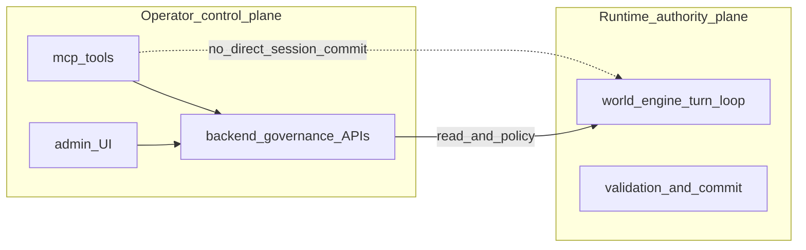

**What to notice:** Dotted line: **no direct** MCP → session commit (**policy**: [`docs/mcp/00_M0_scope.md`](../mcp/00_M0_scope.md)).

**Why it matters:** Prevents misunderstanding MCP as a “hidden player.”

---

## AI turn execution sequence (canonical play path)

### Plain language

The play service runs the graph once per turn, then updates session history with the committed narrative record and diagnostics.

### Technical precision

`StoryRuntimeManager.execute_turn` (simplified): increment counter → `turn_graph.run(...)` → `resolve_narrative_commit(...)` → `update_narrative_threads(...)` → append `history` / `diagnostics` → return event payload.

### Why WoS

This is the **happiest path** operators care about for God of Carnage.

### Connections

Backend `execute_story_turn` proxies to the same play API.

### What this is not

Does not describe WebSocket-only variants in full detail — see world-engine route modules for transport specifics.

### Diagram: Canonical turn sequence

**Title:** Play turn — who calls what

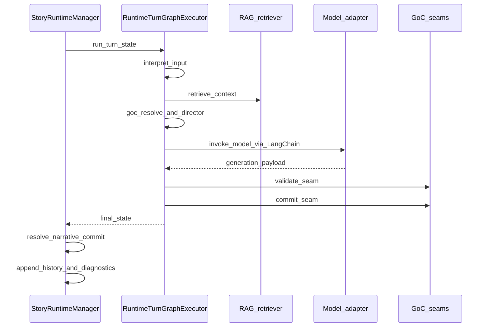

**What to notice:** **Two commit-related layers**: seam inside **G**, then **bounded narrative commit** in **MGR**.

**Why it matters:** Accurate reading of code in `manager.py` plus `langgraph_runtime.py`.

---

## System-wide interaction model

### Sequential view

**Typical live turn:** Client → Backend (auth/policy) → World-engine → LangGraph (RAG + director + model + seams) → Manager persistence → Response with visible bundle and diagnostics.

**Typical review workflow:** Client → Writers’ Room API → LangChain-backed generation + retrieval profiles → **draft outputs** for humans — not automatic promotion to live play state.

### Structural view

| Layer | Responsibility |
|--------|----------------|
| Frontend | UX, calls backend |
| Backend | Auth, governance, Writers’ Room / improvement, proxy to play |
| World-engine | Session authority, invokes `ai_stack` graph |
| ai_stack | RAG, graph, LangChain, capabilities |
| story_runtime_core | Shared adapters / interpretation |
| MCP / Admin | Operator tooling and visibility |

### Operational view

On-call: identify **surface** (play vs review vs tooling), pull **trace_id**, compare **graph_diagnostics.execution_health** and validation outcomes, then check **routing traces** if the issue is model selection.

### Diagram: Layered stack state

**Title:** From user intent to durable record

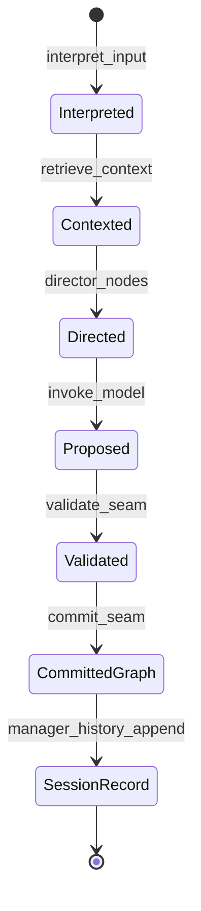

**What to notice:** **SessionRecord** is only after **manager** work — not immediately after model return.

**Why it matters:** Ties UX timing to persistence timing.

---

## Open seams, transitional areas, and future growth

- **Backend `ai_turn_executor`:** Explicitly **transitional** for in-process `SessionState` — keep mental model separate from world-engine GoC path.
- **Checkpoint persistence:** LangGraph checkpointing described elsewhere as deferred in favor of traces and deterministic fallback ([LangGraph integration doc](../technical/integration/LangGraph.md)) — verify before assuming durable graph replay in production.
- **Archive docs:** May lag; prefer contracts + code.
- **Suggested next pages under `docs/ai/`:** `runtime_authority_and_ai_boundaries.md` (extract from this spine), `ai_and_mcp_operator_playbook.md`, `rag_governance_and_profiles.md` — split when sections grow unwieldy.

---

## Conclusion

AI in World of Shadows is a **relationship system**: **RAG** supplies **retrieved context**; **LangGraph** supplies **ordered orchestration**; **LangChain** supplies **structured integration**; **routing** assigns **LLM vs SLM** workloads; **MCP** supplies **operator control plane** tooling; **world-engine** supplies **runtime authority** and **session truth** after **validation and commit**.

If you remember one sentence: **retrieval feeds proposals; seams and the session host feed truth.**

---

## Suggested cross-links (navigation)

| Topic | Go to |
|--------|--------|
| Graph nodes and diagnostics | [LangGraph.md](../technical/integration/LangGraph.md) |
| RAG profiles and ingestion | [RAG.md](../technical/ai/RAG.md) |
| Routing matrix and traces | [llm-slm-role-stratification.md](../technical/ai/llm-slm-role-stratification.md) |
| Play vs backend ownership | [runtime-authority-and-state-flow.md](../technical/runtime/runtime-authority-and-state-flow.md) |
| MCP safety and scope | [docs/mcp/00_M0_scope.md](../mcp/00_M0_scope.md) |
| Normative GoC contract | [VERTICAL_SLICE_CONTRACT_GOC.md](../VERTICAL_SLICE_CONTRACT_GOC.md) |
