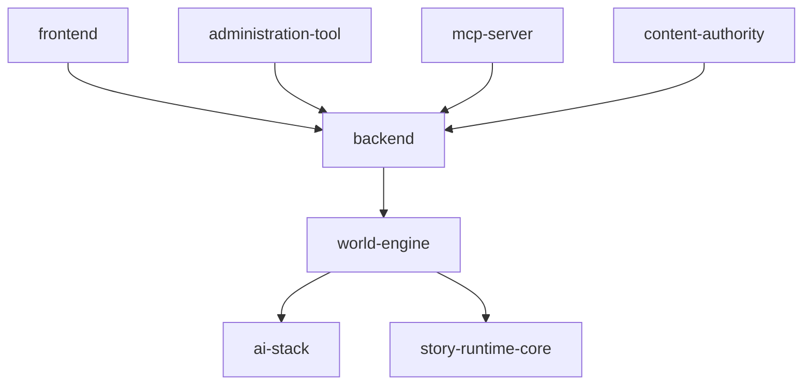

# Architecture Documentation

Durable internal architecture surface for World of Shadows. Governed by
[Quality Standard](QUALITY-STANDARD.md). Fast entry: [START-HERE.md](START-HERE.md).

## Lookup order

0. [Quality Standard](QUALITY-STANDARD.md) for acceptance bar.
1. [Component SAD](components/world-engine/architecture.md) or [project SAD](project/ecosystem-topology/architecture.md) for the owning system.
2. SAD §9 for current decisions; ADRs only for history or open exceptions.
3. [contracts/](contracts/README.md), [gates/](gates/README.md), [boundaries/](boundaries/README.md).
4. [UML](../../UML/README.md) packages linked from the SAD.
5. Tests, `tests/reports/`, and [evidence/](evidence/README.md).

## System landscape

## Capability catalog

| Capability | Owning SAD | UML |
| --- | --- | --- |
| Live play / runtime authority | [world-engine](components/world-engine/architecture.md) | [UML](../../UML/Components/world-engine/README.md) |
| Platform API & persistence | [backend](components/backend/architecture.md) | pending |
| AI graph, RAG, aspects | [ai-stack](components/ai-stack/architecture.md) | pending |
| Shared runtime models | [story-runtime-core](components/story-runtime-core/architecture.md) | pending |
| Player UI | [frontend](components/frontend/architecture.md) | pending |
| Admin UI | [administration-tool](components/administration-tool/architecture.md) | pending |
| MCP tooling | [mcp-server](components/mcp-server/architecture.md) | pending |
| Content modules | [content-authority](components/content-authority/architecture.md) | pending |
| Ecosystem map | [ecosystem-topology](project/ecosystem-topology/architecture.md) | [UML](../../UML/Project/ecosystem-topology/README.md) |
| Governance | [governance](project/governance/architecture.md) | — |
| Documentation supply chain | [documentation-supply-chain](project/documentation-supply-chain/architecture.md) | [UML](../../UML/Project/documentation-supply-chain/README.md) |
| Gates & CI | [quality-gates](project/quality-gates/architecture.md) | — |
| Observability | [observability-traceability](project/observability-traceability/architecture.md) | pending |
| Security | [security-governance](project/security-governance/architecture.md) | pending |
| MVP live runtime program | [mvp-live-runtime-completion](project/mvp-live-runtime-completion/architecture.md) | [UML](../../UML/Project/mvp-live-runtime-completion/README.md) |

## Target structure

| Folder | Purpose |
| --- | --- |
| [components/](components/_template/architecture.template.md) | Per-deployable arc42 SADs |
| [project/](project/README.md) | Cross-cutting process SADs |
| [contracts/](contracts/README.md) | Normative cross-service contracts |
| [gates/](gates/README.md) | Gate documentation |
| [boundaries/](boundaries/README.md) | Ownership boundaries |
| [integrations/](integrations/README.md) | Bootstrap and bridge notes |
| [combinations/](combinations/README.md) | Multi-component solution slices |
| [evidence/](evidence/README.md) | Migration and audit summaries |
| [views/](views/README.md) | UML reading routes |

## Normative contract exceptions (unchanged location)

- [CANONICAL_TURN_CONTRACT_GOC](../MVPs/MVP_VSL_And_GoC_Contracts/CANONICAL_TURN_CONTRACT_GOC.md)
- [VERTICAL_SLICE_CONTRACT_GOC](../MVPs/MVP_VSL_And_GoC_Contracts/VERTICAL_SLICE_CONTRACT_GOC.md)

## Technical detail (transition)

Deep runtime prose is being absorbed into SADs. Until stubs are complete, see
[`docs/technical/`](../technical/README.md) for transitional pages.

## UML entry point

- [world-engine UML](../../UML/Components/world-engine/README.md)
- [Turn execution (canonical)](../../UML/Project/turn-execution-canonical/README.md)
- [Ecosystem topology](../../UML/Project/ecosystem-topology/README.md)

## Rollout status

[DOC-HEALTH.md](DOC-HEALTH.md) · [ROLLOUT.md](project/ROLLOUT.md)
