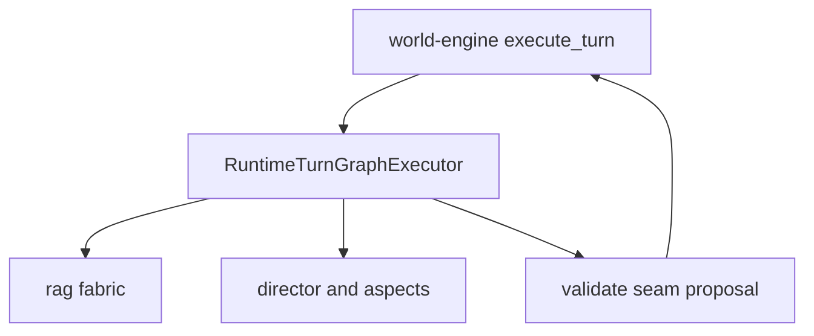

# ai-stack — Software Architecture (arc42)

**Component:** ai-stack · **Folder:** `ai_stack/` · **Last reconciled:** `2026-06-23`

## 1. Introduction & Goals

The ai-stack package orchestrates LangGraph turn execution, RAG retrieval, runtime aspect engines,
research pipelines, and MCP diagnostics. It produces **proposals and structured diagnostics only**;
world-engine owns validate/commit authority for live canon.

See [mechanism catalog](mechanism-catalog.md) for mechanism-level traceability and
[evidence matrix](evidence-matrix.md) for gate-backed claims.

### 1.1 Quality goals

| Goal | Scenario |
| --- | --- |
| Proposal-only | Graph output reaches engine validate/commit seams unchanged |
| Bounded aspects | Each Pi contract has explicit validation and ledger rules |
| Mode-gated capabilities | Writers-room/research/improvement modes enforced |
| Observable intelligence | Capability selection and validator plans are locally auditable |

### 1.2 Stakeholders

| Stakeholder | Concern |
| --- | --- |
| Runtime engineer | Stable seams into world-engine without commit leakage |
| AI engineer | Predictable graph stages and aspect contracts |
| Operator | Langfuse traces, MCP quality lab, governance projections |

## 2. Constraints

- world-engine owns validate/commit ([boundary](../../boundaries/ai-proposal-runtime-commit.md)).
- Research output is non-authoritative for live canon ([ai-stack SAD D10](#d10-research-may-draft-change-but-may-not-publish-change)).
- Semantic capability authority (D12) must not override `validation_outcome` without explicit governed flags.

## 3. Context & Scope



Authoritative: [C4 context](../../../../UML/Components/ai-stack/components/c4-context.md) · [Mechanism catalog](mechanism-catalog.md)

### 3.1 In / out of scope

| In scope | Out of scope |
| --- | --- |
| `langgraph/`, `rag/`, `story_runtime/`, `capabilities/` | HTTP session stores, account auth |
| `research/`, `mcp/` diagnostics | Backend publish routes for canon |
| Runtime aspect ledger projections | Direct player-facing HTML |

<!-- BEGIN BT-SEMANTIC-DEPTH:3 -->
### Evidence-grounded scope and authority

Proposal-producing narrative intelligence layer: semantic ingress, retrieval, director planning, realization, validation and runtime evidence.

**Authority rule:** AI output is a proposal. World-engine validation and commit remain the only live-story authority.

**Git/archaeology scope:** `ai_stack`

| Context concern | Model | Boundary statement |
| --- | --- | --- |
| Proposal authority and external collaborators | [AI Stack — System Context](../../../../UML/Components/ai-stack/components/c4-context.md) | AI output is a proposal. World-engine validation and commit remain the only live-story authority. |

Historical MVP and work-order material is classified evidence, not an authority source. Current code and accepted decisions win; conflicts remain explicit until a target decision is accepted.
<!-- END BT-SEMANTIC-DEPTH:3 -->

## 4. Solution Strategy

- `RuntimeTurnGraphExecutor` implements interpret → retrieve → resolve → director → model → validate/commit hooks.
- GoC seams in `god_of_carnage_turn_seams.py` wire slice authority.
- Runtime aspect engines write structured events consumed by world-engine ledger.
- Capability selector and validator dispatch remain opt-in under ADR-0041 flags.

## 5. Building Block View

| Block | Path |
| --- | --- |
| Turn graph | `ai_stack/langgraph/langgraph_runtime.py` |
| GoC authority | `ai_stack/story_runtime/god_of_carnage/` |
| RAG | `ai_stack/rag/` |
| Director | `ai_stack/story_runtime/director/` |
| Capabilities | `ai_stack/capabilities/` |
| Contracts | `ai_stack/contracts/` |
| Research | `ai_stack/research/` |
| MCP surface | `ai_stack/mcp/mcp_canonical_surface.py` |
| AI runtime support | `ai_stack/` |

Authoritative: [C4 container](../../../../UML/Components/ai-stack/components/c4-container.md) · [Mechanism catalog](mechanism-catalog.md)

<!-- BEGIN BT-SEMANTIC-DEPTH:5 -->
### Source-bound structural decomposition

Only elements that participate in a container or component view are listed as building blocks. Actors, runtime states, data types and deployment nodes remain in their proper viewpoints instead of being misrepresented as structural decomposition.

| Block | Kind | Responsibility | Contract | Source |
| --- | --- | --- | --- | --- |
| Capability Registry (`capabilities`) | `component` | Select allowed runtime capabilities | Evidence-gated capability plan | [`ai_stack/capabilities/capability_selector.py`](../../../../ai_stack/capabilities/capability_selector.py) |
| Director (`director`) | `component` | Select dramatic direction and capability plan | Scene plan and ordered actor directives | [`ai_stack/story_runtime/director/director_realization_composer.py`](../../../../ai_stack/story_runtime/director/director_realization_composer.py) |
| Narrator (`narrator`) | `component` | Realize visible narrative blocks | Proposal-only block stream | [`ai_stack/story_runtime/narrator/god_of_carnage_narrator_path.py`](../../../../ai_stack/story_runtime/narrator/god_of_carnage_narrator_path.py) |
| Proposal Validator (`validator`) | `component` | Evaluate seams, capabilities and retry feedback | Accepted proposal or actionable rejection | [`ai_stack/langgraph/validation/builder.py`](../../../../ai_stack/langgraph/validation/builder.py) |
| Quality Lab (`quality`) | `component` | Score traces and narrative output | Evaluation evidence, never runtime authority | [`ai_stack/quality_lab/evaluation_pipeline.py`](../../../../ai_stack/quality_lab/evaluation_pipeline.py) |
| RAG Context Fabric (`retrieval`) | `component` | Assemble governed continuity and knowledge context | Bounded context pack with provenance | [`ai_stack/rag/rag_context_pack_build.py`](../../../../ai_stack/rag/rag_context_pack_build.py) |
| Research Lane (`research`) | `component` | Explore and draft bounded canon improvements | Draft-only findings; cannot publish canon | [`ai_stack/research/canon_improvement_engine.py`](../../../../ai_stack/research/canon_improvement_engine.py) |
| Runtime Aspect Ledger (`ledger`) | `component` | Project aspect evidence and decision metadata | Typed, non-authoritative evidence records | [`ai_stack/story_runtime/runtime_aspect_ledger/records.py`](../../../../ai_stack/story_runtime/runtime_aspect_ledger/records.py) |
| Semantic Input Translation (`ingress`) | `component` | Translate player text into bounded intent evidence | Semantic input record without invented state | [`ai_stack/langgraph/runtime_executor/semantic_input_translation.py`](../../../../ai_stack/langgraph/runtime_executor/semantic_input_translation.py) |
| LangGraph Runtime Executor (`executor`) | `container` | Coordinate the proposal pipeline | Prepared state in; proposal package out | [`ai_stack/langgraph/runtime_executor/public.py`](../../../../ai_stack/langgraph/runtime_executor/public.py) |
<!-- END BT-SEMANTIC-DEPTH:5 -->

## 6. Runtime View

### 6.1 Story turn graph

Invoked in-process from world-engine `execute_turn`; graph stages call validators before the commit seam returns proposals.

Authoritative: [primary sequence](../../../../UML/Components/ai-stack/sequence/ai-stack-primary-turn-sequence.md)

### 6.2 Capability authority sidecar

When `ADR0041_VALIDATOR_DISPATCH_MODE=plan_enforced`, graph validate seam attaches local-only dispatch context merged into `runtime_intelligence_projection` without mutating commit.

### 6.3 Director pulse (dual mode)

Shadow/dual-mode pulse emits `block_stream_events` parallel to canonical bundle blocks; frontend may consume event stream when feature flags allow.

<!-- BEGIN BT-SEMANTIC-DEPTH:6 -->
### Dynamic viewpoint suite

| Runtime concern | Viewpoint | Model | Modeled interactions |
| --- | --- | --- | ---: |
| Ordered proposal production from semantic input to validation evidence | `sequence` | [AI Stack — Primary Turn Proposal](../../../../UML/Components/ai-stack/sequence/ai-stack-primary-turn-sequence.md) | 11 |
| How a runtime query becomes a bounded provenance-preserving context pack | `sequence` | [AI Stack — RAG Context Fabric](../../../../UML/Components/ai-stack/sequence/rag-context-fabric-sequence.md) | 4 |
| Shadow/live dual mode and gathering pause semantics | `state` | [AI Stack — Director Pulse Lifecycle](../../../../UML/Components/ai-stack/states/director-pulse-lifecycle.md) | 7 |

The ordered sequence/activity relationships and state transitions are validated against the catalog. A sequence or activity view must form one connected runtime path; a list of unrelated calls does not qualify as an end-to-end scenario. Generic arrows such as "evidence for boundary" are not accepted as runtime semantics.
<!-- END BT-SEMANTIC-DEPTH:6 -->

## 7. Deployment View

- Imported as Python package from repo root alongside world-engine.
- Feature flags for ADR-0041 dispatch, pulse dual-mode, and block-stream WS loop are env-driven.
- Tests: `ai_stack/tests/`, `tests/gates/test_goc_mvp03_*`.

<!-- BEGIN BT-SEMANTIC-DEPTH:7 -->
### Deployment and operational boundary evidence

This scope does not claim an independently deployable runtime. Its deployment effect is expressed through the owning systems and the following implementation roots:

- `ai_stack`

A deployment boundary is not inferred from a directory. Process, store, transport and trust contracts must be named by a deployment view or delegated to an owning SAD.
<!-- END BT-SEMANTIC-DEPTH:7 -->

## 8. Crosscutting Concepts

- Capability budgeting ([ai-stack SAD D12](#d12-controlled-runtime-capability-authority)) — partial.
- RAG domains: runtime, writers_room, improvement, research ([RAG.md](../../../technical/ai/RAG.md)).
- Meta-narrative aspects (D13/D14) remain opt-in and validator-gated.

<!-- BEGIN BT-SEMANTIC-DEPTH:8 -->
### Explicit interaction and dependency contracts

| From | To | Semantics | Contract | Evidence |
| --- | --- | --- | --- | --- |
| Director | Capability Registry | requests capability plan | evidence-gated selection | [`ai_stack/langgraph/runtime_executor/executor_realization_capabilities.py`](../../../../ai_stack/langgraph/runtime_executor/executor_realization_capabilities.py) |
| Director | Narrator | requests realization | scene plan and actor directives | [`ai_stack/story_runtime/director/director_realization_composer.py`](../../../../ai_stack/story_runtime/director/director_realization_composer.py) |
| Director | SemanticScenePlan | creates | bounded semantic scene plan | [`ai_stack/story_runtime/semantic_planner/semantic_scene_planner.py`](../../../../ai_stack/story_runtime/semantic_planner/semantic_scene_planner.py) |
| LangGraph Runtime Executor | Semantic Input Translation | interprets input | semantic intent envelope | [`ai_stack/langgraph/runtime_executor/executor_input_interpretation_semantics.py`](../../../../ai_stack/langgraph/runtime_executor/executor_input_interpretation_semantics.py) |
| Semantic Input Translation | RAG Context Fabric | queries grounded context | bounded retrieval query | [`ai_stack/langgraph/runtime_executor/executor_model_context_retrieval.py`](../../../../ai_stack/langgraph/runtime_executor/executor_model_context_retrieval.py) |
| Runtime Aspect Ledger | RuntimeAspectRecord | aggregates | one record per supported aspect | [`ai_stack/story_runtime/runtime_aspect_ledger/records.py`](../../../../ai_stack/story_runtime/runtime_aspect_ledger/records.py) |
| Runtime Aspect Ledger | LangGraph Runtime Executor | returns evidence projection | proposal package metadata | [`ai_stack/story_runtime/runtime_aspect_ledger/runtime_intelligence_projection/builder.py`](../../../../ai_stack/story_runtime/runtime_aspect_ledger/runtime_intelligence_projection/builder.py) |
| Narrator | Proposal Validator | submits proposal | visible blocks plus proposed delta | [`ai_stack/langgraph/runtime_executor/executor_validation_commit.py`](../../../../ai_stack/langgraph/runtime_executor/executor_validation_commit.py) |
| SemanticScenePlan | Narrator | guides | realization constraints | [`ai_stack/story_runtime/director/director_realization_composer.py`](../../../../ai_stack/story_runtime/director/director_realization_composer.py) |
| Quality Lab | Runtime Aspect Ledger | reads trace aspects | evaluation-only projection | [`ai_stack/quality_lab/trace_interpreter.py`](../../../../ai_stack/quality_lab/trace_interpreter.py) |
| Research Lane | Quality Lab | uses evaluation evidence | draft improvement finding | [`ai_stack/research/research_validation.py`](../../../../ai_stack/research/research_validation.py) |
| RAG Context Fabric | Director | provides context pack | citations and continuity facts | [`ai_stack/langgraph/runtime_executor/executor_director_selection_context.py`](../../../../ai_stack/langgraph/runtime_executor/executor_director_selection_context.py) |
| Proposal Validator | Runtime Aspect Ledger | records validation evidence | typed aspect status | [`ai_stack/langgraph/validation/result.py`](../../../../ai_stack/langgraph/validation/result.py) |
| Proposal Validator | Runtime Proposal | annotates | validation result and retry feedback | [`ai_stack/langgraph/validation/result.py`](../../../../ai_stack/langgraph/validation/result.py) |
<!-- END BT-SEMANTIC-DEPTH:8 -->

## 9. Architecture Decisions

| ID | Title | Status | Migrated from |
| --- | --- | --- | --- |
| D1 | Proposal-only outputs | Accepted | ADR-0004 |
| D2 | Quality lab MCP diagnostics | Accepted | ADR-0040 |
| D3 | RAG fabric routing | Accepted | ADR-0044 |
| D4 | Memory indexes / retrieval writes | Accepted | ADR-0045 |
| D5 | Director thin path realization | Accepted | ADR-0062 |
| D6 | Semantic scene planner | Accepted | ADR-0053 |
| D7 | Player guidance and souffleuse lanes | Accepted | ADR-0056, ADR-0060 |
| D8 | Role-aware AIDecisionLog | Accepted | ADR-0018 |
| D9 | ProposalSource and responder gating | Accepted | ADR-0019 |
| D10 | Research may draft but not publish | Accepted | ADR-0005 |
| D11 | Player affect enum signals | Not Finished | ADR-0014 |
| D12 | Controlled runtime capability authority | Not Finished | ADR-0041 |
| D13 | Opt-in meta-narrative awareness | Accepted | ADR-0042 |
| D14 | Adaptive meta-narrative awareness | Accepted | ADR-0043 |
| D15 | Director-pause gathering mode | Proposed | ADR-0061 |
| D16 | Director pulse and block-stream bus | Accepted | ADR-0058, ADR-0059 |
| D17 | Bounded emergent narration | Accepted; Partial | ADR-0007 |
| D18 | Module-owned language boundaries | Accepted; Partial | ADR-0008 |

### D17: Canonical material is reference input in bounded emergence

**Status:** Accepted; production scenario proof remains open
**Origin:** [ADR-0007](../../decisions/ADR-0007-bounded-emergent-narration.md)

The Director owns dramatic choice inside module-declared bounds. For a live player turn in
`bounded_emergence`, semantic scene planning exposes canonical steps, quotes and authored beats as
reference opportunities and derives the actual move from player intent plus dramatic state. It
must not convert those references into mandatory dialogue. `AR-V010` tracks remaining end-to-end
proof and compatibility paths.

### D18: Language is declared by the module, not by the engine

**Status:** Accepted; neutral-field migration incomplete
**Origin:** [ADR-0008](../../decisions/ADR-0008-module-language-boundaries.md)

Ingress normalizes to the module's internal resolution language only when needed. Egress translates
from explicit source provenance only when source and session output differ. The neutral field is
`normalized_internal_text`; English-named aliases are compatibility surfaces recorded by
`AR-V011`.

### D1: Proposal-only outputs

**Status:** Accepted · **Origin:** ADR-0004

**Context.** Before this decision, model output could be treated as committed story truth. That bypassed validator authority and made blocked or degraded turns hard to reason about in production.

**Decision.** LangGraph and model stages emit proposals only; world-engine validate/commit seams gate all canon mutations. Blocked turns are first-class with degradation markers.

**Evidence.** [`ai_stack/story_runtime/god_of_carnage/god_of_carnage_turn_seams.py`](../../../../ai_stack/story_runtime/god_of_carnage/god_of_carnage_turn_seams.py), [world-engine SAD D2](../world-engine/architecture.md#d2-ai-results-remain-proposals-until-world-engine-accepts-them).

### D2: Quality Lab MCP Runtime Diagnostics and Judge-Guided Improvement

**Status:** Accepted
**Origin:** ADR-0040 (retired 2026-06-23)

**Context.** World of Shadows / Better Tomorrow now uses multiple layers of runtime
evidence: Langfuse observability, deterministic runtime gates, LLM-as-a-Judge
evaluators, MCP analyses, and content-pipeline documents to assess the
quality of interactive story turns.

The current MCP/Langfuse tooling can already inspect traces and scores, but
the analysis surface is still too narrow. It often focuses on individual
judge scores or raw Langfuse evidence, while the actual quality problems
can originate from many different areas:

- Runtime graph behavior
- ADR-0033 live runtime commit semantics
- Beat selection and beat realization
- Dramatic capability selection and realization
- Narrator authority
- NPC authority boundaries
- Actor-lane ownership
- Visible block origin/provenance
- Recovery and playability of blocked or ambiguous actions
- RAG/content usefulness
- Content module gaps
- Prompt/context injection defects
- Langfuse evaluator configuration
- Missing or weak runtime metadata
- MCP request/response quality
- Stale assumptions in MCP tools or docs
- Judge prompt/category maintenance needs

The project now contains a human-maintained LLM-as-a-Judge definition
document under:

```text
docs/llm-as-a-judge/
```

This document must become the canonical source for evaluator definitions and
must be used to concretize MCP analyses before further judge maintenance or
prompt rewriting is performed.

The new diagnostic layer must not treat LLM-as-a-Judge results as runtime
truth. Deterministic runtime gates remain authoritative for runtime contract
status.

**Decision.** Introduce a new read-only MCP Quality Lab / Quality Intelligence diagnostics
layer.

The new toolset shall analyze:

- MCP requests
- MCP responses
- Langfuse traces
- Langfuse generation observations
- Deterministic runtime scores
- LLM-as-a-Judge scores
- Evaluator definitions from `docs/llm-as-a-judge`
- Runtime metadata coverage
- Actor-lane and origin evidence
- Beat and capability realization evidence
- Recovery/playability evidence
- RAG/content evidence
- Content pipeline gaps
- Prompt/context injection risks
- Runtime architecture risks
- MCP analysis quality
- Langfuse configuration coverage
- Judge definition coverage
- Targeted claude-context investigation queries

The toolset shall produce evidence-backed quality findings, problem
clusters, improvement candidates, investigation plans, content-revision
candidates, prompt-maintenance suggestions, and repair-wave proposals.

The toolset is analysis-only. It must not mutate runtime state, Langfuse
evaluators, prompts, content files, source code, or deterministic runtime
gates.

Quality Lab is also not the owner of the Capability Matrix. It can inspect and
summarize runtime metadata, judge evidence, Langfuse traces, MCP exchanges, and
problem patterns, but Capability Matrix status changes must still follow the
semantic-name, ADR, anti-hardcoding, verification-log, and live-claim rules in
the matrix documentation. Quality Lab outputs must use production semantic names
for scores and runtime metadata; historical Pi / Π labels may appear only as
explanatory cross-references.

**Consequences.** ### Positive

- MCP analysis becomes more actionable.
- Judge results become semantically meaningful instead of raw category
  strings.
- Runtime, prompt, content, RAG, Langfuse, and MCP-analysis issues can be
  separated.
- claude-context can be used in a targeted and evidence-derived way.
- Content revision can be guided by actual quality findings.
- Judge maintenance becomes structured and reviewable.
- Deterministic runtime gates remain protected.

### Negative / Risks

- The Quality Lab can become too broad if not phased carefully.
- Category mappings must be maintained when evaluator definitions change.
- Human-maintained CSV/document definitions may drift from code if no
  validation exists.
- Overinterpretation risk exists if the tool treats weak evidence as proof.
- claude-context integration must remain targeted to avoid noisy searches.

### Mitigations

- Keep tools read-only.
- Require confidence and evidence fields.
- Report missing evidence explicitly.
- Add tests for deterministic/qualitative separation.
- Add tests that detect stale `backend.turn.execute` rejection assumptions.
- Keep `docs/llm-as-a-judge` canonical.
- Use phased implementation.

**Implementation status.** | Phase | Status | Evidence |
|-------|--------|----------|
| **1 — Evaluator catalog and judgment interpretation** | Implemented | `ai_stack/quality_lab/evaluator_catalog.py`, `judgment_interpreter.py`, `schemas.py`; MCP tool `wos.quality_lab.review_judgments`; tests in `ai_stack/tests/test_quality_lab_judgment_interpreter.py`, `ai_stack/tests/test_quality_lab_evaluator_catalog.py`, and `tools/mcp_server/tests/test_quality_lab_tools.py`. |
| **2 — Trace and metadata analysis** | Implemented | `ai_stack/quality_lab/trace_interpreter.py`; MCP tool `wos.quality_lab.review_trace`; tests in `ai_stack/tests/test_quality_lab_trace_interpreter.py` and `tools/mcp_server/tests/test_quality_lab_tools.py`. |
| **3 — MCP exchange analysis** | Implemented | `ai_stack/mcp/mcp_exchange_interpreter.py`; MCP tool `wos.quality_lab.review_mcp_exchange`; tests in `ai_stack/tests/test_quality_lab_mcp_exchange_interpreter.py` and `tools/mcp_server/tests/test_quality_lab_tools.py`. |
| **4 — Problem clustering and investigation** | Implemented | `ai_stack/quality_lab/pattern_interpreter.py`; MCP tools `wos.quality_lab.find_patterns` and `wos.quality_lab.suggest_investigation`; tests in `ai_stack/tests/test_quality_lab_pattern_and_planning.py` and `tools/mcp_server/tests/test_quality_lab_tools.py`. |
| **5 — Repair, judge-set, and content planning** | Implemented | `ai_stack/quality_lab/planning_interpreter.py`; MCP tools `wos.quality_lab.plan_repair_wave`, `wos.quality_lab.refine_judge_set`, and `wos.quality_lab.plan_content_revision`; tests in `ai_stack/tests/test_quality_lab_pattern_and_planning.py` and `tools/mcp_server/tests/test_quality_lab_tools.py`. |

All implemented surfaces are read-only and registered in
`ai_stack/mcp/mcp_canonical_surface.py` with `McpToolClass.read_only`,
`McpSuite.wos_runtime_read`, and `AUTH_QUALITY_LAB_ANALYSIS`.

**Evidence.** `docs/architecture/components/ai-stack/architecture.md#d2-quality-lab-mcp-runtime-diagnostics-and-judge-guided-improvement` (archived — see `docs/archive/adr-retired-2026/`)

### D3: Runtime RAG Context Fabric — Routing and Authority Boundaries

**Status:** Accepted
**Origin:** ADR-0044 (retired 2026-06-23)

**Context.** Retrieval-augmented generation (RAG) is wired into runtime turns via `RetrievalDomain.RUNTIME`, context packs, and LangGraph `retrieve_context` / synthesis paths. Without explicit **routing**, **audience scoping**, and **authority metadata**, teams risk:

1. Treating ranked chunks or compact `context_text` as **engine truth** (false-green readiness or narrative state).
2. **Global retrieval** every turn (cost, noise, draft leakage despite governance gates).
3. **ADR-0041** surfaces (selector, validator plan, bridge, readiness aggregation) accidentally consuming **unverified** retrieved prose as if it were seam evidence.
4. **Frontend** inferring readiness or canon from diagnostic or retrieved strings.

The codebase already separates **authored canon**, **committed runtime state**, and **retrieved hints** at a high level (`docs/technical/ai/RAG.md`, `run_validation_seam` / `run_commit_seam` in `ai_stack/langgraph/langgraph_runtime_executor.py`). This ADR **normatively** completes that separation for **product-scale** Narrator, NPC/multi-agent, and ADR-0041 synergy.

**Decision.** 1. **RAG role:** RAG is a **runtime context fabric** — bounded, provenance-labeled **prompt and diagnostic support**. It **must not** become canonical narrative state, `validation_outcome`, commit payloads, or player-session **readiness** unless the same fact is already committed or carried in **canonical runtime structures** (world-engine session, commit records, structured ledger fields), not merely because a chunk matched a query.

2. **Retrieval routing:** Runtime retrieval **must** be driven by a deterministic **retrieval plan** derived from:
   - turn class / situation class,
   - selected semantic capabilities (from ADR-0041 selector output when present),
   - active actor / actor lane,
   - beat phase (or equivalent bounded phase signal),
   - authority scope (`runtime_generation` vs `operator_diagnostic` vs `writers_room` / `improvement`).

   Default behavior **must not** be “retrieve on raw player text + scene id only” without a plan; the plan defines **budgets**, **allowed index lanes**, and **exclusions** (e.g. no NPC-private lane for Narrator unless policy explicitly allows a bounded dramatic-irony surface).

3. **Authority metadata on packs:** Every context pack or bundle exposed to runtime consumers **must** carry machine-readable fields including at minimum: `authority_level` (e.g. `canonical_snapshot` | `content_module` | `retrieved_unverified` | `operator_diagnostic_only`), `retrieval_policy_version`, `corpus_fingerprint` / index identity where applicable, and per-hit or per-section provenance (`source_path`, evidence lane, visibility class). **Authority-critical code paths** must reject or downgrade packs that lack required provenance when the consumer is not a model prompt.

4. **ADR-0041 consumption:** ADR-0041 components (`capability_selector`, validator plan, `validation_authority_bridge`, readiness preview/enforcement/aggregation) **may** use retrieval-derived material **only** as **observation** for diagnostics, drift narration, or human review — **never** as the sole proof that a seam concern passed. `run_validation_seam` remains canonical for `validation_outcome`; commit gates unchanged unless explicitly superseded by a future ADR.

5. **Readiness and frontend:** `runtime_session_ready` / `can_execute` and any player-visible “can play” semantics **must** come from backend canonical readiness resolution (including flag-gated ADR-0041 **veto-only** overlay per ADR-0041). The frontend **must not** infer readiness from RAG text, Langfuse labels, or MCP narrative.

6. **Fail-closed:** If a retrieval plan requires canonical context that is missing or stale, runtime generation **must** degrade to deterministic safe surfaces (existing validation feedback / bounded synthesis contracts) rather than inventing facts from retrieval.

**Consequences.** **Positive:**

- Clear promotion path for capability-routed retrieval without authority drift.
- Safer multi-agent and Narrator prompts (lane and disclosure aligned with policy).
- ADR-0041 and RAG evolve together without conflating observation with seam truth.

**Negative / risks:**

- More contract surface area (plans, bundles, tests) to maintain.
- Misconfigured plans could starve prompts; requires monitoring and budgets.

**Follow-ups:**

- Implement retrieval plan builder and wire into `RuntimeTurnGraphExecutor` retrieval node ([ADR-0045](../../../archive/adr-retired-2026/adr-0045-runtime-memory-indexes-and-retrieval-write-contracts.md) for indexes).
- Add CI gates: RAG scope by turn class; no readiness from RAG; ADR-0041 rejects unverified retrieval as authority input.

**Testing.** - Contract tests: retrieval plan inputs include turn class and capability set when ADR-0041 projection is present; plan restricts `max_chunks` and index lanes per profile.
- Authority tests: no code path sets `validation_outcome` or commit payload from raw `context_text` alone.
- Readiness tests: frontend bundle fields unchanged when RAG disabled vs enabled (readiness may only tighten with ADR-0041 veto rules, never from chunk text).
- Comply with [ADR-0039](../../../archive/adr-retired-2026/adr-0039-gate-tests-no-hardcoded-oracle-bypass.md): assert on schema, enums, and policy constants — not generated prose.

**Evidence.** `docs/architecture/components/ai-stack/architecture.md#d3-rag-fabric-routing` (archived — see `docs/archive/adr-retired-2026/`)

### D4: Runtime Memory Indexes and Retrieval Write Contracts

**Status:** Accepted
**Origin:** ADR-0045 (retired 2026-06-23)

**Context.** Several runtime surfaces already persist **committed-truth-derived** structures (for example callback web and consequence cascade records, hierarchical memory aspects, relationship state in ledger and planner truth). The **corpus RAG** store (`.wos/rag/`) ingests repository paths and selected transcripts; that is a **different** write contract from **session-scoped memory indexes** optimized for per-turn retrieval.

Without explicit **write contracts**, a memory index could be populated from **pre-commit proposals** or model output, reintroducing RAG-as-truth and stale-state bugs.

**Decision.** 1. **Index classes:** Distinguish these categories (names are logical; physical storage may combine tables/files under versioned keys):

   - **Content module index** — authored canon and policy; source of truth is repository content; read-heavy; same governance as existing `ContentClass` / domain gates.
   - **Scene / session memory indexes** — bounded projections of **committed** turns: scene event summaries, beat history, relationship memory threads, agent-private memory (NPC-only), knowledge-boundary metadata (who may know what), callback and cascade **read models** where not already served by existing stores.

2. **Write rule (normative):** Memory indexes that feed **runtime** `RetrievalDomain.RUNTIME` **must** be written only from:

   - successful **commit** outcomes (or explicitly persisted post-commit snapshots from world-engine), or
   - **immutable** structured records already defined as committed feedback (e.g. existing callback web / consequence cascade rebuild rules).

   They **must not** be written from unvalidated model proposals, intermediate graph state, or retrieval hits.

3. **Read rule:** Retrieval consumers declare **audience** (`narrator`, `npc_self`, `npc_other`, `player_visible`, `operator_diagnostic`). Filters apply **before** prompt assembly. Default: Narrator lanes exclude agent-private memory; NPC lanes exclude other agents’ private memory unless a governed sharing contract exists.

4. **Freshness:** Each indexed document carries `source_turn_id` / `commit_sequence` / `corpus_or_snapshot_fingerprint` as applicable. Stale documents must not outrank or override canonical snapshot fields in structured prompt sections.

5. **Operator and governance indexes:** ADR text, Capability Matrix markdown, validator evidence exports, and Langfuse/MCP trace excerpts may form **operator_diagnostic** or **research** retrieval lanes only — same prohibition as ADR-0044 on using them as live readiness or commit truth.

6. **Coexistence with corpus RAG:** Session memory indexes are **not** a substitute for `run_validation_seam` or world-engine state. They may be **ingested** into a restricted content class (e.g. `RUNTIME_PROJECTION`) only when the ingestion pipeline tags them with correct provenance and domain policy allows.

**Consequences.** **Positive:**

- Safe evolution toward richer Narrator/NPC context without authority pollution.
- Clear test surface: “write after commit” invariants.

**Negative / risks:**

- Dual maintenance: world-engine state vs index projections until unified tooling exists.
- Migration work for any existing transcripts or logs that should not enter runtime domain.

**Follow-ups:**

- Implement index modules and writers hooked from `StoryRuntimeManager` / commit path (see plan file in repo history; do not treat this ADR as the implementation checklist alone).
- Add compaction and retention policies per module.

**Testing.** - Invariant tests: no index row without `commit_sequence` or equivalent commit anchor when `authority_level` claims runtime use.
- Leak tests: `npc_self` lane never returns other NPC private fields; `player_visible` never returns withheld disclosure units.
- ADR-0039 compliant oracles for schema and policy constants.

**Evidence.** `docs/architecture/components/ai-stack/architecture.md#d4-memory-indexes-retrieval-writes` (archived — see `docs/archive/adr-retired-2026/`)

### D5: Director thin path realization

**Status:** Accepted · **Origin:** ADR-0062

**Context.** Turn realization needed a single thin orchestration path so resolver, director, and narrator stages share contracts with world-engine commit seams without duplicating authority or bypassing validate gates.

**Decision.** Resolver → Director → Narrator thin path produces realization proposals consumed by validate/commit seams; shared with world-engine D4.

**Evidence.** [`ai_stack/story_runtime/director/`](../../../../ai_stack/story_runtime/director/), [world-engine SAD D4](../world-engine/architecture.md#d4-realization-is-subordinate-to-the-canonical-turn).

### D6: Bounded Semantic Scene Planner

**Status:** Accepted
**Origin:** ADR-0053 (retired 2026-06-23)

**Context.** The God of Carnage runtime already had director nodes in the single LangGraph turn path:

```text
goc_resolve_canonical_content -> director_assess_scene -> director_select_dramatic_parameters -> ...
```

Before this ADR, `ai_stack/story_runtime/director/god_of_carnage_scene_director.py` selected scene function,
responder set, pacing, and silence/brevity through deterministic helper logic.
Some of that logic was phrase-driven. That was useful during early slicing, but
it made the director behave like a hidden keyword router. The current contract
requires semantic move payloads and content IDs instead: the director may map a
bounded `move_type` to a scene function, but it must not infer that move from
raw player wording.

The GoC content module now exposes richer canonical path, object, location,
access-policy, quote-anchor, and beat-library authority. That creates a new
director responsibility: it must recognize when a turn should speak, when it
should narrate, when a source quote is moment-locked and allowed, and which
runtime dramatic capabilities should execute. Running every possible branch
for every turn would defeat the purpose of the director; it must use the
capability manager like a selective state machine and choose only the
capabilities needed for the current scene plan.

The semantic dramatic planner roadmap requires the director to become a bounded short-horizon planner that can combine:

- semantic move interpretation,
- social state,
- character tactical identity,
- authored scene constraints and canonical content path,
- prior continuity pressure,
- actor-lane authority,
- quote-anchor policy,
- capability availability,
- and the existing deterministic scene-function/responder selection.

The design problem is authority. A smarter director must not become a second storyteller, a second runtime truth surface, or an LLM-owned planner. It must enrich the shape of the next proposal while preserving the existing truth pipeline:

```text
planner selects direction -> model realizes proposal -> validation checks -> commit authorizes truth
```

**Decision.** 1. The God of Carnage runtime will use a bounded semantic scene planner as part of the existing `director_select_dramatic_parameters` graph node.

2. The planner output is stored inside `ScenePlanRecord`, not in a separate truth store. It is advisory until the validation and commit seams approve runtime consequences.

3. The planner enriches, but does not replace, bounded director selection. The
   first-pass scene function and responder set continue to come from the
   established director contract; that contract consumes semantic move records,
   social state, continuity, and authored content, not raw-text keyword scans.
   The semantic planner derives short-horizon target, beat, directive, and
   handover fields from those selections and structured planner records.

4. `ScenePlanRecord` must include these bounded planner outputs:

   - `narrative_scene_function`
   - `realization_mode`
   - `pressure_function`
   - `scene_target`
   - `pressure_target` as a compatibility alias for pressure-oriented target data
   - `target_obligations`
   - `actor_directives`
   - `dramatic_beats`
   - `handover_policy`
   - `content_frame`
   - `speech_policy`
   - `quote_moment_policy`
   - `dialogue_plan`
   - `capability_manager_plan`
   - `continuity_obligation`
   - `expected_transition_pattern`
   - `semantic_scene_planner_version`
   - bounded `planner_rationale_codes`

5. `scene_target` is the canonical broad target concept. It can target an actor, relationship axis, room, setup, information surface, scene boundary, player affordance, or transition. `pressure_target` must not be treated as the only target type.

6. `actor_directives` may instruct the next proposal to stage NPC presence, force a visible NPC reaction, hold silence, stage interruption, or narrate without forcing an NPC. These are realization directives only. They do not override actor-lane authority, player control, validator policy, or commit semantics.

7. `dramatic_beats` are structured beat objects, not only intent labels. They must carry at least order, kind, function, intent, owner, visibility, required flag, success condition, and constraints where available.

8. `content_frame` is the selected canonical content slice for the turn. It may include canonical path step id, scene node id, location id, object focus ids, quote-anchor refs, action beats, player windows, narrator tasks, and content-access decisions. It is evidence for planning, not committed truth.

9. `speech_policy` decides whether NPC speech is required, recommended, or suppressed for the selected content frame. It must preserve player control: player speech may be afforded, but never forced.

10. `dialogue_plan` is an ordered set of bounded NPC-speech beats. It can reference authored beat-library patterns, required facts, quote anchors, actor ids, and forced-response chains. It must respect actor-lane authority; if the intended speaker is player-controlled, that beat is skipped or degraded, not reassigned to a different NPC.

11. `quote_moment_policy` allows exact quote anchors only as rare, moment-locked short anchors. The default remains paraphrase or transformation. Exact quote use requires a matching canonical path step, a beat that needs source pressure, speaker/context match, and a not-recently-used check.

12. `capability_manager_plan` is the director's dynamic execution gate. It records decision inputs, selected capabilities, required capabilities, optional capabilities, suppressed capabilities, and per-capability steps. The runtime should use it to activate only the chosen dramatic capability branches for the turn instead of running every possible branch. Every selected capability must also pass a bounded dispatch-path audit: one path per capability, no recursive dispatch, no queue expansion during execution, terminal node required, and per-path cycle/depth checks before the capability enters the executable dispatch queue.

13. Planner fields must use machine-readable, inspectable labels. They must not contain free-form psychological claims, long prose plans, hidden-truth assertions, or generated narrative text as authority.

14. The dramatic generation packet may expose the enriched `scene_plan` to guide model realization. That exposure is prompt/proposal guidance only. The model must not treat planner fields as permission to commit facts, mutate scene truth, bypass actor-lane rules, or resolve continuity outside validation/commit.

15. The planner must fail safe. Missing or malformed semantic/social/character/content inputs should degrade to conservative defaults rather than inventing new story truth.

16. This ADR covers the GoC short-horizon scene planner only. It does not implement cross-module generalization, long-horizon plot planning, procedural subplots, or a second planning service.

17. Legacy keyword routing is removed. Compatibility diagnostics may preserve
    historical field names, but `legacy_keyword_scene_candidates_used` must not
    become a behavior path.

**Consequences.** **Positive:**

- The director can now express what the scene is for, who or what is targeted, which immediate beats should be realized, which NPC/director actions are required, how setup should be arranged, and how control should be returned to the player.
- The director can now recognize content-authored speech moments and produce a bounded dialogue plan rather than leaving speech to generic responder heuristics.
- Exact source quotes are available only as short moment-locked anchors, which supports precision without continuous verbatim use.
- Runtime capability selection becomes inspectable and selective: the director can choose the minimal dramatic capability set for the turn.
- Capability dispatch is finite by contract: attached capabilities are checked path-by-path, and invalid, unknown, suppressed, over-deep, or cyclic paths are rejected before execution hints are exposed.
- The model receives more concrete dramatic direction without gaining truth authority.
- Operator/debug surfaces can inspect why a turn was shaped a certain way through structured planner fields.
- The implementation advances the semantic dramatic planner roadmap while preserving the existing LangGraph topology and commit seams.

**Negative / risks:**

- `ScenePlanRecord` is larger and downstream consumers must continue treating it as advisory.
- Overly broad planner labels could become pseudo-truth if future code reads them as committed facts.
- Capability-manager output can become misleading if future capabilities are added without updating the director's selection rules and dispatch path registry.
- Dialogue-plan beats can become too mechanical if the beat library is treated as prose template authority rather than structured direction.
- The current implementation is still short-horizon and GoC-specific; it should not be marketed as full dramatic intelligence or long-horizon story planning.
- Missing semantic move payloads now produce a neutral fallback; upstream AI
  semantic resolution is therefore required for nuanced social direction.

**Follow-ups:**

- Keep `ai_stack/story_runtime/semantic_planner/semantic_scene_planner.py` deterministic and contract-first; new implementation code belongs in named slices under `ai_stack/story_runtime/semantic_planner/semantic_scene_plan/`.
- Add policy/YAML-backed mappings if target functions, actor directives, pressure functions, or beat templates need authoring control.
- Expand dramatic-effect validation to inspect `scene_target`, `actor_directives`, `handover_policy`, `dramatic_beats`, and `continuity_obligation` more deeply.
- Expand validator coverage for `speech_policy`, `dialogue_plan`, `quote_moment_policy`, and `capability_manager_plan`.
- Keep the capability dispatch-path registry in lockstep with any newly introduced dramatic capability; unknown capabilities should fail closed.
- Move more dialogue-step profiles from code into authored content once the shape stabilizes.
- Only generalize beyond GoC after the GoC planner remains stable under regression and live/staging evidence.
- If future modules need different scene-function mappings, author those as
  module policy or AI semantic output contracts, not runtime keyword maps.

**Implementation status.** Implemented and tested as a bounded GoC planner component. Since ADR-0062, the
default player-turn LangGraph route uses the Director realization thin path;
semantic scene planner records are no longer emitted as default player-turn
graph truth.

- `ai_stack/story_runtime/semantic_planner/semantic_scene_planner.py` is the stable import-path loader for bounded short-horizon scene-plan enrichment.
- `ai_stack/story_runtime/semantic_planner/semantic_scene_plan/` contains the small planner slices for mappings, content frame, dialogue, capability planning, continuity, target selection, directives, beats, and final enrichment assembly.
- `ScenePlanRecord` now carries `narrative_scene_function`, `scene_target`, `target_obligations`, `actor_directives`, `dramatic_beats`, `handover_policy`, `content_frame`, `speech_policy`, `quote_moment_policy`, `dialogue_plan`, `capability_manager_plan`, `continuity_obligation`, `expected_transition_pattern`, and `semantic_scene_planner_version`.
- `pressure_target` remains as a compatibility alias for pressure-specific target data; the broader concept is now `scene_target`.
- The legacy `director_select_dramatic_parameters` path can call the planner after AI semantic move, social state, responder, character-mind, and pacing decisions are available. The ADR-0062 thin path does not visit that node for ordinary player turns.
- The planner consumes the expanded GoC content surfaces: `canonical_path`, `scene_graph`, `locations`, `objects`, `content_access_policy`, `opening_quote_anchors`, and `direction/beat_library`.
- The dramatic generation packet exposes the enriched `scene_plan` as model-visible bounded direction, including speech and capability-manager decisions.
- The runtime capability aspect records the director-selected capability-manager plan so validation can see what the director intended to execute.
- `ai_stack/story_runtime/director/capabilities_manager/director_capability_manager.py` audits the selected dramatic capabilities as individual bounded dispatch paths. Each selected capability must have one terminal path, pass cycle detection, stay within the path-depth limit, and enter the runtime as an audited dispatch queue rather than a recursive tree walk.
- Validation and commit seams remain authoritative; planner output is advisory until validation/commit whenever the legacy planner path is used.
- Scene-function and responder selection no longer use legacy keyword scene candidates or raw actor-name matching. Missing semantic move input degrades through `semantic_move_required`.

### Test-suite status

The old graph-level semantic planner golden cases were retired on 2026-05-20.
They asserted `semantic_move_record`, `scene_plan_record`, and
`selected_scene_function` on the default runtime graph, which is now an obsolete
expectation under ADR-0062. Current coverage is split between direct planner /
contract tests and graph-authority tests that assert the thin path keeps legacy
planner fields out of committed truth.

**Testing.** Current verification:

- `PYTHONPATH=/mnt/d/WorldOfShadows:/mnt/d/WorldOfShadows/world-engine python -m py_compile ai_stack/story_runtime/god_of_carnage/god_of_carnage_yaml_authority.py ai_stack/contracts/scene_plan_contract.py ai_stack/story_runtime/semantic_planner/semantic_scene_planner.py ai_stack/langgraph/langgraph_runtime_executor.py`
- `PYTHONPATH=/mnt/d/WorldOfShadows:/mnt/d/WorldOfShadows/world-engine python -m pytest ai_stack/tests/test_director_capability_manager.py -q --tb=short`
- `PYTHONPATH=/mnt/d/WorldOfShadows:/mnt/d/WorldOfShadows/world-engine python -m pytest ai_stack/tests/test_semantic_scene_planner.py ai_stack/tests/test_semantic_planner_contracts.py ai_stack/tests/test_god_of_carnage_structured_setting_knowledge.py -q --tb=short` - 23 passed
- `PYTHONPATH=/mnt/d/WorldOfShadows:/mnt/d/WorldOfShadows/world-engine python -m pytest ai_stack/tests/test_semantic_planner_graph_authority.py -q --tb=short` - 7 passed
- `PYTHONPATH=/mnt/d/WorldOfShadows:/mnt/d/WorldOfShadows/world-engine python -m pytest ai_stack/tests/test_god_of_carnage_scene_director_extended.py ai_stack/tests/test_scene_direction_subdecision_matrix.py -q --tb=short` - 159 passed
- `PYTHONPATH=/mnt/d/WorldOfShadows:/mnt/d/WorldOfShadows/world-engine python -m pytest tests/smoke/test_repository_documented_paths_resolve.py tests/smoke/test_docs_truth.py -q --tb=short` - 48 passed

Failure modes that require ADR review:

- Planner output directly mutates committed runtime truth.
- A model proposal can overwrite planner-owned director fields.
- `ScenePlanRecord` becomes a second canonical session state store.
- Generated prose becomes the primary oracle for planner tests.
- The capability manager plan is ignored and every dramatic branch runs regardless of director selection.
- A selected capability can recurse, expand the dispatch queue, or execute without an individual terminal path audit.
- Exact quote anchors are used continuously rather than only at moment-locked beats.
- Raw player text, actor names, or off-scope topic words route scene candidates
  without an AI semantic move payload.
- Cross-module planner reuse starts without an explicit generalization ADR or amendment.

All tests must comply with [ADR-0039](../../../archive/adr-retired-2026/adr-0039-gate-tests-no-hardcoded-oracle-bypass.md): assert structured fields, contract constants, and deterministic policy behavior rather than copied example prose.

**Evidence.** `docs/architecture/components/ai-stack/architecture.md#d6-semantic-scene-planner` (archived — see `docs/archive/adr-retired-2026/`)

### D7: Souffleuse Inner Voice Composition

**Status:** Accepted
**Origin:** ADR-0060 (retired 2026-06-23)

**Context.** The existing `god_of_carnage_souffleuse.py` generates opening-phase Souffleuse blocks from
canonical_path cue content. That implementation is correct for Phase 1 (opening
cues) but it does not specify:

1. How the Souffleuse operates during live play (after opening).
2. What the Souffleuse's voice identity is in relation to the player character.
3. How the Director decides whether and when to compose a Souffleuse block.
4. How the Souffleuse block interacts with pressure escalation from the Director.

Phase 2 requires these decisions to be canonical so that the Souffleuse can be
composed by the Director Pulse path without ambiguity.

**Decision.** ### 1. Souffleuse identity: inner voice of the played character

The Souffleuse is the inner voice of the player's selected character — not a
narrator, not an assistant, not a generic hint system. It speaks as the
character's own inner monologue: evaluation, self-talk, weighing options, feeling
pressure, recalling past events as the character would.

Invariants:

- Always uses second-person address (`du`, `you`) in the character's own voice.
- Never uses generic assistant phrasing ("You might want to...", "Consider...").
- Never uses generic narrator phrasing ("The room is tense.").
- Always speaks from within the character's perspective, knowledge, and affect.
- Character voice profile (`characters/voices/character_voice_*.yaml`) is
  mandatory input; a missing voice profile must be diagnosed and surfaced, not
  silently skipped.

### 2. Voice profile is mandatory

The Souffleuse composition path must read the character voice profile for the
selected player character. If the profile is absent or fails to load:

- Log a diagnostic warning.
- Set `diagnostics.errors` in the output with an `"missing_character_voice_profile"` code.
- Return an empty block list (graceful degradation).
- Do **not** substitute a generic fallback voice.

### 3. Composition is semantic, not mode lookup

The Director does not select Souffleuse behavior from a lookup table of named
modes (e.g. `mode: "pressure"`, `mode: "orientation"`). It composes semantically
over the available capability outputs:

- `scene_energy` — how intense is the current scene?
- `social_pressure` — what is the social pressure state?
- `relationship_dynamics` — what is the player character's relational state?
- `narrative_momentum` — what is the dramatic momentum?
- `actor_pressure_profiles` — what are this character's core pressures and fears?

These inputs inform the Souffleuse's emotional tone and content without hard-
wiring any response to a specific scene function or beat ID. The canonical_path
`souffleuse_cues` remain the primary trigger source; Director-composed (non-cue)
Souffleuse blocks may be added in a future phase but are **not** part of Phase 2.

### 4. Pressure escalation is Director-arranged

When the Director detects that an NPC push is underway (high motivation score on
one or more NPCs), it may arrange a Souffleuse block to convey the character's
subjective sense of pressure. The escalation is:

- Arranged by the Director based on motivation scores and scene state.
- Never a direct report of NPC intent ("Veronique is about to say X").
- Always expressed as the character's own experience ("Something in her tone
  makes you wary.").
- Subject to all existing `player_hint` lane constraints.

In Phase 2 the Souffleuse pressure escalation is shadow-path only. The
Director's tick decision may include `chosen_action_kind: "souffleuse_hint"`
in a future extension; Phase 2 exposes the capability contract, not live delivery.

### 5. No hardcoded sentence templates

The Souffleuse text is produced by the prompt store or, in Phase 1, from
canonical_path cue content. The implementation must not contain hardcoded
German or English sentence fragments. All surface text must come from:

- `canonical_path/*.yaml` `souffleuse_cues[*].prompt_key` → prompt store
- Character voice profile fields used as variables in the prompt

### 6. Block shape

Souffleuse blocks in the block stream have:

- `block_type: "souffleuse"`
- `lane: "player_hint"`
- `cut_in_kind: "skip_to_end"` (from ADR-0058 §6)
- `visible_lane: "player_hint"`
- `card_style: "director_notice"` (existing convention, unchanged)

### 7. No Souffleuse in `director_gathering_state_contracts.py`

The Souffleuse is a Phase-2 / ADR-0060 concern. The `director_gathering_state_contracts.py`
module (ADR-0061 domain) must not reference Souffleuse, motivation scores, or
block stream concepts. This is enforced by existing PR-C guardrail tests.

### 8. Existing `god_of_carnage_souffleuse.py` unchanged

`ai_stack/story_runtime/god_of_carnage/god_of_carnage_souffleuse.py` and `build_goc_opening_souffleuse_projection()` are
not modified by this ADR. The opening Souffleuse path continues to work as
implemented under ADR-0035. This ADR governs the rules that any future Souffleuse
composition path must follow.

### 9. Stage M follow-up composition (NPC reply after a player cut-in)

ADR-0058 §"Stage M" ships the dispatcher that composes the
`post_cut_in_follow_up_event.v1` block when an NPC is selected to reply
to a promoted player cut-in. The Stage-M follow-up is *not* the
Souffleuse (it is an NPC reply, not the played character's inner voice),
but it inherits the same voice discipline that this ADR establishes —
voice-profile-driven, content-authored, never generic — and the
shared safety-gate vocabulary listed in §10.

**Composition modes (closed enum):**

| Mode | When it fires |
|---|---|
| `template_render` | Deterministic render of an authored template from the NPC voice profile (`follow_up_composition`, `speech_patterns`, or top-level template keys). |
| `semantic_generation` | A `FollowUpSemanticProvider` is injected and `PHASE2_FOLLOW_UP_SEMANTIC_COMPOSITION_ENABLED=true`. The provider receives a `follow_up_composition_request.v1` projection and returns text only — never a safety verdict. |
| `template_fallback_after_semantic_failure` | Semantic generation was attempted but the provider raised, returned non-text, or its text was rejected by a safety gate. The dispatcher renders the deterministic template and tags the result with this mode plus a `semantic_attempt_metadata` block. |
| `not_applicable` | No voice profile available, or composition was not attempted (e.g. the selected next-action source was `silence`). |

The feature flag *and* an injected provider are both required to take
the semantic path. Setting the flag alone leaves the dispatcher on the
deterministic template path. Production provider wiring on the WS
endpoint is **not** active in Phase 2; see
`docs/MVPs/phase_2_director_pulse_status.md` §5.2 for the deliberate
deferral.

Template-path placeholders are restricted to a closed allowlist:
`actor_id`, `baseline_tone`, `current_phase_voice_hint`,
`interrupted_block_id`, `interrupted_block_type`, `motivation_score`,
`player_input`, `promoted_player_input`, `promoted_player_input_id`,
`voice_hint`. An unrecognised placeholder rejects the render with
`unsupported_follow_up_template_placeholder`.

# Stage M safety gates (closed enum, applied to template AND semantic output)

Every gate runs on whichever text reaches the rendered stage. Any
single `reject` fails the composition; the dispatcher records the first
failing gate's reason and stays on the deterministic template (or, if
the template path also fails, emits a no-follow-up event with a
closed-enum reason).

| Gate | What it checks |
|---|---|
| `length` | Non-empty and ≤ `MAX_COMPOSED_FOLLOW_UP_CHARS` (280 chars). |
| `actor_lane` | Actor ID is not in the AI-forbidden actor lane (human player, `ai_forbidden_actor_ids`, or `actor_lane_context.ai_forbidden_actor_ids`). |
| `voice_forbidden_markers` | Output contains no `voice_consistency.forbidden_language_markers` declared on the actor's voice profile. |
| `no_new_people` | Output contains no token in `forbidden_new_person_tokens`. |
| `no_new_rooms` | Output contains no token in `forbidden_new_room_tokens`. |
| `no_forbidden_plot_facts` | Output contains no token in `forbidden_plot_fact_tokens`. |
| `information_disclosure` | Output contains no `forbidden_disclosure_tokens` from `information_disclosure_target.withheld_units`. |

Each gate returns `pass` / `reject` / `not_applicable` deterministically.
The provider's `success` flag is *advisory*; the gates own the final
decision.

### 11. Inherited invariants — no generic assistant phrasing, no hardcoded NPC lines

The Stage M follow-up composition inherits §1, §2, §3, and §5 of this
ADR:

- The voice profile is the mandatory primary source of text. Without
  a voice profile the dispatcher returns `composition_mode="not_applicable"`
  with `reason="voice_profile_unavailable"`; it never substitutes
  generic copy.
- No hardcoded NPC lines. Template strings live in the authored voice
  profile YAML, not in Python. Tests that exercise the dispatcher
  drive it with fixture profiles built from policy/contract constants,
  not from authored prose.
- No generic assistant phrasing ("You might want to...",
  "Consider...") and no generic narrator phrasing ("The room is
  tense."). These would fail either the `voice_forbidden_markers`
  gate (when the voice profile lists them) or trip the
  `actor_lane`/`no_new_people` gates on lane-breaking content.

### 12. Stage M ≠ live Souffleuse pipeline

Stage M composes an NPC reply (e.g. an `actor_line` follow-up); it does
*not* compose new Souffleuse blocks. Live Director-composed Souffleuse
blocks (pressure-escalation inner-voice cues outside the opening
canonical_path cues) remain deferred — see §3 and §4 above. Phase 2
ships:

- The Souffleuse block-type / lane / cut-kind contract surface
  (`director_pulse_contracts.BLOCK_TYPE_SOUFFLEUSE`,
  `LANE_PLAYER_HINT`, `CUT_KIND_SKIP_TO_END`).
- The opening Souffleuse path via `god_of_carnage_souffleuse.py` (unchanged).
- The Stage M follow-up composition for NPC replies, sharing the
  voice-profile discipline and safety-gate vocabulary above.

Live Director-composed Souffleuse pressure-escalation blocks are
explicit future work and are not part of Phase 2 closure.

**Consequences.** **Positive:**

- Souffleuse voice is defined precisely; future implementations cannot drift into
  generic assistant phrasing without violating this ADR.
- Semantic composition removes the need for a mode-lookup table.
- Shadow path compatibility means Souffleuse pressure escalation is diagnosable
  in Phase 2 without live delivery risk.

**Negative / Trade-offs:**

- Live Director-composed Souffleuse (non-cue) is deferred to a future phase; Phase 2
  only covers the contract and existing cue-based path.
- Character voice profile being mandatory means any missing profile immediately
  surfaces as a diagnostic gap (intended behavior, but may require content work).

**Evidence.** `docs/architecture/components/ai-stack/architecture.md#d7-player-guidance-and-souffleuse-lanes` (archived — see `docs/archive/adr-retired-2026/`)

### D10: Research may draft change, but may not publish change

**Status:** Accepted
**Origin:** ADR-0005 (retired 2026-06-23)

**Decision.** Research outputs may create findings, revision candidates, and draft patch bundles. Research may never directly modify canonical runtime packages.

**Consequences.** - no AI-to-AI uncontrolled publish loop
- review and evaluation remain mandatory
- writers-room and admin stay meaningful in the content chain

**Implementation status.** **Implemented at the process level; enforcement is structural (path separation), not code-gated.**

- Writers-room (`writers-room/`) produces recommendation artifacts only; publishing authority stays in backend/admin processes.
- `backend/app/content/compiler/` is the sole publish path; writers-room content does not reach runtime until approved through backend publish routes.
- `docs/technical/content/writers-room-and-publishing-flow.md` documents the production/publish separation.
- No automated CI test enforces this boundary; it is maintained by structural path separation and code review convention.
- Status promoted from "Proposed" because the structural decision is in force and the pattern is stable.

**Testing.** Contract / unit coverage as cited in **References**; extend this section when a dedicated gate exists. Revisit this ADR if enforcement drifts or the decision is bypassed in code review.

**Evidence.** `docs/architecture/components/ai-stack/architecture.md#d10-research-may-draft-but-not-publish` (archived — see `docs/archive/adr-retired-2026/`)

### D11: Player affect uses enum-based signals, not one-off frustration booleans

**Status:** Not Finished
**Origin:** ADR-0014 (retired 2026-06-23)

**Decision.** Any player-state interpretation seam should use a general affect model with enums and confidence values. Frustration is one possible affect, not the architecture itself.

**Consequences.** - future adaptive assistance remains extensible
- operators and evaluators can inspect broader player-state signals
- player adaptation can stay bounded by policy instead of ad hoc heuristics

**Implementation status.** **Decision stated; no player affect model implementation found in codebase.**

- No `PlayerAffect` enum, affect model, or confidence-scored player-state interpretation seam was found in `backend/`, `world-engine/`, or `ai_stack/`.
- The principle (general enum-based affect model instead of one-off frustration booleans) is correct and would enable future adaptive assistance.
- Required before: player-state-driven adaptive behavior, operator inspection of affect signals, or policy-bounded player adaptation.
- This ADR describes future-oriented design; it has not been prioritized ahead of MVP4 runtime concerns.

**Testing.** Contract / unit coverage as cited in **References**; extend this section when a dedicated gate exists. Revisit this ADR if enforcement drifts or the decision is bypassed in code review.

**Evidence.** `docs/architecture/components/ai-stack/architecture.md#d11-player-affect-enum-signals` (archived — see `docs/archive/adr-retired-2026/`)

### D8: Role-aware `AIDecisionLog` and `ParsedRoleAwareDecision`

**Status:** Accepted
**Origin:** ADR-0018 (retired 2026-06-23)

**Context.** Workstream W2/W3 introduced role-structured decision artifacts (interpreter, director, responder) and a need to record role-aware decision diagnostics in a canonical, machine-readable form for auditing and debugging.

**Decision.** - Extend the `AIDecisionLog` to include: `parsed_decision` (the canonical `ParsedAIDecision`), role fields (interpreter, director, responder summaries), and `parsed_output` as a serialisable representation of the canonical decision.
- Introduce `ParsedRoleAwareDecision` as a schema that normalizes role-aware fields into `parsed_decision` when present.
- Implement helper `construct_ai_decision_log()` to populate these fields deterministically from the parsing layer.

**Consequences.** - Logging schema changes; consumers must read `parsed_decision` from `AIDecisionLog` rather than inferring decisions from raw outputs.
- Tests and evidence builders should assert canonicalization invariants (parsed_decision identity).
- Backward compatibility: when role-aware fields are absent, systems fall back to legacy raw outputs.

**Implementation status.** **Implemented — `AIDecisionLog` with role-aware fields and `construct_ai_decision_log()` in place.**

- `backend/app/runtime/ai/ai_decision_logging.py`: `construct_ai_decision_log()` populates `AIDecisionLog` with `parsed_decision`, `interpreter_output`, `director_output`, `responder_output` from `ParsedRoleAwareDecision` when present; falls back to `None` for legacy paths.
- `ParsedRoleAwareDecision` schema exists with `InterpreterSection`, `DirectorSection`, `ResponderSection` — normalizes role-aware fields into `parsed_decision`.
- `AIDecisionLog` includes `interpreter_output` (→ `InterpreterDiagnosticSummary`), `director_output` (→ `DirectorDiagnosticSummary`), `responder_output`, `validation_outcome`, `guard_outcome`.
- Backward compatibility maintained: when `role_aware_decision=None`, role fields are `None` and legacy `raw_output` path is used.
- Comprehensive tests in `backend/tests/runtime/test_ai_decision_logging.py`.
- Status promoted from "Proposed" because the decision and implementation are complete and tested.

**Testing.** Contract / unit coverage as cited in **References**; extend this section when a dedicated gate exists. Revisit this ADR if enforcement drifts or the decision is bypassed in code review.

**Evidence.** `docs/architecture/components/ai-stack/architecture.md#d8-role-aware-aidecisionlog` (archived — see `docs/archive/adr-retired-2026/`)

### D9: ProposalSource enum and responder-only gating

**Status:** Accepted
**Origin:** ADR-0019 (retired 2026-06-23)

**Context.** Certain AI-produced proposals should be classified by origin (e.g., `MOCK`, `RESPONDER_DERIVED`, `DIRECTOR`, `MODEL_PROPOSAL`) to allow enforcement of "responder-only" execution modes and to ensure that proposals from non-authoritative sources are handled appropriately by runtime filters and validators.

**Decision.** - Add a `ProposalSource` enum to decision/model types to tag the origin of a proposal.
- Extend `MockDecision` and other test helpers to support `proposal_source` for explicit test cases.
- Enforce `responder-only` gating in execution paths where `enforce_responder_only=True` so that only proposals with the correct source are applied as state changes.
- Ensure parsing converts director/interpreter content to `ParsedAIDecision.rationale` (diagnostic) and that state changes only come from validated proposals.

**Consequences.** - Minor schema changes; tests updated to set `proposal_source` when required.
- Execution code must check `proposal_source` when `enforce_responder_only` is enabled.

**Implementation status.** **Implemented and tested.**

- `ProposalSource` enum exists with values: `RESPONDER_DERIVED`, `MOCK`, `ENGINE`, `OPERATOR`.
- `MockDecision` defaults `proposal_source=ProposalSource.MOCK` (conservative default, not responder-authoritative).
- `execute_turn()` with `enforce_responder_only=True` rejects proposals from non-responder sources before state changes apply.
- `backend/tests/runtime/test_responder_gating.py`: comprehensive test coverage including `test_proposal_source_enum_has_all_values`, `test_mock_decision_requires_proposal_source`, and enforcement tests.
- `GuardOutcome.REJECTED` is the result for non-responder proposals when enforcement is enabled; existing guard pipeline remains authoritative for content validation after source gate passes.

**Testing.** Contract / unit coverage as cited in **References**; extend this section when a dedicated gate exists. Revisit this ADR if enforcement drifts or the decision is bypassed in code review.

**Evidence.** `docs/architecture/components/ai-stack/architecture.md#d9-proposalsource-and-responder-gating` (archived — see `docs/archive/adr-retired-2026/`)

### D12: Controlled Runtime Capability Authority

**Status:** Not Finished
**Origin:** ADR-0041 (retired 2026-06-23)

**Context.** Runtime turns need semantic capability selection, validator routing, and bounded co-authority previews without ADR-0041 owning commit or `validation_outcome`.

**Decision.** ADR-0041 is **Controlled Runtime Capability Authority**: classify runtime situation, select semantic capabilities, project validator plans, and emit local-only co-authority previews under explicit feature flags. `run_validation_seam` remains canonical for commit gates.

**Consequences.** Positive: reduced validation cost and drift visibility. Risks: flag discipline and proof-level honesty (`local_only` must not imply live readiness).

**Evidence.** [`ai_stack/capabilities/capability_selector.py`](../../../../ai_stack/capabilities/capability_selector.py), [`ai_stack/tests/test_capability_selector.py`](../../../../ai_stack/tests/test_capability_selector.py), [mechanism catalog](mechanism-catalog.md) AI-M12.

### D15: Director-Pause Mode for Gathering Interruption

**Status:** Proposed
**Origin:** ADR-0061 (retired 2026-06-23)

**Context.** The roadmap [`NPC_INTERACTION_AND_INTERACTIVITY_PLAN.md`](../../../../NPC_INTERACTION_AND_INTERACTIVITY_PLAN.md) §3.4 corrects a conceptual error in earlier plan versions: when the player interrupts a gathering — by leaving the apartment, walking to another room, drifting to the window mid-conversation — the runtime today either (a) holds the player ("you can't leave now") or (b) lets the canonical step advance even though `named_characters[current_step]` is no longer co-present in the scene.

Both behaviors are wrong. The correct behavior is the inversion: the **gathering** waits while the **player** remains free. The Director switches into a `gathering_paused` mode. The player may freely pursue mundane actions; NPCs may freely pursue their own mundane actions; mandatory-beat consumption pauses; canonical-step advance pauses; the narrator may emit at most one transition reaction block on entry.

This requires a contract for the Director-Pause state and a deterministic composition function that decides whether the pause is on, derived from the resolver's semantic output and the current actor topology. It must **not** be a verb whitelist, a room enum, or a `step.mode` switch.

PR-0 of the roadmap (the contracts + PIV baseline PR) names this contract by reserving `director_gathering_state.v1` in ADR-0057's Phase-1 amendment. This ADR-0061 Draft fixes the contract shape and the composition rule. The PR that delivers the implementation is PR-C of Phase 1; ADR-0061 transitions from Draft to Accepted with PR-C.

**Decision.** ### 1. Contract — `director_gathering_state.v1`

A per-tick atomic snapshot emitted by the Director. Required fields:

- `paused` — boolean.
- When `paused == true`:
  - `step_id` — canonical step at the entry to the pause.
  - `missing_actor_ids` — list of actor ids that should be co-present per `named_characters[current_step]` but are not.
  - `since_turn` — turn number at which the pause entered.
  - `presence_required_for_step` — snapshot of `named_characters` for that step, captured at entry time. Subsequent edits to canonical content do not retroactively alter this snapshot for an ongoing pause.

Transitions `paused: false → true` and `paused: true → false` each emit exactly one state-change event in the per-turn evidence stream so a transition can be observed without polling.

### 2. Composition function — `compute_gathering_state`

Pure function in the Director (the canonical surface will live in `ai_stack/story_runtime/director/god_of_carnage_scene_director.py`; the function is introduced by PR-C, not PR-0).

Signature (informal):

```
compute_gathering_state(
    actor_locations: dict[actor_id, location_id],
    current_step_named_characters: list[actor_id],
    current_step_scene_id: location_id,
    participation_relevance: enum,
    visibility_audibility: enum,
) -> { paused: bool, missing: list[actor_id] }
```

Composition rule (semantic, not lexical):

- `paused == true` iff at least one actor in `current_step_named_characters` is **either** not at `current_step_scene_id` **or** has lost participation-relevance (e.g. the player turns demonstratively away in the same room) **or** has lost visibility / audibility relative to the gathering.
- `missing` is the subset of `current_step_named_characters` failing any of those conditions.
- The function is **pure** — it reads its inputs and returns a value. No mutation of session state, no side effects.

The contract field `presence_breaks_gathering` in `free_player_action_resolution.v1` (see ADR-0057 amendment) is the resolver-side input that lets `compute_gathering_state` decide; the resolver delivers it, the Director composes the final state.

### 3. Required presence from `named_characters`

`current_step_named_characters` is sourced from the canonical content. For God-of-Carnage step 005 the field declares the four named actors at the meeting; future module content declares its own equivalent. The Director **never** edits or paraphrases `named_characters`; it reads it as a content snapshot.

### 4. `actor_locations`, `participation_relevance`, `visibility / audibility` inputs

- `actor_locations` is the existing runtime-world projection (see `ai_stack/contracts/environment_state_contracts.py` and `RuntimeAspectLedger` adjacent surfaces). No new mechanism is added.
- `participation_relevance` and `visibility / audibility` are semantic signals emitted by the resolver's classification of the player action (e.g. "demonstratively turns toward the window away from the conversation" yields `participation_relevance == "broken"`; "kurzer Toilettengang" yields `visibility / audibility == "still_audible"`).
- These signals are part of the `free_player_action_resolution.v1` contract (per ADR-0057 amendment) and are populated by PR-A; ADR-0061 only consumes them.

### 5. Gathering pauses Mandatory-Beat consumption

When `paused == true`:

- The NPC-agency / mandatory-beat-consumption path (canonical surface around `ai_stack/story_runtime/director/god_of_carnage_scene_director.py:655` `_build_responder_set()` and `ai_stack/langgraph/langgraph_runtime_executor.py:3996` `_build_npc_agency_plan_projection()`) is consulted with a `gathering_paused` gate. The gate **does not** suppress NPC mundane action; it only suppresses mandatory-beat consumption tied to the missing co-presence.
- The canonical-step pointer does **not** advance while paused. This is observable at `world-engine/world_engine/story_runtime/manager/` (`_turn_holds_canonical_path_for_free_player_action`) and at `:8746` (the gate against `session.canonical_step_id` advance).

### 6. Player remains free

The player's freedom in `gathering_paused` mode is identical to the freedom defined in [ADR-0057](../../../archive/adr-retired-2026/adr-0057-canon-safe-player-freedom-and-affordance-inference.md): any possible (physically plausible) and morally acceptable (not criminal / not evil) action commits through the same `resolve_player_action` path. The pause does not gate the player. There is no "you must come back" coercion.

### 7. Return clears the pause

Transition `paused: true → false` fires when `current_step_named_characters ⊆ scene-presence` is restored — i.e. all required actors are again at `current_step_scene_id` with intact participation-relevance and visibility / audibility. The Director clears `gathering_paused` atomically; the next LDSS-driven turn resumes mandatory-beat consumption.

### 8. Optional narrator transition reaction

On `paused: false → true` the narrator **may** emit a single block describing the gathering's reaction ("a pause settles over the table; Veronique sets down the paper"). Required properties of the optional block:

- One block, not a stream. PR-0 (this commit) deliberately limits Phase-1 to **one summary block**; per-NPC reaction blocks are a Phase-2 (Pulse) responsibility (see ADR-0058 draft).
- Content-led from `characters/details/actor_pressure_profiles.yaml` and `characters/details/interaction_patterns.yaml`. No hardcoded text snippets in the Director.
- The block is a `narrator` block under the existing `visible_scene_output.blocks.v1` contract. No new block type is added.
- Absence is allowed and observable. The Director records `transition_reaction_emitted: false` when no block was generated.

On `paused: true → false` the narrator transition reaction is optional and follows the same constraints. Phase 1 may ship without it; Phase 2 may add structured continuity callbacks.

### 9. Non-goals

- **No Phase-2 Pulse logic.** ADR-0061 does not introduce a tick, a motivation score, a block-stream-bus, or any of the Pulse-MVP contracts. Those belong to ADR-0058 / ADR-0059 / ADR-0060.
- **No pointer repair.** ADR-0061 does not modify `_execute_opening_locked` or any of the Turn-0 narrator-path handling. Steps 001-005 of the GoC opening remain as the gameplay testpoint defined in the plan §0.
- **No `step.mode` switch.** ADR-0061 does not branch on `step.mode` enum values. The pause decision is a semantic composition over actor topology and resolver signals; reading `step.mode` to gate behavior is explicitly out of scope and prohibited.
- **No new runtime aspect ledger row in PR-0.** PR-C decides whether `gathering_paused` rides on an existing aspect (likely as an `npc_agency` companion field) or warrants its own row; PR-0 only names the contract.
- **No verb / room / actor whitelist.** All discrimination is semantic, derived from inputs the resolver and runtime-world already provide.

**Consequences.** **Positive:**

- The player gains canon-safe freedom to interrupt a gathering, including by leaving the apartment, without the runtime declaring a violation or silently advancing past missing co-presence.
- Mandatory-beat consumption is gated by a single, semantic predicate (`gathering_paused`), making "did the canonical step advance this turn?" a question with a structured per-turn answer.
- The Resolver / Director split stays clean: resolver = world physics + morality + target; director = story-mechanic implication.
- Phase-2 Pulse can land later without renegotiating the gathering predicate — `compute_gathering_state` is the same in Phase 1 and Phase 2.

**Negative / trade-offs:**

- PR-C must deliver `compute_gathering_state` and the beat-consumption gate. Until then, "leave the apartment" continues to misbehave (the gap is documented in PR-0's PIV artifact §3).
- `presence_breaks_gathering` requires the resolver to emit `participation_relevance` and `visibility / audibility` reliably (PR-A). Until PR-A ships, PR-C cannot fully drive the composition.

**Testing.** Tests for PR-0 verify only that this ADR exists, has `Status: Draft`, and names the required surface terms. Live behavior tests belong to PR-C.

| Layer | Test | Expectation |
|---|---|---|
| ADR presence | `tests/test_npc_interactivity_piv_baseline.py::test_adr_0061_draft_exists_and_defines_director_pause` | File exists, status `Draft`, defines `director_gathering_state.v1`, `compute_gathering_state`, `named_characters`-presence predicate, beat-consumption pause, player-freedom invariant, return-clears-pause condition, narrator transition reaction, and the four non-goals above. |
| ADR-0057 amendment | `tests/test_npc_interactivity_piv_baseline.py::test_adr_0057_phase_1_amendment_names_four_contracts` | `director_gathering_state.v1` appears in ADR-0057's Phase-1 amendment with the same shape declared here. |
| Live composition function | (PR-C) `compute_gathering_state` unit tests with paraphrased movement / participation / visibility inputs; assertions on path properties, not input strings. | Pure function returns expected `{paused, missing}` for documented input combinations. |
| Live beat-consumption gate | (PR-C) live smoke against the LDSS / NPC agency path; assertions on `mandatory_beat_consumed_during_pause: false` invariant. | Mandatory beats do not consume during pause; canonical step pointer does not advance. |

Per [ADR-0039](../../../archive/adr-retired-2026/adr-0039-gate-tests-no-hardcoded-oracle-bypass.md), all PR-C tests assert structured contract fields and path properties, not the player input string or example prose.

**Evidence.** `docs/architecture/components/ai-stack/architecture.md#d3-runtime-rag-context-fabric-routing-and-authority-boundaries` (archived — see `docs/archive/adr-retired-2026/`)

### D13: Opt-in Meta-Narrative Awareness Runtime Aspect

**Status:** Accepted
**Origin:** ADR-0042 (retired 2026-06-23)

**Context.** Capability Matrix index Π25 historically grouped two different ideas under
"meta-awareness":

- Out-of-world player control input, now implemented as `player_input_kind=meta`
  and LangGraph `meta_control_turn`.
- In-world, character-level awareness of dramatic structure, which is higher
  risk because it can easily disclose prompts, tools, model mechanics, hidden
  facts, or seize control of player intention.

ADR-0039 also requires that legacy Pi / Π labels remain historical index
vocabulary only. Runtime code must use semantic names, contract fields,
validators, and ledger evidence.

**Decision.** World of Shadows implements the first active in-world slice as
`meta_narrative_awareness`, a separate opt-in runtime aspect.

The aspect is distinct from `meta_control_turn`:

- `meta_control_turn` handles out-of-character control input and skips the
  story path.
- `meta_narrative_awareness` is a story-play runtime aspect derived on the full
  graph path before context synthesis and model routing.

Activation requires both module support and resolved Story Runtime Experience
opt-in:

- Module policy: `runtime_intelligence.meta_narrative_awareness`.
- Session/operator settings:
  `meta_narrative_awareness_enabled`,
  `meta_narrative_awareness_intensity`,
  `meta_narrative_trigger_frequency`,
  `meta_narrative_characters_with_awareness`.
- Actor eligibility: selected actors must be configured, module-supported, and
  not in the human/forbidden actor lane.

The first accepted production slice is deliberately narrow:

- Allowed intensity for the GoC module is `subtle`.
- Allowed frequency is `rare`.
- Supported actor set is module policy data, not runtime hardcoding.
- Structured output evidence uses `meta_narrative_awareness_events`.
- Validation rejects unauthorized actors, forbidden modes, system/tool/model
  disclosure, direct full fourth-wall address in subtle mode, and unbounded
  rewrite/player-control claims.

**Consequences.** - The dramatic packet may expose bounded opt-in context under
  `meta_narrative_awareness`.
- `RuntimeAspectLedger` owns the per-turn projection as
  `meta_narrative_awareness`.
- Validation can reject and retry recoverable violations before commit.
- Adaptive fourth-wall dialogue, narrator negotiation, and bounded
  cross-session self-awareness are governed by ADR-0043 when the v2 policy and
  Story Runtime Experience opt-in are active. Broad authoring cognition,
  prompt/tool/model disclosure, and player-control claims remain out of scope.

**Evidence.** `docs/architecture/components/ai-stack/architecture.md#d13-meta-narrative-awareness-opt-in` (archived — see `docs/archive/adr-retired-2026/`)

### D14: Adaptive Meta-Narrative Awareness and Fourth-Wall Play

**Status:** Accepted
**Origin:** ADR-0043 (retired 2026-06-23)

**Context.** ADR-0042 introduced the first safe `meta_narrative_awareness` slice: opt-in,
actor-lane-gated, subtle, rare, and structurally validated. This ADR adds
adaptive in-world meta-awareness, broad fourth-wall play, and cross-session
self-awareness without turning meta-awareness into prompt/tool disclosure,
player-control claims, or invented memory.

ADR-0039 still applies: Pi / Π labels remain Capability Matrix index language
only. Runtime behavior must use semantic contracts, policy, structured events,
ledger evidence, and bounded memory references.

**Decision.** World of Shadows extends `meta_narrative_awareness` with a v2 contract:

- `meta_narrative_awareness.v2`
- `meta_narrative_awareness_policy.v2`
- Story Runtime Experience gates:
  `meta_narrative_awareness_tier`,
  `meta_narrative_allow_direct_player_address`,
  `meta_narrative_allow_narrator_negotiation`,
  `meta_narrative_allow_cross_session_memory`,
  `meta_narrative_memory_retention_scope`, and
  `meta_narrative_max_direct_addresses_per_turn`.

The v2 aspect remains separate from `meta_control_turn`. It is a story-play
runtime aspect and only activates when module policy, Story Runtime Experience
settings, selected actor lanes, event budgets, and consent scope all align.

Adaptive awareness may use structured runtime signals such as social pressure,
dramatic irony, relationship state, semantic move records, and bounded
hierarchical memory references. It must not read raw prompts, tool names, model
names, hidden internal machinery, or raw private player text.

Cross-session self-awareness is represented through verified memory reference
ids supplied by bounded memory context. The model may reference only selected
memory ids; it must not invent remembered sessions or expose private player
data.

**Consequences.** - The GoC module policy can allow `subtle`, `adaptive`, and `full` tiers while
  keeping `subtle` as the default.
- Direct player address is allowed only in the `full` tier and within the
  per-turn direct-address budget.
- Cross-session references require `selected_memory_ref_ids`; missing,
  unowned, fabricated, or private memory claims are recoverable validation
  failures before commit.
- `RuntimeAspectLedger.meta_narrative_awareness` records tier, adaptive signal
  codes, direct-address counts, memory refs, and failure codes.

**Evidence.** [UML d14](../../../../UML/Components/ai-stack/decisions/d14-adaptive-meta-narrative.md), [mechanism catalog](mechanism-catalog.md) AI-M11.

### D16: Director-Driven Pulse and Block-Stream Bus

**Status:** Accepted
**Origin:** ADR-0058, ADR-0059 (retired 2026-06-23)

**Context.** Scene output historically used a flat `visible_scene_output.blocks` bundle. Phase 2 adds parallel `block_stream_events` and Director Pulse motivation scoring without changing commit semantics.

**Decision.** Director tick emits shadow/dual-mode pulse contracts (`director_tick_decision.v1`, `block_stream_event.v1`, `npc_motivation_score.v1`). Bundle remains canonical fallback until readiness gates promote the event stream.

**Consequences.** Positive: structured NPC initiative and frontend event-stream rendering. Risks: parity drift between bundle and stream requires diagnostics.

**Evidence.** [`ai_stack/story_runtime/director/`](../../../../ai_stack/story_runtime/director/), [UML d16](../../../../UML/Components/ai-stack/decisions/d16-director-pulse-block-stream.md), [mechanism catalog](mechanism-catalog.md) AI-M13.

<!-- BEGIN BT-SEMANTIC-DEPTH:9 -->
### Decision-to-view correspondence

| Decision(s) | Concern | Viewpoint | Model |
| --- | --- | --- | --- |
| `D1`, `D10` | Proposal authority and external collaborators | `context` | [AI Stack — System Context](../../../../UML/Components/ai-stack/components/c4-context.md) |
| `D2`, `D3`, `D5`, `D10` | Major execution, retrieval, planning, validation and evidence seams | `container` | [AI Stack — Runtime Containers](../../../../UML/Components/ai-stack/components/c4-container.md) |
| `D1`, `D5`, `D6`, `D12` | Internal responsibilities and contracts on the canonical proposal path | `component` | [AI Stack — Proposal Pipeline Components](../../../../UML/Components/ai-stack/components/c4-component.md) |
| `D1`, `D5`, `D6` | Ordered proposal production from semantic input to validation evidence | `sequence` | [AI Stack — Primary Turn Proposal](../../../../UML/Components/ai-stack/sequence/ai-stack-primary-turn-sequence.md) |
| `D3`, `D4` | How a runtime query becomes a bounded provenance-preserving context pack | `sequence` | [AI Stack — RAG Context Fabric](../../../../UML/Components/ai-stack/sequence/rag-context-fabric-sequence.md) |
| `D3`, `D4`, `D6`, `D12` | Data contracts carried between retrieval, planning, realization and validation | `class` | [AI Stack — Runtime Proposal Data Model](../../../../UML/Components/ai-stack/classes/runtime-proposal-data-model.md) |
| `D15`, `D16` | Shadow/live dual mode and gathering pause semantics | `state` | [AI Stack — Director Pulse Lifecycle](../../../../UML/Components/ai-stack/states/director-pulse-lifecycle.md) |

The correspondence is intentionally many-to-many: one decision may require structural, dynamic, data and deployment evidence, and one model may make several decisions analyzable together.
<!-- END BT-SEMANTIC-DEPTH:9 -->

## 10. Quality Requirements

`ai_stack/tests/`, `tests/gates/test_goc_mvp03_*`, aspect contract tests per `docs/architecture/contracts/runtime/`.

## 11. Risks & Technical Debt

Despaghettify DS-045/048 hotspots in narrative and authority modules.

<!-- BEGIN BT-SEMANTIC-DEPTH:11 -->
### Git-grounded drift profile

The May refactor moved hundreds of modules into langgraph, story_runtime, RAG and capability packages. Models expose those seams and the still-hot runtime_executor split rather than treating ai_stack as one box.

| Tracked files | Lifetime commits | Recent path touches | Recent renames |
| ---: | ---: | ---: | ---: |
| 630 | 321 | 3321 | 423 |

| Drift claim | Status | Concern | Target direction |
| --- | --- | --- | --- |
| `DRIFT-002` | `conflicting` | Proposal finalization is named and shaped like a second commit | Define an explicit ProposalDecision/ValidatedProposal contract. Rename AI-internal commit concepts to proposal finalization; reserve CommitDecision and committed state for world-engine. |
| `DRIFT-004` | `conflicting` | Authored content truth has several executable projections | Keep YAML modules as authored truth, generate or validate a versioned compiled content contract once, and make world-engine/AI consumers read that contract through anti-corruption adapters. |
| `DRIFT-006` | `open_target` | Manager decomposition contains generated-looking and legacy shards | Replace dynamic legacy assembly with explicit cohesive modules organized by session lifecycle, turn execution, commit, projection and observability. Preserve behavior through characterization tests before each deletion. |
| `DRIFT-008` | `open_target` | Observability contracts are fragmented across services | Define a minimal TurnTrace contract with propagated identity, owned spans, explicit gaps and redaction. Each service adapts locally but must satisfy the shared trace tree. |

[Git/archaeology baseline](../../evidence/architecture-drift-baseline.md) · [Drift reconciliation and target directions](../../evidence/architecture-drift-reconciliation.md)

These entries are review inputs, not automatic design decisions. Conflicting/open items close only through accepted target decisions and the listed behavioral evidence.
<!-- END BT-SEMANTIC-DEPTH:11 -->

## 12. Glossary

| Term | Meaning |
| --- | --- |
| Seam | Validate/commit boundary in GoC turn graph |
