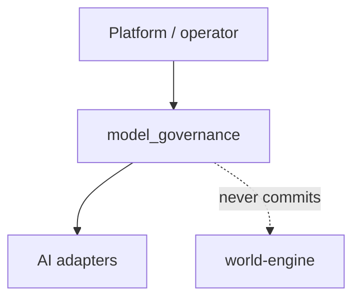

# model-governance — Software Architecture (arc42)

**Component:** model-governance · **Folder:** `backend/app/model_governance/` · **Status:** `internal`  
**Last reconciled to code:** `2026-07-31`

## 1. Introduction & Goals

Model governance hosts **adapter routing and in-process governance session contracts** inside the
backend process. It exists so routing and governance pipeline shape stay separate from
world-engine live narrative commit authority after Wave 6 moved former `backend/app/runtime`
routing surfaces here or retired them.

### 1.1 Quality goals

| Goal | Scenario |
| --- | --- |
| No live commit leakage | Selecting an adapter never writes authoritative story session truth |
| Explicit routing evidence | Operators can explain which adapter was chosen and why |
| Clear package boundary | `backend/app/model_governance` is the only backend home for this concern |

### 1.2 Stakeholders

| Stakeholder | Concern |
| --- | --- |
| Platform engineer | Stable routing registry and contracts |
| Runtime engineer | Clear non-authority relative to world-engine |
| Operator | Auditable adapter selection |

## 2. Constraints

- Governed by [Backend SAD](../backend/architecture.md) and [Governance SAD](../../project/governance/architecture.md).
- Must not reintroduce SQL `runtime_sessions` or a backend live-session truth store.
- World-engine remains the only live commit authority.

## 3. Context & Scope

### 3.1 In / out of scope

| In scope | Out of scope |
| --- | --- |
| Model routing, adapter registry, routing contracts | Live story session commit |
| Governance session JSON snapshots | Player WebSocket play loops |
| In-process W2 governance pipeline shape | Content YAML authoring |

<!-- BEGIN BT-SEMANTIC-DEPTH:3 -->
### Evidence-grounded scope and authority

Backend-hosted model routing and in-process governance session contracts without live turn commit authority.

**Authority rule:** Owns adapter routing and governance session shape only; world-engine owns live narrative commits.

**Git/archaeology scope:** `backend/app/model_governance`

| Context concern | Model | Boundary statement |
| --- | --- | --- |
| Routing package versus live world-engine authority | [Model Governance - Authority Context](../../../../UML/Components/model-governance/context/authority-context.md) | Owns adapter routing and governance session shape only; world-engine owns live narrative commits. |

Historical MVP and work-order material is classified evidence, not an authority source. Current code and accepted decisions win; conflicts remain explicit until a target decision is accepted.
<!-- END BT-SEMANTIC-DEPTH:3 -->

## 4. Solution Strategy

Keep routing and governance session serialization in one backend package; prove absence of retired
`runtime_sessions` writers with the dedicated gate; never claim live authority.

## 5. Building Block View

| Block | Path |
| --- | --- |
| Package root | `backend/app/model_governance/__init__.py` |
| Model routing | `backend/app/model_governance/model_routing.py` |
| Adapter registry | `backend/app/model_governance/adapter_registry.py` |
| Routing contracts | `backend/app/model_governance/model_routing_contracts.py` |
| Session persistence | `backend/app/model_governance/session/session_persistence.py` |
| Runtime models | `backend/app/model_governance/runtime_models.py` |

<!-- BEGIN BT-SEMANTIC-DEPTH:5 -->
### Source-bound building-block catalog

Each block has one stated responsibility, an interaction or ownership contract, and a current source anchor. The list is individualized for this scope; it is not derived from a fixed diagram count.

| Block | Kind | Responsibility | Contract | Source |
| --- | --- | --- | --- | --- |
| Operator / Platform (`operator`) | `actor` | Configure and invoke model routing without owning live commits | Privileged or internal platform call | [`backend/app/model_governance/__init__.py`](../../../../backend/app/model_governance/__init__.py) |
| Routing Decision (`decision`) | `class` | Explain adapter selection | Auditable routing evidence | [`backend/app/model_governance/model_routing.py`](../../../../backend/app/model_governance/model_routing.py) |
| Runtime Models (`models`) | `class` | Carry SessionState and turn deltas for governance pipelines | Pydantic value objects | [`backend/app/model_governance/runtime_models.py`](../../../../backend/app/model_governance/runtime_models.py) |
| Adapter Registry (`registry`) | `component` | Register available AI adapters | Explicit registry bootstrap | [`backend/app/model_governance/adapter_registry.py`](../../../../backend/app/model_governance/adapter_registry.py) |
| Governance Session Persistence (`session`) | `component` | Serialize in-process governance session shape | JSON-compatible snapshot; not live WE authority | [`backend/app/model_governance/session/session_persistence.py`](../../../../backend/app/model_governance/session/session_persistence.py) |
| Model Routing (`routing`) | `component` | Choose adapters and record routing decisions | Routing policy without commit side effects | [`backend/app/model_governance/model_routing.py`](../../../../backend/app/model_governance/model_routing.py) |
| Routing Contracts (`contracts`) | `component` | Define routing decision vocabulary | Serializable contract types | [`backend/app/model_governance/model_routing_contracts.py`](../../../../backend/app/model_governance/model_routing_contracts.py) |
| Configured (`configured`) | `state` | Hold registry and policy | Ready for routing | [`backend/app/model_governance/routing_registry_bootstrap.py`](../../../../backend/app/model_governance/routing_registry_bootstrap.py) |
| Governance Snapshot Persisted (`persisted`) | `state` | Store governance session snapshot | Non-authoritative relative to world-engine | [`backend/app/model_governance/session/session_persistence.py`](../../../../backend/app/model_governance/session/session_persistence.py) |
| Routed (`routed`) | `state` | Adapter selected for a call | No narrative commit | [`backend/app/model_governance/model_routing.py`](../../../../backend/app/model_governance/model_routing.py) |
| Model Governance (`governance`) | `system` | Route adapters and shape in-process governance sessions | Python package under backend/app/model_governance | [`backend/app/model_governance/__init__.py`](../../../../backend/app/model_governance/__init__.py) |
| World Engine (`world`) | `system` | Own live story commits | Authoritative play service | [`world-engine/world_engine/main.py`](../../../../world-engine/world_engine/main.py) |
<!-- END BT-SEMANTIC-DEPTH:5 -->

## 6. Runtime View

Configure registry → route adapter → optionally persist governance snapshot → return to caller.
No world-engine commit occurs on this path.

<!-- BEGIN BT-SEMANTIC-DEPTH:6 -->
### Dynamic viewpoint suite

| Runtime concern | Viewpoint | Model | Modeled interactions |
| --- | --- | --- | ---: |
| Adapter selection without live commit | `sequence` | [Model Governance - Routing Sequence](../../../../UML/Components/model-governance/sequence/routing-sequence.md) | 5 |
| Configure, route and persist governance snapshots only | `state` | [Model Governance - Routing Lifecycle](../../../../UML/Components/model-governance/states/routing-lifecycle.md) | 4 |

The ordered sequence/activity relationships and state transitions are validated against the catalog. Generic arrows such as "evidence for boundary" are not accepted as runtime semantics.
<!-- END BT-SEMANTIC-DEPTH:6 -->

## 7. Deployment View

Runs in-process inside the backend Flask service; no separate deployable.

<!-- BEGIN BT-SEMANTIC-DEPTH:7 -->
### Deployment and operational boundary evidence

This scope does not claim an independently deployable runtime. Its deployment effect is expressed through the owning systems and the following implementation roots:

- `backend/app/model_governance`

A deployment boundary is not inferred from a directory. Process, store, transport and trust contracts must be named by a deployment view or delegated to an owning SAD.
<!-- END BT-SEMANTIC-DEPTH:7 -->

## 8. Crosscutting Concepts

- Authority boundary enforced by package placement and `tests/gates/test_runtime_sessions_table_absent.py`.
- Observability of routing decisions remains adapter/trace local, not live-session truth.

<!-- BEGIN BT-SEMANTIC-DEPTH:8 -->
### Explicit interaction and dependency contracts

| From | To | Semantics | Contract | Evidence |
| --- | --- | --- | --- | --- |
| Model Governance | Model Routing | selects adapter | routing-only side effect | [`backend/app/model_governance/model_routing.py`](../../../../backend/app/model_governance/model_routing.py) |
| Model Governance | Governance Session Persistence | persists governance snapshot | non-authoritative snapshot | [`backend/app/model_governance/session/session_persistence.py`](../../../../backend/app/model_governance/session/session_persistence.py) |
| Runtime Models | Routing Decision | bounds routing evidence | explainable selection | [`backend/app/model_governance/runtime_models.py`](../../../../backend/app/model_governance/runtime_models.py) |
| Model Routing | Routing Contracts | emits decision vocabulary | stable contract types | [`backend/app/model_governance/model_routing_contracts.py`](../../../../backend/app/model_governance/model_routing_contracts.py) |
| Model Routing | Adapter Registry | resolves adapters | registered adapters only | [`backend/app/model_governance/adapter_registry.py`](../../../../backend/app/model_governance/adapter_registry.py) |
<!-- END BT-SEMANTIC-DEPTH:8 -->

## 9. Architecture Decisions

### D1: Model governance is routing-only, never live turn authority

**Status:** Accepted

**Context.** Wave 6 retired `backend/app/runtime` live-session surfaces and relocated routing/governance
helpers under `backend/app/model_governance`.

**Decision.** Treat `model_governance` as a critical but non-authoritative component: it may route
adapters and persist governance snapshots, but must not own live narrative commits.

**Consequences.** Clearer authority; callers must use world-engine for play truth.

<!-- BEGIN BT-SEMANTIC-DEPTH:9 -->
### Decision-to-view correspondence

| Decision(s) | Concern | Viewpoint | Model |
| --- | --- | --- | --- |
| `D1` | Routing package versus live world-engine authority | `context` | [Model Governance - Authority Context](../../../../UML/Components/model-governance/context/authority-context.md) |
| `D1` | Routing, registry, contracts and governance session seams | `component` | [Model Governance - Components](../../../../UML/Components/model-governance/components/routing-components.md) |
| `D1` | Adapter selection without live commit | `sequence` | [Model Governance - Routing Sequence](../../../../UML/Components/model-governance/sequence/routing-sequence.md) |
| `D1` | Governance session models and routing decisions | `class` | [Model Governance - Data Model](../../../../UML/Components/model-governance/classes/routing-data-model.md) |
| `D1` | Configure, route and persist governance snapshots only | `state` | [Model Governance - Routing Lifecycle](../../../../UML/Components/model-governance/states/routing-lifecycle.md) |

The correspondence is intentionally many-to-many: one decision may require structural, dynamic, data and deployment evidence, and one model may make several decisions analyzable together.
<!-- END BT-SEMANTIC-DEPTH:9 -->

## 10. Quality Requirements

| Quality | Measure |
| --- | --- |
| Authority isolation | Gate proves `runtime_sessions` absent; no backend live commit sink |
| Routing explainability | Routing contracts and decision fields remain serializable |

## 11. Risks and Technical Debt

| Risk | Mitigation |
| --- | --- |
| Accidental reintroduction of backend session truth | Gate + catalog authority edge to world-engine |
| Routing package grows into a second runtime | Keep lane root scoped to `backend/app/model_governance` |

<!-- BEGIN BT-SEMANTIC-DEPTH:11 -->
### Git-grounded drift profile

Former backend/app/runtime surfaces moved here or were retired. Models keep routing separate from live session authority.

| Drift claim | Status | Concern | Target direction |
| --- | --- | --- | --- |
| Scope-specific watch | `open_target` | No global claim currently maps to this root. | Keep source-bound views and review on structural Git changes. |

[Git/archaeology baseline](../../evidence/architecture-drift-baseline.md) · [Drift reconciliation and target directions](../../evidence/architecture-drift-reconciliation.md)

These entries are review inputs, not automatic design decisions. Conflicting/open items close only through accepted target decisions and the listed behavioral evidence.
<!-- END BT-SEMANTIC-DEPTH:11 -->

## 12. Glossary

| Term | Meaning |
| --- | --- |
| Model governance | Backend routing/governance package without live commit authority |
| Governance snapshot | JSON-compatible session shape for governance pipelines only |
