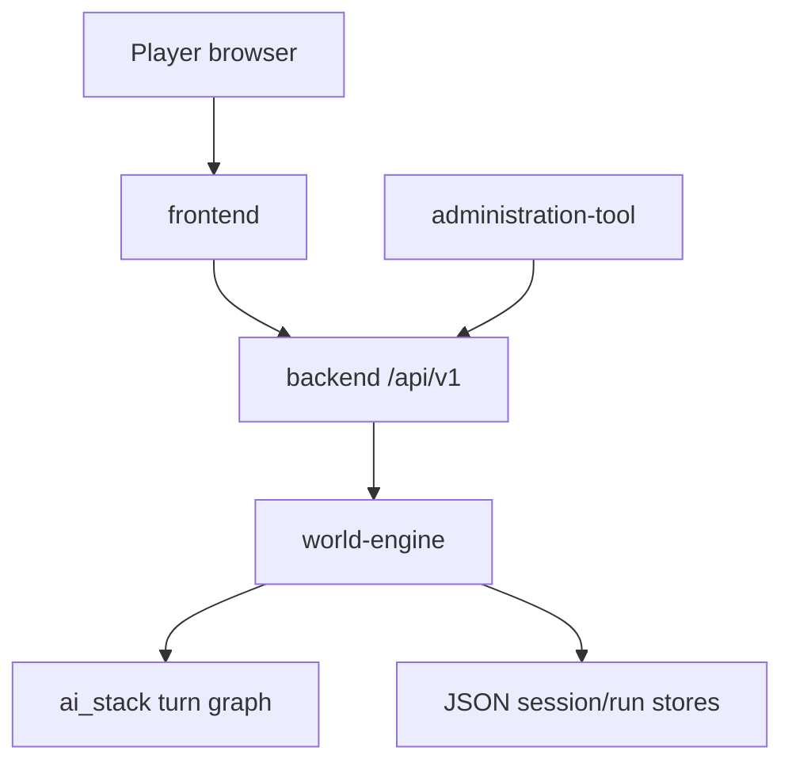

# world-engine — Software Architecture (arc42)

**Component:** world-engine · **Folder:** `world-engine/` · **Status:** `internal`  
**Last reconciled to code:** `2026-06-23`

## 1. Introduction & Goals

The world-engine play service is the FastAPI application that hosts **authoritative live runtime state**
for World of Shadows. When a story session is live, this process owns what actually happened: scene
identity, turn count, committed consequences, and diagnostics—not merely what a model proposed or what
a database row stores for platform marketing.

The service exposes two cooperating runtime faces inside one process: **template/run runtime**
(lobbies, WebSocket commands, snapshots) and **story narrative runtime** (HTTP story API, turn graph,
narrative commits). Both share ticket verification and trace middleware but serve different player
questions.

### 1.1 Quality goals

| Goal | Scenario |
| --- | --- |
| Single commit authority | A turn that fails validation leaves committed state unchanged; no backend mirror overrides engine truth |
| Observable live path | Operators can trace `world-engine.turn.execute` and prove adapter kind vs visible output |
| Thin-path realization | Ordinary player movement routes through Director → model realization in session output language |
| Recoverable degradation | Mock/fallback adapters mark `live_success=false` without corrupting canon |

### 1.2 Stakeholders

| Stakeholder | Concern |
| --- | --- |
| Player | Consistent live session via backend bootstrap + play WebSocket/HTTP |
| Runtime engineer | Clear module boundaries between `app/runtime/*` and `app/story_runtime/*` |
| AI engineer | Stable seams for `ai_stack.RuntimeTurnGraphExecutor` without commit leakage |
| Operator | Diagnostics HTTP, Langfuse traces, internal API key routes |

## 2. Constraints

- Governed by [Ecosystem Topology SAD](../../project/ecosystem-topology/architecture.md) and [Governance SAD](../../project/governance/architecture.md).
- Backend must proxy play operations; it must not host competing commit logic ([ADR-0002](../../../archive/adr-retired-2026/adr-0002-backend-session-surface-quarantine.md)).
- AI output is proposal-only until validator approval ([ADR-0004](../../../archive/adr-retired-2026/adr-0004-runtime-model-output-proposal-only-until-validator-approval.md)).
- GoC turn semantics: [`CANONICAL_TURN_CONTRACT_GOC`](../../../MVPs/MVP_VSL_And_GoC_Contracts/CANONICAL_TURN_CONTRACT_GOC.md) remains normative slice contract.
- Shared secret ticket contract documented in [`world-engine/README.md`](../../../../world-engine/README.md).

## 3. Context & Scope

Authoritative diagrams: [C4 context](../../../../UML/Components/world-engine/components/c4-context.md) · [Use cases](../../../../UML/Components/world-engine/components/c4-context.md)

### 3.1 In / out of scope

| In scope | Out of scope |
| --- | --- |
| `StoryRuntimeManager.execute_turn`, narrative commit resolution | Account auth, forum, wiki persistence |
| `RuntimeManager` + WebSocket `/ws` template runs | Content YAML authoring |
| Ticket verification, trace middleware | Admin UI rendering |
| Internal `/api/story/*` story session API | Direct player marketing HTML |

<!-- BEGIN BT-SEMANTIC-DEPTH:3 -->
### Evidence-grounded scope and authority

Authoritative live story runtime coordinating sessions, content, AI proposals, validation, commit, persistence and delivery.

**Authority rule:** World Engine exclusively owns live session state and commit decisions; AI, backend and frontend are collaborators with narrower authority.

**Git/archaeology scope:** `world-engine`, `story_runtime_core`

| Context concern | Model | Boundary statement |
| --- | --- | --- |
| Live authority among player, backend, content and AI proposal collaborators | [World Engine - System Context](../../../../UML/Components/world-engine/components/c4-context.md) | World Engine exclusively owns live session state and commit decisions; AI, backend and frontend are collaborators with narrower authority. |

Historical MVP and work-order material is classified evidence, not an authority source. Current code and accepted decisions win; conflicts remain explicit until a target decision is accepted.
<!-- END BT-SEMANTIC-DEPTH:3 -->

## 4. Solution Strategy

- Host both run and story managers in one FastAPI lifespan ([`world-engine/app/main.py`](../../../../world-engine/app/main.py)).
- Delegate turn orchestration to `ai_stack` graph executor; keep validate/commit/render seams in engine modules.
- Persist story sessions and run artifacts to configured JSON store directories.
- Expose diagnostics and state over HTTP for backend proxy and operator tooling.
- Use thin Director realization path for default player turns ([ADR-0062](../../../archive/adr-retired-2026/adr-0062-director-realization-thin-path.md)).

### 4.1 Persistence resources and sinks (Wave 2)

Exactly one declared sink per resource. Routes must not call store sinks directly.

| Resource | Owner / writer | Sink callsite | Revision behavior |
| --- | --- | --- | --- |
| `live_story_session` | StoryRuntimeManager | `_persist_session` → `_session_store.save` | `session.revision` increments on real write; `PersistOutcome` returned |
| `live_run_instance` | RuntimeManager | `self.store.save` (incl. `attach_runtime_profile_handoff`) | Run-instance metadata; not story revision |
| `branching_tree` | StoryRuntimeManager | `_persist_branching_tree_record` | Tree record replace |
| `branch_timeline` | StoryRuntimeManager | `_persist_branch_timeline_record` | Timeline record replace |
| `callback_web` | StoryRuntimeManager | `_persist_callback_web_record` | Callback-web record replace |
| `consequence_cascade` | StoryRuntimeManager | `_persist_consequence_cascade_record` | Cascade record replace |
| `backend_runtime_session` | Backend session store | `_persist_session_to_database` | SQL `runtime_sessions` (Wave 6 retirement candidate) |

Gate: `tools/architecture_assurance/drift_edge_catalog.json` `write_surfaces` + `validate_authoritative_write_surfaces` (alias-aware).

### 4.2 Action-outcome vocabulary (Wave 3)

Authority commit vocabulary is at least as rich as AI affordance resolution. Scene transitions are a
special case of state change; missing transition-card edges yield `partial`, not `blocked`.

| `SituationStatus` | Meaning | Beat behavior |
| --- | --- | --- |
| `continue` | No scene change; state may still update | Continuity carry / advance as usual |
| `transitioned` | Legal scene transition committed | New beat identity |
| `partial` | Action accepted without scene change (e.g. off transition map) | `partial_effect_advance` |
| `prevented` | Narratively prevented but witnessed | `prevented_but_witnessed` |
| `allowed_offscreen` | Offscreen-allowed effect | `allowed_offscreen_advance` |
| `blocked` | Situatively impossible (e.g. unknown target scene) | Frozen (`blocked_turn_no_advance`) |
| `terminal` | Session at terminal scene | Overlay after non-block |

AI affordance → situation mapping: `app/story_runtime/situation_status_mapping.py`
(`AI_TO_SITUATION_STATUS`). Mapping to a poorer status than the AI resolved is a contract failure.

## 5. Building Block View

| Block | Location | Role |
| --- | --- | --- |
| HTTP API | `app/api/http.py` | Story session REST, internal API key |
| WebSocket API | `app/api/ws.py`, `app/api/story_ws.py` | Live run + story WS loops |
| Story runtime manager | `app/story_runtime/manager/` | In-memory `StorySession` map, `execute_turn` |
| Run runtime | `app/runtime/manager.py`, `app/runtime/engine.py` | Template instances, snapshots, transcripts |
| Auth tickets | `app/auth/tickets.py` | Shared-secret websocket tickets |
| Commit models | `app/story_runtime/commit_models.py` | Narrative commit records |
| Trace middleware | `app/middleware/trace_middleware.py` | Request/turn correlation |

Authoritative: [C4 container](../../../../UML/Components/world-engine/components/c4-container.md) · [C4 component](../../../../UML/Components/world-engine/components/c4-component.md) · [Mechanism catalog](mechanism-catalog.md)

<!-- BEGIN BT-SEMANTIC-DEPTH:5 -->
### Source-bound building-block catalog

Each block has one stated responsibility, an interaction or ownership contract, and a current source anchor. The list is individualized for this scope; it is not derived from a fixed diagram count.

| Block | Kind | Responsibility | Contract | Source |
| --- | --- | --- | --- | --- |
| Player (`player`) | `actor` | Submit semantic intent and observe committed narrative | Ticket-bound session | [`world-engine/app/api/story_ws.py`](../../../../world-engine/app/api/story_ws.py) |
| CommitDecision (`commit`) | `class` | Explain accepted or rejected mutation | Validation and policy evidence | [`world-engine/app/story_runtime/narrative_commit_resolution.py`](../../../../world-engine/app/story_runtime/narrative_commit_resolution.py) |
| NarrativeProposal (`proposal`) | `class` | Carry uncommitted AI result and evidence | No authoritative mutations | [`world-engine/app/story_runtime/commit_models.py`](../../../../world-engine/app/story_runtime/commit_models.py) |
| StorySession (`session`) | `class` | Aggregate live story truth and bindings | Monotonic revision and bound content | [`world-engine/app/story_runtime/commit_models.py`](../../../../world-engine/app/story_runtime/commit_models.py) |
| AI Proposal Bridge (`ai_bridge`) | `component` | Request and normalize AI proposal packets | Proposal-only anti-corruption layer | [`world-engine/app/story_runtime/governed_runtime_adapters.py`](../../../../world-engine/app/story_runtime/governed_runtime_adapters.py) |
| Canonical Turn Lifecycle (`lifecycle`) | `component` | Enforce interpret, propose, validate, commit ordering | No render before commit | [`world-engine/app/story_runtime/canonical_turn_lifecycle.py`](../../../../world-engine/app/story_runtime/canonical_turn_lifecycle.py) |
| Commit Resolution (`validation`) | `component` | Validate proposal against world truth and policy | Accepted/rejected decision with evidence | [`world-engine/app/story_runtime/narrative_commit_resolution.py`](../../../../world-engine/app/story_runtime/narrative_commit_resolution.py) |
| Delivery Surfaces (`delivery`) | `component` | Publish committed blocks and state | Post-commit events only | [`world-engine/app/api/story_ws.py`](../../../../world-engine/app/api/story_ws.py) |
| Live Governance (`governance`) | `component` | Apply runtime policy and authority guards | Fail-closed mutation policy | [`world-engine/app/story_runtime/live_governance.py`](../../../../world-engine/app/story_runtime/live_governance.py) |
| Story Session Store (`store`) | `component` | Persist committed state and monotonic revision | Atomic session update | [`world-engine/app/story_runtime/story_session_store.py`](../../../../world-engine/app/story_runtime/story_session_store.py) |
| Turn Execution (`turn`) | `component` | Run the canonical lifecycle for one player command | Exactly one commit or explicit rejection | [`world-engine/app/story_runtime/manager/turn_execution.py`](../../../../world-engine/app/story_runtime/manager/turn_execution.py) |
| Compatibility Runtime (`runtime`) | `container` | Host legacy engine profiles and transitional behavior | Explicitly non-canonical where overlapped | [`world-engine/app/runtime/manager.py`](../../../../world-engine/app/runtime/manager.py) |
| Runtime Observability (`observability`) | `container` | Correlate turn lifecycle and failures | Redacted trace tree | [`world-engine/app/observability/trace.py`](../../../../world-engine/app/observability/trace.py) |
| Session Stores (`persistence`) | `container` | Persist committed session, branches and callbacks | Commit-versioned state | [`world-engine/app/story_runtime/story_session_store.py`](../../../../world-engine/app/story_runtime/story_session_store.py) |
| Story API (`api`) | `container` | Expose health, package, session, turn and branching routes | Validated HTTP/WS envelopes | [`world-engine/app/api/http.py`](../../../../world-engine/app/api/http.py) |
| Story Runtime Manager (`manager`) | `container` | Coordinate canonical sessions and turns | Single live authority | [`world-engine/app/story_runtime/manager/runtime_manager.py`](../../../../world-engine/app/story_runtime/manager/runtime_manager.py) |
| Session Persistence (`store_node`) | `database` | Persist committed state and evidence | Atomic revision storage | [`world-engine/app/story_runtime/story_session_store.py`](../../../../world-engine/app/story_runtime/story_session_store.py) |
| AI Runtime (`ai_node`) | `node` | Produce proposals | In-process/service adapter | [`ai_stack/langgraph/langgraph_runtime_executor.py`](../../../../ai_stack/langgraph/langgraph_runtime_executor.py) |
| Backend/Browser Clients (`client_node`) | `node` | Call story endpoints and consume events | HTTP/WebSocket | [`world-engine/app/api/http.py`](../../../../world-engine/app/api/http.py) |
| World Engine Process (`world_node`) | `node` | Host authoritative runtime | Python service | [`world-engine/Dockerfile`](../../../../world-engine/Dockerfile) |
| Active (`active`) | `state` | Accept canonical turns | Bound content and actor | [`world-engine/app/story_runtime/manager/runtime_manager.py`](../../../../world-engine/app/story_runtime/manager/runtime_manager.py) |
| Closed (`closed`) | `state` | Reject further turns and retain evidence | Final persisted revision | [`world-engine/app/api/http_routes/story_session_lifecycle_routes.py`](../../../../world-engine/app/api/http_routes/story_session_lifecycle_routes.py) |
| Degraded (`degraded`) | `state` | Preserve session during provider or validation failure | No fabricated commit | [`world-engine/app/narrative/fallback_generator.py`](../../../../world-engine/app/narrative/fallback_generator.py) |
| Executing Turn (`executing`) | `state` | Hold one in-flight command | Serialized session mutation | [`world-engine/app/story_runtime/manager/turn_execution.py`](../../../../world-engine/app/story_runtime/manager/turn_execution.py) |
| New (`new`) | `state` | Await initial content/session binding | No player turn | [`world-engine/app/api/http_routes/story_session_lifecycle_routes.py`](../../../../world-engine/app/api/http_routes/story_session_lifecycle_routes.py) |
| AI Stack (`ai`) | `system` | Produce bounded narrative proposals | Proposal and evidence, never commit | [`ai_stack/langgraph/langgraph_runtime_executor.py`](../../../../ai_stack/langgraph/langgraph_runtime_executor.py) |
| Backend (`backend`) | `system` | Authenticate and proxy play operations | Signed internal request | [`backend/app/services/game/game_service.py`](../../../../backend/app/services/game/game_service.py) |
| Content Authority (`content`) | `system` | Supply versioned authored facts and policy | Immutable bound content version | [`content/modules/god_of_carnage/module.yaml`](../../../../content/modules/god_of_carnage/module.yaml) |
| World Engine (`world`) | `system` | Own sessions, validate proposals and commit story truth | HTTP/WebSocket story API | [`world-engine/app/main.py`](../../../../world-engine/app/main.py) |
<!-- END BT-SEMANTIC-DEPTH:5 -->

## 6. Runtime View

### 6.1 Story turn (happy path)

Player input reaches backend, which forwards to world-engine story API. `StoryRuntimeManager` loads
session state, invokes the LangGraph executor in `ai_stack`, runs validate/commit seams, persists
delta, returns visible blocks and diagnostics.

Authoritative: [Primary turn sequence](../../../../UML/Components/world-engine/sequence/world-engine-primary-turn-sequence.md) · [Mechanism catalog](mechanism-catalog.md) · [Evidence matrix](evidence-matrix.md)

### 6.2 Degraded adapter path

When the adapter is mock, fallback, or placeholder, live success gates mark degradation without
writing false canon. Opening leniency may approve diagnostic commits with explicit signals.

Authoritative: [Degraded turn sequence](../../../../UML/Components/world-engine/sequence/world-engine-degraded-turn-sequence.md)

### 6.3 Session lifecycle

Story sessions move through creation, active play, terminal/end, and eviction from the in-memory map
according to manager policies.

Authoritative: [Story session states](../../../../UML/Components/world-engine/states/world-engine-story-session-states.md)

<!-- BEGIN BT-SEMANTIC-DEPTH:6 -->
### Dynamic viewpoint suite

| Runtime concern | Viewpoint | Model | Modeled interactions |
| --- | --- | --- | ---: |
| End-to-end authoritative turn from player intent to committed event | `sequence` | [World Engine - Primary Turn](../../../../UML/Components/world-engine/sequence/primary-turn-sequence.md) | 7 |
| Provider or validation failure preserves committed truth | `sequence` | [World Engine - Degraded Turn](../../../../UML/Components/world-engine/sequence/degraded-turn-sequence.md) | 6 |
| Decision points between proposal, rejection, commit and delivery | `activity` | [World Engine - Canonical Turn Activity](../../../../UML/Components/world-engine/activity/canonical-turn-activity.md) | 6 |
| Session creation, serialized turns, degradation, recovery and closure | `state` | [World Engine - Session Lifecycle](../../../../UML/Components/world-engine/states/session-lifecycle.md) | 8 |

The ordered sequence/activity relationships and state transitions are validated against the catalog. Generic arrows such as "evidence for boundary" are not accepted as runtime semantics.
<!-- END BT-SEMANTIC-DEPTH:6 -->

## 7. Deployment View

- Process: `uvicorn app.main:app` from `world-engine/` (see README).
- Env: `PLAY_SERVICE_SECRET`, store dirs (`STORY_SESSION_STORE_DIR`, `RUN_STORE_DIR`, …), optional `PLAY_SERVICE_INTERNAL_API_KEY`.
- CI: `pip install -r world-engine/requirements-dev.txt`; tests import repo-root `ai_stack`.
- Docker: composed with backend via `docker-up.py` ([ADR-0030](../../../archive/adr-retired-2026/adr-0030-docker-up-complete-bootstrap.md)).

<!-- BEGIN BT-SEMANTIC-DEPTH:7 -->
### Deployment and operational boundary evidence

| Concern | Model | Nodes / stores |
| --- | --- | --- |
| Client boundary, authoritative service, AI collaborator and session persistence | [World Engine - Deployment](../../../../UML/Components/world-engine/deployment/world-engine-deployment.md) | Backend/Browser Clients, World Engine Process, AI Runtime, Session Persistence |

A deployment boundary is not inferred from a directory. Process, store, transport and trust contracts must be named by a deployment view or delegated to an owning SAD.
<!-- END BT-SEMANTIC-DEPTH:7 -->

## 8. Crosscutting Concepts

- **Tracing:** Langfuse spans on turn execute; player input length/hash on spans ([ADR-0033](../../../archive/adr-retired-2026/adr-0033-live-runtime-commit-semantics.md)).
- **Validation strategies:** `OutputValidatorConfig` / `ValidationStrategy` in narrative package loader path.
- **Preview isolation:** `PreviewIsolationRegistry` keeps preview sessions off active runtime ([ADR-0013](../../../archive/adr-retired-2026/adr-0013-preview-sessions-isolated-from-active-runtime.md) — partial).
- **Locale:** Session output language drives visible realization ([ADR-0036](../../../archive/adr-retired-2026/adr-0036-player-session-output-language.md)).

<!-- BEGIN BT-SEMANTIC-DEPTH:8 -->
### Explicit interaction and dependency contracts

| From | To | Semantics | Contract | Evidence |
| --- | --- | --- | --- | --- |
| AI Proposal Bridge | Commit Resolution | returns candidate | proposal plus evidence | [`world-engine/app/story_runtime/narrative_commit_resolution.py`](../../../../world-engine/app/story_runtime/narrative_commit_resolution.py) |
| Story API | Story Runtime Manager | delegates story operation | validated command | [`world-engine/app/api/http_routes/story_turn_routes.py`](../../../../world-engine/app/api/http_routes/story_turn_routes.py) |
| CommitDecision | StorySession | advances when accepted | monotonic revision | [`world-engine/app/story_runtime/story_session_store.py`](../../../../world-engine/app/story_runtime/story_session_store.py) |
| Live Governance | AI Proposal Bridge | requests bounded proposal | proposal-only | [`world-engine/app/story_runtime/governed_runtime_adapters.py`](../../../../world-engine/app/story_runtime/governed_runtime_adapters.py) |
| Canonical Turn Lifecycle | Live Governance | checks authority and policy | fail closed | [`world-engine/app/story_runtime/live_governance.py`](../../../../world-engine/app/story_runtime/live_governance.py) |
| Story Runtime Manager | Runtime Observability | emits lifecycle evidence | trace-correlated spans | [`world-engine/app/observability/trace.py`](../../../../world-engine/app/observability/trace.py) |
| Story Runtime Manager | Session Stores | loads and stores session | revision-safe transaction | [`world-engine/app/story_runtime/story_session_store.py`](../../../../world-engine/app/story_runtime/story_session_store.py) |
| NarrativeProposal | CommitDecision | is resolved as | validation evidence | [`world-engine/app/story_runtime/narrative_commit_resolution.py`](../../../../world-engine/app/story_runtime/narrative_commit_resolution.py) |
| Compatibility Runtime | Story Runtime Manager | adapts supported legacy paths | explicit compatibility seam | [`world-engine/app/runtime/manager.py`](../../../../world-engine/app/runtime/manager.py) |
| StorySession | NarrativeProposal | bounds evaluation | base revision | [`world-engine/app/story_runtime/commit_models.py`](../../../../world-engine/app/story_runtime/commit_models.py) |
| Story Session Store | Delivery Surfaces | publishes committed result | post-commit only | [`world-engine/app/api/story_ws.py`](../../../../world-engine/app/api/story_ws.py) |
| Turn Execution | Canonical Turn Lifecycle | executes canonical phases | ordered lifecycle | [`world-engine/app/story_runtime/canonical_turn_lifecycle.py`](../../../../world-engine/app/story_runtime/canonical_turn_lifecycle.py) |
| Commit Resolution | Story Session Store | commits accepted delta | atomic revision or no write | [`world-engine/app/story_runtime/story_session_store.py`](../../../../world-engine/app/story_runtime/story_session_store.py) |
<!-- END BT-SEMANTIC-DEPTH:8 -->

## 9. Architecture Decisions

| ID | Title | Status | Migrated from |
| --- | --- | --- | --- |
| D1 | Runtime authority in world-engine | Accepted | ADR-0001 |
| D2 | Proposal-only AI until validator approval | Accepted | ADR-0004 |
| D3 | Live runtime commit semantics | Partially implemented | ADR-0033 |
| D4 | Director realization thin path | Accepted | ADR-0062 |
| D5 | Canonical turn lifecycle (single commit path) | Partially implemented | ADR-0038 |
| D6 | W5 actor tracking and player view | Accepted (partial) | ADR-0069, ADR-0070 |
| D7 | Scene identity canonical surface | Accepted | ADR-0003 |
| D8 | Validation failures degrade gracefully | Accepted | ADR-0011 |
| D9 | Persist TurnExecutionResult and AIDecisionLog | Accepted | ADR-0015 |
| D10 | Player session output language | Accepted | ADR-0036 |
| D11 | Explicit configurable validation strategy | Accepted | ADR-0008 |
| D12 | Preview session isolation | Not Finished | ADR-0013 |
| D16 | Retire legacy narrator area fields | Proposed | ADR-0071 |

Normative detail: [mechanism catalog](mechanism-catalog.md) · [evidence matrix](evidence-matrix.md) · [decision detail](decision-detail.md) · [UML decisions](../../../../UML/Components/world-engine/decisions/)

### D1: Runtime authority in world-engine

**Status:** Accepted
**Origin:** ADR-0001 (retired 2026-06-23)

**Context.** World of Shadows split **platform API / governance** from **live narrative execution**. Without a single authoritative runtime host, duplicate business logic and conflicting session state would emerge across Flask backends and experimental paths.

**MVP narrative governance (historical index):** Runtime must consume only **approved compiled packages**; raw authored source, research outputs, and draft patches are never read directly by live runtime execution. Preview builds are first-class; rollback is feasible; promotion is a formal act. (Source: [`02_architecture_decisions.md`](../../../MVPs/MVP_Narrative_Governance_And_Revision_Foundation/02_architecture_decisions.md) — index only; **this ADR is normative** for authority placement.)

**Decision.** 1. **`world-engine` (play service)** is the **authoritative runtime host** for story sessions: lifecycle, turn execution, and runtime-side session persistence model.
2. **`backend`** remains responsible for content curation, publishing controls, review/moderation workflows, policy validation, and admin/operator diagnostics integration - **not** for hosting canonical player HTML or re-implementing committed turn logic.
3. **`story_runtime_core`** holds shared interpretation, registry/adapters, and reusable models consumed by the play service.
4. **AI output** remains **non-authoritative proposal data** until validated and committed by runtime seams (see `docs/MVPs/MVP_VSL_And_GoC_Contracts/CANONICAL_TURN_CONTRACT_GOC.md` for GoC specifics).
5. Governance evidence for a session is keyed by the World-Engine
   story-session id. A missing story session is represented as
   `world_engine_story_session_not_found`; backend-local `SessionState`
   lookups are not a fallback authority.

**Consequences.** **Positive**

- Clear seam for engineering ownership and on-call triage.
- Enables MCP and admin tooling without conflating them with committed play state.

**Negative / risks**

- Requires careful **proxy and secret** configuration between backend and play service.
- Transitional backend paths must be **explicitly labeled** deprecated until removed.

**Follow-ups**

- Track removal of transitional in-process runtime shims as documented in `runtime_authority_decision.md`.
- Keep ADR synchronized if authority shifts (supersede rather than silently edit).

**Implementation status.** **Implemented — matches ADR.**

- `world-engine/app/story_runtime/manager/` (`StoryRuntimeManager`) is the single authoritative runtime host for story sessions, turn execution, and session lifecycle.
- `backend/app/api/v1/game_routes.py` proxies to world-engine; no competing session commit logic exists in the backend layer.
- Backend AI-stack session evidence bundles resolve evidence through
  `game_service.get_story_state` / `get_story_diagnostics` for the
  World-Engine story-session id; they do not consult removed backend runtime
  sessions.
- `story_runtime_core` provides shared interpretation and registry/adapters consumed by the play service.
- AI output proposal-only contract enforced: validation + commit seams in `world-engine/app/api/http.py`.
- Governance investigation confirms: `CTR-ADR-0001-RUNTIME-AUTHORITY` implemented by `world-engine/app/story_runtime/manager/` and `world-engine/app/api/http.py`, validated by `world-engine/tests/test_story_runtime_api.py`.
- Supersedes ADR-0021 (stub — see `docs/archive/adr-retired-2026/legacy/`).

**Testing.** - **Documentation / review:** cross-check against [`runtime-authority-and-state-flow.md`](../../../technical/runtime/runtime-authority-and-state-flow.md) and [`runtime-authority-and-session-lifecycle.md`](../../../dev/architecture/runtime-authority-and-session-lifecycle.md).
- **Code anchors:** `StoryRuntimeManager` and play-service session lifecycle paths in `world-engine/` must remain the only authority for committed play; flag any new backend “truth” writes in review.
- **Failure mode:** duplicated session commit paths or Flask-hosted canonical play without an ADR amendment.

**Evidence.** `docs/architecture/components/world-engine/architecture.md#d1-runtime-authority-in-world-engine` (archived — see `docs/archive/adr-retired-2026/`)

### D2: Runtime model output is proposal-only until validator approval

**Status:** Accepted
**Origin:** ADR-0004 (retired 2026-06-23)

**Decision.** The model may suggest narrative text, triggers, and effects. No suggestion is authoritative until output validation and engine legality checks pass.

**Consequences.** - the model cannot silently mutate truth
- blocked turns are first-class
- commit logic remains engine authority

**Implementation status.** **Implemented — principle enforced throughout the runtime.**

- Model output is treated as a proposal in `world-engine/app/story_runtime/manager/` (LangGraph graph execution → validation seam → commit seam).
- `world-engine/app/api/http.py` enforces the proposal → validation → commit pipeline for every turn.
- `ai_stack/story_runtime/live_runtime_commit_semantics.py` formalizes `live_success` computation separating "commit_applied" from proof of real generation.
- ADR-0033 (Live Runtime Commit Semantics) extends this principle with specific fields (`adapter_kind`, `live_success`, `validation_status` provenance) — the two ADRs are complementary.
- Blocked turns are first-class: degradation markers and `quality_class=degraded` propagate when validation fails.

**Testing.** Contract / unit coverage as cited in **References**; extend this section when a dedicated gate exists. Revisit this ADR if enforcement drifts or the decision is bypassed in code review.

**Evidence.** `docs/architecture/components/world-engine/architecture.md#d2-runtime-model-output-is-proposal-only-until-validator-approval` (archived — see `docs/archive/adr-retired-2026/`)

### D3: Live Runtime Commit Semantics for Real AI, Mock, Fallback, and Visible Story Output

**Status:** Accepted (partial; open gaps in diagnostics/shell — see [decision-detail](decision-detail.md#d3-live-runtime-commit-semantics-adr-0033))
**Origin:** ADR-0033 (retired 2026-06-23)

**Context.** Langfuse traces can show routing, invoke, validation, and commit phases while the adapter is still `mock` or fallback-only, with empty generation and no player-visible story output. That pattern produces false-green “live success” if gates only check span presence.

**Decision.** A governed live turn is **live-successful** only when: runtime profile and human role bind correctly; a **real non-mock** adapter runs; structured generation is non-empty; validation approves; the engine commits; and the commit yields **non-empty frontend-visible** story output. Diagnostics and traces must label mock, fallback, degraded, and empty paths explicitly. Tracing alone is never live proof.

**Consequences.** MVP4/live gates and backend bundles must use `evaluate_live_turn_success_gate()` semantics; mock/fallback paths set `live_success=false`. Some legacy tests may fail until aligned. Preview/test modes may allow mock commits only when explicitly labeled.

**Evidence.** [WE-M03](mechanism-catalog.md#we-m03) · [`live_runtime_commit_semantics.py`](../../../../ai_stack/story_runtime/live_runtime_commit_semantics.py) · [`test_adr_live_runtime_commit_semantics_gate.py`](../../../../tests/gates/test_adr_live_runtime_commit_semantics_gate.py) · [detail + trace examples](decision-detail.md#d3-live-runtime-commit-semantics-adr-0033) · [archive ADR-0033](../../../archive/adr-retired-2026/adr-0033-live-runtime-commit-semantics.md)

### D4: Director Realization Thin Path (Resolver → Director → Narrator)

**Status:** Accepted
**Origin:** ADR-0062 (retired 2026-06-23)

**Context.** Mundane player turns (movement, perception) previously bypassed the Director via `authoritative_action_resolution`, echoing English affordance YAML instead of `session_output_language` realization. Live traces showed German movement producing English bleed and questions failing late on `dramatic_irony_hidden_fact_echo`. Product rule: Resolver classifies; Director composes; Narrator realizes — no binary short-path vs monolithic graph router for ordinary turns.

**Decision.** Mandatory thin path: `resolve_player_action` → `director_compose_realization` → `realize_via_capabilities` → model/validate/commit/render. `realization_plan.v1` from `compose_realization_plan` with semantic capability names (movement, perception, speech, clarification, kanon_break). Narrator capabilities invoke LLM only in session language — never echo English affordance `description` fields. Movement folds diegetic text into `player_input_outcome` when no NPC lines. State and `observability_path_summary` carry realization metadata; operators use thin-path summary API. LDSS/dramatic nodes remain in graph but off the default player edge list after resolve.

**Consequences.** German/session-language movement at token cost; LLM outage surfaces as turn failure rather than silent English bleed. PR-A.2/3 still needed for richer capabilities and irony validation ahead of realization.

**Evidence.** [WE-M04](mechanism-catalog.md#we-m04) · [`director_realization_composer.py`](../../../../ai_stack/story_runtime/director/director_realization_composer.py) · [detail: capabilities + tests](decision-detail.md#d4-director-thin-path-adr-0062) · [UML d4](../../../../UML/Components/world-engine/decisions/d4-director-thin-path.md) · [`test_thin_path_summary_api.py`](../../../../world-engine/tests/test_thin_path_summary_api.py) · [archive ADR-0062](../../../archive/adr-retired-2026/adr-0062-director-realization-thin-path.md)

### D5: Canonical Turn Lifecycle and Single Commit / Persist / Project Path

**Status:** Accepted
**Origin:** ADR-0038 (retired 2026-06-23)

**Context.** Shell counters, `story_window`, diagnostics rows, and Langfuse metadata can disagree — e.g. visible blocks while `turn_counter` reads zero. ADR-0033 quality gates stay unchanged; this decision defines **one canonical turn envelope** per player-visible outcome.

**Decision.** Every canonical turn has a stable `canonical_turn_id` joining history, `story_window`, backend bundle fields, and trace metadata. Lifecycle states run `received` → … → `committed` → `persisted` → `projected` → `observed`; no player-visible projection without commit. Shell counters derive from persisted canonical turns only. Phases A→B→C (counter parity, lifecycle field, short-path convergence) shipped in fixed order.

**Consequences.** Single join key for story, shell, observability, and replay; hot-path changes in `StoryRuntimeManager` and HTTP state mapping require strict contract tests.

**Evidence.** [WE-M05](mechanism-catalog.md#we-m05) · [`canonical_turn_lifecycle.py`](../../../../world-engine/app/story_runtime/canonical_turn_lifecycle.py) · [detail: lifecycle + phases](decision-detail.md#d5-canonical-turn-lifecycle-adr-0038) · [UML d5](../../../../UML/Components/world-engine/decisions/d5-canonical-turn-lifecycle.md) · [`test_canonical_turn_lifecycle_gate.py`](../../../../tests/gates/test_canonical_turn_lifecycle_gate.py) · [archive ADR-0038](../../../archive/adr-retired-2026/adr-0038-canonical-turn-lifecycle-single-commit-path.md)

### D7: Scene Identity Compatibility Surface Across Compile, AI Guidance, and Commit

**Status:** Accepted
**Origin:** ADR-0003 (retired 2026-06-23)

**Context.** Authored narrative modules are consumed by more than one component (content compiler, optional direct YAML readers in AI/helpers, world-engine narrative commit). Without a single canonical scene identifier vocabulary and a small, tested translation layer, regressions at handoffs can reappear even after point fixes (audit finding class "dual interpretation surfaces").

**Scene packet contract (historical MVP ADR-003 wording):** The model call must be built from a typed **`NarrativeDirectorScenePacket`**. This is not optional retrieval context and not ad hoc prompt interpolation. Consequences: runtime model input is inspectable and testable; policy, legality, actor scope, and constraints are explicit; generation becomes reproducible enough for regression testing. (Source: [`02_architecture_decisions.md`](../../../MVPs/MVP_Narrative_Governance_And_Revision_Foundation/02_architecture_decisions.md) — index only.)

**Decision.** 1. Treat **compiler runtime projection** and world-engine **commit resolver** as the **normative** contract for scene row identity at the seam (unchanged from prior draft).
2. **Single owned compatibility resolver:** [`ai_stack/story_runtime/god_of_carnage/god_of_carnage_scene_identity.py`](../../ai_stack/story_runtime/god_of_carnage/god_of_carnage_scene_identity.py) is the only place that defines legacy runtime `scene_id` -> phase-policy guidance keys and guidance-phase -> escalation-arc subkeys. [`ai_stack/story_runtime/god_of_carnage/god_of_carnage_yaml_authority.py`](../../ai_stack/story_runtime/god_of_carnage/god_of_carnage_yaml_authority.py) **re-exports** and consumes that module; it must not introduce a second mapping dict.
3. **No local remap (mandatory):**
   - No duplicate scene-id -> guidance dicts outside `god_of_carnage_scene_identity.py` (enforced by `python tools/verify_goc_scene_identity_single_source.py` in CI and by `test_sole_definition_of_guidance_phase_key_for_scene_id` in `ai_stack/tests/test_god_of_carnage_scene_identity.py`).
   - No ad hoc `if scene_id == "...": phase = ...` mapping in consumers; use `guidance_phase_key_for_scene_id` (exceptions require ADR amendment or state decision log + expiry).
4. Prefer **contract tests** that load canonical content and assert vocabulary legibility (see `ai_stack/tests/test_god_of_carnage_scene_identity.py`).
5. Do not add new runtime maps for player language, semantic moves, actor
   aliases, location aliases, or scene candidates. Those meanings must come
   from authored content IDs and AI semantic resolution.
6. The compatibility resolver does **not** authorize phase-helper fallback.
   Backend transitional helpers such as `app.runtime.narrative.next_situation` and
   `app.runtime.validation.reference_policy` remain strict over
   `ContentModule.scene_phases`: a `SessionState.current_scene_id` that names
   only a `scene_graph.yaml` node is rejected instead of being silently
   remapped to a phase id. Even scene self-reference checks first require the
   referenced id to exist in the module phase vocabulary.

**Consequences.** - Positive: Fewer silent failures at seams; CI enforcement against mapping drift.
- Negative: GoC YAML or guidance renames need a coordinated code update.

**Implementation status.** **Implemented as a bounded compatibility surface.**

- `ai_stack/story_runtime/god_of_carnage/god_of_carnage_scene_identity.py` is the sole legacy-compatible definition
  point for `guidance_phase_key_for_scene_id`.
- `ai_stack/story_runtime/god_of_carnage/god_of_carnage_yaml_authority.py` re-exports and consumes that module without introducing a second mapping dict.
- `ai_stack/tests/test_god_of_carnage_scene_identity.py` includes `test_sole_definition_of_guidance_phase_key_for_scene_id` which scans the entire repo for duplicate definitions and fails on any found.
- `tools/verify_goc_scene_identity_single_source.py` enforces the no-local-remap rule in CI.
- Governance investigation confirms `CTR-ADR-0003-SCENE-IDENTITY` implemented and validated.
- This ADR does not authorize semantic routing, language translation, actor
  targeting, or scene-candidate selection from raw player text. Current GoC
  direction is governed by authored `canonical_path/`, `scene_graph.yaml`,
  phase policy, and AI semantic payloads.

**Testing.** - **CI:** `python tools/verify_goc_scene_identity_single_source.py` and `ai_stack/tests/test_god_of_carnage_scene_identity.py` (including `test_sole_definition_of_guidance_phase_key_for_scene_id`).
- **Failure mode:** duplicate scene-id -> guidance maps, ad hoc `if scene_id == ...` branches outside `god_of_carnage_scene_identity.py`, or tests that require transitional phase/reference helpers to accept scene-graph node ids as backward-compatible phase aliases.
- **Out of scope:** raw player text, actor names, locale words, or scene-topic
  keywords selecting semantic moves or scene candidates.

**Evidence.** `docs/architecture/components/world-engine/architecture.md#d7-scene-identity-canonical-surface` (archived — see `docs/archive/adr-retired-2026/`)

### D8: Corrective retry must provide actionable validation feedback

**Status:** Accepted
**Origin:** ADR-0012 (retired 2026-06-23)

**Decision.** Retry is not blind regeneration. When validation fails, the runtime must produce actionable feedback describing the violation, the violated rule, and legal alternatives where available.

**Consequences.** - retry quality is materially better than blind re-roll
- validation feedback becomes a first-class contract
- semantic and rule-based validators must expose machine-usable violation details
- prompt assembly must support corrective context

**Implementation status.** **Implemented — `ValidationFeedback` / `ValidationViolation` types and corrective retry loop in place.**

- `world-engine/app/narrative/validation_feedback.py`: `ValidationViolation` (violation_type, specific_issue, rule_violated, suggested_fix) and `ValidationFeedback` (passed, violations, corrections_needed, legal_alternatives) as machine-usable contracts.
- World-engine retry logic uses `enable_corrective_feedback` flag in `OutputValidatorConfig` and feeds violation detail back into the retry generation context.
- `docs/MVPs/MVP_Narrative_Governance_And_Revision_Foundation/12_live_play_correction_and_fallbacks.md` documents the full 5-step recovery flow (generate → validate → feedback → corrective retry → safe fallback).
- Status promoted from "Proposed" because the decision and types are implemented and tested.

**Testing.** Contract / unit coverage as cited in **References**; extend this section when a dedicated gate exists. Revisit this ADR if enforcement drifts or the decision is bypassed in code review.

**Evidence.** `docs/architecture/components/world-engine/architecture.md#d8-validation-failures-degrade-gracefully` (archived — see `docs/archive/adr-retired-2026/`)

### D9: Persist TurnExecutionResult and AIDecisionLog in SessionState

**Status:** Accepted
**Origin:** ADR-0015 (retired 2026-06-23)

**Context.** During W2/W3 workstreams the team implemented helper-role parsing, session APIs, and diagnostic visibility for the end-to-end AI decision pipeline. As part of closure, the team agreed which runtime artifacts must be persisted in order to provide traceability, debugging, and audit evidence.

**Decision.** - Persist `TurnExecutionResult` in `SessionContextLayers`.
- Persist `AIDecisionLog` in `SessionContextLayers`.
- Track the last turn number in the session state.

Make persisted diagnostics visible in debug tooling (debug panel) including:
- Raw LLM output
- Role diagnostics (interpreter, director, responder)
- Validation errors (first 5)
- Recovery actions taken (inferred from degradation markers)
- Triggers, outcomes, degradation markers

**Consequences.** - Auditability: decision and execution data required for post-hoc analysis are available.
- Storage: session-layer storage needs sizing and retention policy defined by operations (see Appendix A in archive evidence).
- UI: debug surfaces expose sensitive data; ensure operator-only access and auditing on access.

**Implementation status.** **Partially implemented — AIDecisionLog persists via session metadata; TurnExecutionResult persistence is incomplete.**

- `backend/app/runtime/ai_turn/ai_turn_recovery_paths.py`: `store_decision_log()` persists `AIDecisionLog` entries to `session.metadata["ai_decision_logs"]`.
- `backend/app/runtime/presentation/debug_presenter.py`: `present_debug_panel()` exposes diagnostics via `DebugPanelOutput`; `full_diagnostics` field populated from `short_term_context`.
- Gap noted in `debug_presenter.py` docstring (W3.5.1 limitation): "Does not include TurnExecutionResult fields (validation outcomes, failure reasons, timing) ... TurnExecutionResult and AIDecisionLog are not persisted in SessionState [directly]... Deferred to W3.5.2".
- Debug panel renders diagnostics via `
/
` in session UI (ADR-0020 implemented).
- Diagnostics retrieved via session inspection endpoints — partial; richer field coverage deferred.

**Testing.** - Debug panel shows full diagnostics.
- Diagnostics persisted and retrievable via session inspection endpoints.
- Test results indicated: helper functions, API endpoints, and regressions passed for W2/W3 closure.

**Evidence.** `docs/architecture/components/world-engine/architecture.md#d9-persist-turnexecutionresult-and-aidecisionlog` (archived — see `docs/archive/adr-retired-2026/`)

### D10: Player Session Output Language (Launch-Time Selection)

**Status:** Partially implemented
**Origin:** ADR-0036 (retired 2026-06-23)

**Context.** Without an explicit session_output_language, models drift (e.g. French bleed) and the launcher cannot steer generation. v1 supports de and en as closed session-wide output languages.

**Decision.** Player chooses session_output_language at session create (with template/role). Value flows frontend → backend validation → StorySession.session_output_language → opening and turn prompts. When output language matches module authoring language, record 	ranslation_required=false and skip realization. Character/place names may stay in-world; generated narrative frame follows session language. Errors: invalid_output_language, unsupported_language.

**Consequences.** Reproducible QA for language; opening and turn graph must inject language directives (turn path partially pending).

**Evidence.** [detail: propagation table](decision-detail.md#d10-player-session-output-language-adr-0036) · `world-engine/app/story_runtime/manager/` · `frontend/templates/session_start.html` · [archive ADR-0036](../../../archive/adr-retired-2026/adr-0036-player-session-output-language.md)

### D11: Validation strategy must be explicit and configurable

**Status:** Accepted
**Origin:** ADR-0008 (retired 2026-06-23)

**Context.** Output validation intensity and cost vary by environment (local dev vs. staging vs. gate CI). Without an **explicit, named strategy**, teams cannot align runtime behavior, observability, and automated tests: the same code path might be “strict” in one place and “schema-only” in another without documentation. That ambiguity invites silent drift and brittle tests that pin accidental behavior instead of declared invariants.

**Decision.** Output validation must expose a strategy: `schema_only`, `schema_plus_semantic`, or `strict_rule_engine`.

**Consequences.** - runtime behavior becomes transparent
- environments can trade latency for scrutiny
- test suites can target strategy-specific expectations **without** inventing a second truth surface: expectations must still satisfy [ADR-0039](../../../archive/adr-retired-2026/adr-0039-gate-tests-no-hardcoded-oracle-bypass.md) (derive assertions from schema, contracts, or canonical authored content—not from copy-pasted example output)

**Implementation status.** **Implemented — validation strategy enum and configuration in place.**

- `backend/app/models/world_engine/narrative_enums.py`: `NarrativeValidationStrategy` enum with values `SCHEMA_ONLY`, `SCHEMA_PLUS_SEMANTIC`, `STRICT_RULE_ENGINE`.
- `backend/app/models/backend/governance_enums.py`: `ValidationExecutionMode` enum with matching values.
- `world-engine/app/main.py`: strategy resolved from `validation_mode` setting into `OutputValidatorConfig` with `strategy`, `semantic_policy_check`, `enable_corrective_feedback`, and `max_retry_attempts` fields.
- World-engine startup lifespan reads the configured mode and wires the validator accordingly.
- Environments can trade latency for scrutiny by changing `VALIDATION_MODE` config.
- Status promoted from "Proposed" because the decision and all three strategy values are implemented.

**Testing.** Contract / unit coverage as cited in **References**; extend this section when a dedicated gate exists. Revisit this ADR if enforcement drifts or the decision is bypassed in code review.

**Gate and regression tests** that exist to prove validation behavior must:

- assert **invariants** and **strategy wiring** (e.g. which branch runs for a given `VALIDATION_MODE`, presence of corrective feedback fields, rejection classes) rather than long literal model outputs; and
- comply with [ADR-0039](../../../archive/adr-retired-2026/adr-0039-gate-tests-no-hardcoded-oracle-bypass.md): hardcoded strings as the primary pass/fail oracle are forbidden when they only encode a one-off symptom fix.

**Evidence.** `docs/architecture/components/world-engine/architecture.md#d11-explicit-configurable-validation-strategy` (archived — see `docs/archive/adr-retired-2026/`)

### D12: Preview sessions must be isolated from active runtime

**Status:** Accepted
**Origin:** ADR-0013 (retired 2026-06-23)

**Decision.** Preview packages are executable only inside explicitly isolated preview sessions. Active live sessions may never accidentally resolve against a preview package.

**Consequences.** - preview execution must use explicit session namespace or isolated loader
- reload semantics for active and preview paths must stay distinct
- admin actions must show whether a package is active or preview-only

**Implementation status.** **Decision stated; dedicated preview session isolation not found in current codebase.**

- The MVP spec (`docs/MVPs/MVP_Narrative_Governance_And_Revision_Foundation/01_revised_mvp_spec.md`) describes preview isolation as a requirement with three allowed modes: dedicated process/container, in-memory preview loader + namespace, or preview-token-keyed resolver.
- No `PreviewSessionNamespace`, `PreviewPackageLoader`, or preview-session-token isolation path was found in `world-engine/` or `backend/`.
- The current session model (`StorySession`, `StoryRuntimeManager`) does not distinguish preview vs. active session namespaces.
- Required before: preview package testing without risk of contaminating live player sessions.
- Dependency: content package promotion pipeline (ADR-0009) would normally drive the need for preview isolation.

**Testing.** Contract / unit coverage as cited in **References**; extend this section when a dedicated gate exists. Revisit this ADR if enforcement drifts or the decision is bypassed in code review.

**Evidence.** `docs/architecture/components/world-engine/architecture.md#d12-preview-session-isolation` (archived — see `docs/archive/adr-retired-2026/`)

### D13: Story Opening Economy, Warmup, and Phase Alignment

**Status:** Accepted
**Origin:** ADR-0035 (retired 2026-06-23)

**Context.** Canonical early-phase content favors orientation over escalation, but runtime prompts, LDSS, and fallbacks can dump exposition or mid-conflict stubs at turn zero — contradicting literary economy and phase policy.

**Decision.** First committed player-visible beat prioritizes grounding and invitation, honors active module phase (no early attack-shaped NPC lines unless phase allows), and composes as background/premise then into-the-scene handover. Narrator adds hinge imagination without repeating visible dialogue. GoC narrator-path openings are mechanical projections from canonical_path — no runtime-authored replacement prose. Deterministic/degraded openings stay ADR-0033 truthful and phase-1 compatible unless diagnostics label stress.

**Consequences.** Shared vocabulary for narrative, engine, and QA; may require validation and golden fixture updates.

**Evidence.** [detail: two-part table](decision-detail.md#d13-opening-economy-adr-0035) · `content/modules/god_of_carnage/canonical_path/` · [archive ADR-0035](../../../archive/adr-retired-2026/adr-0035-story-opening-economy-and-warmup.md)

### D14: Semantic Player Input Translation Ingress

**Status:** Accepted
**Origin:** ADR-0055 (retired 2026-06-23)

**Context.** ADR-0054 defines input/output language contracts, but raw player text must not reach interpretation, retrieval, or prompts before semantic translation — otherwise German input cannot ground English-authored modules (and vice versa) without hardcoded phrase maps.

**Decision.** Canonical player-turn graph enters through 	ranslate_player_input before interpret/retrieve/action/model/validate/commit. Ingress emits bounded input_translation evidence (languages, hashes, adapter status, optional semantic_action / semantic_move). Structural raw-input guards detect commands/meta only — not semantic keyword maps. Downstream stages consume semantic payloads; backend previews are non-authoritative.

**Consequences.** Stable grounding without per-language action tables; extra early model cost must be observable.

**Evidence.** [WE-M10](mechanism-catalog.md#we-m10) · [detail](decision-detail.md#d14-semantic-input-ingress-adr-0055) · [UML d14](../../../../UML/Components/world-engine/decisions/d14-semantic-input-ingress.md) · [`test_adr0055_semantic_ingress_gate.py`](../../../../tests/gates/test_adr0055_semantic_ingress_gate.py) · [archive ADR-0055](../../../archive/adr-retired-2026/adr-0055-semantic-player-input-translation-ingress.md)

### D6: W5 Actor Tracking

**Status:** Partially implemented
**Origin:** ADR-0063 (retired 2026-06-23)

**Context.** Actor situation was fragmented across environment_state, narrator prose, NPC planning, validation, and UI — with inconsistent truth levels and dropped How signals.

**Decision.** Introduce append-only **W5 Actor Tracking**: five dimensions (who/where/what/how/why), six truth levels (canonical … projected), closed sources, and schemas (W5Fact, W5Snapshot, W5Projection). Only extract_w5_snapshot_from_committed_event() produces facts — pure, deterministic, substrate-only, no LLM promotion to OBSERVED. Phase 1 is shadow-only (StorySession.w5_history); consumers migrate in later phases without weakening ADR-0033 or actor-lane contracts.

**Consequences.** Single audit trail per turn; storage growth from append-only history; migration risk until projections replace legacy location helpers.

**Evidence.** [WE-M11](mechanism-catalog.md#we-m11) · [`ai_stack/actor_tracking/`](../../../../ai_stack/actor_tracking/) · [`manager/actor_tracking/`](../../../../world-engine/app/story_runtime/manager/actor_tracking/) · [UML d6](../../../../UML/Components/world-engine/decisions/d6-w5-actor-tracking.md) · [archive ADR-0063](../../../archive/adr-retired-2026/adr-0063-w5-actor-tracking.md)

### D15: W5 Narrator Strict Mode Becomes the Default Actor-Situation Surface

**Status:** Proposed
**Origin:** ADR-0065 (retired 2026-06-23)

**Context.** Phase 6B-3B introduced `W5_AST_NARRATOR_STRICT_ENABLED` as an opt-in, default-off migration flag. With strict mode enabled, narrator path payloads stop exposing `source_facts.transition_from_previous` as primary actor-situation input; the same legacy transition payload is demoted under `source_facts._legacy_compat["transition_from_previous"]`, and narrator prompts are instructed to use the W5 narrator projection as the actor-situation authority.

Phase 6B-4 completed a post-migration W5 fallback inventory and found zero newly-dead branches. Phase 6B-4.5 repaired the MVP04 diagnostics-envelope route oracle after an unrelated HTTP route refactor; it did not change W5 or narrator runtime behavior. The current active W5 packages are:

- `ai_stack/actor_tracking`
- `world-engine/app/story_runtime/manager/actor_tracking/`

Retired actor-situation package names must not be imported or recreated.

**Decision.** In a future phase, after the safety gates in this ADR are green, W5 narrator strict mode will become the default actor-situation surface for narrator prompts, narrator path source facts, admin diagnostics, and observability.

This ADR is planning only. It does not flip `W5_AST_NARRATOR_STRICT_ENABLED`, remove `transition_from_previous`, remove `_legacy_compat`, remove strict-off fallback prompts, remove malformed-W5 safety fallbacks, mutate committed events, or change committed output.

The future permanent posture is:

- W5 narrator projection is the primary narrator actor-situation authority.
- `transition_from_previous` is not authoritative.
- `_legacy_compat["transition_from_previous"]` remains available during rollout as diagnostics-only evidence.
- Explicit opt-out and malformed/missing-W5 safety behavior stay in place until their own removal phase or ADR retires them.

**Evidence.** `docs/architecture/components/world-engine/architecture.md#d15-w5-actor-tracking-follow-up` (archived — see `docs/archive/adr-retired-2026/`)

### D16: Retire Legacy Narrator Consequence Area Fields After W5 Location Framing

**Status:** Proposed
**Origin:** ADR-0071 (retired 2026-06-23)

**Context.** ADR-0070 moved narrator-consequence and sensory-context location decisions to
W5-first behavior. After Phase 6C-4:

- Graph state synthesizes `w5_location_framing` on the default path.
- Valid W5 framing is authority when `source == "w5_projection"` and a usable
  current, scene, or target location exists.
- `build_local_context_transition()` and `derive_sensory_context()` prefer
  valid W5 framing.
- `location_framing_authority` reports `"w5"` or `"legacy_fallback"`.
- `local_context_transition_source` reports `"w5_location_framing"` or
  `"legacy"`.
- `current_area`, `from_area`, and `to_area` remain compatibility/fallback
  fields in the local-context transition shape.

The remaining question is not whether W5 is authority. It is whether removing
the legacy area fields from narrator-consequence and sensory-context consumers
is safe without breaking fallback paths, old payloads, tests, diagnostics, or
downstream consequence realization.

**Decision.** Removal is not approved yet.

The legacy area fields may be retired from narrator-consequence and
sensory-context runtime consumers only after the readiness checklist in this
ADR is fully satisfied and a follow-up removal phase proves the code change with
semantic parity tests. Until then, they remain compatibility/fallback fields.

W5 location framing remains the authority for valid default-path decisions.
Legacy fields are allowed only as:

- malformed-W5 fallback
- missing-W5 fallback
- old-payload fallback
- compatibility output for downstream consumers that still expect the old
  transition shape
- historical test/doc references clearly marked as such

**Evidence.** `docs/architecture/components/world-engine/architecture.md#d16-retire-legacy-narrator-consequence-area-fields` (archived — see `docs/archive/adr-retired-2026/`)

<!-- BEGIN BT-SEMANTIC-DEPTH:9 -->
### Decision-to-view correspondence

| Decision(s) | Concern | Viewpoint | Model |
| --- | --- | --- | --- |
| `D1`, `D4` | Live authority among player, backend, content and AI proposal collaborators | `context` | [World Engine - System Context](../../../../UML/Components/world-engine/components/c4-context.md) |
| `D1`, `D5` | API, canonical manager, compatibility runtime, persistence and observability | `container` | [World Engine - Runtime Containers](../../../../UML/Components/world-engine/components/c4-container.md) |
| `D1`, `D4`, `D6` | Canonical interpret, govern, propose, validate, commit and delivery seams | `component` | [World Engine - Turn Components](../../../../UML/Components/world-engine/components/c4-component.md) |
| `D1`, `D4` | End-to-end authoritative turn from player intent to committed event | `sequence` | [World Engine - Primary Turn](../../../../UML/Components/world-engine/sequence/primary-turn-sequence.md) |
| `D5`, `D14` | Provider or validation failure preserves committed truth | `sequence` | [World Engine - Degraded Turn](../../../../UML/Components/world-engine/sequence/degraded-turn-sequence.md) |
| `D1`, `D4`, `D6` | Decision points between proposal, rejection, commit and delivery | `activity` | [World Engine - Canonical Turn Activity](../../../../UML/Components/world-engine/activity/canonical-turn-activity.md) |
| `D5`, `D6` | Session creation, serialized turns, degradation, recovery and closure | `state` | [World Engine - Session Lifecycle](../../../../UML/Components/world-engine/states/session-lifecycle.md) |
| `D1`, `D4` | Session truth, uncommitted proposal and explicit commit decision | `class` | [World Engine - Commit Data Model](../../../../UML/Components/world-engine/classes/commit-data-model.md) |
| `D1`, `D5` | Client boundary, authoritative service, AI collaborator and session persistence | `deployment` | [World Engine - Deployment](../../../../UML/Components/world-engine/deployment/world-engine-deployment.md) |

The correspondence is intentionally many-to-many: one decision may require structural, dynamic, data and deployment evidence, and one model may make several decisions analyzable together.
<!-- END BT-SEMANTIC-DEPTH:9 -->

## 10. Quality Requirements

| Requirement | Verification |
| --- | --- |
| No backend commit authority | `tests/gates/test_goc_mvp01_mvp02_foundation_gate.py` |
| Live commit semantics gate | `tests/gates/test_adr_live_runtime_commit_semantics_gate.py` |
| Story API regression | `world-engine/tests/test_story_runtime_api.py` |
| WebSocket session loop | `world-engine/tests/test_websocket.py` |
| SAD/UML completeness | `tests/gates/test_architecture_documentation_gate.py` |

## 11. Risks & Technical Debt

| Risk | Mitigation |
| --- | --- |
| Dual runtime faces confused in docs | This SAD + ecosystem topology explicitly names run vs story |
| Despaghettify hotspots DS-047 (`story_ws`, `runtime_world`) | Structural waves update TRACEABILITY |
| ADR-0038 partial closure | D5 tracks phases A–C; shell alignment pending |
| W5 open ADRs (0063, 0065, 0071) | D6 lists proposed follow-ups; inventory gates enforce removal |
| Preview isolation (ADR-0013) | D12 Not Finished — do not archive until implemented |

<!-- BEGIN BT-SEMANTIC-DEPTH:11 -->
### Git-grounded drift profile

The engine contains both app/story_runtime and app/runtime generations plus manager decompositions and legacy surfaces. Models make the canonical turn path, compatibility seams and commit authority testable.

| Tracked files | Lifetime commits | Recent path touches | Recent renames |
| ---: | ---: | ---: | ---: |
| 430 | 353 | 1595 | 13 |

| Drift claim | Status | Concern | Target direction |
| --- | --- | --- | --- |
| `DRIFT-001` | `conflicting` | Competing live-runtime structures | Make app/story_runtime the only live-session authority. Reduce app/runtime to named infrastructure/profile adapters or retire each overlapping behavior. No compatibility path may commit session truth. |
| `DRIFT-002` | `conflicting` | Proposal finalization is named and shaped like a second commit | Define an explicit ProposalDecision/ValidatedProposal contract. Rename AI-internal commit concepts to proposal finalization; reserve CommitDecision and committed state for world-engine. |
| `DRIFT-003` | `open_target` | Dramatic planner state survival through authoritative commit | Use one versioned turn envelope from planner selection through proposal, validation, CommitDecision, committed dramatic context and player projection. Every narrowing step must be explicit and tested. |
| `DRIFT-004` | `conflicting` | Authored content truth has several executable projections | Keep YAML modules as authored truth, generate or validate a versioned compiled content contract once, and make world-engine/AI consumers read that contract through anti-corruption adapters. |
| `DRIFT-005` | `open_target` | Beat and canonical-path authority in the live turn | Model authored canonical constraints separately from live beat state. World-engine owns live progression; AI may propose beat effects; frontend displays only committed player-safe projections. |
| `DRIFT-006` | `open_target` | Manager decomposition contains generated-looking and legacy shards | Replace dynamic legacy assembly with explicit cohesive modules organized by session lifecycle, turn execution, commit, projection and observability. Preserve behavior through characterization tests before each deletion. |
| `DRIFT-007` | `open_target` | Player surface can flatten upstream runtime intelligence | Adopt one player-visible block schema versioned at the world-engine delivery boundary. Frontend rendering is exhaustive over block variants and may not infer missing authority fields. |
| `DRIFT-008` | `open_target` | Observability contracts are fragmented across services | Define a minimal TurnTrace contract with propagated identity, owned spans, explicit gaps and redaction. Each service adapts locally but must satisfy the shared trace tree. |

[Git/archaeology baseline](../../evidence/architecture-drift-baseline.md) · [Drift reconciliation and target directions](../../evidence/architecture-drift-reconciliation.md)

These entries are review inputs, not automatic design decisions. Conflicting/open items close only through accepted target decisions and the listed behavioral evidence.
<!-- END BT-SEMANTIC-DEPTH:11 -->

## 12. Glossary

| Term | Meaning |
| --- | --- |
| Play service | The world-engine FastAPI process |
| Story runtime | Narrative session + turn graph path under `app/story_runtime/` |
| Run runtime | Template/lobby path under `app/runtime/` |
| Narrative commit | Authoritative scene progression record after validate/commit seams |
| Thin path | Director-led realization chain for default player turns |
