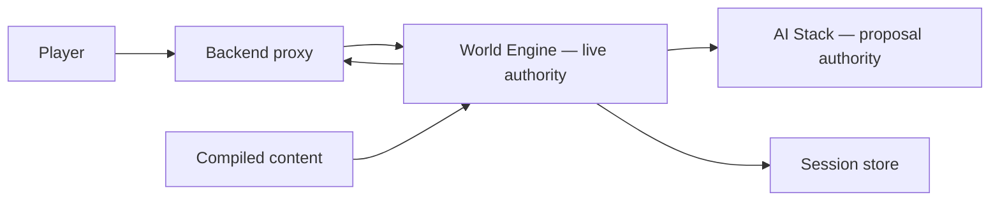

# World Engine — Software Architecture (arc42)

**Scope:** `world-engine/` · **Architecture status:** known violations · **Reconciled commit:** `a1b5db907b0484f8898f5caf3fdc57edd6efb46c`

This SAD describes the World Engine as it is implemented, the rules that are already normative, and the target needed to repair known architectural defects. The labels **Observed**, **Normative**, **Target**, **Violation**, and **Historical** are intentionally not interchangeable.

## 1. Introduction & Goals

World Engine is the sole live-story authority. It coordinates a revision-bound player turn, obtains an uncommitted AI proposal, validates the proposal against committed world truth, persists one accepted outcome, and publishes only post-commit player-visible blocks.

Quality priorities, in order:

1. A rejected or degraded proposal cannot change committed session truth.
2. One turn has one identity and one monotonically advancing revision.
3. AI, backend, and frontend cannot become competing commit authorities.
4. A player-visible result is traceable back to the accepted commit decision.
5. Compatibility paths are named and retired rather than silently treated as peers.

Stakeholders are players, runtime and AI engineers, operators, security owners, and maintainers repairing the current architecture.

## 2. Constraints

- **Normative:** [ADR-0001](../../decisions/ADR-0001-single-live-story-commit-authority.md) assigns the live commit decision to World Engine.
- **Normative:** [ADR-0002](../../decisions/ADR-0002-versioned-turn-envelope.md) requires one revision-bound turn envelope.
- **Normative:** [ADR-0005](../../decisions/ADR-0005-cross-service-turn-trace.md) requires a cross-service trace identity.
- **Observed:** backend calls the story HTTP API through [`GameService`](../../../../backend/app/services/game/game_service.py); it is a proxy, not a story-state owner.
- **Observed:** content is compiled and bound before live execution; authoring is outside this component.
- **Historical:** retired ADRs and MVP documents explain why seams exist but do not override current source or active decisions.

## 3. Context & Scope

| Collaborator | May do | Must not do |
| --- | --- | --- |
| Backend | authenticate, issue a ticket, proxy command/result | decide narrative commit or keep a competing live session |
| AI Stack | retrieve, plan, realize, validate proposal evidence | advance authoritative session revision |
| Content authority | supply immutable compiled content | mutate a live session |
| Frontend | submit intent and render typed blocks | infer committed truth from presentation state |
| World Engine | validate, decide, persist, project | publish speculative output as committed |

In scope are story-session lifecycle, canonical turn orchestration, proposal normalization, commit resolution, session persistence, delivery, and compatibility containment. Account, forum, authoring, provider configuration, and browser presentation are out of scope.

<!-- BEGIN BT-SEMANTIC-DEPTH:3 -->
### Evidence-grounded scope and authority

Authoritative live story runtime coordinating sessions, content, AI proposals, validation, commit, persistence and delivery.

**Authority rule:** World Engine exclusively owns live session state and commit decisions; AI, backend and frontend are collaborators with narrower authority.

**Git/archaeology scope:** `world-engine`, `story_runtime_core`

| Context concern | Model | Boundary statement |
| --- | --- | --- |
| Live authority among player, backend, content and AI proposal collaborators | [World Engine - System Context](../../../../UML/Components/world-engine/components/c4-context.md) | World Engine exclusively owns live session state and commit decisions; AI, backend and frontend are collaborators with narrower authority. |

Historical MVP and work-order material is classified evidence, not an authority source. Current code and accepted decisions win; conflicts remain explicit until a target decision is accepted.
<!-- END BT-SEMANTIC-DEPTH:3 -->

## 4. Solution Strategy

The target architecture is a transaction-shaped turn pipeline:

`ingress → load(base revision) → interpret → propose → validate → decide → persist once → project → deliver`

The transaction is semantic rather than a single database transaction, but it has the same invariant: before the accepted decision there is no authoritative write and no player-visible commit claim. The authoritative source path is documented in the [canonical turn scenario](../../scenarios/canonical-turn.md).

The current implementation is being repaired incrementally. Existing compatibility managers and commit-like AI naming remain visible as violations; they are not elevated into the target design.

## 5. Building Block View

| Block | Location | Responsibility |
| --- | --- | --- |
| HTTP API | `world-engine/world_engine/api/http.py` | Validate story commands and map transport envelopes |
| WebSocket API | `world-engine/world_engine/api/ws.py` | Maintain ordered client delivery without owning commit truth |
| Story runtime manager | `world-engine/world_engine/story_runtime/manager/` | Serialize a command against one session revision |
| Run runtime | `world-engine/world_engine/runtime/manager.py` | Contain template-run compatibility behavior |
| Auth tickets | `world-engine/world_engine/auth/tickets.py` | Verify ticket-bound caller and session context |
| Commit models | `world-engine/world_engine/story_runtime/commit_models.py` | Represent proposal and commit evidence without hidden writes |
| Trace middleware | `world-engine/world_engine/middleware/trace_middleware.py` | Propagate request and turn correlation |
| Engine application | `world-engine/world_engine/` | Own supporting runtime, narrative, content and transport implementation under the narrower blocks above |

### Level 2 — canonical turn collaboration

- [`turn_execution.py`](../../../../world-engine/world_engine/story_runtime/manager/turn_execution.py) owns the serialized orchestration entry.
- [`canonical_turn_lifecycle.py`](../../../../world-engine/world_engine/story_runtime/canonical_turn_lifecycle.py) names ordered phases.
- [`governed_runtime_adapters.py`](../../../../world-engine/world_engine/story_runtime/governed_runtime_adapters.py) is the proposal anti-corruption seam.
- [`narrative_commit_resolution.py`](../../../../world-engine/world_engine/story_runtime/narrative_commit_resolution.py) resolves evidence into an accepted/rejected decision.
- [`story_session_store.py`](../../../../world-engine/world_engine/story_runtime/story_session_store.py) is the revision-safe persistence boundary.
- [`story_ws.py`](../../../../world-engine/world_engine/api/story_ws.py) projects post-commit delivery.

<!-- BEGIN BT-SEMANTIC-DEPTH:5 -->
### Source-bound structural decomposition

Only elements that participate in a container or component view are listed as building blocks. Actors, runtime states, data types and deployment nodes remain in their proper viewpoints instead of being misrepresented as structural decomposition.

| Block | Kind | Responsibility | Contract | Source |
| --- | --- | --- | --- | --- |
| AI Proposal Bridge (`ai_bridge`) | `component` | Request and normalize AI proposal packets | Proposal-only anti-corruption layer | [`world-engine/world_engine/story_runtime/governed_runtime_adapters.py`](../../../../world-engine/world_engine/story_runtime/governed_runtime_adapters.py) |
| Canonical Turn Lifecycle (`lifecycle`) | `component` | Enforce interpret, propose, validate, commit ordering | No render before commit | [`world-engine/world_engine/story_runtime/canonical_turn_lifecycle.py`](../../../../world-engine/world_engine/story_runtime/canonical_turn_lifecycle.py) |
| Commit Resolution (`validation`) | `component` | Validate proposal against world truth and policy | Accepted/rejected decision with evidence | [`world-engine/world_engine/story_runtime/narrative_commit_resolution.py`](../../../../world-engine/world_engine/story_runtime/narrative_commit_resolution.py) |
| Delivery Surfaces (`delivery`) | `component` | Publish committed blocks and state | Post-commit events only | [`world-engine/world_engine/api/story_ws.py`](../../../../world-engine/world_engine/api/story_ws.py) |
| Live Governance (`governance`) | `component` | Apply runtime policy and authority guards | Fail-closed mutation policy | [`world-engine/world_engine/story_runtime/live_governance.py`](../../../../world-engine/world_engine/story_runtime/live_governance.py) |
| Story Session Store (`store`) | `component` | Persist committed state and monotonic revision | Atomic session update | [`world-engine/world_engine/story_runtime/story_session_store.py`](../../../../world-engine/world_engine/story_runtime/story_session_store.py) |
| Turn Execution (`turn`) | `component` | Run the canonical lifecycle for one player command | Exactly one commit or explicit rejection | [`world-engine/world_engine/story_runtime/manager/turn_execution.py`](../../../../world-engine/world_engine/story_runtime/manager/turn_execution.py) |
| Compatibility Runtime (`runtime`) | `container` | Host legacy engine profiles and transitional behavior | Explicitly non-canonical where overlapped | [`world-engine/world_engine/runtime/manager.py`](../../../../world-engine/world_engine/runtime/manager.py) |
| Runtime Observability (`observability`) | `container` | Correlate turn lifecycle and failures | Redacted trace tree | [`world-engine/world_engine/observability/trace.py`](../../../../world-engine/world_engine/observability/trace.py) |
| Session Stores (`persistence`) | `container` | Persist committed session, branches and callbacks | Commit-versioned state | [`world-engine/world_engine/story_runtime/manager/session/manager_init_and_persistence.py`](../../../../world-engine/world_engine/story_runtime/manager/session/manager_init_and_persistence.py) |
| Story API (`api`) | `container` | Expose health, package, session, turn and branching routes | Validated HTTP/WS envelopes | [`world-engine/world_engine/api/http.py`](../../../../world-engine/world_engine/api/http.py) |
| Story Runtime Manager (`manager`) | `container` | Coordinate canonical sessions and turns | Single live authority | [`world-engine/world_engine/story_runtime/manager/runtime_manager.py`](../../../../world-engine/world_engine/story_runtime/manager/runtime_manager.py) |
<!-- END BT-SEMANTIC-DEPTH:5 -->

## 6. Runtime View

### 6.1 Observed primary turn

The backend enters the story route, the manager locks and loads the session, and `_execute_turn_locked` coordinates lifecycle, proposal, finalization, persistence, and delivery. The observed source walk and its target sequence are maintained in [Canonical turn](../../scenarios/canonical-turn.md). The canonical UML is [Primary turn sequence](../../../../UML/Components/world-engine/sequence/primary-turn-sequence.md).

### 6.2 Target success invariant

Given base revision `r`, one accepted result persists revision `r+1`; every response block and trace references that same turn and revision. Delivery happens only after persistence succeeds. Retry of an already accepted idempotency key returns the prior result without a second write.

### 6.3 Target rejection/degradation invariant

Provider failure, invalid proposal, stale base revision, or persistence failure returns an explicit non-commit outcome. Committed revision remains `r`; the system emits diagnostic evidence but neither state nor player-visible commit blocks. The canonical UML is [Degraded turn sequence](../../../../UML/Components/world-engine/sequence/degraded-turn-sequence.md).

### 6.4 Session lifecycle

New sessions become active only after content and actor binding. Active sessions serialize one executing turn. A dependency failure may enter degraded state without revision advance; recovery returns to active at the same revision. Closed sessions reject further turns. See [Session lifecycle](../../../../UML/Components/world-engine/states/session-lifecycle.md).

<!-- BEGIN BT-SEMANTIC-DEPTH:6 -->
### Dynamic viewpoint suite

| Runtime concern | Viewpoint | Model | Modeled interactions |
| --- | --- | --- | ---: |
| End-to-end authoritative turn from player intent to committed event | `sequence` | [World Engine - Primary Turn](../../../../UML/Components/world-engine/sequence/primary-turn-sequence.md) | 10 |
| Provider or validation failure preserves committed truth | `sequence` | [World Engine - Degraded Turn](../../../../UML/Components/world-engine/sequence/degraded-turn-sequence.md) | 6 |
| Decision points between proposal, rejection, commit and delivery | `activity` | [World Engine - Canonical Turn Activity](../../../../UML/Components/world-engine/activity/canonical-turn-activity.md) | 6 |
| Session creation, serialized turns, degradation, recovery and closure | `state` | [World Engine - Session Lifecycle](../../../../UML/Components/world-engine/states/session-lifecycle.md) | 8 |

The ordered sequence/activity relationships and state transitions are validated against the catalog. A sequence or activity view must form one connected runtime path; a list of unrelated calls does not qualify as an end-to-end scenario. Generic arrows such as "evidence for boundary" are not accepted as runtime semantics.
<!-- END BT-SEMANTIC-DEPTH:6 -->

## 7. Deployment View

World Engine runs as one Python service behind backend-internal HTTP and ticketed WebSocket boundaries. It calls AI proposal code through an adapter and writes session state through its configured store. Deployment does not redefine authority: in-process AI code remains proposal-only, and a remote store remains persistence infrastructure rather than a decision maker.

The complete topology, trust boundaries, protocols, and ownership are in [Deployment topology](../../data/deployment-topology.md) and [World Engine deployment UML](../../../../UML/Components/world-engine/deployment/world-engine-deployment.md).

Operational configuration must make store location, internal service authentication, AI mode, and tracing behavior explicit. A fallback adapter is a degraded operating mode, not evidence of a successful live turn.

<!-- BEGIN BT-SEMANTIC-DEPTH:7 -->
### Deployment and operational boundary evidence

| Concern | Model | Nodes / stores |
| --- | --- | --- |
| Client boundary, authoritative service, AI collaborator and session persistence | [World Engine - Deployment](../../../../UML/Components/world-engine/deployment/world-engine-deployment.md) | Backend/Browser Clients, World Engine Process, AI Runtime, Session Persistence |

A deployment boundary is not inferred from a directory. Process, store, transport and trust contracts must be named by a deployment view or delegated to an owning SAD.
<!-- END BT-SEMANTIC-DEPTH:7 -->

## 8. Crosscutting Concepts

### Authority and consistency

World Engine decides live story truth. Optimistic concurrency checks the base revision. Persistence returns an explicit outcome. A post-commit projection may be rebuilt from committed state; it may not invent a commit.

### Turn envelope

The target envelope carries identity (`turn_id`, `session_id`, idempotency key), version (`base_revision`, `committed_revision`), causality (`trace_id`, parent request), input, proposal, validation, decision, persistence outcome, and typed player-visible blocks. Field ownership is defined in [Data ownership](../../data/data-ownership.md).

### Failure semantics

Errors are typed by phase. A failure before persistence is `not_committed`; an ambiguous store response is not reported as success; delivery failure after commit is recoverable by replay from the committed revision.

### Observability and security

Traces carry identifiers and decisions, never secrets or unrestricted player payloads. Internal calls are authenticated, and player ownership is checked before session access.

### Session language

Input and output language are session-bound turn-envelope fields. Translation may normalize or
realize text, but it must preserve semantic intent, provenance, and the committed block type; a
translation adapter cannot create a separate decision path. Source and target language are
compared explicitly; English has no special skip semantics. See
[ADR-0008](../../decisions/ADR-0008-module-language-boundaries.md).

### Narrative governance

World Engine owns validation, atomic state mutation and revision. It does not own the selection of
prose or force a canonical beat merely because a free action left the canonical pointer unchanged.
The module/profile narrative mode is carried into planning and compatibility output. In bounded
emergence the canonical path is a reference arc; hard world and actor-lane invariants remain
mandatory. See [ADR-0007](../../decisions/ADR-0007-bounded-emergent-narration.md).

<!-- BEGIN BT-SEMANTIC-DEPTH:8 -->
### Explicit interaction and dependency contracts

| From | To | Semantics | Contract | Evidence |
| --- | --- | --- | --- | --- |
| AI Proposal Bridge | Commit Resolution | returns candidate | proposal plus evidence | [`world-engine/world_engine/story_runtime/narrative_commit_resolution.py`](../../../../world-engine/world_engine/story_runtime/narrative_commit_resolution.py) |
| Story API | Story Runtime Manager | delegates story operation | validated command | [`world-engine/world_engine/api/http_routes/story_turn_routes.py`](../../../../world-engine/world_engine/api/http_routes/story_turn_routes.py) |
| CommitDecision | StorySession | advances when accepted | monotonic revision | [`world-engine/world_engine/story_runtime/story_session_store.py`](../../../../world-engine/world_engine/story_runtime/story_session_store.py) |
| Live Governance | AI Proposal Bridge | requests bounded proposal | proposal-only | [`world-engine/world_engine/story_runtime/governed_runtime_adapters.py`](../../../../world-engine/world_engine/story_runtime/governed_runtime_adapters.py) |
| Canonical Turn Lifecycle | Live Governance | checks authority and policy | fail closed | [`world-engine/world_engine/story_runtime/live_governance.py`](../../../../world-engine/world_engine/story_runtime/live_governance.py) |
| Story Runtime Manager | Runtime Observability | emits lifecycle evidence | trace-correlated spans | [`world-engine/world_engine/observability/trace.py`](../../../../world-engine/world_engine/observability/trace.py) |
| Story Runtime Manager | Session Stores | loads and stores session | revision-safe transaction | [`world-engine/world_engine/story_runtime/story_session_store.py`](../../../../world-engine/world_engine/story_runtime/story_session_store.py) |
| NarrativeProposal | CommitDecision | is resolved as | validation evidence | [`world-engine/world_engine/story_runtime/narrative_commit_resolution.py`](../../../../world-engine/world_engine/story_runtime/narrative_commit_resolution.py) |
| Compatibility Runtime | Story Runtime Manager | adapts supported legacy paths | explicit compatibility seam | [`world-engine/world_engine/runtime/manager.py`](../../../../world-engine/world_engine/runtime/manager.py) |
| StorySession | NarrativeProposal | bounds evaluation | base revision | [`world-engine/world_engine/story_runtime/commit_models.py`](../../../../world-engine/world_engine/story_runtime/commit_models.py) |
| Story Session Store | Delivery Surfaces | publishes committed result | post-commit only | [`world-engine/world_engine/api/story_ws.py`](../../../../world-engine/world_engine/api/story_ws.py) |
| Turn Execution | Canonical Turn Lifecycle | executes canonical phases | ordered lifecycle | [`world-engine/world_engine/story_runtime/canonical_turn_lifecycle.py`](../../../../world-engine/world_engine/story_runtime/canonical_turn_lifecycle.py) |
| Commit Resolution | Story Session Store | commits accepted delta | atomic revision or no write | [`world-engine/world_engine/story_runtime/story_session_store.py`](../../../../world-engine/world_engine/story_runtime/story_session_store.py) |
<!-- END BT-SEMANTIC-DEPTH:8 -->

## 9. Architecture Decisions

The active cross-system decisions live in the [ADR index](../../decisions/README.md). The D-identifiers below preserve local lineage expected by existing evidence bindings; they are a compact correspondence index, not an embedded ADR archive.

### D1: World Engine owns live story commit authority

**Status:** Accepted; implementation contains known violations
**Origin:** retired ADR lineage and Git history

Apply [ADR-0001](../../decisions/ADR-0001-single-live-story-commit-authority.md). Backend and AI may collaborate but cannot advance the authoritative session. Current violations and closure evidence are tracked as [AR-V001](../../violations/README.md#ar-v001-proposal-finalization-resembles-a-second-commit) and [AR-V005](../../violations/README.md#ar-v005-oversized-finalization-seam).

### D2: AI results remain proposals until World Engine accepts them

**Status:** Accepted; terminology migration incomplete
**Origin:** `5bb589e9`, retired proposal-only ADR

The AI boundary returns a candidate plus evidence. Commit-like names in the AI executor are historical implementation residue and must not be interpreted as authority. Evidence anchors are [`governed_runtime_adapters.py`](../../../../world-engine/world_engine/story_runtime/governed_runtime_adapters.py) and [`executor_validation_commit.py`](../../../../ai_stack/langgraph/runtime_executor/executor_validation_commit.py).

### D4: Realization is subordinate to the canonical turn

**Status:** Accepted
**Origin:** Director thin-path implementation lineage

Retrieval, Director planning, narrator realization, and validation execute inside the proposal phase. They may enrich the proposal but may not bypass commit resolution or publish visible blocks directly. See [ADR-0001](../../decisions/ADR-0001-single-live-story-commit-authority.md).

### D5: One canonical lifecycle and one persistence edge

**Status:** Accepted; refactoring in progress
**Origin:** `7959c848` PersistOutcome and manager unsharding

Every live story command follows the lifecycle documented in §6. Compatibility paths must delegate to it or be explicitly retired. `_finalize_committed_turn` is currently too broad; [AR-V005](../../violations/README.md#ar-v005-oversized-finalization-seam) records the intended split and proof needed for closure.

### D6: Actor and situation changes are committed data

**Status:** Accepted
**Origin:** W5 actor-tracking lineage

Actor location, presence, situation, and consequence changes are part of the revisioned outcome rather than UI-only state. They must pass validation and persist atomically with the narrative decision. [`commit_models.py`](../../../../world-engine/world_engine/story_runtime/commit_models.py) is the contract anchor.

### D14: Semantic player input enters once

**Status:** Accepted; cross-boundary proof incomplete
**Origin:** semantic-input ingress implementation

Free player intent is normalized once at the canonical ingress and remains attributable throughout proposal, decision, and trace evidence. Choice compatibility may adapt to that contract but cannot create a second turn path. Closure depends on [ADR-0002](../../decisions/ADR-0002-versioned-turn-envelope.md).

<!-- BEGIN BT-SEMANTIC-DEPTH:9 -->
### Decision-to-view correspondence

| Decision(s) | Concern | Viewpoint | Model |
| --- | --- | --- | --- |
| `D1`, `D4` | Live authority among player, backend, content and AI proposal collaborators | `context` | [World Engine - System Context](../../../../UML/Components/world-engine/components/c4-context.md) |
| `D1`, `D5` | API, canonical manager, compatibility runtime, persistence and observability | `container` | [World Engine - Runtime Containers](../../../../UML/Components/world-engine/components/c4-container.md) |
| `D1`, `D4`, `D6` | Canonical interpret, govern, propose, validate, commit and delivery seams | `component` | [World Engine - Turn Components](../../../../UML/Components/world-engine/components/c4-component.md) |
| `D1`, `D4` | End-to-end authoritative turn from player intent to committed event | `sequence` | [World Engine - Primary Turn](../../../../UML/Components/world-engine/sequence/primary-turn-sequence.md) |
| `D5`, `D14` | Provider or validation failure preserves committed truth | `sequence` | [World Engine - Degraded Turn](../../../../UML/Components/world-engine/sequence/degraded-turn-sequence.md) |
| `D1`, `D4`, `D6` | Decision points between proposal, rejection, commit and delivery | `activity` | [World Engine - Canonical Turn Activity](../../../../UML/Components/world-engine/activity/canonical-turn-activity.md) |
| `D5`, `D6` | Session creation, serialized turns, degradation, recovery and closure | `state` | [World Engine - Session Lifecycle](../../../../UML/Components/world-engine/states/session-lifecycle.md) |
| `D1`, `D4` | Session truth, uncommitted proposal and explicit commit decision | `class` | [World Engine - Commit Data Model](../../../../UML/Components/world-engine/classes/commit-data-model.md) |
| `D1`, `D5` | Client boundary, authoritative service, AI collaborator and session persistence | `deployment` | [World Engine - Deployment](../../../../UML/Components/world-engine/deployment/world-engine-deployment.md) |

The correspondence is intentionally many-to-many: one decision may require structural, dynamic, data and deployment evidence, and one model may make several decisions analyzable together.
<!-- END BT-SEMANTIC-DEPTH:9 -->

## 10. Quality Requirements

| ID | Scenario | Measurable response |
| --- | --- | --- |
| WE-Q1 | Validation rejects a proposal | revision and store checksum remain unchanged; no committed delivery block |
| WE-Q2 | Two commands target base revision `r` | at most one advances to `r+1`; the other receives a typed conflict |
| WE-Q3 | Delivery disconnects after commit | reconnect replays `r+1` without executing or persisting again |
| WE-Q4 | A turn crosses backend, World Engine, and AI | all evidence is joinable by one `trace_id` and `turn_id` |
| WE-Q5 | Fallback/mock adapter runs | result is explicitly degraded and never counted as successful live realization |
| WE-Q6 | Architecture evidence is regenerated | unmapped source remains visible and does not inflate representation coverage |

## 11. Risks & Technical Debt

The authoritative register is [Architecture violations](../../violations/README.md). World Engine is directly affected by:

- **AR-V001:** AI code still exposes commit-like proposal finalization.
- **AR-V002:** the versioned turn envelope is not proven across every boundary.
- **AR-V005:** `_finalize_committed_turn` concentrates validation, mutation, persistence, and projection concerns.
- **AR-V006:** trace identity is not yet uniformly propagated.
- **AR-V007:** duplicate historical UML files can create parallel truths until removed.

These are current-state defects with target and closure criteria. Their presence does not invalidate source evidence; it invalidates a claim that observed implementation already conforms to the target architecture.

<!-- BEGIN BT-SEMANTIC-DEPTH:11 -->
### Git-grounded drift profile

The engine contains both world_engine/story_runtime and world_engine/runtime generations plus manager decompositions and legacy surfaces. Models make the canonical turn path, compatibility seams and commit authority testable.

| Tracked files | Lifetime commits | Recent path touches | Recent renames |
| ---: | ---: | ---: | ---: |
| 430 | 353 | 1595 | 13 |

| Drift claim | Status | Concern | Target direction |
| --- | --- | --- | --- |
| `DRIFT-001` | `confirmed_current` | Competing live-runtime structures | Keep live_story_session and live_run_instance as distinct resources with one sink each; retire overlapping commit authority from app/runtime into named adapters only. |
| `DRIFT-002` | `conflicting` | Proposal finalization is named and shaped like a second commit | Define an explicit ProposalDecision/ValidatedProposal contract. Rename AI-internal commit concepts to proposal finalization; reserve CommitDecision and committed state for world-engine. |
| `DRIFT-003` | `open_target` | Dramatic planner state survival through authoritative commit | Use one versioned turn envelope from planner selection through proposal, validation, CommitDecision, committed dramatic context and player projection. Every narrowing step must be explicit and tested. |
| `DRIFT-004` | `conflicting` | Authored content truth has several executable projections | Keep YAML modules as authored truth, generate or validate a versioned compiled content contract once, and make world-engine/AI consumers read that contract through anti-corruption adapters. |
| `DRIFT-005` | `open_target` | Beat and canonical-path authority in the live turn | Model authored canonical constraints separately from live beat state. World-engine owns live progression; AI may propose beat effects; frontend displays only committed player-safe projections. |
| `DRIFT-006` | `open_target` | Manager decomposition contains generated-looking and legacy shards | Replace dynamic legacy assembly with explicit cohesive modules organized by session lifecycle, turn execution, commit, projection and observability. Preserve behavior through characterization tests before each deletion. |
| `DRIFT-007` | `open_target` | Player surface can flatten upstream runtime intelligence | Adopt one player-visible block schema versioned at the world-engine delivery boundary. Frontend rendering is exhaustive over block variants and may not infer missing authority fields. |
| `DRIFT-008` | `open_target` | Observability contracts are fragmented across services | Define a minimal TurnTrace contract with propagated identity, owned spans, explicit gaps and redaction. Each service adapts locally but must satisfy the shared trace tree. |

[Git/archaeology baseline](../../evidence/architecture-drift-baseline.md) · [Drift reconciliation and target directions](../../evidence/architecture-drift-reconciliation.md)

These entries are review inputs, not automatic design decisions. Conflicting/open items close only through accepted target decisions and the listed behavioral evidence.
<!-- END BT-SEMANTIC-DEPTH:11 -->

## 12. Glossary

| Term | Meaning |
| --- | --- |
| proposal | uncommitted candidate produced by AI/runtime collaboration |
| commit decision | World Engine acceptance or rejection with evidence |
| committed revision | monotonic session version after successful persistence |
| projection | transport- or UI-oriented view derived from committed truth |
| degraded turn | explicit failure/recovery outcome with no speculative write |
| compatibility path | temporary adapter that delegates to, but does not rival, the canonical path |
| observed | behavior supported by current source evidence |
| target | intended repair direction not yet fully implemented |
| violation | known mismatch between observed and normative/target architecture |
