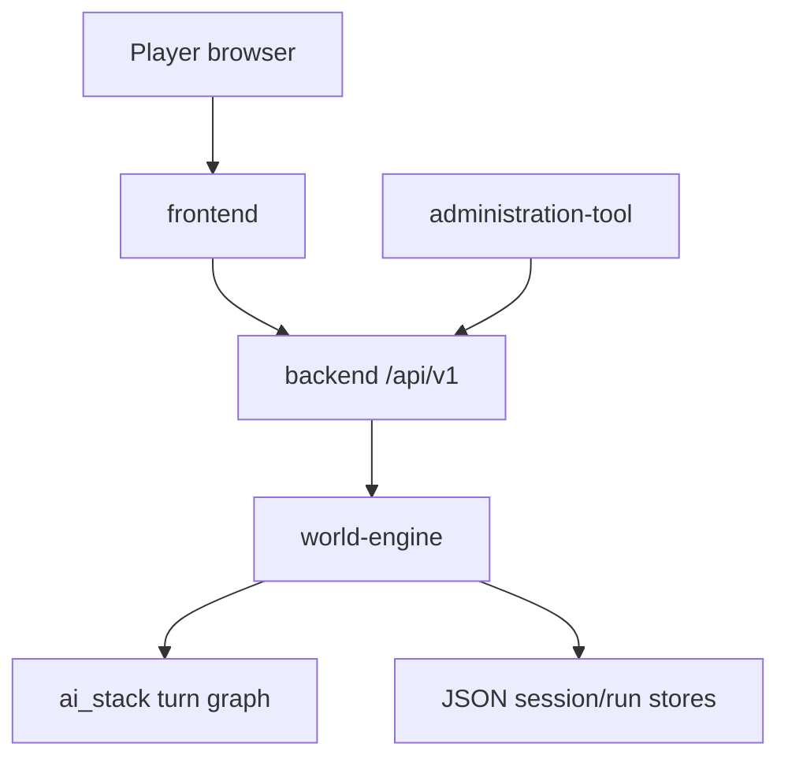

# world-engine — Software Architecture (arc42)

**Component:** world-engine · **Folder:** `world-engine/` · **Status:** `internal`  
**Last reconciled to code:** `2026-06-23`

## 1. Introduction & Goals

The world-engine play service is the FastAPI application that hosts **authoritative live runtime state**
for World of Shadows. When a story session is live, this process owns what actually happened: scene
identity, turn count, committed consequences, and diagnostics—not merely what a model proposed or what
a database row stores for platform marketing.

The service exposes two cooperating runtime faces inside one process: **template/run runtime**
(lobbies, WebSocket commands, snapshots) and **story narrative runtime** (HTTP story API, turn graph,
narrative commits). Both share ticket verification and trace middleware but serve different player
questions.

### 1.1 Quality goals

| Goal | Scenario |
| --- | --- |
| Single commit authority | A turn that fails validation leaves committed state unchanged; no backend mirror overrides engine truth |
| Observable live path | Operators can trace `world-engine.turn.execute` and prove adapter kind vs visible output |
| Thin-path realization | Ordinary player movement routes through Director → model realization in session output language |
| Recoverable degradation | Mock/fallback adapters mark `live_success=false` without corrupting canon |

### 1.2 Stakeholders

| Stakeholder | Concern |
| --- | --- |
| Player | Consistent live session via backend bootstrap + play WebSocket/HTTP |
| Runtime engineer | Clear module boundaries between `app/runtime/*` and `app/story_runtime/*` |
| AI engineer | Stable seams for `ai_stack.RuntimeTurnGraphExecutor` without commit leakage |
| Operator | Diagnostics HTTP, Langfuse traces, internal API key routes |

## 2. Constraints

- Governed by [Ecosystem Topology SAD](../../project/ecosystem-topology/architecture.md) and [Governance SAD](../../project/governance/architecture.md).
- Backend must proxy play operations; it must not host competing commit logic ([ADR-0002](../../../archive/adr-retired-2026/adr-0002-backend-session-surface-quarantine.md)).
- AI output is proposal-only until validator approval ([ADR-0004](../../../archive/adr-retired-2026/adr-0004-runtime-model-output-proposal-only-until-validator-approval.md)).
- GoC turn semantics: [`CANONICAL_TURN_CONTRACT_GOC`](../../../MVPs/MVP_VSL_And_GoC_Contracts/CANONICAL_TURN_CONTRACT_GOC.md) remains normative slice contract.
- Shared secret ticket contract documented in [`world-engine/README.md`](../../../../world-engine/README.md).

## 3. Context & Scope



Authoritative diagrams: [C4 context](../../../../UML/Components/world-engine/components/c4-context.md) · [Use cases](../../../../UML/Components/world-engine/components/c4-context.md)

### 3.1 In / out of scope

| In scope | Out of scope |
| --- | --- |
| `StoryRuntimeManager.execute_turn`, narrative commit resolution | Account auth, forum, wiki persistence |
| `RuntimeManager` + WebSocket `/ws` template runs | Content YAML authoring |
| Ticket verification, trace middleware | Admin UI rendering |
| Internal `/api/story/*` story session API | Direct player marketing HTML |

## 4. Solution Strategy

- Host both run and story managers in one FastAPI lifespan ([`world-engine/app/main.py`](../../../../world-engine/app/main.py)).
- Delegate turn orchestration to `ai_stack` graph executor; keep validate/commit/render seams in engine modules.
- Persist story sessions and run artifacts to configured JSON store directories.
- Expose diagnostics and state over HTTP for backend proxy and operator tooling.
- Use thin Director realization path for default player turns ([ADR-0062](../../../archive/adr-retired-2026/adr-0062-director-realization-thin-path.md)).

## 5. Building Block View

| Block | Location | Role |
| --- | --- | --- |
| HTTP API | `app/api/http.py` | Story session REST, internal API key |
| WebSocket API | `app/api/ws.py`, `app/api/story_ws.py` | Live run + story WS loops |
| Story runtime manager | `app/story_runtime/manager/` | In-memory `StorySession` map, `execute_turn` |
| Run runtime | `app/runtime/manager.py`, `app/runtime/engine.py` | Template instances, snapshots, transcripts |
| Auth tickets | `app/auth/tickets.py` | Shared-secret websocket tickets |
| Commit models | `app/story_runtime/commit_models.py` | Narrative commit records |
| Trace middleware | `app/middleware/trace_middleware.py` | Request/turn correlation |

Authoritative: [C4 container](../../../../UML/Components/world-engine/components/c4-container.md) · [C4 component](../../../../UML/Components/world-engine/components/c4-component.md)

## 6. Runtime View

### 6.1 Story turn (happy path)

Player input reaches backend, which forwards to world-engine story API. `StoryRuntimeManager` loads
session state, invokes the LangGraph executor in `ai_stack`, runs validate/commit seams, persists
delta, returns visible blocks and diagnostics.

Authoritative: [Primary turn sequence](../../../../UML/Components/world-engine/sequence/world-engine-primary-turn-sequence.md)

### 6.2 Degraded adapter path

When the adapter is mock, fallback, or placeholder, live success gates mark degradation without
writing false canon. Opening leniency may approve diagnostic commits with explicit signals.

Authoritative: [Degraded turn sequence](../../../../UML/Components/world-engine/sequence/world-engine-degraded-turn-sequence.md)

### 6.3 Session lifecycle

Story sessions move through creation, active play, terminal/end, and eviction from the in-memory map
according to manager policies.

Authoritative: [Story session states](../../../../UML/Components/world-engine/states/world-engine-story-session-states.md)

## 7. Deployment View

- Process: `uvicorn app.main:app` from `world-engine/` (see README).
- Env: `PLAY_SERVICE_SECRET`, store dirs (`STORY_SESSION_STORE_DIR`, `RUN_STORE_DIR`, …), optional `PLAY_SERVICE_INTERNAL_API_KEY`.
- CI: `pip install -r world-engine/requirements-dev.txt`; tests import repo-root `ai_stack`.
- Docker: composed with backend via `docker-up.py` ([ADR-0030](../../../archive/adr-retired-2026/adr-0030-docker-up-complete-bootstrap.md)).

## 8. Crosscutting Concepts

- **Tracing:** Langfuse spans on turn execute; player input length/hash on spans ([ADR-0033](../../../archive/adr-retired-2026/adr-0033-live-runtime-commit-semantics.md)).
- **Validation strategies:** `OutputValidatorConfig` / `ValidationStrategy` in narrative package loader path.
- **Preview isolation:** `PreviewIsolationRegistry` keeps preview sessions off active runtime ([ADR-0013](../../../archive/adr-retired-2026/adr-0013-preview-sessions-isolated-from-active-runtime.md) — partial).
- **Locale:** Session output language drives visible realization ([ADR-0036](../../../archive/adr-retired-2026/adr-0036-player-session-output-language.md)).

## 9. Architecture Decisions

| ID | Title | Status | Migrated from |
| --- | --- | --- | --- |
| D1 | Runtime authority in world-engine | Accepted | ADR-0001 |
| D2 | Proposal-only AI until validator approval | Accepted | ADR-0004 |
| D3 | Live runtime commit semantics | Partially implemented | ADR-0033 |
| D4 | Director realization thin path | Accepted | ADR-0062 |
| D5 | Canonical turn lifecycle (single commit path) | Partially implemented | ADR-0038 |
| D6 | W5 actor tracking and player view | Accepted (partial) | ADR-0069, ADR-0070 |
| D7 | Scene identity canonical surface | Accepted | ADR-0003 |
| D8 | Validation failures degrade gracefully | Accepted | ADR-0011 |
| D9 | Persist TurnExecutionResult and AIDecisionLog | Accepted | ADR-0015 |
| D10 | Player session output language | Accepted | ADR-0036 |
| D11 | Explicit configurable validation strategy | Accepted | ADR-0008 |
| D12 | Preview session isolation | Not Finished | ADR-0013 |
| D13 | Story opening economy and warmup | Accepted | ADR-0035 |

### D1: Runtime authority in world-engine

**Status:** 
**Origin:** ADR-0001 (retired 2026-06-23)

**Context.** World of Shadows split **platform API / governance** from **live narrative execution**. Without a single authoritative runtime host, duplicate business logic and conflicting session state would emerge across Flask backends and experimental paths.

**MVP narrative governance (historical index):** Runtime must consume only **approved compiled packages**; raw authored source, research outputs, and draft patches are never read directly by live runtime execution. Preview builds are first-class; rollback is feasible; promotion is a formal act. (Source: [`02_architecture_decisions.md`](../../../MVPs/MVP_Narrative_Governance_And_Revision_Foundation/02_architecture_decisions.md) — index only; **this ADR is normative** for authority placement.)

**Decision.** 1. **`world-engine` (play service)** is the **authoritative runtime host** for story sessions: lifecycle, turn execution, and runtime-side session persistence model.
2. **`backend`** remains responsible for content curation, publishing controls, review/moderation workflows, policy validation, and admin/operator diagnostics integration - **not** for hosting canonical player HTML or re-implementing committed turn logic.
3. **`story_runtime_core`** holds shared interpretation, registry/adapters, and reusable models consumed by the play service.
4. **AI output** remains **non-authoritative proposal data** until validated and committed by runtime seams (see `docs/MVPs/MVP_VSL_And_GoC_Contracts/CANONICAL_TURN_CONTRACT_GOC.md` for GoC specifics).
5. Governance evidence for a session is keyed by the World-Engine
   story-session id. A missing story session is represented as
   `world_engine_story_session_not_found`; backend-local `SessionState`
   lookups are not a fallback authority.

**Consequences.** **Positive**

- Clear seam for engineering ownership and on-call triage.
- Enables MCP and admin tooling without conflating them with committed play state.

**Negative / risks**

- Requires careful **proxy and secret** configuration between backend and play service.
- Transitional backend paths must be **explicitly labeled** deprecated until removed.

**Follow-ups**

- Track removal of transitional in-process runtime shims as documented in `runtime_authority_decision.md`.
- Keep ADR synchronized if authority shifts (supersede rather than silently edit).

**Implementation status.** **Implemented — matches ADR.**

- `world-engine/app/story_runtime/manager/` (`StoryRuntimeManager`) is the single authoritative runtime host for story sessions, turn execution, and session lifecycle.
- `backend/app/api/v1/game_routes.py` proxies to world-engine; no competing session commit logic exists in the backend layer.
- Backend AI-stack session evidence bundles resolve evidence through
  `game_service.get_story_state` / `get_story_diagnostics` for the
  World-Engine story-session id; they do not consult removed backend runtime
  sessions.
- `story_runtime_core` provides shared interpretation and registry/adapters consumed by the play service.
- AI output proposal-only contract enforced: validation + commit seams in `world-engine/app/api/http.py`.
- Governance investigation confirms: `CTR-ADR-0001-RUNTIME-AUTHORITY` implemented by `world-engine/app/story_runtime/manager/` and `world-engine/app/api/http.py`, validated by `world-engine/tests/test_story_runtime_api.py`.
- Supersedes ADR-0021 (stub, moved to `docs/ADR/legacy/`).

**Testing.** - **Documentation / review:** cross-check against [`runtime-authority-and-state-flow.md`](../../../technical/runtime/runtime-authority-and-state-flow.md) and [`runtime-authority-and-session-lifecycle.md`](../../../dev/architecture/runtime-authority-and-session-lifecycle.md).
- **Code anchors:** `StoryRuntimeManager` and play-service session lifecycle paths in `world-engine/` must remain the only authority for committed play; flag any new backend “truth” writes in review.
- **Failure mode:** duplicated session commit paths or Flask-hosted canonical play without an ADR amendment.

**Evidence.** `docs/architecture/project/components/world-engine/architecture.md#d1-runtime-authority-in-world-engine` (archived — see `docs/archive/adr-retired-2026/`)

### D2: Runtime model output is proposal-only until validator approval

**Status:** 
**Origin:** ADR-0004 (retired 2026-06-23)

**Decision.** The model may suggest narrative text, triggers, and effects. No suggestion is authoritative until output validation and engine legality checks pass.

**Consequences.** - the model cannot silently mutate truth
- blocked turns are first-class
- commit logic remains engine authority

**Implementation status.** **Implemented — principle enforced throughout the runtime.**

- Model output is treated as a proposal in `world-engine/app/story_runtime/manager/` (LangGraph graph execution → validation seam → commit seam).
- `world-engine/app/api/http.py` enforces the proposal → validation → commit pipeline for every turn.
- `ai_stack/story_runtime/live_runtime_commit_semantics.py` formalizes `live_success` computation separating "commit_applied" from proof of real generation.
- ADR-0033 (Live Runtime Commit Semantics) extends this principle with specific fields (`adapter_kind`, `live_success`, `validation_status` provenance) — the two ADRs are complementary.
- Blocked turns are first-class: degradation markers and `quality_class=degraded` propagate when validation fails.

**Testing.** Contract / unit coverage as cited in **References**; extend this section when a dedicated gate exists. Revisit this ADR if enforcement drifts or the decision is bypassed in code review.

**Evidence.** `docs/architecture/project/components/world-engine/architecture.md#d2-runtime-model-output-is-proposal-only-until-validator-approval` (archived — see `docs/archive/adr-retired-2026/`)

### D3: Live Runtime Commit Semantics for Real AI, Mock, Fallback, and Visible Story Output

**Status:** ** Accepted — **Absorbed into** [world-engine SAD D3](architecture.md#d3-live-runtime-commit-semantics-for-real-ai-mock-fallback-and-visible-story-output) (partial; open gaps documented there).
**Origin:** ADR-0033 (retired 2026-06-23)

**Context.** The current World of Shadows live story path is instrumented with Langfuse tracing, but recent runtime evidence shows that tracing presence does not prove that a real live story turn happened.

Observed local traces show the following pattern:

```text
world-engine.turn.execute
route=True
invoke=True
fallback_used=True
model=openai_gpt_5_4_nano
adapter=mock
quality=degraded
degradation=fallback_used
```

The same turn trace contains a model invocation phase that reports success while using a mock adapter:

```text
story.phase.model_invoke
called=True
attempted=True
success=True
adapter=mock
api_model=unknown
error=none
parser_error=none
inputUsage=0
outputUsage=0
totalUsage=0
```

The commit phase can still report that a commit was applied:

```text
story.phase.commit
called=True
commit_applied=True
quality=degraded
degradation=fallback_used
```

Session creation traces also show the presence of runtime phases such as `story.phase.narrator`, `story.phase.model_invoke`, `story.phase.validation`, and `story.phase.commit`, but with empty `input`, empty `output`, empty `metadata`, empty status messages, no prompt/model data, and zero usage. This indicates that the system can produce observability spans without proving that an actual narrator opening or visible story output was generated.

This creates a false-green risk:

```text
Trace exists
Route exists
Invoke phase exists
Validation approved
Commit applied
```

None of the above is sufficient proof of a real live story turn if the turn used a mock adapter, fallback-only output, empty generation output, or no frontend-visible story content.

---

**Decision.** For governed live story runtime, a story turn is considered **live-successful** only when all of the following are true:

1. The runtime profile resolves to a valid runtime/content binding.
2. The selected player role is bound to `human_actor_id`.
3. The selected human actor is excluded from AI-authored speech/action generation.
4. A real non-mock model adapter is used.
5. The model invocation produces non-empty structured narrative output.
6. The produced output is validated by the engine.
7. The engine commits the approved output.
8. The commit creates non-empty frontend-visible story output.
9. Diagnostics and Langfuse expose enough evidence to distinguish live, mock, fallback, degraded, and empty paths.

Therefore:

```text
Tracing presence is not live proof.
Routing success is not live proof.
Mock invocation success is not live proof.
Fallback completion is not live proof.
Validation approval alone is not live proof.
Commit applied alone is not live proof.
A live turn is proven only by real non-mock generation, approved engine commit, and visible story output.
```

---

**Consequences.** ### 8.1 Positive consequences

- Prevents false-green live runtime tests.
- Makes Langfuse traces useful for runtime truth instead of only span presence.
- Separates diagnostic/test execution from real live story execution.
- Makes degraded fallback behavior explicit and visible.
- Forces session creation to produce a real opening or fail/hold honestly.
- Gives the frontend a reliable readiness contract.
- Protects the `AI Proposal ≠ Engine Truth` boundary.

### 8.2 Negative consequences

- Some currently green tests may fail because they rely on mock/fallback success.
- Local development may need an explicit preview/test mode to allow mock commits.
- Live mode may fail closed more often until provider credentials, routing, and output contracts are fixed.
- Diagnostics payloads and Langfuse metadata will become larger.
- Frontend/backend contract tests must be stricter.

### 8.3 Migration consequences

Existing tests and runtime paths that treat these as success must be updated:

```text
adapter=mock + success=True
fallback_used=True + quality=healthy
commit_applied=True + visible_output_count=0
validation=approved + generated_output_present=false
session.create + no opening + frontend ready
trace exists + no real generation observation
```

---

**Implementation status.** **Core semantic gate implemented; some diagnostics fields and frontend contracts still in progress.**

**Implemented:**
- `ai_stack/story_runtime/live_runtime_commit_semantics.py`: `evaluate_live_turn_success_gate()` computes `live_success`, `adapter_kind`, `visible_output_present`, `visible_output_count`, `quality_class`, `degradation_signals` per ADR definitions.
- `adapter_kind` classification: `real`, `mock`, `fallback`, `placeholder`.
- Mock and fallback paths set `live_success=false`; `opening_leniency_approved=True` marks degraded diagnostic commits.
- §13.5 (Langfuse trace-level scores): `LangfuseAdapter.add_score` emits scores both at observation level and trace level via `create_score(trace_id=...)`. Regression guard in `world-engine/tests/test_trace_middleware.py`.
- §13.6 (player input observability): `player_input_length` and `player_input_sha256` on `backend.turn.execute` (Backend) and `world-engine.turn.execute` spans. Regression guards in `backend/tests/test_game_routes.py`, `backend/tests/test_session_routes.py`, `world-engine/tests/test_trace_middleware.py`.

**Not yet fully implemented:**
- Not all required diagnostic fields from §6 are present on every trace (some are partial depending on adapter/provider path).
- Frontend does not yet fully enforce all §7 readiness states (ready_with_opening vs. creating_opening vs. blocked_missing_opening) — see ADR-0034 for shell contract.
- Hard gate tests (§10) are defined but not all paths covered.
- **Project:** World of Shadows
- **Decision owner:** Runtime / AI / Observability maintainers
- **Related areas:** World-Engine, Backend, AI Stack, LangGraph/LangChain, Langfuse, Frontend Player Shell, Narrative Governance
- **Related ADR:** [ADR-0034](../../../archive/adr-retired-2026/adr-0034-player-facing-narrative-shell-contract.md) — player shell / MVP5 presentation contract (orthogonal to commit semantics)
- **Related ADR (proposed):** [ADR-0038](../../../archive/adr-retired-2026/adr-0038-canonical-turn-lifecycle-single-commit-path.md) — single canonical turn lifecycle and commit/persist/project path (must not weaken §5–§7 semantics here)
- **Supersedes:** None
- **Superseded by:** None

---

**Evidence.** `docs/architecture/project/components/world-engine/architecture.md#d3-live-runtime-commit-semantics-for-real-ai-mock-fallback-and-visible-story-output` (archived — see `docs/archive/adr-retired-2026/`)

### D4: Director Realization Thin Path (Resolver → Director → Narrator)

**Status:** 
**Origin:** ADR-0062 (retired 2026-06-23)

**Context.** Live traces (2026-05-18/19) showed that mundane German player movement (“Gehe in die Küche”, “Ich gehe ins Bad”) produced English bleed from `scene_affordance_model.description` via a deterministic short path (`authoritative_action_resolution`) that bypassed the Director and LLM realization. Questions routed to `full_pipeline` could fail with `dramatic_irony_hidden_fact_echo` after the fact.

The product requirement is fixed: **Resolver classifies and translates; Director composes what to realize; Narrator/Actor-Line realizes in `session_output_language`.** No binary router between “short path” and “full monolithic pipeline” for ordinary player turns.

**Decision.** 1. **Replace the player-turn router** `_route_after_resolve_player_action` and node `authoritative_action_resolution` with a mandatory thin path:
   - `resolve_player_action` → `director_compose_realization` → `realize_via_capabilities` → `route_model` → `invoke_model` → `proposal_normalize` → `validate_seam` → `commit_seam` → `render_visible` → `package_output`.

2. **Introduce `realization_plan.v1`** composed by `ai_stack/story_runtime/director/director_realization_composer.py` (`compose_realization_plan`). PR-A (movement) uses deterministic composition; PR-A.2/3 add semantic LLM composition and richer capabilities.

3. **Capability vocabulary (semantic names, not Π-IDs):**
   - `narrator.location_transition.describe` — movement to a known location.
   - `narrator.perception.describe` — in-world answer to a perception question about a known location/object.
   - `narrator.clarification.describe` — resolver uncertain / unknown target.
   - `narrator.kanon_break_refusal.describe` — `kanon_break=true`.
   - `actor_line.speech` — player speech act.

4. **Visible text** for thin-path narrator capabilities is produced only by LLM invocation in `session_output_language` (`ThinPathRuntimeOutput` parser variant). No echo of English `description` fields from affordance YAML.

5. **Player shell fold (movement):** when the thin path realizes via `narrator.*`, the diegetic text is folded into the `player_input_outcome` card; duplicate standalone `narrator` blocks are suppressed for that turn when no NPC lines are present (`world-engine/app/story_runtime/manager/`).

6. **State propagation:** `RuntimeTurnState` and `observability_path_summary` carry `realization_plan`, `realize_via_capabilities_used_capability`, `realize_via_capabilities_outcome`, `kanon_break`, `kanon_break_reason`, `director_path_mode`.

7. **Operator diagnostics:** `GET /api/story/sessions/{session_id}/thin-path-summary` exposes per-turn thin-path evidence; world-engine UI **Narrative Systems** renders it via backend proxy `admin/world-engine/story/sessions/{id}/thin-path-summary`.

8. **LDSS / full dramatic pipeline** nodes (`retrieve_context`, `derive_*`, `synthesize_context`, `assemble_model_context`, scene director assess/select) remain in the graph for future re-entry but are **not** on the default player-turn edge list after `resolve_player_action`.

9. **`build_synthetic_generation_for_action_resolution`** remains in the repository for legacy/tests but is **not** called from the player-turn graph.

**Consequences.** **Positive:**

- Mundane movement and perception questions get German (or session-language) LLM realization anchored in destination context, not English affordance fallback.
- Director is always consulted; path summaries show non-empty `capabilities_selected` and `realization_plan`.
- Operator can verify Resolver → Director → Narrator per turn without Langfuse-only archaeology.

**Negative / trade-offs:**

- Token cost per mundane movement turn increases (Director compose is deterministic in PR-A; one narrator LLM call per turn).
- LLM outage surfaces as turn failure rather than silent English template bleed (intentional transparency).
- PR-A.2/3 still required for object interaction, RAG, and moving `dramatic_irony` validation ahead of realization.

**Testing.** | Layer | Command / file | Expectation |
|-------|----------------|-------------|
| Composer invariants | `ai_stack/tests/test_runtime_authority_aspects.py` | `compose_realization_plan` routes movement, perception, speech, clarification, kanon_break |
| Graph shape | `ai_stack/tests/test_langgraph_runtime.py` | thin-path nodes present; `authoritative_action_resolution` absent |
| Thin-path API | `world-engine/tests/test_thin_path_summary_api.py` | `get_thin_path_summary` + HTTP route |
| Live smoke (opt-in) | `WOS_THIN_PATH_LIVE_SMOKE=1 python -m pytest tests/smoke/test_thin_path_pr_a_live_smoke.py` | real stack; path properties + no English bleed |

Per [ADR-0039](../../../archive/adr-retired-2026/adr-0039-gate-tests-no-hardcoded-oracle-bypass.md): assert path properties and contract fields, not fixture input strings.

**Evidence.** `docs/architecture/project/components/world-engine/architecture.md#d4-director-realization-thin-path-resolver-director-narrator` (archived — see `docs/archive/adr-retired-2026/`)

### D5: Canonical Turn Lifecycle and Single Commit / Persist / Project Path

**Status:** 
**Origin:** ADR-0038 (retired 2026-06-23)

**Context.** Work item **CANONICAL-TURN-ALGORITHM-OVERHAUL-01** and production-like runs show **split truth** between:

- **Committed narrative / diagnostics rows** in the World-Engine story session (history, `session.diagnostics`, `story_window` entries when populated from commits),
- **Transport and shell counters** (e.g. backend `shell_state_view.turn_counter` derived from `/state` without matching the last committed row),
- **Observability** (Langfuse spans/scores) that can exist for partial paths.

Symptom class: the UI can show **“committed turns 0”** while **player-visible blocks** already exist, because **visible projection** is taken from one surface (e.g. cumulative `story_window`, `opening_turn`, or `last_committed_turn` slices) and **counters** from another (`state.turn_counter` or stale session fields). That violates the product rule: **visible player output must not outrank canonical commit truth**, and **no counter may imply “no commits” when a committed opening or turn row exists**.

This ADR does **not** redefine ADR-0033 quality gates. It defines **where** lifecycle and counters are anchored so ADR-0033 fields remain meaningful on **one** serialised turn envelope per canonical turn.

**Decision.** ### D1 — Single canonical turn record

For every outcome that is allowed to become **player-visible** on the canonical ordinary-player path, the World-Engine **must** produce exactly **one** logical **canonical turn** identified by **`canonical_turn_id`** (stable within the session). That turn record is the **authoritative join key** for:

- persisted session history / diagnostics row,
- `story_window` entry (when used for player narrative),
- backend player-session bundle fields (`last_committed_turn`, committed summaries),
- Langfuse trace/span/score correlation metadata,
- replay and governance exports.

**Non-goals:** prompt tuning, LLM-as-judge, card copy polish, or phrase-based routing hacks.

### D2 — TurnLifecycle (normative state machine)

Each canonical turn progresses through the following **ordered** lifecycle states (stored as `lifecycle_state` on the turn envelope or an equivalent single field; intermediate states may be omitted in serialisation if a later state is persisted atomically, but **ordering invariants** must hold in code):

```text
received          — input accepted for this turn (player or internal opening driver).
interpreted       — affordance / intent frame and interpretation attached where applicable.
planned           — response plan / graph branch choice recorded where applicable.
generated_or_resolved — model output and/or deterministic resolver output present.
validated         — validation seam completed (pass, degraded, or hard fail recorded explicitly).
committed         — authoritative commit decision applied to runtime truth (ADR-0033 semantics).
persisted         — durable session store / history / diagnostics row written.
projected         — player-visible bundle and story_window projection derived **only** from committed payload.
observed          — delivered to downstream consumers (backend bundle, APIs, replay); not “rendered in browser”.
```

**Rules:**

- No `projected` or `observed` without **`committed`** for player-visible narrative on the canonical path.
- **Opening** (Turn 0) uses the **same** lifecycle; `turn_kind == "opening"` and internal drivers satisfy `received` without player text where applicable.
- Short paths (`blocked_action`, `needs_clarification`, `rejected_recoverable`, deterministic action resolution, graph exception mapped to playable outcome) **still** run through **`committed` → `persisted` → `projected` → `observed`**; they may skip or abbreviate `generated_or_resolved`, but must **not** skip **`validated`** as a distinct decision record (can be “approved by policy” with explicit codes).

### D3 — Mandatory fields on the canonical envelope

Every persisted canonical turn row (the shape already approached by `committed_record` / turn diagnostics in `StoryRuntimeManager`) **must** expose at minimum:

- `canonical_turn_id`, `turn_kind`, `turn_number` (and indices: `player_turn_index`, `total_canonical_turn_index` as defined in implementation),
- `lifecycle_state` (terminal for that HTTP/WS interaction: `observed` when response leaves WE),
- `player_input_attribution` when applicable; `player_action_frame` / `affordance_resolution` / `response_plan` when applicable,
- `turn_aspect_ledger`, validation outcome, commit decision (`committed_turn_authority` / ADR-0033 companions),
- `visible_output_bundle` (or strict equivalent) and path diagnostics (`path_summary` / observability summaries),
- Langfuse correlation ids at trace + observation scope per ADR-0033 where scores/spans apply.

**Actor-lane safety** and responder gating remain **hard** constraints: no lifecycle shortcut may bypass lane validation contracts.

### D4 — Counters and shell

Any **player-visible** `turn_counter` / “committed turns” shown in the shell **must** be derived from **canonical persisted turns** (same source as `story_window` / `last_committed_turn`), not from a divergent session field. If `story_window.entry_count > 0` and the latest entry is `committed`, shell counters **must** reflect that (including Turn 0 after opening commit).

### D5 — Phased implementation (normative rollout)

Implementation **must** follow these phases (order fixed):

| Phase | Scope | Exit criteria |
|-------|--------|----------------|
| **A — Counter and projection parity** | World-Engine `/state` and backend `shell_state_view` / `get_story_state` mapping; opening + first player turn. | Contract tests: committed opening with non-empty `story_window` ⇒ shell `turn_counter` ≠ misleading zero; resume path consistent. |
| **B — `lifecycle_state` and invariants** | Add `lifecycle_state` to canonical envelope; enforce ordering in `StoryRuntimeManager` commit/persist/project helpers. | Tests: no `projected` without `committed`; blocked/recoverable paths still persist one canonical row. |
| **C — Converge short paths** | Ensure all listed outcome types (deterministic action, blocked, clarify, recoverable, graph rescue) use the **same** persist/project functions; remove duplicate ad-hoc bundle writers. | Reduced branching in manager; single suite of turn-contract tests per outcome; Langfuse metadata present on all. |

Phases **must not** ship in reverse order: Phase A fixes user-visible lies before deeper refactors.

**Consequences.** **Positive:**

- One join key (`canonical_turn_id`) for story, shell, observability, and governance.
- Eliminates false “zero commits” while text is visible.
- Clear seam for MVP gates and replay.

**Negative / risks:**

- Touches hot paths (`StoryRuntimeManager`, HTTP state mapping, shell bundle); requires disciplined tests.
- Requires careful merge with ongoing ADR-0034/0035 work — coordinate on `story_window` vs `opening_turn` precedence.

**Follow-ups:**

- After Phase A: link this ADR from operational runbooks and `live_runtime_empty_session_audit.md` follow-ups where relevant.
- Consider a thin `docs/technical/runtime/canonical-turn-lifecycle.md` consumer summary (optional; not required for ADR acceptance).

**Implementation status.** | Phase | Status | Evidence |
|-------|--------|----------|
| **A — Counter and projection parity** | Implemented | World-Engine `get_state` includes `committed_canonical_turn_count`; backend `shell_state_view.turn_counter` uses `_shell_committed_turn_display_counter` in `game_routes.py`. Tests: `backend/tests/test_player_session_live_opening_contract.py`, `world-engine/tests/test_story_runtime_api.py` (`test_state_after_create_includes_committed_canonical_turn_count`). |
| **B — `lifecycle_state` and invariants** | Implemented | `world-engine/app/story_runtime/canonical_turn_lifecycle.py` (`TurnLifecycleChain`); wired in `StoryRuntimeManager._finalize_committed_turn` and `_persist_player_visible_turn_event`; canonical history rows and matching diagnostics carry `lifecycle_state: "observed"` at end of turn. Tests: `world-engine/tests/test_canonical_turn_lifecycle.py`, lifecycle assertions in `world-engine/tests/test_story_runtime_narrative_commit.py`. |
| **C — Converge short paths** | Implemented | **Converged:** validation-recoverable (`player_rejected_recoverable`) and graph-rescue playable (`player_graph_exception_playable`) share `_recoverable_narrator_visible_output_bundle`, `_recoverable_playable_turn_envelope`, and `_persist_player_visible_turn_event`; Langfuse path summary + evidence hooks unified via `_emit_observability_path_for_event` (also used by `_finalize_committed_turn`). **Main path unchanged:** validation-approved turns (incl. deterministic / in-graph blocked narrative outcomes) continue through a single `_finalize_committed_turn` — no duplicate recoverable narrator bundle. Tests: `world-engine/tests/test_story_runtime_short_path_persist_convergence.py`. |

**Note (Phase B):** Durable append occurs after the envelope’s visible bundle is finalised; code therefore advances **`projected` before `persisted`** while still forbidding **`projected` before `committed`**. ADR D2 lists `persisted` before `projected`; the semantic rule (no player-visible projection without commit) is what the implementation enforces.

**Testing.** - **Phase A:** backend contract tests (existing patterns in `backend/tests/test_player_session_live_opening_contract.py`, `backend/tests/test_game_routes.py`) plus World-Engine state endpoint tests; assert `shell_state_view.turn_counter` aligns with last committed `turn_number` / story window entries.
- **Phase B:** World-Engine unit tests on lifecycle transitions; forbid illegal skips.
- **Phase C:** `world-engine/tests/test_story_runtime_short_path_persist_convergence.py` (recoverable vs graph-exception: identical narrator bundle contract, `observability_path_summary` on response); optional extension via `test_story_runtime_api.py` for HTTP-level short paths. No mock-only Langfuse “integration” tests (repository rule).

**Failure modes requiring ADR review:** reintroduction of dual bundle writers; shell readiness true without `lifecycle_state >= committed` on latest entry; ADR-0033 `live_success` contradictions.

**Evidence.** `docs/architecture/project/components/world-engine/architecture.md#d5-canonical-turn-lifecycle-single-commit-path` (archived — see `docs/archive/adr-retired-2026/`)

### D16: Retire Legacy Narrator Consequence Area Fields After W5 Location Framing

**Status:** 
**Origin:** ADR-0071 (retired 2026-06-23)

**Context.** ADR-0070 moved narrator-consequence and sensory-context location decisions to
W5-first behavior. After Phase 6C-4:

- Graph state synthesizes `w5_location_framing` on the default path.
- Valid W5 framing is authority when `source == "w5_projection"` and a usable
  current, scene, or target location exists.
- `build_local_context_transition()` and `derive_sensory_context()` prefer
  valid W5 framing.
- `location_framing_authority` reports `"w5"` or `"legacy_fallback"`.
- `local_context_transition_source` reports `"w5_location_framing"` or
  `"legacy"`.
- `current_area`, `from_area`, and `to_area` remain compatibility/fallback
  fields in the local-context transition shape.

The remaining question is not whether W5 is authority. It is whether removing
the legacy area fields from narrator-consequence and sensory-context consumers
is safe without breaking fallback paths, old payloads, tests, diagnostics, or
downstream consequence realization.

**Decision.** Removal is not approved yet.

The legacy area fields may be retired from narrator-consequence and
sensory-context runtime consumers only after the readiness checklist in this
ADR is fully satisfied and a follow-up removal phase proves the code change with
semantic parity tests. Until then, they remain compatibility/fallback fields.

W5 location framing remains the authority for valid default-path decisions.
Legacy fields are allowed only as:

- malformed-W5 fallback
- missing-W5 fallback
- old-payload fallback
- compatibility output for downstream consumers that still expect the old
  transition shape
- historical test/doc references clearly marked as such

**Evidence.** `docs/architecture/project/components/world-engine/architecture.md#d16-retire-legacy-narrator-consequence-area-fields` (archived — see `docs/archive/adr-retired-2026/`)

### D7: Scene Identity Compatibility Surface Across Compile, AI Guidance, and Commit

**Status:** 
**Origin:** ADR-0003 (retired 2026-06-23)

**Context.** Authored narrative modules are consumed by more than one component (content compiler, optional direct YAML readers in AI/helpers, world-engine narrative commit). Without a single canonical scene identifier vocabulary and a small, tested translation layer, regressions at handoffs can reappear even after point fixes (audit finding class "dual interpretation surfaces").

**Scene packet contract (historical MVP ADR-003 wording):** The model call must be built from a typed **`NarrativeDirectorScenePacket`**. This is not optional retrieval context and not ad hoc prompt interpolation. Consequences: runtime model input is inspectable and testable; policy, legality, actor scope, and constraints are explicit; generation becomes reproducible enough for regression testing. (Source: [`02_architecture_decisions.md`](../../../MVPs/MVP_Narrative_Governance_And_Revision_Foundation/02_architecture_decisions.md) — index only.)

**Decision.** 1. Treat **compiler runtime projection** and world-engine **commit resolver** as the **normative** contract for scene row identity at the seam (unchanged from prior draft).
2. **Single owned compatibility resolver:** [`ai_stack/story_runtime/god_of_carnage/god_of_carnage_scene_identity.py`](../../ai_stack/story_runtime/god_of_carnage/god_of_carnage_scene_identity.py) is the only place that defines legacy runtime `scene_id` -> phase-policy guidance keys and guidance-phase -> escalation-arc subkeys. [`ai_stack/story_runtime/god_of_carnage/god_of_carnage_yaml_authority.py`](../../ai_stack/story_runtime/god_of_carnage/god_of_carnage_yaml_authority.py) **re-exports** and consumes that module; it must not introduce a second mapping dict.
3. **No local remap (mandatory):**
   - No duplicate scene-id -> guidance dicts outside `god_of_carnage_scene_identity.py` (enforced by `python tools/verify_goc_scene_identity_single_source.py` in CI and by `test_sole_definition_of_guidance_phase_key_for_scene_id` in `ai_stack/tests/test_god_of_carnage_scene_identity.py`).
   - No ad hoc `if scene_id == "...": phase = ...` mapping in consumers; use `guidance_phase_key_for_scene_id` (exceptions require ADR amendment or state decision log + expiry).
4. Prefer **contract tests** that load canonical content and assert vocabulary legibility (see `ai_stack/tests/test_god_of_carnage_scene_identity.py`).
5. Do not add new runtime maps for player language, semantic moves, actor
   aliases, location aliases, or scene candidates. Those meanings must come
   from authored content IDs and AI semantic resolution.
6. The compatibility resolver does **not** authorize phase-helper fallback.
   Backend transitional helpers such as `app.runtime.narrative.next_situation` and
   `app.runtime.validation.reference_policy` remain strict over
   `ContentModule.scene_phases`: a `SessionState.current_scene_id` that names
   only a `scene_graph.yaml` node is rejected instead of being silently
   remapped to a phase id. Even scene self-reference checks first require the
   referenced id to exist in the module phase vocabulary.

**Consequences.** - Positive: Fewer silent failures at seams; CI enforcement against mapping drift.
- Negative: GoC YAML or guidance renames need a coordinated code update.

**Implementation status.** **Implemented as a bounded compatibility surface.**

- `ai_stack/story_runtime/god_of_carnage/god_of_carnage_scene_identity.py` is the sole legacy-compatible definition
  point for `guidance_phase_key_for_scene_id`.
- `ai_stack/story_runtime/god_of_carnage/god_of_carnage_yaml_authority.py` re-exports and consumes that module without introducing a second mapping dict.
- `ai_stack/tests/test_god_of_carnage_scene_identity.py` includes `test_sole_definition_of_guidance_phase_key_for_scene_id` which scans the entire repo for duplicate definitions and fails on any found.
- `tools/verify_goc_scene_identity_single_source.py` enforces the no-local-remap rule in CI.
- Governance investigation confirms `CTR-ADR-0003-SCENE-IDENTITY` implemented and validated.
- This ADR does not authorize semantic routing, language translation, actor
  targeting, or scene-candidate selection from raw player text. Current GoC
  direction is governed by authored `canonical_path/`, `scene_graph.yaml`,
  phase policy, and AI semantic payloads.

**Testing.** - **CI:** `python tools/verify_goc_scene_identity_single_source.py` and `ai_stack/tests/test_god_of_carnage_scene_identity.py` (including `test_sole_definition_of_guidance_phase_key_for_scene_id`).
- **Failure mode:** duplicate scene-id -> guidance maps, ad hoc `if scene_id == ...` branches outside `god_of_carnage_scene_identity.py`, or tests that require transitional phase/reference helpers to accept scene-graph node ids as backward-compatible phase aliases.
- **Out of scope:** raw player text, actor names, locale words, or scene-topic
  keywords selecting semantic moves or scene candidates.

**Evidence.** `docs/architecture/project/components/world-engine/architecture.md#d7-scene-identity-canonical-surface` (archived — see `docs/archive/adr-retired-2026/`)

### D8: Corrective retry must provide actionable validation feedback

**Status:** 
**Origin:** ADR-0012 (retired 2026-06-23)

**Decision.** Retry is not blind regeneration. When validation fails, the runtime must produce actionable feedback describing the violation, the violated rule, and legal alternatives where available.

**Consequences.** - retry quality is materially better than blind re-roll
- validation feedback becomes a first-class contract
- semantic and rule-based validators must expose machine-usable violation details
- prompt assembly must support corrective context

**Implementation status.** **Implemented — `ValidationFeedback` / `ValidationViolation` types and corrective retry loop in place.**

- `world-engine/app/narrative/validation_feedback.py`: `ValidationViolation` (violation_type, specific_issue, rule_violated, suggested_fix) and `ValidationFeedback` (passed, violations, corrections_needed, legal_alternatives) as machine-usable contracts.
- World-engine retry logic uses `enable_corrective_feedback` flag in `OutputValidatorConfig` and feeds violation detail back into the retry generation context.
- `docs/MVPs/MVP_Narrative_Governance_And_Revision_Foundation/12_live_play_correction_and_fallbacks.md` documents the full 5-step recovery flow (generate → validate → feedback → corrective retry → safe fallback).
- Status promoted from "Proposed" because the decision and types are implemented and tested.

**Testing.** Contract / unit coverage as cited in **References**; extend this section when a dedicated gate exists. Revisit this ADR if enforcement drifts or the decision is bypassed in code review.

**Evidence.** `docs/architecture/project/components/world-engine/architecture.md#d8-validation-failures-degrade-gracefully` (archived — see `docs/archive/adr-retired-2026/`)

### D9: Persist TurnExecutionResult and AIDecisionLog in SessionState

**Status:** 
**Origin:** ADR-0015 (retired 2026-06-23)

**Context.** During W2/W3 workstreams the team implemented helper-role parsing, session APIs, and diagnostic visibility for the end-to-end AI decision pipeline. As part of closure, the team agreed which runtime artifacts must be persisted in order to provide traceability, debugging, and audit evidence.

**Decision.** - Persist `TurnExecutionResult` in `SessionContextLayers`.
- Persist `AIDecisionLog` in `SessionContextLayers`.
- Track the last turn number in the session state.

Make persisted diagnostics visible in debug tooling (debug panel) including:
- Raw LLM output
- Role diagnostics (interpreter, director, responder)
- Validation errors (first 5)
- Recovery actions taken (inferred from degradation markers)
- Triggers, outcomes, degradation markers

**Consequences.** - Auditability: decision and execution data required for post-hoc analysis are available.
- Storage: session-layer storage needs sizing and retention policy defined by operations (see Appendix A in archive evidence).
- UI: debug surfaces expose sensitive data; ensure operator-only access and auditing on access.

**Implementation status.** **Partially implemented — AIDecisionLog persists via session metadata; TurnExecutionResult persistence is incomplete.**

- `backend/app/runtime/ai_turn/ai_turn_recovery_paths.py`: `store_decision_log()` persists `AIDecisionLog` entries to `session.metadata["ai_decision_logs"]`.
- `backend/app/runtime/presentation/debug_presenter.py`: `present_debug_panel()` exposes diagnostics via `DebugPanelOutput`; `full_diagnostics` field populated from `short_term_context`.
- Gap noted in `debug_presenter.py` docstring (W3.5.1 limitation): "Does not include TurnExecutionResult fields (validation outcomes, failure reasons, timing) ... TurnExecutionResult and AIDecisionLog are not persisted in SessionState [directly]... Deferred to W3.5.2".
- Debug panel renders diagnostics via `<details>/<summary>` in session UI (ADR-0020 implemented).
- Diagnostics retrieved via session inspection endpoints — partial; richer field coverage deferred.

**Testing.** - Debug panel shows full diagnostics.
- Diagnostics persisted and retrievable via session inspection endpoints.
- Test results indicated: helper functions, API endpoints, and regressions passed for W2/W3 closure.

**Evidence.** `docs/architecture/project/components/world-engine/architecture.md#d9-persist-turnexecutionresult-and-aidecisionlog` (archived — see `docs/archive/adr-retired-2026/`)

### D10: Player Session Output Language (Launch-Time Selection)

**Status:** 
**Origin:** ADR-0036 (retired 2026-06-23)

**Context.** 1. **Observed failure mode:** Generated narrative sometimes **drifts into French** (e.g. when prompts, module metadata, character names, or Paris-setting cues stack with model defaults), even when the player expects **German or English**. That is a product defect: language is part of the **experience contract**, not an emergent side effect of setting.

2. **Missing control surface:** Today the play launcher exposes **template** and **Play As** (role). There is no first-class **output language** choice, so the stack cannot consistently steer the model or validate “wrong language” drift.

3. **Scope for v1:** The product needs **German** and **English** as the first supported **player-visible output languages** for generation. Additional languages are out of scope for this ADR but must remain **extensible** (registry or enum, not hard-coded `if` trees scattered across services).

**Decision.** ### D1 — Canonical notion: `session_output_language`

- Introduce a session-scoped, normative field **`session_output_language`** (working name; implementation may use `output_language` in API JSON if aliased in OpenAPI).
- **Allowed values (v1):** `de` and `en` (BCP 47 primary language tags; region subtags optional later).
- **Semantics:** All **player-visible** model-generated prose for that session (narrator, NPC lines, stage directions where generated) SHALL be produced in this language unless a future **module-declared exception** is accepted in a separate ADR (not in v1).
- **Ownership:** When canonical or deterministic source text is authored in
  English, the story output module owns the conversion into
  `session_output_language`. Runtime code and module content SHALL NOT satisfy
  German output by storing German replacement prose beside English source
  blocks.
- **No-op realization:** When source/module authoring language and
  `session_output_language` already match, no output-language pipeline is
  required. The runtime records the no-op decision (`translation_required=false`)
  and must not call an output realization adapter merely to restate text in the
  same language.

### D2 — Launch-time selection (UX)

- At **game start** (same step as template selection and **Play As**), the player SHALL choose **`session_output_language`** explicitly.
- **Default value (v1):** the module authoring language when known; for GoC v1
  that resolves to `en`. If the player does not choose and no module language is
  declared, backend defaults to `en`.
- Browser language MAY inform the UI default (suggested pre-selection), but does not override explicit backend default of `en`.
- The launcher MUST persist the chosen/resolved language tag on the session so it is not lost on resume.

#### D2a — Frontend implementation contract

The language selector is part of the existing play launcher form (`frontend/templates/session_start.html`) and its server-side handler (`frontend/app/routes_play.py`).

**UI widget:** One select box with two options (`de`, `en`) — closed choice, no free-text entry:

```html
<label for="session_output_language">Sprache / Language</label>
<select id="session_output_language" name="session_output_language">
  <option value="de">Deutsch</option>
  <option value="en" selected>English</option>
</select>
```

- The select box enforces a closed choice; the user cannot submit an arbitrary string.
- `en` is pre-selected unless the launcher has an explicit user/site preference.
- Shown for **all** templates that reach the `POST /api/v1/game/player-sessions` endpoint (not only `god_of_carnage_solo`); it is a session-level, not template-level, choice.
- Widget position: immediately after the **Play as** role selector and before the submit button.

**Server-side handler** (`routes_play.py`, function `play_create`):

- Read `session_output_language` from `request.form` (or query param if the launcher uses AJAX).
- Fall back to `"en"` if absent or empty.
- Include in the `json_data` dict for **both** the `runtime_profile_id` path and the `template_id` path:
  ```python
  session_output_language = (request.form.get("session_output_language") or "en").strip()
  json_data["session_output_language"] = session_output_language
  ```
- Do **not** duplicate backend validation in the frontend — the backend is the authority. If the backend returns `unsupported_language` or `invalid_output_language`, surface the backend error message via `flash()` and redirect, same as other validation errors.

**Idempotent resume:** Language is fixed at session creation and stored server-side; the resume path (`GET /api/v1/game/player-sessions/<id>`) does not re-submit `session_output_language`. Frontend tests need not assert language on resume.

### D3 — Propagation (runtime contract)

The chosen language MUST flow through the canonical play path so all generation seams see it:

1. **Frontend** — submit `session_output_language` with `POST /api/v1/game/player-sessions` payload (same request as `runtime_profile_id`, `selected_player_role`).

2. **Backend** — validate allowed values (`de` or `en`; reject with `invalid_output_language` or `unsupported_language` error code); store on **`GameSaveSlot.metadata[“session_output_language”]`**; forward to World-Engine `create_story_session()` call as parameter.

3. **World-Engine** — receive `session_output_language` parameter; store on **`StorySession.session_output_language`** (session-level attribute, not runtime_projection). World-Engine passes language to all downstream consumers (`_build_opening_prompt`, turn prompts, LDSS, graph packaging) from this single source.

4. **Observability (Langfuse)** — attach `user_id` (backend user ID as string) to all Langfuse traces via `propagate_attributes(user_id=...)` (Langfuse SDK v4.x API). Langfuse automatically groups traces in the Users view. `session_output_language` appears in trace metadata; the language is visible per-trace without a separate “User object” API call.

5. **AI stack / LangGraph** — inject a **hard instruction block** (system or structured context) of the form: “Write all player-visible narrative in **{language}**,” plus negative guidance (“Do not switch to French unless quoting in-world French text marked as such”).

### D4 — Relationship to canonical module content

- **Character names, place names, and in-world documents** may remain French or mixed where the module is faithful to source material; the ADR governs **narrative language**, not renaming **Véronique** to **Veronika**.
- If a beat requires **quoted** French (e.g. a letter read aloud), the module or director policy may emit it as **quoted** content; the surrounding frame stays in `session_output_language`.
- Canonical story content, narrator-path source blocks, and Souffleuse source
  blocks remain authored/grounded in their declared authoring language
  (`en` for GoC v1). Per-language story prose fields are not the mechanism for
  player-visible language support.
- If the session output language equals the declared authoring language, those
  source blocks do not require output realization. If it differs, the output
  module realizes the text into the requested language and records provenance.
- Locale-specific UI labels are allowed outside the story runtime contract; they
  must not be used as story facts or narrative prose sources.

### D5 — Observability and QA

- **Langfuse / trace attributes:** `user_id` is set on all Langfuse traces via `propagate_attributes(user_id=str(user.id))` (Langfuse SDK v4.x; **not** `update_user()`). This causes Langfuse to show the user in the Users view and enables filtering by player. `session_output_language` is attached as trace metadata in addition.
- **Tests:** Contract tests SHALL assert that both `de` and `en` values reach World-Engine `StorySession` and appear in prompt assembly (golden or snapshot tests acceptable); optional LLM-as-judge **not** required for CI.

### D5a — Error Codes

Backend validation of `session_output_language` uses two structured error codes:

- **`invalid_output_language`** — Request contains malformed value (null, empty string, non-string type). HTTP 400.
- **`unsupported_language`** — Request contains valid string but not in allowed set (`de`, `en`). HTTP 400. Response body includes allowed values.

Both errors are returned in the standard game API error response format (see `backend/app/api/errors.py`).

### D6 — Non-goals (this ADR)

- Full **UI i18n** (menus, errors) — orthogonal; only **generated story text**.
- Automatic **translation** of existing committed transcript when the user changes language mid-session — not in v1; language is fixed at session create unless a future ADR defines migration.
- **Per-block** language tags — v1 is session-wide unless superseded.

**Consequences.** ### Positive

- Reproducible language behavior; easier QA and player trust.
- Clear seam for prompts and validation; reduces “model picked French” incidents.

### Negative / risks

- Models may still code-mix; mitigated by prompt discipline and optional lightweight post-checks later.
- Existing German-first YAML or prompt-store prose must be treated as drift in
  story-runtime paths and moved behind the output-module boundary.

### Follow-ups

- OpenAPI schema: add `session_output_language` field to `game_player_session` request/response.
- Launcher UI + routes_play.py: implement per D2a with select widget semantics (frontend not yet implemented as of 2026-05-07).
- ADR-0035 opening prompt alignment: opening beats must respect
  `session_output_language`; static German story prose in YAML prompts must not
  contradict an English session and must not bypass the output module for German
  sessions.
- Graph prompt injection: `ai_stack/langgraph/langgraph_runtime_executor.py` — mirror language directive into all turn prompts, not only the opening prompt (currently only `_build_opening_prompt()` injects it).
- Langfuse `update_user` verification: confirm `session_output_language` appears on User objects in Langfuse dashboard after live session create.

**Implementation status.** **Core runtime implemented; frontend UI and AI stack turn-prompt injection still pending.**

**Implemented (as of 2026-05-07):**
- `world-engine/app/story_runtime/manager/`: `create_session()` accepts `session_output_language: str = "en"` parameter; stored on `StorySession.session_output_language`.
- `world-engine/app/api/http.py`: `CreateStorySessionRequest` accepts `session_output_language` parameter.
- `world-engine/app/story_runtime/manager/` (`_build_opening_prompt`): language directive prepended to opening prompt for `de` and `en`.
- Tests: `world-engine/tests/test_mvp1_experience_identity.py` asserts `session_output_language` round-trips and opening prompt contains "German" directive.
- Backend: `game_routes.py` validates `session_output_language` with `invalid_output_language` / `unsupported_language` error codes; persists in `GameSaveSlot.metadata["session_output_language"]`; passes to `create_story_session()`.

**Also implemented (as of 2026-05-07):**
- `frontend/templates/session_start.html`: select box (`session_output_language`, Deutsch / English) added after Play-as selector.
- `frontend/app/routes_play.py`: `play_create()` reads and forwards `session_output_language` for both runtime_profile and template paths.
- `frontend/tests/test_mvp1_play_launcher.py`: historical tests asserted de/en forwarding and the old default; current default semantics are English unless explicitly selected.
- Langfuse `user_id` propagation: `backend/app/observability/langfuse_adapter.py` `start_trace()` accepts `user_id` and uses `propagate_attributes(user_id=...)` (SDK v4.x). `game_routes.py` passes `str(user.id)` on turn traces. `world-engine/app/observability/langfuse_adapter.py` `session_scope()` accepts and propagates `user_id`. `world-engine/app/api/http.py` `CreateStorySessionRequest` accepts `user_id`, forwarded to `session_scope()`. Wrong `adapter.client.update_user()` call removed.

**Updated (as of 2026-05-18):**
- GoC narrator-path openings and Souffleuse opening guidance use English source
  blocks and output-module realization for non-English visible text.
- `session_output_language` is now explicitly an output-realization contract,
  not permission to store parallel German story prose in runtime code,
  canonical path YAML, or prompt-store templates.
- Tests assert output-realization provenance for German narrator-path and
  Souffleuse blocks.
- World-Engine HTTP acceptance tests for `session_output_language=de` may create
  the session with opening generation skipped; live German opening realization is
  a separate output-module contract because the current implementation correctly
  requires a synthesis module when source blocks are English and target output is
  German.
- Omitted `session_output_language` now resolves to `en`, matching the canonical
  English authoring language. German is an explicit player-visible output choice,
  not the implicit runtime default.

**Updated (as of 2026-05-20):**
- Output realization is conditional, not ceremonial. If the resolved
  `session_output_language` equals the source/module authoring language for a
  visible source block, the runtime must project the source text directly and
  report `translation_required=false` / `requires_output_realization=false`.
- The same rule is language-agnostic. German is only one target language; future
  modules may declare a different authoring language, and the no-pipeline case is
  "player/module language match", not specifically `en`.
- Narrated direct speech remains one player-visible prose block when prose and
  actor speech are inseparable; the actor's language and speaker authority are
  carried structurally by the block and its embedded speech span, not by duplicating
  localized story prose in code.

**Not yet implemented:**
- `ai_stack/langgraph/langgraph_runtime_executor.py`: language directive injection into turn prompts (only opening prompt currently).
- See ADR-0036 Follow-ups section for full list.

**Testing.** - **Contract:** Assert `session_output_language` round-trips Frontend → Backend → World-Engine projection for `de` and `en`.
- **Prompt assembly:** Unit or golden tests that prompt text contains the selected language directive.
- **Manual:** Start two sessions (`de` vs `en`) with the same template; compare opening narration language (subjective checklist until automated judge exists).
- **Failure mode triggering ADR review:** Sustained player-visible text predominantly not in `session_output_language` across golden runs.

**Evidence.** `docs/architecture/project/components/world-engine/architecture.md#d10-player-session-output-language` (archived — see `docs/archive/adr-retired-2026/`)

### D11: Validation strategy must be explicit and configurable

**Status:** 
**Origin:** ADR-0008 (retired 2026-06-23)

**Context.** Output validation intensity and cost vary by environment (local dev vs. staging vs. gate CI). Without an **explicit, named strategy**, teams cannot align runtime behavior, observability, and automated tests: the same code path might be “strict” in one place and “schema-only” in another without documentation. That ambiguity invites silent drift and brittle tests that pin accidental behavior instead of declared invariants.

**Decision.** Output validation must expose a strategy: `schema_only`, `schema_plus_semantic`, or `strict_rule_engine`.

**Consequences.** - runtime behavior becomes transparent
- environments can trade latency for scrutiny
- test suites can target strategy-specific expectations **without** inventing a second truth surface: expectations must still satisfy [ADR-0039](../../../archive/adr-retired-2026/adr-0039-gate-tests-no-hardcoded-oracle-bypass.md) (derive assertions from schema, contracts, or canonical authored content—not from copy-pasted example output)

**Implementation status.** **Implemented — validation strategy enum and configuration in place.**

- `backend/app/models/world_engine/narrative_enums.py`: `NarrativeValidationStrategy` enum with values `SCHEMA_ONLY`, `SCHEMA_PLUS_SEMANTIC`, `STRICT_RULE_ENGINE`.
- `backend/app/models/backend/governance_enums.py`: `ValidationExecutionMode` enum with matching values.
- `world-engine/app/main.py`: strategy resolved from `validation_mode` setting into `OutputValidatorConfig` with `strategy`, `semantic_policy_check`, `enable_corrective_feedback`, and `max_retry_attempts` fields.
- World-engine startup lifespan reads the configured mode and wires the validator accordingly.
- Environments can trade latency for scrutiny by changing `VALIDATION_MODE` config.
- Status promoted from "Proposed" because the decision and all three strategy values are implemented.

**Testing.** Contract / unit coverage as cited in **References**; extend this section when a dedicated gate exists. Revisit this ADR if enforcement drifts or the decision is bypassed in code review.

**Gate and regression tests** that exist to prove validation behavior must:

- assert **invariants** and **strategy wiring** (e.g. which branch runs for a given `VALIDATION_MODE`, presence of corrective feedback fields, rejection classes) rather than long literal model outputs; and
- comply with [ADR-0039](../../../archive/adr-retired-2026/adr-0039-gate-tests-no-hardcoded-oracle-bypass.md): hardcoded strings as the primary pass/fail oracle are forbidden when they only encode a one-off symptom fix.

**Evidence.** `docs/architecture/project/components/world-engine/architecture.md#d11-explicit-configurable-validation-strategy` (archived — see `docs/archive/adr-retired-2026/`)

### D12: Preview sessions must be isolated from active runtime

**Status:** 
**Origin:** ADR-0013 (retired 2026-06-23)

**Decision.** Preview packages are executable only inside explicitly isolated preview sessions. Active live sessions may never accidentally resolve against a preview package.

**Consequences.** - preview execution must use explicit session namespace or isolated loader
- reload semantics for active and preview paths must stay distinct
- admin actions must show whether a package is active or preview-only

**Implementation status.** **Decision stated; dedicated preview session isolation not found in current codebase.**

- The MVP spec (`docs/MVPs/MVP_Narrative_Governance_And_Revision_Foundation/01_revised_mvp_spec.md`) describes preview isolation as a requirement with three allowed modes: dedicated process/container, in-memory preview loader + namespace, or preview-token-keyed resolver.
- No `PreviewSessionNamespace`, `PreviewPackageLoader`, or preview-session-token isolation path was found in `world-engine/` or `backend/`.
- The current session model (`StorySession`, `StoryRuntimeManager`) does not distinguish preview vs. active session namespaces.
- Required before: preview package testing without risk of contaminating live player sessions.
- Dependency: content package promotion pipeline (ADR-0009) would normally drive the need for preview isolation.

**Testing.** Contract / unit coverage as cited in **References**; extend this section when a dedicated gate exists. Revisit this ADR if enforcement drifts or the decision is bypassed in code review.

**Evidence.** `docs/architecture/project/components/world-engine/architecture.md#d12-preview-session-isolation` (archived — see `docs/archive/adr-retired-2026/`)

### D13: Story Opening Economy, Warmup, and Phase Alignment

**Status:** 
**Origin:** ADR-0035 (retired 2026-06-23)

**Context.** Canonical content modules already describe an early dramaturgical phase that favors **orientation over escalation**. Example (God of Carnage): the opening canonical path steps, `scene_graph.yaml`, and `phase_beat_policy.yaml` define a polite handover into the Vallon apartment — ritual civility, light framing, **no** substantive disagreement yet, escalation beats intentionally constrained.

Separately, several runtime layers optimize for **immediate visible narrative mass** and **dramatic pressure**:

- Opening-generation prompts currently emphasize establishing tension and stakes early (`world-engine` story runtime opening prompt construction).
- LDSS validation historically expects visible NPC participation (dramatic mass, passivity gates) on ordinary turns; deterministic fallback stubs may emit **mid-conflict** sample dialogue despite phase semantics (`ai_stack/live_dramatic_scene_simulator.py`).
- Product and literary goals (see [ADR-0034](../../../archive/adr-retired-2026/adr-0034-player-facing-narrative-shell-contract.md)) favor a **literary narrator**: atmosphere and perception, not a synopsis of the entire plot before play begins.

Together these forces can produce an **exposition-heavy opening**: cast, conflict spine, and moral stakes spelled out before the player has taken an action — contradicting both canonical phase intent and the literary principle that strong openings often **withhold** context (single image, skew, or invitation to infer).

**Reference dramaturgy (film shooting script):** `resources/carnage-2011.pdf` (*Carnage*, Roman Polanski shooting script dated 2011-01-30) sequences the opening in a way we treat as **normative inspiration** for “economy + handover” (not a literal transcript for the interactive module). Extracted structure of the **first beats**:

1. **Title / form** — script identification only.
2. **Part A — Background without living-room dialogue (EXT. PLAYGROUND — DAY):** Pure **scene description**: Brooklyn playground, winter light, the two boys, verbal abuse, shove, strike with the branch, injured child, crowd. No character dialogue yet; the audience receives the **precipitating event** through **action and image**, not through a narrator explaining morals.
3. **Part B — Into the scene (INT. LONGSTREET APARTMENT — DEN — DAY):** **Slugline + spatial description** (narrow den, light, table objects, laptop). **Blocking and social temperature** in prose (“these two couples are not close… serious, cordial and tolerant”). **Then** the first **spoken** lines begin — Penelope **reads** the prepared statement (the incident restated as *in-world document text*, not as omniscient voiceover dumping the whole evening).

That split matches the product intent: **(1)** premise / fact pattern / “why we meet” can be **longer** if it is **shown** (action, document, ritual) rather than **told** as argumentative recap; **(2)** entering the playable space is a **second movement** — room, bodies, mood — before dialogue does the heavy lifting. **Narrator-style support** in our engine should mirror the screenplay’s **scene description** function: complete **sensory and social imagination** at hinge moments, **without** parroting what a dialogue block or obvious staging already conveys.

> **Licensing:** The PDF may be subject to copyright; keep distribution and CI policy aligned with your license. The ADR cites it as a **dramaturgical reference**, not as text to ship verbatim.

> **Repository:** `resources/carnage-2011.pdf` is present in-repo for maintainer analysis; clones may omit large binaries via sparse checkout — the structural claims above remain valid without the file.

Opening **readiness** and **truthful degradation** remain governed by [ADR-0033](../../../archive/adr-retired-2026/adr-0033-live-runtime-commit-semantics.md); this ADR does **not** relax opening-evidence requirements. It defines **what kind** of opening text is desirable once evidence exists.

**Decision.** This section is the accepted runtime contract for GoC-style openings. Module-specific content remains the source of truth; runtime code may enforce and project the contract but must not invent new opening truth.

### D1 — Opening economy principle

The **first committed player-visible narrative beat** after session acceptance should prioritize:

- **Grounding:** place, time-quality (evening, indoor ritual), who is present — shown through observable behavior or setting detail, not exhaustive backstory.
- **Invitation:** one clear dramatic question or imbalance in the room — **without** naming every faction’s moral thesis upfront.
- **Restraint:** defer systematic exposition (full incident recap, legal framing, character dossiers) to **later beats** driven by player curiosity or escalation.

“Economy” here means **fewer predicates per sentence**, not fewer tokens arbitrarily.

### D2 — Phase alignment

Runtime-generated openings (narrator + NPC lanes as applicable) should **honor the active content-module phase** when `current_scene_id` / phase metadata maps to an early phase:

- Early-phase openings avoid **trigger-shaped conflict** and **attack-shaped NPC dialogue** unless the phase definition explicitly allows them.
- Phase transitions remain **engine-owned** (authoritative content rules); the opening text must not pretend a phase transition occurred.

### D3 — Two-part opening (product default for GoC-style modules)

For drawing-room and similar modules, the **first session narrative** should be composable as **at least two committed narrative movements** (not necessarily two HTTP requests — see Open Questions), each delivered as **one or more typed blocks** so the player shell can hand over attention **block by block** (typewriter pacing per [ADR-0034](../../../archive/adr-retired-2026/adr-0034-player-facing-narrative-shell-contract.md)):

| Part | Dramaturgic job | Typical lane mix (illustrative) |
|------|-----------------|----------------------------------|
| **Part 1 — Background / premise** | Establish *why we are here* and the off-stage fact pattern the characters already share — enough that later lines land, **without** playing the whole fight in advance. | Narrator-forward; optional brief documentary-style framing if the module contract allows; NPC lines stay **non-accusatory** and phase-1 compatible. |
| **Part 2 — Into the scene** | Land the **room**: physical layout, ritual (seating, drink, food), who faces whom; let subtext breathe; end on an **invitation to play** (silence, glance, social trap) rather than on an NPC attack line. | Narrator inserts **complete imagination** (sensory, spatial, social temperature) at **hinge moments**; NPC speech favors ritual and avoidance until the player steers. |

**Narrator bar:** Interjections should **not** restate what the block stream already shows (e.g. repeating dialogue the player just read). They add what **staging alone cannot**: atmosphere, timing, social nuance — the script’s “intelligent narrator” role, not a wikipedia voiceover.

**Typewriter:** The shell’s typewriter is a **first-read experience** instrument: within each committed envelope, blocks reveal in order so the player is **guided into fiction** rather than wall-of-text dumped. Policy details (last-block-only vs. per-block) remain under ADR-0034; this ADR only requires that **opening envelopes are authored** so that block boundaries **match** natural handover beats.

### D4 — Deterministic and degraded openings

Deterministic / mock / fallback openings must **not** contradict phase-1 civility when simulating God-of-Carnage-style modules unless diagnostics explicitly label an intentional stress scenario. Degraded output remains truthful under ADR-0033 but should not become the **canonical literary template** for production tone.

When an opening candidate has valid actor lanes but no usable narrative
summary, the correct deterministic behavior is an explicit missing-narration
diagnostic (`opening_actor_lane_narration_missing`) rather than generated
atmosphere, role-anchor, or multi-paragraph substitute story prose. This keeps
the actor-lane structure available for validation while preserving the
no-runtime-authored-opening boundary.

### D5 — Relationship to shell contract

[ADR-0034](../../../archive/adr-retired-2026/adr-0034-player-facing-narrative-shell-contract.md) continues to govern **how** blocks render (lanes, typewriter). This ADR governs **what literary posture** the committed bundle should carry at session start.

### D6 — Mechanical narrator path and output-language boundary

The GoC narrator-path opening is a projection of canonical content, not a
second prose database. Runtime code may select steps, read mandatory beats,
preserve source refs, assign block metadata, and enforce the narrator-only
contract. Runtime code SHALL NOT author replacement opening prose or localized
Opening strings.

The canonical opening source language is English. For `session_output_language =
en`, the source blocks may be committed directly. For any supported non-English
session output language, the source blocks must pass through the story output
module before becoming player-visible. This is true even when the source block
is deterministic or narrator-path generated; determinism decides source
selection, not localization.

Souffleuse opening cues follow the same boundary: cue timing and source facts
come mechanically from canonical path and character documents; visible German is
produced only by the output module, with character-specific source facts
preserved. The source cue itself should be a compact inward character thought,
not a role summary or an explanation of the guidance lane.

**Consequences.** ### Positive

- Shared vocabulary (**economy**, **warmup**, **phase alignment**) for narrative, engine, and QA.
- Clear rationale when rejecting prompts or stubs that recap the whole arc at minute zero.

### Negative / Risks

- Stricter opening composition may require validation rule updates and golden-fixture refreshes.
- Tension with pipelines tuned for “always show NPC speaking early” — requires deliberate redesign where necessary.

**Implementation status.** **Accepted and implemented as a bounded GoC opening/runtime-state contract.**

- Implemented opening contract surfaces: `content/modules/god_of_carnage/canonical_path/`, `locations/opening/`, `locations/building/`, `locations/appartment_vallon/`, `objects/`, `characters/`, `knowledge/opening_scene_sequence.yaml`, `knowledge/opening_quote_anchors.yaml`, `direction/opening_sequence.yaml`, `scene_graph.yaml`, and `phase_beat_policy.yaml` are loaded through the module runtime policy and GoC YAML slice.
- Runtime prompt/support wiring now carries opening event ids, required establishment facts, handover phase, hard-forbidden detection policy, and no-forced-player-speech constraints through `world-engine/app/story_runtime/manager/`, `ai_stack/langgraph/langgraph_runtime_executor.py`, and `ai_stack/story_runtime/god_of_carnage/god_of_carnage_knowledge_runtime_gates.py`.
- Runtime validation now records and gates opening event coverage, handover phase, summary-only absence, and hard-forbidden opening violations through structured diagnostics rather than narrator wording.
- The bounded Pi15 environment-state slice initializes the opening room/object context in `StorySession.environment_state` and carries the same state into generation, render support, shell readout, and get-state projections.
- GoC Turn-0 narrator-path openings are mechanically projected from
  `canonical_path.paths.opening`, canonical mandatory beats, source refs, and
  content-derived block metadata. They must not contain code-level authored
  German or English replacement prose.
- Actor-lane-only opening output without a usable `narration_summary` is a
  generation error, not an invitation for runtime prose synthesis. The runtime
  may emit the explicit diagnostic text
  `opening_actor_lane_narration_missing` / "No substitute story text" so later
  gates see truthful degradation, but tests must not expect invented opening
  paragraphs from that path.
- If the session output language differs from the canonical authoring language
  (`en`), the story output module realizes the already-grounded source blocks
  into the requested player-visible language. The same rule applies to
  Souffleuse blocks selected during the opening.
- Still outside this ADR: a multi-request warmup choreography, a global relaxation of NPC visibility/passivity rules, and any free-form literary quality judge.
- Related: ADR-0033 governs opening readiness/commit truth; ADR-0034 governs
  block rendering (including §**narration_beat semantics** — literary opening
  slots `premise` / `scene_setup` / `role_anchor` apply to **gm_narration text**
  and opening-shape subgates, **not** to forced `scene_blocks[].narration_beat`
  by card index); ADR-0036 governs player-visible output language; ADR-0039
  governs tests for this contract; ADR-0056 governs the Souffleuse guidance
  lane.

**Evidence.** `docs/architecture/project/components/world-engine/architecture.md#d13-story-opening-economy-and-warmup` (archived — see `docs/archive/adr-retired-2026/`)

### D14: Semantic Player Input Translation Ingress

**Status:** 
**Origin:** ADR-0055 (retired 2026-06-23)

**Context.** ADR-0054 defines `session_input_language`, internal module-language
normalization, and the rule that player-visible output remains governed by
`session_output_language`.

That language contract is not sufficient by itself if the runtime still lets raw
player text flow into interpretation, retrieval, action resolution, scene
direction, or model prompt construction before semantic translation has run.
For example, German input such as `Gehe ins Bad` cannot reliably ground against
English-authored locations if retrieval and action resolution see only the raw
German text first. The inverse is also true for future non-English modules: if
the player already types in the module language, there is no language translation
work to do.

The runtime also must avoid the tempting shortcut: a hardcoded map from German
verbs or phrases to English runtime actions. That shortcut would make every new
language, module, and authoring style a special case, and would recreate the
locale/phrase-table architecture ADR-0054 explicitly rejects.

**Decision.** ### D1 - Semantic translation is the graph ingress for player turns

The canonical LangGraph player-turn path SHALL enter through
`translate_player_input` before `interpret_input`, retrieval, action resolution,
scene direction, model invocation, validation, or commit.

Opening/system turns may mark translation as skipped because they are not real
player-input evidence lanes. Player turns may not bypass the translation ingress
just because the raw text appears simple.

When `session_input_language` equals the module/internal resolution language, the
ingress node still records the contract boundary but SHALL mark
`translation_required=false` and SHALL NOT invoke a language-translation pipeline
just to restate the same text.

### D2 - The translation ingress produces bounded semantic evidence

`translate_player_input` SHALL create an `input_translation` record containing:

- the language adapter contract,
- `session_input_language`,
- `session_output_language`,
- `module_authoring_language`,
- `internal_resolution_language` (declared module language; `en` for GoC v1),
- `translation_required`,
- the hash of raw player text,
- adapter status and parser diagnostics,
- optional normalized internal-language text (legacy
  `normalized_english_text` remains valid for English-authored modules),
- optional bounded `semantic_action`,
- optional bounded `semantic_move`.

When model output is missing, unavailable, or unparsable, the node keeps the
semantic contract and records a contract-only status. Downstream code must then
clarify or continue conservatively. It must not fill the gap with phrase maps.

### D3 - Raw control guards remain structural, not semantic maps

After translation ingress, the runtime may still inspect raw input for structural
control modes such as explicit commands or out-of-character/meta prefixes. This
guard exists to keep non-story control input out of the fiction.

That guard must not become action meaning extraction. It may not classify
unquoted natural language as movement, perception, reaction, social pressure,
target selection, or scene routing from raw-language keywords.

### D4 - Downstream runtime consumes semantic payloads first

`interpret_input` SHALL merge successful `input_translation` payloads into
`interpreted_input` before action resolution or semantic move interpretation.

When `semantic_action` is present, player input kind, action kind, verb,
target/source queries, resolved content IDs, commit policy, confidence, and
reason fields come from the semantic payload. When `semantic_move` is present,
scene-director semantic move interpretation reads that bounded payload rather
than raw phrases.

### D5 - Retrieval and prompts prefer normalized internal-language evidence

Runtime retrieval SHALL prefer normalized internal-language text when building a
query against module-authored content. Raw player text remains attached for
audit, visible echo, and continuity context. If no translation was required
because the player language already equals the module language, raw player text
is valid grounding evidence and should not be wrapped in an artificial
translation result.

Model prompts may include both the original input and normalized internal-language
input when both exist, clearly separated, so generation can preserve
player-facing language while content grounding remains stable.

### D6 - Backend previews are non-authoritative

Backend session routes may expose `backend_semantic_translation_preview` and
`backend_interpretation_preview` for diagnostics. These previews are not runtime
truth and must not be used to authorize story facts, player action commits, or
scene progression.

The authoritative result remains the World-Engine turn graph output.

**Consequences.** ### Positive

- Player input languages follow the same architecture without language-specific
  action maps, and matching player/module language does not pay a translation
  cost.
- Action resolution can ground against module-authored locations, objects, and
  affordances through semantic payloads when translation is required.
- Retrieval no longer accidentally searches module content using only a
  different-language raw input.
- Diagnostics can show whether semantic translation resolved, failed, or fell
  back to contract-only handling.
- The old deterministic preview stays thin and structural.

### Risks

- A configured model may return invalid JSON or incomplete semantic payloads.
  The runtime mitigates this by preserving the contract, parser status, and a
  clarification path.
- Translation may over-normalize or mistranslate player intent. The mitigation
  is to require confidence/reason fields and prefer resolved content IDs over
  loose target text.
- The translation ingress adds an early model call. Runtime configuration and
  observability must make this cost visible rather than hiding it in later
  generation work.

**Evidence.** `docs/architecture/project/components/world-engine/architecture.md#d14-semantic-player-input-translation-ingress` (archived — see `docs/archive/adr-retired-2026/`)

### D6: W5 Actor Tracking

**Status:** 
**Origin:** ADR-0063 (retired 2026-06-23)

**Context.** The runtime today carries actor-tracking information across multiple disjoint surfaces: `environment_state.actor_locations`, narrator composition prose, NPC agency planning, Director gathering state, validation context, frontend cards, and admin/diagnostics views. Each surface has its own implicit notion of "who knows what about whom, when, and from where," and many of them collapse **How** (manner, tone, intensity) into **What** or lose it entirely. There is no single object answering "what is the current situation for actor X, what is its source, how confident is it, and is it OBSERVED, INFERRED, or only DECLARED?"

This has concrete failure modes:

- LLM proposals can leak into surfaces that downstream code treats as committed truth.
- Inferred Why (motive, dramatic function) is sometimes serialized next to OBSERVED Where without source/truth attribution.
- How signals (tone, manner, intensity, pace, physicality, method, style) are dropped or coerced into What.
- Validation, narrator composition, and NPC planning each re-derive situation from different bases, with no append-only audit trail of what was true at turn N.

The W5 Actor Tracking introduces a single, **purely derived, append-only, source-tagged, truth-leveled** actor-tracking authority. It is shadow-only in Phase 1 — it changes no consumer behavior — but it is the target authority for narrator/NPC/Director/validation/frontend/admin/observability after migration.

**Decision.** We will introduce the **W5 Actor Tracking** with the following normative properties:

1. **Five closed dimensions.** `W5Dimension ∈ { who, where, what, how, why }`. `how` is a first-class dimension and must not be collapsed into `what`.

2. **Six closed truth levels.** `W5TruthLevel ∈ { canonical, observed, declared, director_assigned, inferred, projected }` with these rules:
   - `canonical` = authored content.
   - `observed` = derived from committed runtime substrate / committed event.
   - `declared` = stated/claimed by actor, resolver, or player input, not yet substrate truth.
   - `director_assigned` = assigned by Director / runtime planning authority.
   - `inferred` = soft actor-tracking inference (especially Why and How).
   - `projected` = consumer-facing projection only, never committed fact truth.
   - INFERRED `why.*` may exist; it must **never** become OBSERVED unless a future explicit engine-owned commit path / ADR defines that promotion.
   - PROJECTED is **not** a committed fact truth level.
   - LLM structured output must **never** create OBSERVED facts directly.

3. **Closed source set.** `W5Source ∈ { canonical_content, committed_action, participant_state_move, free_player_action_resolution, director_gathering_state, director_composition, npc_agency_simulation, character_mind_record, sensory_context_engine, souffleuse, narrator_composition, admin_override }`. `committed_action` / `participant_state_move` may produce OBSERVED Where/What only after substrate commit. `free_player_action_resolution` typically produces DECLARED until committed. `character_mind_record` / `npc_agency_simulation` may produce INFERRED How/Why. `souffleuse` / `narrator_composition` are projection-lane only. `admin_override` is audited and must never produce OBSERVED.

4. **Visibility, status, freshness, action state, conflict resolution, validation failure codes** are closed enums (see `ai_stack/actor_tracking/models.py`).

5. **W5Fact, W5ActorSituation, W5Snapshot, W5Conflict, W5Projection** schemas with stable `schema_version` strings (`w5_fact.v1`, `w5_snapshot.v1`, `w5_projection.v1`). Required invariants:
   - `fact_id` stable and unique; `confidence ∈ [0.0, 1.0]`.
   - `source_event_id` required for OBSERVED facts (except bootstrap / canonical cases handled by the extractor).
   - `how.*` facts use `dimension="how"`, never `dimension="what"`.
   - INFERRED `why.*` use `truth_level="inferred"`, never `"observed"`.
   - Projected values belong in `W5Projection`, not `W5Fact`.

6. **Pure extractor.** A single function — `extract_w5_snapshot_from_committed_event(...)` — is the only legal producer of W5 facts. It is:
   - Pure (no I/O, no LLM calls, no mutation of inputs).
   - Deterministic for identical inputs.
   - Reads substrate / `environment_state` only.
   - Does not advance canonical path, consume mandatory beats, authorize actor-lane behavior, or rewrite committed events.
   - Emits `how.*` whenever How signals exist.
   - Emits `why.*` only with `truth_level="inferred"`.
   - Supersedes lower/equal active facts via `status` and `superseded_by_fact_id` in the new snapshot — it never mutates prior snapshots.
   - DECLARED / INFERRED never silently overwrite OBSERVED / CANONICAL.

7. **Append-only storage.** `StorySession.w5_history: list[W5Snapshot]` is append-only and `StorySession.w5_latest_snapshot: W5Snapshot | None` holds the most recent snapshot. Existing payloads without these fields load as `[]` / `None`.

8. **Phase 1 is shadow-only.** Extraction is wired in after committed runtime events and persisted, but **no consumer is migrated yet**. Narrator, NPC, Director, frontend, admin, and validation continue to read their current sources. `environment_state` remains the low-level committed substrate.

9. **Target architecture (later phases).** W5 becomes the actor-tracking authority for higher-level consumers. After final migration, narrator composition, NPC planning, Director gathering, validation, frontend, admin, and observability read W5 projections rather than `environment_state.actor_locations` / `current_room` / `current_area` / `previous_room_id` directly. `environment_state` remains as low-level committed substrate only.

10. **Non-weakening guarantees.** This ADR does not weaken ADR-0033 (live-commit gate), the Actor Lane / Commit / Readiness contract, `validation_outcome` semantics, or Canonical Path semantics. W5 is downstream of commit, not parallel to it.

**Consequences.** **Positive:**
- Single source-tagged, truth-leveled actor-tracking surface for higher-level consumers.
- How becomes a first-class projected dimension; tone/manner/intensity are no longer dropped.
- INFERRED Why is explicitly soft-truth and cannot be promoted by accident.
- Append-only snapshots provide a per-turn audit trail of what was OBSERVED vs DECLARED vs INFERRED.

**Negative / risks:**
- Risk of duplicate truth between `environment_state` and W5 during migration — mitigated by Phase 1 being shadow-only and `environment_state` remaining the committed substrate.
- Storage growth: append-only history per session. Phase 1 keeps full history; later phases may add bounded retention.
- Extractor must remain pure and side-effect-free; any future Director / planning logic must stay outside it.

**Follow-ups:**
- Phase 2: bounded projections for narrator and NPC consumers (read-only).
- Phase 3: Director / gathering / validation consumers switched to W5 projections.
- Phase 4: frontend / admin / observability projections.
- Phase 5: legacy localization / actor-location helpers replaced by W5 projections.
- Phase 6: retention / compaction policy and bounded `w5_history`.

**Testing.** - Closed-enum tests for `W5Dimension`, `W5TruthLevel`, `W5Source`, `W5VisibilityScope`, `W5FactStatus`, `W5FreshnessStatus`, `W5ActorType`, `W5ProjectionConsumer`, `W5ActionState`, `W5ConflictResolutionStatus`, `W5ValidationFailureCode`.
- Extractor purity tests: no I/O, no mutation of inputs, deterministic for identical inputs.
- Committed-only OBSERVED tests: OBSERVED facts are never produced from uncommitted LLM output.
- How-first-class tests: `how.*` is emitted as `dimension="how"`, never folded into `what`.
- INFERRED Why soft-truth tests: `why.*` from `character_mind_record` / `npc_agency_simulation` carry `truth_level="inferred"`.
- `StorySession` W5 round-trip tests: snapshot survives `story_session_to_payload` / `story_session_from_payload`.
- Legacy-default tests: a payload without `w5_history` / `w5_latest_snapshot` loads as `[]` / `None`.
- Localization regression tests: existing locale tests (ADR-0037 / ADR-0054) remain green.

Gate-style tests follow **[ADR-0039](../../../archive/adr-retired-2026/adr-0039-gate-tests-no-hardcoded-oracle-bypass.md)**: assertions are derived from the W5 contracts above, not hardcoded oracle bypasses.

**Evidence.** `docs/architecture/project/components/world-engine/architecture.md#d6-w5-actor-tracking-and-player-view` (archived — see `docs/archive/adr-retired-2026/`)

### D15: W5 Narrator Strict Mode Becomes the Default Actor-Situation Surface

**Status:** 
**Origin:** ADR-0065 (retired 2026-06-23)

**Context.** Phase 6B-3B introduced `W5_AST_NARRATOR_STRICT_ENABLED` as an opt-in, default-off migration flag. With strict mode enabled, narrator path payloads stop exposing `source_facts.transition_from_previous` as primary actor-situation input; the same legacy transition payload is demoted under `source_facts._legacy_compat["transition_from_previous"]`, and narrator prompts are instructed to use the W5 narrator projection as the actor-situation authority.

Phase 6B-4 completed a post-migration W5 fallback inventory and found zero newly-dead branches. Phase 6B-4.5 repaired the MVP04 diagnostics-envelope route oracle after an unrelated HTTP route refactor; it did not change W5 or narrator runtime behavior. The current active W5 packages are:

- `ai_stack/actor_tracking`
- `world-engine/app/story_runtime/manager/actor_tracking/`

Retired actor-situation package names must not be imported or recreated.

**Decision.** In a future phase, after the safety gates in this ADR are green, W5 narrator strict mode will become the default actor-situation surface for narrator prompts, narrator path source facts, admin diagnostics, and observability.

This ADR is planning only. It does not flip `W5_AST_NARRATOR_STRICT_ENABLED`, remove `transition_from_previous`, remove `_legacy_compat`, remove strict-off fallback prompts, remove malformed-W5 safety fallbacks, mutate committed events, or change committed output.

The future permanent posture is:

- W5 narrator projection is the primary narrator actor-situation authority.
- `transition_from_previous` is not authoritative.
- `_legacy_compat["transition_from_previous"]` remains available during rollout as diagnostics-only evidence.
- Explicit opt-out and malformed/missing-W5 safety behavior stay in place until their own removal phase or ADR retires them.

**Evidence.** `docs/architecture/project/components/world-engine/architecture.md#d15-w5-actor-tracking-follow-up` (archived — see `docs/archive/adr-retired-2026/`)
## 10. Quality Requirements

| Requirement | Verification |
| --- | --- |
| No backend commit authority | `tests/gates/test_goc_mvp01_mvp02_foundation_gate.py` |
| Live commit semantics gate | `tests/gates/test_adr_live_runtime_commit_semantics_gate.py` |
| Story API regression | `world-engine/tests/test_story_runtime_api.py` |
| WebSocket session loop | `world-engine/tests/test_websocket.py` |
| SAD/UML completeness | `tests/gates/test_architecture_documentation_gate.py` |

## 11. Risks & Technical Debt

| Risk | Mitigation |
| --- | --- |
| Dual runtime faces confused in docs | This SAD + ecosystem topology explicitly names run vs story |
| Despaghettify hotspots DS-047 (`story_ws`, `runtime_world`) | Structural waves update TRACEABILITY |
| ADR-0038 partial closure | D5 tracks phases A–C; shell alignment pending |
| W5 open ADRs (0063, 0065, 0071) | D6 lists proposed follow-ups; inventory gates enforce removal |
| Preview isolation (ADR-0013) | D12 Not Finished — do not archive until implemented |

## 12. Glossary

| Term | Meaning |
| --- | --- |
| Play service | The world-engine FastAPI process |
| Story runtime | Narrative session + turn graph path under `app/story_runtime/` |
| Run runtime | Template/lobby path under `app/runtime/` |
| Narrative commit | Authoritative scene progression record after validate/commit seams |
| Thin path | Director-led realization chain for default player turns |
