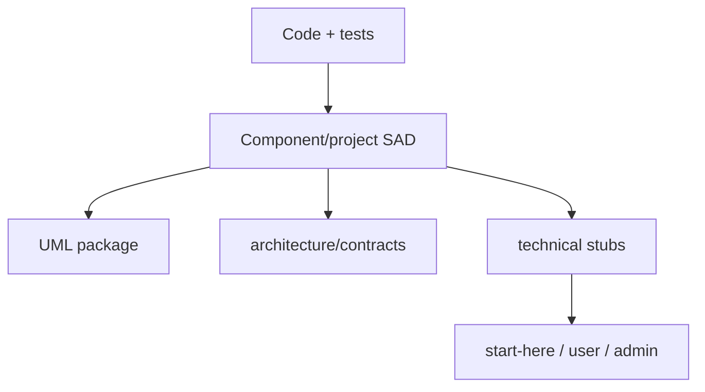

# Documentation Supply Chain — Software Architecture (arc42, project-wide)

**System:** Documentation Supply Chain · **Last reconciled:** `2026-06-23`

## 1. Introduction & Goals

Keeps World of Shadows architecture documentation aligned from implementation and tests through SADs,
contracts, UML, and audience-facing projections—without turning SADs into link lists or copying
internal paths into player docs.

### 1.1 Quality goals

| Goal | Scenario |
| --- | --- |
| Self-contained SADs | A new agent understands world-engine authority from the SAD alone |
| Traceable migration | Every moved technical page has a stub pointing to owning SAD |
| Checkable completeness | DOC-HEALTH + documentation gate reflect rollout truth |

## 2. Constraints

- Internal-only: `docs/architecture` and `UML/` do not ship to players.
- GoC normative slice contracts stay in `docs/MVPs/MVP_VSL_And_GoC_Contracts/`.
- Do not overwrite `docs/archive/documentation-consolidation-2026/` historical ledgers if restored from git.

## 3. Context & Scope

### 3.1 In / out of scope

| In scope | Out of scope |
| --- | --- |
| SAD/UML authoring rules, migration | Rewriting all player guides |
| DOC-HEALTH tracking | MkDocs theme design |

## 4. Solution Strategy

Direction of truth:

`implementation + tests → SAD → contracts/gates → docs/technical stubs → audience docs`

- Absorb repeated prose from `docs/technical/` into SADs; leave short stubs at old paths.
- Runtime contracts migrate to `docs/architecture/contracts/runtime/`.
- Evidence reports live in `docs/architecture/evidence/`.

## 5. Building Block View

| Block | Path |
| --- | --- |
| SAD index | `docs/architecture/README.md`, `START-HERE.md` |
| Templates | `components/_template/` |
| Inventory | `scripts/architecture_migration_inventory.py` |
| Rollout | `project/ROLLOUT.md`, `DOC-HEALTH.md` |
| Quality bar | `QUALITY-STANDARD.md` |

## 6. Runtime View

Documentation revision loop: information-mode friction → classify owning document → update SAD/contract → regenerate stub links → run documentation gate.

Authoritative: [UML documentation-supply-chain](../../../../UML/Project/documentation-supply-chain/README.md)

## 7. Deployment View

N/A

## 8. Crosscutting Concepts

- Registry: [`documentation-registry.md`](../../../reference/documentation-registry.md) lists audience owners separately.

## 9. Architecture Decisions

| ID | Title | Status |
| --- | --- | --- |
| D1 | SAD-first internal architecture | Accepted |
| D2 | SAD-only decisions (ADR directory retiring) | Accepted |
| D3 | Anti-linklist SAD rule | Accepted |

### D1: SAD-first internal architecture

**Status:** Accepted
**Origin:** documentation-supply-chain consolidation (retired 2026-06-23)

**Decision.** `docs/architecture/components/*/architecture.md` replaces `docs/architecture/README.md` redirect-to-technical as the primary internal entry.

**Evidence.** [`docs/architecture/README.md`](../../README.md), [`START-HERE.md`](../../START-HERE.md).

### D2: SAD-only decisions (ADR directory retiring)

**Status:** Accepted
**Origin:** ADR-0017 evolution (retired 2026-06-23)
**Supersedes:** ADR absorption-only workflow

**Decision.** Normative decision text lives in owning SAD §9 and UML. [`DECISION_REGISTRY.md`](../DECISION_REGISTRY.md) maps ex-ADR IDs to SAD anchors until `docs/ADR/` is archived and deleted.

**Evidence.** [`DECISION_REGISTRY.md`](../DECISION_REGISTRY.md), [`scripts/adr_retirement_audit.py`](../../../../scripts/adr_retirement_audit.py).

### D3: Anti-linklist SAD rule

**Status:** Accepted
**Origin:** QUALITY-STANDARD enforcement (retired 2026-06-23)

**Decision.** SADs must contain substantive prose (≥200 words outside tables) per QUALITY-STANDARD; link-only sections fail the documentation gate.

**Evidence.** [`tests/gates/test_architecture_documentation_gate.py`](../../../../tests/gates/test_architecture_documentation_gate.py).

## 10. Quality Requirements

`tests/gates/test_architecture_documentation_gate.py`; manual QUALITY-STANDARD checklist.

## 11. Risks & Technical Debt

Missing consolidation-2026 ledger files: documented stub at [`docs/archive/documentation-consolidation-2026/README.md`](../../../archive/documentation-consolidation-2026/README.md). **Policy:** do not restore from git history without governance review; new migrations use [`DECISION_REGISTRY.md`](../DECISION_REGISTRY.md) + evidence folder instead.

## 12. Glossary

| Term | Meaning |
| --- | --- |
| Stub | Short redirect page at a former canonical path |
