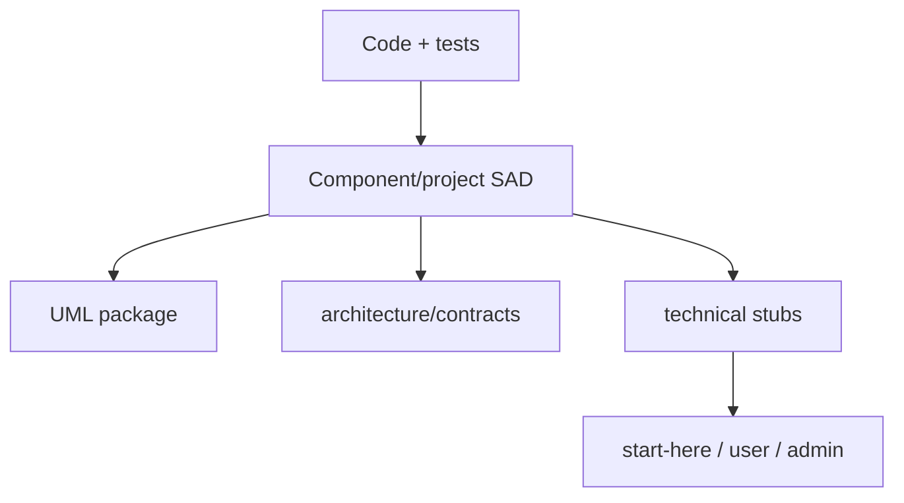

# Documentation Supply Chain — Software Architecture (arc42, project-wide)

**System:** Documentation Supply Chain · **Last reconciled:** `2026-06-23`

## 1. Introduction & Goals

Keeps World of Shadows architecture documentation aligned from implementation and tests through SADs,
contracts, UML, and audience-facing projections—without turning SADs into link lists or copying
internal paths into player docs.

### 1.1 Quality goals

| Goal | Scenario |
| --- | --- |
| Self-contained SADs | A new agent understands world-engine authority from the SAD alone |
| Traceable migration | Every moved technical page has a stub pointing to owning SAD |
| Checkable completeness | DOC-HEALTH + documentation gate reflect rollout truth |

## 2. Constraints

- Internal-only: `docs/architecture` and `UML/` do not ship to players.
- GoC normative slice contracts stay in `docs/MVPs/MVP_VSL_And_GoC_Contracts/`.
- Do not overwrite `docs/archive/documentation-consolidation-2026/` historical ledgers if restored from git.

## 3. Context & Scope

### 3.1 In / out of scope

| In scope | Out of scope |
| --- | --- |
| SAD/UML authoring rules, migration | Rewriting all player guides |
| DOC-HEALTH tracking | MkDocs theme design |

<!-- BEGIN BT-SEMANTIC-DEPTH:3 -->
### Evidence-grounded scope and authority

Authoring, validation, navigation and publication path for architecture and operational documentation.

**Authority rule:** SADs, contracts, decisions and generated model companions have explicit roles; navigation and publication projections must not silently become competing truth.

**Git/archaeology scope:** `docs`, `mkdocs.yml`, `scripts/architecture_link_audit.py`, `tests/gates/test_architecture_documentation_gate.py`

| Context concern | Model | Boundary statement |
| --- | --- | --- |
| Human author and authoritative documentation corpus | [Documentation Supply Chain - Context](../../../../UML/Project/documentation-supply-chain/context/documentation-context.md) | SADs, contracts, decisions and generated model companions have explicit roles; navigation and publication projections must not silently become competing truth. |

Historical MVP and work-order material is classified evidence, not an authority source. Current code and accepted decisions win; conflicts remain explicit until a target decision is accepted.
<!-- END BT-SEMANTIC-DEPTH:3 -->

## 4. Solution Strategy

Direction of truth:

`implementation + tests → SAD → contracts/gates → docs/technical stubs → audience docs`

- Absorb repeated prose from `docs/technical/` into SADs; leave short stubs at old paths.
- Runtime contracts migrate to `docs/architecture/contracts/runtime/`.
- Evidence reports live in `docs/architecture/evidence/`.

## 5. Building Block View

| Block | Path |
| --- | --- |
| SAD index | `docs/architecture/README.md`, `START-HERE.md` |
| Templates | `components/_template/` |
| Inventory | `scripts/architecture_migration_inventory.py` |
| Rollout | `project/ROLLOUT.md`, `DOC-HEALTH.md` |
| Quality bar | `QUALITY-STANDARD.md` |
| Site configuration | `mkdocs.yml` |

<!-- BEGIN BT-SEMANTIC-DEPTH:5 -->
### Source-bound structural decomposition

Only elements that participate in a container or component view are listed as building blocks. Actors, runtime states, data types and deployment nodes remain in their proper viewpoints instead of being misrepresented as structural decomposition.

| Block | Kind | Responsibility | Contract | Source |
| --- | --- | --- | --- | --- |
| Authoritative Sources (`source`) | `component` | Hold SAD, decision, contract and runbook truth | Declared document role | [`docs/architecture/project/FRONTMATTER.md`](../FRONTMATTER.md) |
| Documentation Gate (`gate`) | `component` | Enforce required sections, roles and navigation | Blocking CI findings | [`tests/gates/test_architecture_documentation_gate.py`](../../../../tests/gates/test_architecture_documentation_gate.py) |
| Generated Model Companions (`models`) | `component` | Project semantic catalog content for navigation | Regenerated, never hand-divergent | [`tools/architecture_assurance/view_builder.py`](../../../../tools/architecture_assurance/view_builder.py) |
| Link Audit (`links`) | `component` | Detect missing and stale references | Repository-relative target resolution | [`scripts/architecture_link_audit.py`](../../../../scripts/architecture_link_audit.py) |
| MkDocs Projection (`site`) | `component` | Publish navigable documentation | mkdocs.yml navigation | [`mkdocs.yml`](../../../../mkdocs.yml) |
<!-- END BT-SEMANTIC-DEPTH:5 -->

## 6. Runtime View

Documentation revision loop: information-mode friction → classify owning document → update SAD/contract → regenerate stub links → run documentation gate.

Authoritative: [UML documentation-supply-chain](../../../../UML/Project/documentation-supply-chain/README.md)

<!-- BEGIN BT-SEMANTIC-DEPTH:6 -->
### Dynamic viewpoint suite

| Runtime concern | Viewpoint | Model | Modeled interactions |
| --- | --- | --- | ---: |
| Deterministic authoring-to-publication validation | `activity` | [Documentation Supply Chain - Publication Flow](../../../../UML/Project/documentation-supply-chain/activity/publication-flow.md) | 4 |
| Draft, validated, published and stale documentation | `state` | [Documentation Supply Chain - Lifecycle](../../../../UML/Project/documentation-supply-chain/states/document-lifecycle.md) | 5 |

The ordered sequence/activity relationships and state transitions are validated against the catalog. A sequence or activity view must form one connected runtime path; a list of unrelated calls does not qualify as an end-to-end scenario. Generic arrows such as "evidence for boundary" are not accepted as runtime semantics.
<!-- END BT-SEMANTIC-DEPTH:6 -->

## 7. Deployment View

N/A

<!-- BEGIN BT-SEMANTIC-DEPTH:7 -->
### Deployment and operational boundary evidence

This scope does not claim an independently deployable runtime. Its deployment effect is expressed through the owning systems and the following implementation roots:

- `docs`
- `mkdocs.yml`
- `scripts/architecture_link_audit.py`
- `tests/gates/test_architecture_documentation_gate.py`

A deployment boundary is not inferred from a directory. Process, store, transport and trust contracts must be named by a deployment view or delegated to an owning SAD.
<!-- END BT-SEMANTIC-DEPTH:7 -->

## 8. Crosscutting Concepts

- Registry: [`documentation-registry.md`](../../../reference/documentation-registry.md) lists audience owners separately.

<!-- BEGIN BT-SEMANTIC-DEPTH:8 -->
### Explicit interaction and dependency contracts

| From | To | Semantics | Contract | Evidence |
| --- | --- | --- | --- | --- |
| Documentation Gate | MkDocs Projection | permits publication | all blocking gates pass | [`mkdocs.yml`](../../../../mkdocs.yml) |
| Link Audit | Documentation Gate | supplies findings | stable failing paths | [`tests/gates/test_architecture_documentation_gate.py`](../../../../tests/gates/test_architecture_documentation_gate.py) |
| Generated Model Companions | Link Audit | is checked by | all generated links resolve | [`scripts/architecture_link_audit.py`](../../../../scripts/architecture_link_audit.py) |
| Authoritative Sources | Generated Model Companions | drives projections | semantic catalog and SAD intent | [`tools/architecture_assurance/view_builder.py`](../../../../tools/architecture_assurance/view_builder.py) |
<!-- END BT-SEMANTIC-DEPTH:8 -->

## 9. Architecture Decisions

| ID | Title | Status |
| --- | --- | --- |
| D1 | SAD-first internal architecture | Accepted |
| D2 | SAD-only decisions (ADR directory retiring) | Accepted |
| D3 | Anti-linklist SAD rule | Accepted |

### D1: SAD-first internal architecture

**Status:** Accepted
**Origin:** documentation-supply-chain consolidation (retired 2026-06-23)

**Context.** Internal contributors previously followed redirect-heavy README paths; component ownership was unclear and ADR stubs duplicated SAD prose. START-HERE now routes readers to owning component SADs first.

**Decision.** `docs/architecture/components/*/architecture.md` replaces `docs/architecture/README.md` redirect-to-technical as the primary internal entry.

**Consequences.** New architecture work must update the owning component SAD; README remains a thin index only.

**Evidence.** [`docs/architecture/README.md`](../../README.md), [`START-HERE.md`](../../START-HERE.md).

### D2: SAD-only decisions (ADR directory retiring)

**Status:** Accepted
**Origin:** ADR-0017 evolution (retired 2026-06-23)
**Supersedes:** ADR absorption-only workflow

**Context.** Active ADR markdown files drifted from owning SAD §9 text; retirement required a single normative surface plus a manifest-backed registry for traceability and link-audit enforcement.

**Decision.** Normative decision text lives in owning SAD §9 and UML. [`DECISION_REGISTRY.md`](../DECISION_REGISTRY.md) maps ex-ADR IDs to SAD anchors after the ADR tree was archived under `docs/archive/adr-retired-2026/`.

**Evidence.** [`DECISION_REGISTRY.md`](../DECISION_REGISTRY.md), [`scripts/adr_retirement_audit.py`](../../../../scripts/adr_retirement_audit.py).

### D3: Anti-linklist SAD rule

**Status:** Accepted
**Origin:** QUALITY-STANDARD enforcement (retired 2026-06-23)

**Context.** Link-only architecture pages passed review while failing operator needs; gates now require substantive prose so decisions remain auditable without opening every linked file or external wiki page.

**Decision.** SADs must contain substantive prose (≥200 words outside tables) per QUALITY-STANDARD; link-only sections fail the documentation gate.

**Consequences.** Documentation gates count words outside tables; reviewers reject bullet-only §9 stubs.

**Evidence.** [`tests/gates/test_architecture_documentation_gate.py`](../../../../tests/gates/test_architecture_documentation_gate.py).

<!-- BEGIN BT-SEMANTIC-DEPTH:9 -->
### Decision-to-view correspondence

| Decision(s) | Concern | Viewpoint | Model |
| --- | --- | --- | --- |
| `D1` | Human author and authoritative documentation corpus | `context` | [Documentation Supply Chain - Context](../../../../UML/Project/documentation-supply-chain/context/documentation-context.md) |
| `D1`, `D2` | Source, generated models, validation and publication seams | `component` | [Documentation Supply Chain - Components](../../../../UML/Project/documentation-supply-chain/components/publication-components.md) |
| `D2` | Deterministic authoring-to-publication validation | `activity` | [Documentation Supply Chain - Publication Flow](../../../../UML/Project/documentation-supply-chain/activity/publication-flow.md) |
| `D3` | Draft, validated, published and stale documentation | `state` | [Documentation Supply Chain - Lifecycle](../../../../UML/Project/documentation-supply-chain/states/document-lifecycle.md) |

The correspondence is intentionally many-to-many: one decision may require structural, dynamic, data and deployment evidence, and one model may make several decisions analyzable together.
<!-- END BT-SEMANTIC-DEPTH:9 -->

## 10. Quality Requirements

`tests/gates/test_architecture_documentation_gate.py`; manual QUALITY-STANDARD checklist.

## 11. Risks & Technical Debt

Missing consolidation-2026 ledger files: documented stub at [`docs/archive/documentation-consolidation-2026/README.md`](../../../archive/documentation-consolidation-2026/README.md). **Policy:** do not restore from git history without governance review; new migrations use [`DECISION_REGISTRY.md`](../DECISION_REGISTRY.md) + evidence folder instead.

<!-- BEGIN BT-SEMANTIC-DEPTH:11 -->
### Git-grounded drift profile

Documents and ADRs moved, archives retained links, and generated projections outlived source decisions. The chain models authorship, transformation and stale-reference detection.

| Tracked files | Lifetime commits | Recent path touches | Recent renames |
| ---: | ---: | ---: | ---: |
| 652 | 588 | 3869 | 243 |

| Drift claim | Status | Concern | Target direction |
| --- | --- | --- | --- |
| `DRIFT-010` | `superseded` | Historical snapshots contain paths that no longer map to current architecture | Retain hashes, claim headings and path-diff evidence. Port only a claim or behavior after current-source reconciliation; never copy a full old package over HEAD. |
| `DRIFT-011` | `superseded` | MVP completion labels are not architecture authority | Use capability lifecycle states proposed, implemented, integrated, proven and regressed. Only production-path evidence advances a capability to proven. |
| `DRIFT-012` | `confirmed_current` | Architecture coverage metrics can hide shallow semantics | Keep model selection concern-driven and source-bound. Coverage remains supporting evidence; semantic analyzability, drill-down and correspondence determine acceptance. |

[Git/archaeology baseline](../../evidence/architecture-drift-baseline.md) · [Drift reconciliation and target directions](../../evidence/architecture-drift-reconciliation.md)

These entries are review inputs, not automatic design decisions. Conflicting/open items close only through accepted target decisions and the listed behavioral evidence.
<!-- END BT-SEMANTIC-DEPTH:11 -->

## 12. Glossary

| Term | Meaning |
| --- | --- |
| Stub | Short redirect page at a former canonical path |
